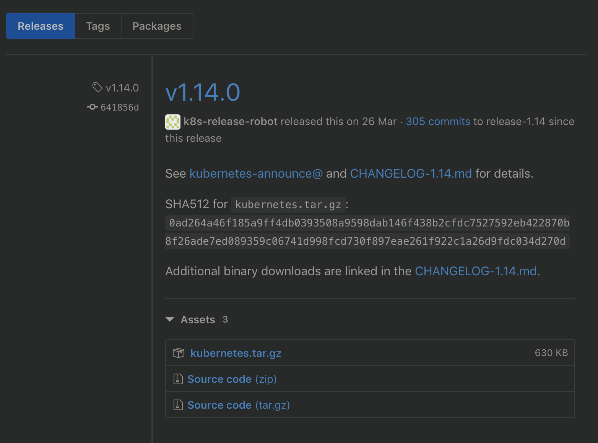
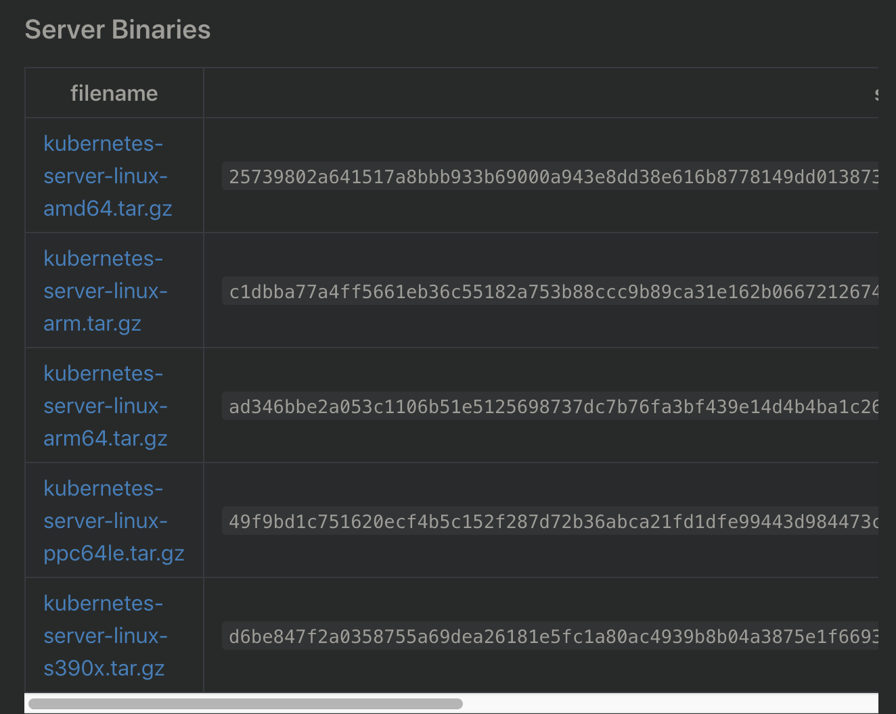
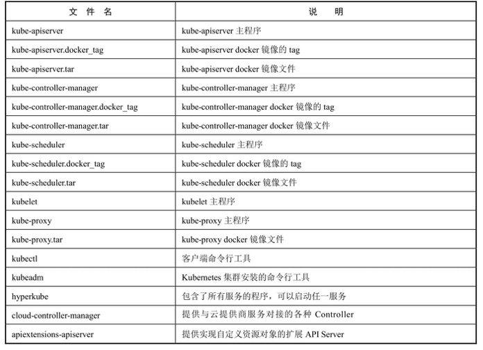

<!-- @import "[TOC]" {cmd="toc" depthFrom=1 depthTo=6 orderedList=false} -->

<!-- code_chunk_output -->

- [0 安装概述](#0-安装概述)
- [1 Master上的etcd、kube\-apiserver、kube\-controller\-manager、kube\-scheduler服务](#1-master上的etcd-kube-apiserver-kube-controller-manager-kube-scheduler服务)
  - [1.1 etcd服务](#11-etcd服务)
  - [1.2 kube\-apiserver服务](#12-kube-apiserver服务)
  - [1.3 kube\-controller\-manager服务](#13-kube-controller-manager服务)
  - [1.4 kube\-scheduler服务](#14-kube-scheduler服务)
- [2 Node上的kubelet、kube\-proxy服务](#2-node上的kubelet-kube-proxy服务)
  - [2.1 kubelet服务](#21-kubelet服务)
  - [2.2 kube\-proxy服务](#22-kube-proxy服务)

<!-- /code_chunk_output -->

# 0 安装概述

从Kubernetes发布官网 https://github.com/kubernetes/kubernetes/releases 找到对应的版本号, 单击CHANGELOG, 找到已编译好的二进制文件的下载页面, 如图2.1和图2.2所示. 本书基于Kubernetes 1.14版本进行说明. 

在压缩包**kubernetes.tar.gz**内包含了Kubernetes的**服务程序文件、文档和示例**; 

在压缩包**kubernetes\-src.tar.gz**内则包含了**全部源代码**. 

也可以直接下载**Server Binaries**中的**kubernetes\-server\-linux\-amd64.tar.gz**文件, 其中包含了Kubernetes需要运行的**全部服务程序文件**. 主要的服务程序文件列表如表2.2所示. 





表: 主要的服务程序文件列表



Kubernetes的**主要服务程序**都可以通过**直接运行二进制文件加上启动参数**完成运行. 

在Kubernetes的

- Master上需要部署**etcd**、**kube\-apiserver**、**kube\-controller\-manager**、**kube\-scheduler**服务进程, 
- 在工作Node上需要部署**docker**、**kubelet**和**kube\-proxy**服务进程. 

将Kubernetes的**二进制可执行文件**复制到/**usr/bin目录**下, 然后在/**usr/lib/system/system目录**下为各服务创建**systemd服务配置文件**(完整的systemd系统知识请参考Linux的相关手册), 这样就完成了软件的安装. 

要使Kubernetes正常工作, 需要详细**配置各个服务的启动参数**. 

# 1 Master上的etcd、kube\-apiserver、kube\-controller\-manager、kube\-scheduler服务

## 1.1 etcd服务

etcd服务作为Kubernetes集群的主数据库, 在安装Kubernetes各服务之前需要首先安装和启动. 

从GitHub官网( https://github.com/coreos/etcd/releases )下载etcd二进制文件, 将etcd和etcdctl文件复制到/usr/bin目录. 

设置systemd服务配置文件/usr/lib/systemd/system/etcd.service: 

```
[Unit]
Description=Etcd Server
After=network.target

[Service]
Type=simple
WorkingDirectory=/var/lib/etcd/
EnvironmentFile=-/etc/etcd/etcd.conf
ExecStart=/usr/bin/etcd

[Install]
WantedBy=multi-user.target
```

其中, WorkingDirectory(/var/lib/etcd/)表示etcd数据保存的目录, 需要在启动etcd服务之前创建. 

配置文件 /etc/etcd/etcd.conf 通常不需要特别的参数设置(详细的参数配置内容参见官方文档), etcd默认使用 http://127.0.0.1:2379 地址供客户端连接. 

配置完成后, 通过systemctl start命令启动etcd服务. 同时将其加入开机列表

```
# systemctl daemon-reload
# systemctl enable etcd.service
# systemctl start etcd.service
```

验证etcd是否正常

```
# etcdctl endpoint health
```

## 1.2 kube\-apiserver服务

将kube\-apiserver、kube\-controller\-manager和kube\-scheduler文件复制到/usr/bin目录. 

设置systemd服务配置文件/usr/lib/systemd/system/kube\-apiserver.service, 内容如下: 

```
# kube-apiserver
[Unit]
Description=Kubernetes API Server
Documentation=https://github.com/GoogleCloudPlatform/kubernetes
# 后于etcd
After=etcd.service 
Wants=etcd.service

[Service]
# 环境变量文件
EnvironmentFile=/etc/kubernetes/apiserver
# 参数
ExecStart=/usr/bin/kube-apiserver $KUBE_API_ARGS
Restart=on-failure
Type=notify
LimitNOFILE=65536

[Install]
WantedBy=multi-user.target
```

配置文件/etc/kubernetes/apiserver的内容包括了kube-apiserver的全部启动参数, 主要配置参数在变量KUBE\_API\_ARGS中指定.

```
# /etc/kubernetes/apiserver
KUBE_API_ARGS="--etcd-servers=http://127.0.0.1:2379 --insecure-bind-address=0.0.0.0 --insecure-port=8080 --service-cluster-ip-range=169.169.0.0/16 --service-node-port-range=1-65535 --enable-admission-plugins=NamespaceLifecycle,LimitRanger,ServiceAccount,DefaultStorageClass,DefaultTolerationSeconds,MutatingAdmissionWebhook,ValidatingAdmissionWebhook,ResourceQuota --logtostderr=false --log-dir=/var/log/kubernetes --v=0"
```

启动参数说明如下. 

- \-\-etcd\-servers: 指定etcd服务的URL. 
- \-\-storage-backend: 指定etcd的版本, 从Kubernetes 1.6开始, 默认为etcd 3. 注意, 在Kubernetes 1.6之前的版本中没有这个参数, kube\-apiserver默认使用etcd 2, 对于正在运行的1.5或旧版本的Kubernetes集群, etcd提供了数据升级方案, 详见etcd文档(https://coreos.com/etcd/docs/latest/upgrades/upgrade_3_0.html). 
- \-\-insecure\-bind\-address: API Server绑定主机的非安全IP地址, 设置0.0.0.0表示绑定所有IP地址. 
- \-\-insecure\-port: API Server绑定主机的非安全端口号, 默认为8080. 
- \-\-service\-cluster\-ip\-range: Kubernetes集群中Service的虚拟IP地址范围, 以CIDR格式表示, 例如169.169.0.0/16, 该IP范围不能与物理机的IP地址有重合. 
- \-\-service\-node\-port\-range: Kubernetes集群中Service可使用的物理机端口号范围, 默认值为30000~32767. 
- \-\-enable\-admission\-plugins: Kubernetes集群的准入控制设置, 各控制模块以插件的形式依次生效. 
- \-\-logtostderr: 设置为false表示将日志写入文件, 不写入stderr. 
- \-\-log\-dir: 日志目录. 
- \-\-v: 日志级别. 

## 1.3 kube\-controller\-manager服务

kube\-controller\-manager服务依赖于kube\-apiserver服务, 设置systemd服务配置文件/usr/lib/systemd/system/kube\-controller\-manager.service, 内容如下: 


```
# kube-controller-manager.service
[Unit]
Description=Kubernetes Controller Manager
Documentation=https://github.com/GoogleCloudPlatform/kubernetes
# 后于apiserver
After=kube-apiserver.service
Requires=kube-apiserver.service

[Service]
EnvironmentFile=/etc/kubernetes/controller-manager
ExecStart=/usr/bin/kube-controller-manager $KUBE_CONTROLLER_MANAGER_ARGS
Restart=on-failure
LimitNOFILE=65536

[Install]
WantedBy=multi-user.target
```

配置文件/etc/kubernetes/controller\-manager的内容包含了kube\-controller\-manager的全部启动参数, 主要的配置参数在变量KUBE\_CONTROLLER\_MANAGER\_ARGS中指定: 

```
# /etc/kubernetes/controller-manager
KUBE_CONTROLLER_MANAGER_ARGS="--kubeconfig=/etc/kubernetes/kubeconfig --logtostderr=false --log-dir=/var/log/kubernetes --v=0"
```

启动参数说明

- \-\-kubeconfig: 设置与API Server连接的相关配置, 例如: 

```
# /etc/kubernetes/kubeconfig
apiVersion: v1
kind: Config
users:
- name: client
  user:
clusters:
- name: default
  cluster:
    server: http://192.168.18.3:8080
contexts:
- context:
    cluster: default
    user: client
  name: default
current-context: default
```

- \-\-logtostderr: 设置为false表示将日志写入文件, 不写入stderr. 
- \-\-log\-dir: 日志目录. 
- \-\-v: 日志级别. 

## 1.4 kube\-scheduler服务

kube\-scheduler服务也**依赖于kube\-apiserver服务**, 设置systemd服务配置文件/usr/lib/systemd/system/kube\-scheduler.service, 内容如下: 

```
# kube-scheduler.service
[Unit]
Description=Kubernetes Controller Manager
Documentation=https://github.com/GoogleCloudPlatform/kubernetes
After=kube-apiserver.service
Requires=kube-apiserver.service

[Service]
EnvironmentFile=/etc/kubernetes/scheduler
ExecStart=/usr/bin/kube-scheduler $KUBE_SCHEDULER_ARGS
Restart=on-failure
LimitNOFILE=65536

[Install]
WantedBy=multi-user.target
```

配置文件/etc/kubernetes/scheduler的内容包括了kube\-scheduler的全部启动参数, 主要的配置参数在变量KUBE\_SCHEDULER\_ARGS中指定: 

```
# /etc/kubernetes/scheduler
KUBE_SCHEDULER_ARGS="--kubeconfig=/etc/kubernetes/kubeconfig --logtostderr=false --log-dir=/var/log/kubernetes --v=0"
```

启动参数说明

- \-\-kubeconfig: 设置与API Server连接的相关配置, 可以与kube\-controller\-manager使用的kubeconfig文件相同. 
- \-\-logtostderr: 设置为false表示将日志写入文件, 不写入stderr. 
- \-\-log\-dir: 日志目录. 
- \-\-v: 日志级别

配置完成后, 执行systemctl start命令按**顺序启动**这3个服务, 同时, 使用systemctl enable命令将服务加入开机启动列表中: 

```
# systemctl daemon-reload

# systemctl enable kube-apiserver.service
# systemctl start kube-apiserver.service

# systemctl enable kube-controller-manager.service
# systemctl start kube-controller-manager.service

# systemctl enable kube-scheduler.service
# systemctl start kube-scheduler.service
```

# 2 Node上的kubelet、kube\-proxy服务

在工作Node上需要预先安装好Docker Daemon并且正常启动. 

## 2.1 kubelet服务

依赖于Docker服务, 设置systemd服务配置文件/usr/lib/systemd/system/kubelet.service

```
# kubelet.service
[Unit]
Description=Kubernetes Kubelet Server
Documentation=https://github.com/GoogleCloudPlatform/kubernetes
After=docker.service
Requires=docker.service

[Service]
WorkingDirectory=/var/lib/kubelet
EnvironmentFile=/etc/kubernetes/kubelet
ExecStart=/usr/bin/kubelet $KUBELET_ARGS
Restart=on-failure

[Install]
WantedBy=multi-user.target
```

WorkingDirectory表示kubelet保存数据的目录, 需要在启动kubelet服务之前创建. 

配置文件/etc/kubernetes/kubelet的内容包括了kubelet的全部启动参数, 主要的配置参数在变量KUBELET\_ARGS中指定: 

```
# /etc/kubernetes/kubelet
KUBELET_ARGS="--kubeconfig=/etc/kubernetes/kubeconfig --hostname-override=192.168.18.3 --logtostderr=false --log-dir=/var/log/kubernetes --v=0"
```

启动参数说明如下

- \-\-kubeconfig: 设置与API Server连接的相关配置, 可以与kube\-controller\-manager使用的kubeconfig文件相同
- \-\-hostname\-override: 设置本Node的名称
- \-\-logtostderr: 设置为false表示将日志写入文件, 不写入stderr
- \-\-log\-dir: 日志目录
- \-\-v: 日志级别

## 2.2 kube\-proxy服务

kube-proxy服务依赖于**network服务**, 设置systemd服务配置文件/usr/lib/systemd/system/kube-proxy.service

```
# kube-proxy.service
[Unit]
Description=Kubernetes Kube-Proxy Server
Documentation=https://github.com/GoogleCloudPlatform/kubernetes
After=network.target
Requires=network.service

[Service]
EnvironmentFile=/etc/kubernetes/proxy
ExecStart=/usr/bin/kube-proxy $KUBE_PROXY_ARGS
Restart=on-failure
LimitNOFILE=65536

[Install]
WantedBy=multi-user.target
```

配置文件/etc/kubernetes/proxy的内容包括了kube-proxy的全部启动参数

```
# /etc/kubernetes/proxy
KUBE_PROXY_ARGS="--kubeconfig=/etc/kubernetes/kubeconfig --logtostderr=false --log-dir=/var/log/kubernetes --v=2"
```

- \-\-kubeconfig: 设置与API Server连接的相关配置, 可以与kube\-controller\-manager使用的kubeconfig文件相同. 
- \-\-logtostderr: 设置为false表示将日志写入文件, 不写入stderr. 
- \-\-log\-dir: 日志目录. 
- \-\-v: 日志级别

配置完成后, 通过systemctl启动kubelet和kube\-proxy服务: 

```
# systemctl daemon-reload

# systemctl enable kubelet.service
# systemctl start kubelet.service

# systemctl enable kube-proxy.service
# systemctl start kube-proxy.service
```

**kubelet默认**采用向Master自动注册本Node的机制, 在Master上查看各Node的状态, 状态为Ready表示Node已经成功注册并且状态为可用: 

```
# kubectl get nodes
NAME            STATUS      AGE
192.168.18.3    Ready       1m
```

等所有Node的状态都为Ready之后, 一个Kubernetes集群就启动完成了. 接下来可以创建Pod、Deployment、Service等资源对象来部署容器应用了. 