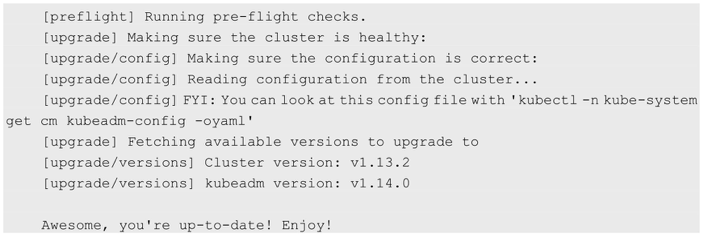
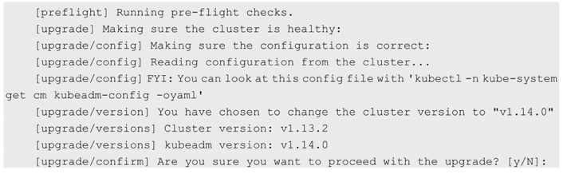
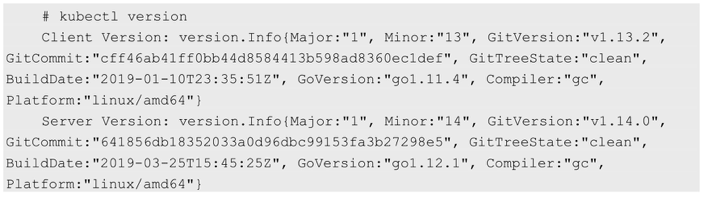

<!-- @import "[TOC]" {cmd="toc" depthFrom=1 depthTo=6 orderedList=false} -->

<!-- code_chunk_output -->

- [1 二进制升级](#1-二进制升级)
- [2 使用kubeadm进行集群升级](#2-使用kubeadm进行集群升级)

<!-- /code_chunk_output -->

# 1 二进制升级

不要让当前集群中正在运行的容器受到影响. 

应对集群中的**各Node逐个进行隔离**, 然后等待在其上运行的**容器全部执行完成**, 再**更新该Node**上的**kubelet**和**kube\-proxy**服务, 将全部Node都更新完成后, 再**更新Master的服务**. 

- 通过官网获取最新版本的二进制包kubernetes.tar.gz, 解压后提取服务的二进制文件. 

- 逐个隔离Node, 等待在其上运行的全部容器工作完成后, 更新**kubelet**和**kube\-proxy**服务文件, 然后重启这两个服务. 

- 更新Master的kube\-apiserver、kube\-controller\-manager、kube\-scheduler服务文件并重启. 

# 2 使用kubeadm进行集群升级

kubeadm提供了upgrade命令用于对kubeadm安装的Kubernetes集群进行升级. 

需要注意: 

- 虽然kubeadm的升级不会触及工作负载, 但还是要在升级之前做好备份. 
- 升级过程可能会因为Pod的变化而造成容器重启. 

首先需要升级的是kubeadm

```
yum list kubeadm  --showduplicates |sort -r
```

```
# yum install -y kubeadm-1.15.2 --disableexcludes=kubernetes
```

查看kubeadm的升级计划:

```
# kubeadm upgrade plan
```



会出现预备升级的内容描述.

按照任务指引进行升级:

```
# kubeadm upgrade apply 1.14.0
```



确认之后, 开始进行升级

运行完成后, 查看版本:

```
# kubectl version
```



可以看到, 虽然kubectl还是1.13.2, 服务端的控制平面已经升级到了1.14.0, 但是查看Node版本, 会发现Node版本还是滞后的: 

```
# kubectl get nodes
NAME                STATUS      ROLES       AGE     VERSION
node-kubeadm-1      Ready       master      15m     v1.13.2
node-kubeadm-2      Ready       <none>      13m     v1.13.2
```

然后可以对节点配置进行升级: 

```
# kubeadm upgrade node config --kubelet-version 1.14.0
```

接下来, 按照和二进制升级一样的步骤将kubelct升级, 这样就完成了集群的整体升级: 

```
# kubectl get nodes
NAME                STATUS      ROLES       AGE     VERSION
node-kubeadm-1      Ready       master      25m     v1.14.0
node-kubeadm-2      Ready       <none>      22m     v1.14.0
```