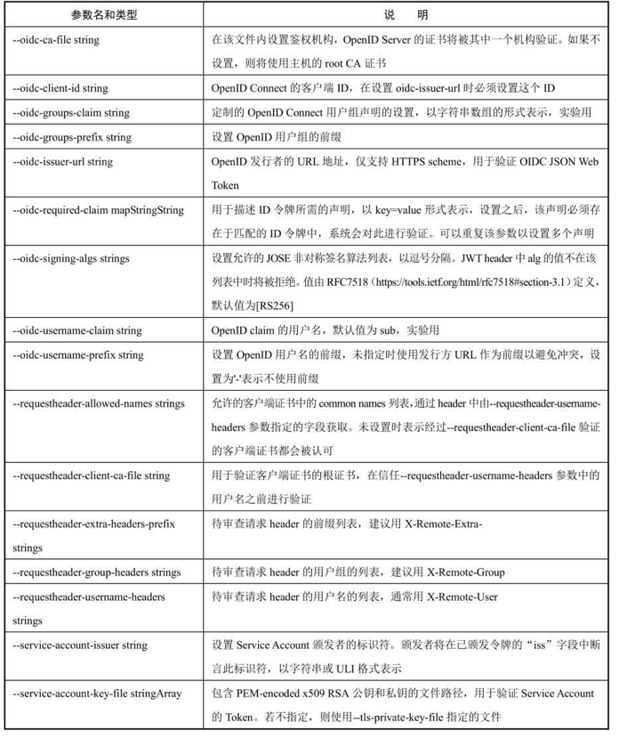
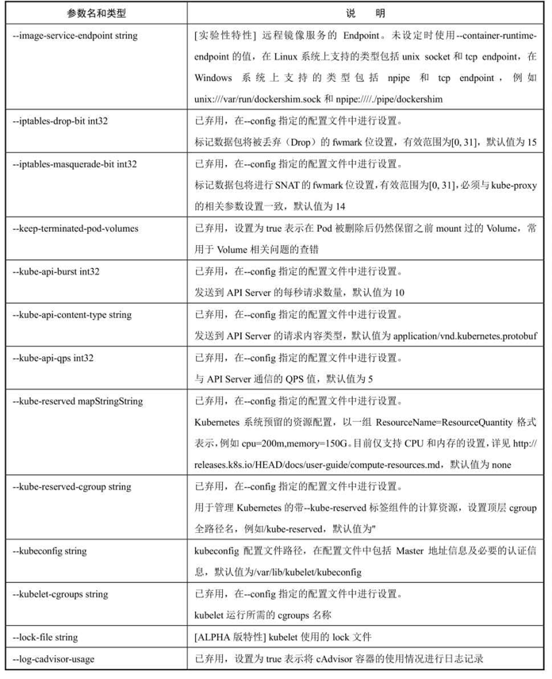
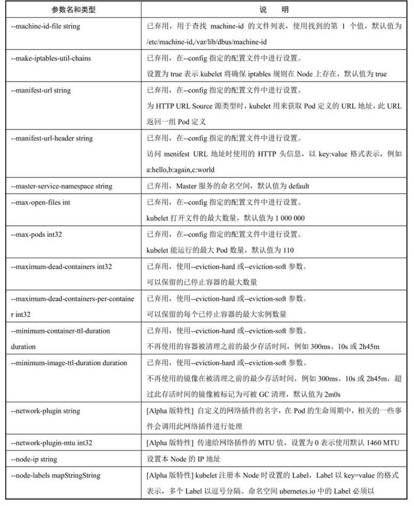

<!-- @import "[TOC]" {cmd="toc" depthFrom=1 depthTo=6 orderedList=false} -->

<!-- code_chunk_output -->

- [0 概述](#0-概述)
- [1 公共配置参数](#1-公共配置参数)
- [2 kube\-apiserver启动参数](#2-kube-apiserver启动参数)
- [3 kube\-controller\-manager启动参数](#3-kube-controller-manager启动参数)
- [4 kube\-scheduler启动参数](#4-kube-scheduler启动参数)
- [5 kubelet启动参数](#5-kubelet启动参数)
- [6 kube\-proxy启动参数](#6-kube-proxy启动参数)

<!-- /code_chunk_output -->

# 0 概述

Kubernetes的**每个服务**都提供了**许多可配置的参数**. 这些参数涉及安全性、性能优化及功能扩展(Plugin)等方方面面. 

每个服务的可用参数都可以通过运行"cmd \-\-help"命令进行查看, 其中cmd为具体的服务启动命令, 例如kube\-apiserver、kube\-controller\-manager、kube\-scheduler、kubelet、kube\-proxy等. 另外, 可以通过在命令的配置文件(例如/etc/kubernetes/kubelet等)中添加"\-\-参数名=参数取值"语句来完成对某个参数的配置. 

# 1 公共配置参数

公共配置参数**适用于所有服务**, 如表2.3所示的参数可用于kube\-apiserver、kube\-controller\-manager、kube\-scheduler、kubelet、kube\-proxy. 

表2.3 公共配置参数表:

# 2 kube\-apiserver启动参数

# 3 kube\-controller\-manager启动参数

表2.5　对kube-controller-manager启动参数的详细说明:

# 4 kube\-scheduler启动参数

表2.6 对kube-scheduler启动参数的详细说明:

# 5 kubelet启动参数

表2.7　对kubelet启动参数的详细说明

# 6 kube\-proxy启动参数

对kube-proxy启动参数的详细说明:

