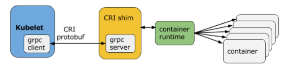
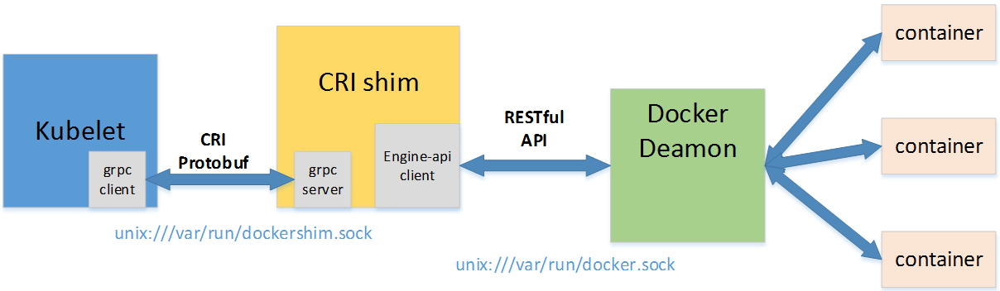
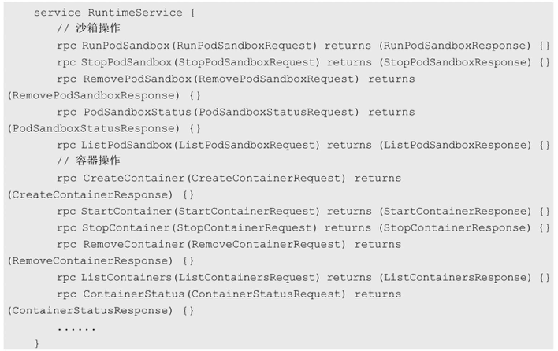
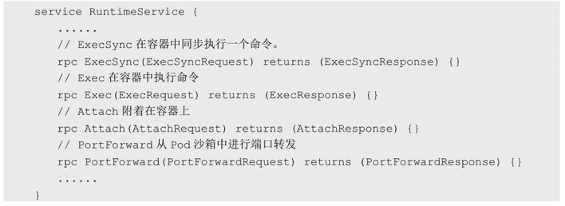
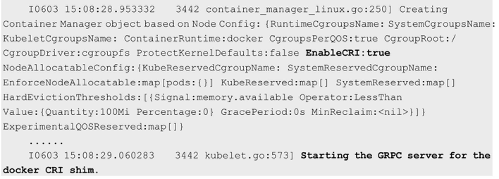

<!-- @import "[TOC]" {cmd="toc" depthFrom=1 depthTo=6 orderedList=false} -->

<!-- code_chunk_output -->

- [1. CR和CRI](#1-cr和cri)
- [2. CRI概述](#2-cri概述)
- [3. CRI架构](#3-cri架构)
- [4. RuntimeService: Pod和容器的生命周期管理](#4-runtimeservice-pod和容器的生命周期管理)
  - [4.1. PodSanbox: 共有环境](#41-podsanbox-共有环境)
  - [4.2. kubelet创建cgroup: 资源保障](#42-kubelet创建cgroup-资源保障)
  - [4.3. 生命周期](#43-生命周期)
- [5. 面向容器级别的设计思路](#5-面向容器级别的设计思路)
  - [5.1. 旧可能方案: 复用Pod对象, 简化API](#51-旧可能方案-复用pod对象-简化api)
    - [某些基于Pod的功能和机制: CR实现有负担](#某些基于pod的功能和机制-cr实现有负担)
    - [某些Pod一些功能: kubelet完成](#某些pod一些功能-kubelet完成)
  - [容器级别实现](#容器级别实现)
- [6. 尝试使用新的Docker\-CRI来创建容器](#6-尝试使用新的docker-cri来创建容器)
- [7. CRI的进展](#7-cri的进展)
- [8. 参考](#8-参考)

<!-- /code_chunk_output -->

# 1. CR和CRI

归根结底, Kubernetes **Node(kubelet！！！**)的**主要功能**就是**启动和停止容器的组件！！！**, 我们称之为**容器运行时(Container Runtime**, **管理容器的组件！！！**), 其中最知名的就是**Docker！！！** 了. 

**每个容器运行时**都有特点, 因此不少用户希望Kubernetes能够支持**更多的容器运行时**. Kubernetes从**1.5版本**开始引入了**CRI接口规范！！！**, 通过**插件接口模式！！！**, Kubernetes**无须重新编译！！！** 就可以使用**更多的容器运行时！！！**. 

**Container Runtime Interface**, 简称CRI. 

# 2. CRI概述

CRI中定义了**容器**和**镜像**的服务的**接口**, 因为**容器运行时！！！** 与**镜像的生命周期！！！** 是彼此**隔离**的, 因此需要**定义两个服务**. 该接口使用[Protocol Buffer](https://developers.google.com/protocol-buffers/), 基于[gRPC](https://grpc.io/). 这两种服务定义在 kubernetes/staging/src/k8s.io/cri-api/pkg/apis/runtime/v1alpha2/api.proto 中

**Protocol Buffers API！！！** 包含**两个gRPC服务**: **ImageService**和**RuntimeService**. 

* **ImageService**提供了**从仓库拉取镜像**、**查看和移除镜像**的功能. 

* **RuntimeService**负责**Pod和容器的生命周期管理**, 以及**与容器的交互**(exec/attach/port\-forward). 

**Docker的CRI实现！！！** 在Kubernetes 1.6中被更新为Beta版本, 并在**kubelet启动！！！**时**默认启动！！！**. 

**可替代的容器运行时支持**在Kubernetes中的概念**并非首次**. 在Kubernetes **1.3**发布时, **rktnetes**项目同时发布, 让**rkt容器引擎**成为**除Docker外**的又一选择. 

然而, 不管是**Docker**还是**rkt**, 都需要通过内部、不太稳定的接口直接**集成到kubelet**的**源码**中, 同kubelet源码纠缠不清. 这种程度的集成需要对kubelet的内部机制有非常深入的了解, 还会给社区带来**维护管理压力**, 这就给新生代容器运行时造成了难于跨越的集成壁垒. 

# 3. CRI架构

**CRI**包含**一组Protocol Buffers！！！**、**gRPC API！！！**、**运行库支持！！！** 及开发中的标准规范和工具. **CRI目前是v1alpha2版本**.

**Kubelet**与**容器运行时**通信(或者是**CRI插件填充了容器运行时**)时, **Kubelet**就像是**客户端**, 而**CRI插件**就像**对应的服务器**. 它们之间可以通过**Unix 套接字**或者**gRPC框架**进行通信. 

**kubelet**使用**gRPC client！！！** 通过**UNIX Socket(！！！或GRPC框架**)与**容器运行时(或CRI代理！！！**)进行**通信**. 在这个过程中**kubelet**是**客户端**, **CRI代理(shim**)是**服务端**, 如图2.3所示. 

* **Container Runtime！！！** 实现了**CRI gRPC Server！！！**, 包括**RuntimeService** 和**ImageService**. 

* 该gRPC Server需要**监听本地的Unix socket！！！**, 而**kubelet**则作为**gRPC Client！！！运行**. 

图2.3 CRI的架构:





CRI在**Kubelet**与**docker**之间实现了**CRI shim中间层**. 

* CRI shim的gRPC server监听unix:///var/run/dockershim.sock, kubelet的gRPC client连接这个socket. 
* kubelet与CRI shim的**数据传输**使用**gRPC**、而**数据格式**采用**protobuf**. 
* CRI shim使用engine-api建立一个连接unix:///var/run/docker.sock的client, 通过docker API控制容器生命周期以及镜像管理. 

**一个单块！！！的容器运行时**能够**管理镜像和容器**(例如: Docker和Rkt), 并且通过**同一个套接字同时提供这两种服务**. 

rkt和Docker这样的**容器运行时**可以使用**一个Socket同时提供两个服务**, 在**kubelet**中可以用\-\-**container\-runtime\-endpoint**和\-\-**image\-service\-endpoint**参数**设置这个Socket**. 

当前Linux上支持unix socket, windows上支持tcp. 例如: unix:///var/run/dockershim.sock、 tcp://localhost:373, 默认是unix:///var/run/dockershim.sock, 即默认使用本地的docker作为容器运行时. 

# 4. RuntimeService: Pod和容器的生命周期管理

```
service RuntimeService {
    // Version returns the runtime name, runtime version, and runtime API version.
    rpc Version(VersionRequest) returns (VersionResponse) {}

    // RunPodSandbox creates and starts a pod-level sandbox. Runtimes must ensure
    // the sandbox is in the ready state on success.
    rpc RunPodSandbox(RunPodSandboxRequest) returns (RunPodSandboxResponse) {}
    // StopPodSandbox stops any running process that is part of the sandbox and
    // reclaims network resources (e.g., IP addresses) allocated to the sandbox.
    // If there are any running containers in the sandbox, they must be forcibly
    // terminated.
    // This call is idempotent, and must not return an error if all relevant
    // resources have already been reclaimed. kubelet will call StopPodSandbox
    // at least once before calling RemovePodSandbox. It will also attempt to
    // reclaim resources eagerly, as soon as a sandbox is not needed. Hence,
    // multiple StopPodSandbox calls are expected.
    rpc StopPodSandbox(StopPodSandboxRequest) returns (StopPodSandboxResponse) {}
    // RemovePodSandbox removes the sandbox. If there are any running containers
    // in the sandbox, they must be forcibly terminated and removed.
    // This call is idempotent, and must not return an error if the sandbox has
    // already been removed.
    rpc RemovePodSandbox(RemovePodSandboxRequest) returns (RemovePodSandboxResponse) {}
    // PodSandboxStatus returns the status of the PodSandbox. If the PodSandbox is not
    // present, returns an error.
    rpc PodSandboxStatus(PodSandboxStatusRequest) returns (PodSandboxStatusResponse) {}
    // ListPodSandbox returns a list of PodSandboxes.
    rpc ListPodSandbox(ListPodSandboxRequest) returns (ListPodSandboxResponse) {}

    // CreateContainer creates a new container in specified PodSandbox
    rpc CreateContainer(CreateContainerRequest) returns (CreateContainerResponse) {}
    // StartContainer starts the container.
    rpc StartContainer(StartContainerRequest) returns (StartContainerResponse) {}
    // StopContainer stops a running container with a grace period (i.e., timeout).
    // This call is idempotent, and must not return an error if the container has
    // already been stopped.
    // TODO: what must the runtime do after the grace period is reached?
    rpc StopContainer(StopContainerRequest) returns (StopContainerResponse) {}
    // RemoveContainer removes the container. If the container is running, the
    // container must be forcibly removed.
    // This call is idempotent, and must not return an error if the container has
    // already been removed.
    rpc RemoveContainer(RemoveContainerRequest) returns (RemoveContainerResponse) {}
    // ListContainers lists all containers by filters.
    rpc ListContainers(ListContainersRequest) returns (ListContainersResponse) {}
    // ContainerStatus returns status of the container. If the container is not
    // present, returns an error.
    rpc ContainerStatus(ContainerStatusRequest) returns (ContainerStatusResponse) {}
    // UpdateContainerResources updates ContainerConfig of the container.
    rpc UpdateContainerResources(UpdateContainerResourcesRequest) returns (UpdateContainerResourcesResponse) {}
    // ReopenContainerLog asks runtime to reopen the stdout/stderr log file
    // for the container. This is often called after the log file has been
    // rotated. If the container is not running, container runtime can choose
    // to either create a new log file and return nil, or return an error.
    // Once it returns error, new container log file MUST NOT be created.
    rpc ReopenContainerLog(ReopenContainerLogRequest) returns (ReopenContainerLogResponse) {}

    // ExecSync runs a command in a container synchronously.
    rpc ExecSync(ExecSyncRequest) returns (ExecSyncResponse) {}
    // Exec prepares a streaming endpoint to execute a command in the container.
    rpc Exec(ExecRequest) returns (ExecResponse) {}
    // Attach prepares a streaming endpoint to attach to a running container.
    rpc Attach(AttachRequest) returns (AttachResponse) {}
    // PortForward prepares a streaming endpoint to forward ports from a PodSandbox.
    rpc PortForward(PortForwardRequest) returns (PortForwardResponse) {}

    // ContainerStats returns stats of the container. If the container does not
    // exist, the call returns an error.
    rpc ContainerStats(ContainerStatsRequest) returns (ContainerStatsResponse) {}
    // ListContainerStats returns stats of all running containers.
    rpc ListContainerStats(ListContainerStatsRequest) returns (ListContainerStatsResponse) {}

    // UpdateRuntimeConfig updates the runtime configuration based on the given request.
    rpc UpdateRuntimeConfig(UpdateRuntimeConfigRequest) returns (UpdateRuntimeConfigResponse) {}

    // Status returns the status of the runtime.
    rpc Status(StatusRequest) returns (StatusResponse) {}
}
```

## 4.1. PodSanbox: 共有环境

**Pod**由**一组应用容器**组成, 其中包含**共有的环境和资源约束！！！**. 在**CRI**里, 这个环境被称为**PodSandbox！！！**. 

PodSandbox就是Pod的这个环境, 也就是说**Pod这个抽象概念**的表现就是**PodSandbox\<共有环境>、应用容器**和一些**资源约束**.

Kubernetes有意为**容器运行时！！！** 留下一些**发挥空间**, 它们可以根据自己的内部实现来**生成不同的PodSandbox！！！**. 

* 对于**基于Hypervisor**的**运行时**, **PodSandbox**会具体化为一个**虚拟机！！！**. 
* 其他例如**Docker**, 会是一个**Linux命名空间！！！**. 

这个PodSandbox一定遵循着**Pod的资源定义**. 

## 4.2. kubelet创建cgroup: 资源保障

在**v1alpha1版API**中, **kubelet！！！**会创建**Pod级别的cgroup！！！** 传递给**容器运行时！！！**, 并以此**运行所有进程！！！** 来**满足PodSandbox对Pod的资源保障！！！**. 

## 4.3. 生命周期

* 在**启动Pod之前**, **kubelet**调用**RuntimeService.RunPodSandbox**来创建环境. 这一过程包括**为Pod设置网络资源**(分配IP等操作, **涉及CNI**). 
* **PodSandbox**被激活之后, 就可以独立地创建、启动、停止和删除**不同的容器**了. 
* kubelet会在**停止和删除PodSandbox之前**首先**停止和删除其中的容器**. 

**kubelet**的职责在于**通过RPC！！！** 管理**容器的生命周期**, 实现容器生命周期的钩子, 存活和健康监测, 以及执行Pod的重启策略等. 

RuntimeService服务包括对**Sandbox**和**Container**操作的方法, 下面的伪代码展示了主要的RPC方法: 



# 5. 面向容器级别的设计思路

## 5.1. 旧可能方案: 复用Pod对象, 简化API

众所周知, Kubernetes的**最小调度单元是Pod**, 它**曾经**可能采用的**一个CRI设计**就是**复用Pod对象**, 使得**容器运行时**可以**自行实现控制逻辑和状态转换**, 这样一来, 就能**极大地简化API！！！**, 让CRI能够更广泛地适用于多种容器运行时. 

但是经过深入讨论之后, Kubernetes放弃了这一想法. 

### 某些基于Pod的功能和机制: CR实现有负担

首先, kubelet有**很多Pod级别**的**功能和机制**(例如crash\-loop backoff机制), 如果交给**容器运行时**去**实现**, 则会造成很重的负担; 

### 某些Pod一些功能: kubelet完成

其次且更重要的是, **Pod标准**还在快速演进中. 很多**新功能**(如**初始化容器**)都是由**kubelet完成管理！！！** 的, 无须交给**容器运行时实现**. 

## 容器级别实现

CRI选择了**在容器级别进行实现**, 使得**容器运行时**能够**共享这些通用特性！！！**, 以获得更快的开发速度. 这并不意味着设计哲学的改变—**kubelet！！！** 要负责、保证**容器应用的实际状态**和**声明状态的一致性！！！**. 

Kubernetes为用户提供了**与Pod及其中的容器！！！进行交互的功能**(kubectl exec/attach/port-forward). kubelet目前提供了两种方式来支持这些功能. 

(1) 调用**容器的本地方法**

(2) 使用**Node上的工具**(如nsenter和socat)

因为**多数工具**都**假设Pod**用**Linux namespace**做了隔离, 因此使用Node上的工具并不是一种容易移植的方案. 在**CRI**中**显式定义了这些调用方法**, 让**容器运行时**进行具体实现. 下面的伪代码显示了Exec、Attach、PortForward这几个调用需要实现的RuntimeService方法:



目前还有一个潜在问题是, **kubelet**处理**所有的请求连接**, 使其有成为**Node通信瓶颈**的可能. 在设计CRI时, 要让**容器运行时**能够跳过中间过程. 容器运行时可以启动一个**单独的流式服务**来**处理请求**(还能对Pod的资源使用情况进行记录), 并将**服务地址**返回给**kubelet**. 这样kubelet就能**反馈信息给API Server**, 使之可以**直接连接到容器运行时**提供的服务, 并**连接到客户端**. 

# 6. 尝试使用新的Docker\-CRI来创建容器

要尝试新的**Kubelet\-CRI\-Docker集成**, 只需为kubelet启动参数加上\-\-**enable\-cri=true**开关来启动CRI. 

1.6开始已经作为kubelet的**默认选项**了. 如果**不希望使用CRI**, 则可以设置\-\-enable\-cri=false来关闭这个功能. 

查看kubelet的日志, 看到启用CRI和创建gRPC Server的日志: 



创建一个Deployment:

```
# kubectl run nginx --image=nginx
deployment "nginx" created
```

查看Pod的详细信息, 可看到将会创建沙箱(Sanbox)的Event:

```
# kubectl describe pod nginx
......
Events:
...From                 Type        Reason          Message
...------------         ----------  ---------       ----------
...default-scheduler    Normal      Scheduled       Successfully assigned nginx to k8s-node-1
...kubelet, k8s-node-1  Normal      SandboxReceived Pod sndbox received, it will be created.
......
```

这表明kubelet使用了CRI接口来创建容器. 

# 7. CRI的进展

目前已经有**多款开源CRI项目**可用于Kubernetes: **Docker**、**CRI\-O**、**Containerd**、**frakti**(**基于Hypervisor**的容器运行时), 

最初在使用Kubernetes时通常会默认使用Docker作为容器运行时, 其实从Kubernetes 1.5开始已经开始支持CRI, 目前是处于Alpha版本, 通过CRI接口可以指定使用其它容器运行时作为Pod的后端, 目前支持 CRI 的后端有: 

- [cri-o](https://github.com/kubernetes-incubator/cri-o): 同时兼容OCI和CRI的容器运行时
- [cri-containerd](https://github.com/containerd/cri-containerd): 基于[Containerd](https://github.com/containerd/containerd)的Kubernetes CRI 实现
- [rkt](https://coreos.com/rkt/): 由CoreOS主推的用来跟docker抗衡的容器运行时
- [frakti](https://github.com/kubernetes/frakti): 基于hypervisor的CRI
- [docker](https://www.docker.com): kuberentes最初就开始支持的容器运行时, 目前还没完全从kubelet中解耦, docker公司同时推广了[OCI](https://www.opencontainers.org/)标准
- [Clear Containers](https://github.com/clearcontainers): 由Intel推出的同时兼容OCI和CRI的容器运行时
- [Kata Containers](https://katacontainers.io/): 符合OCI规范同时兼容CRI
- [gVisor](https://github.com/google/gvisor): 由谷歌推出的容器运行时沙箱(Experimental)

各CRI运行时的安装手册可参考官网 https://kubernetes.io/docs/setup/cri/ 的说明. 

CRI是由[SIG-Node](https://kubernetes.slack.com/archives/sig-node)来维护的. 

# 8. 参考

* Protocol Buffer: https://developers.google.com/protocol-buffers/

* gRPC: https://grpc.io/

* [Kubernetes CRI and Minikube](https://sreeninet.wordpress.com/2017/02/11/kubernetes-cri-and-minikube/)
* [CRI-O and Alternative Runtimes in Kubernetes](https://www.projectatomic.io/blog/2017/02/crio-runtimes/)
* [Docker、Containerd、RunC...: 你应该知道的所有](http://www.infoq.com/cn/news/2017/02/Docker-Containerd-RunC)
