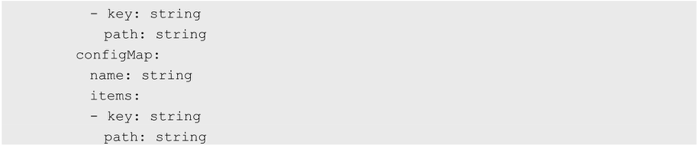
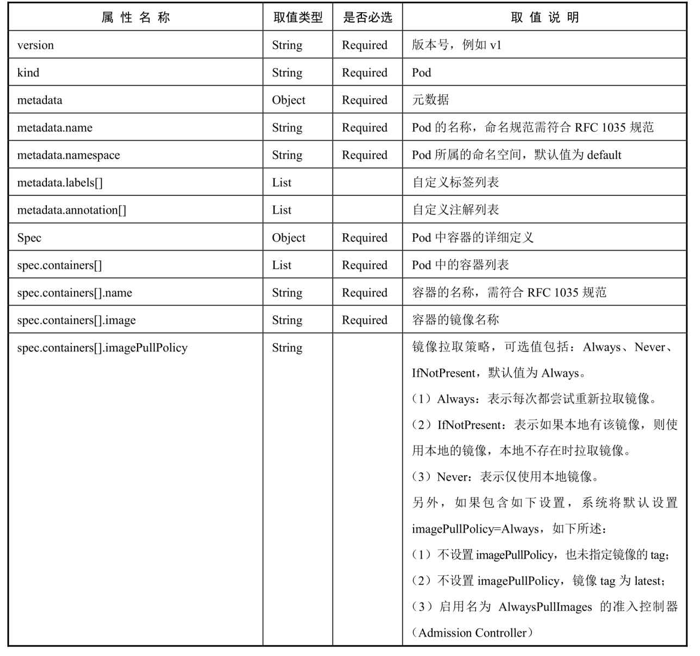

<!-- @import "[TOC]" {cmd="toc" depthFrom=1 depthTo=6 orderedList=false} -->

<!-- code_chunk_output -->

- [1. YAML格式的完整定义](#1-yaml格式的完整定义)
- [2. 属性说明](#2-属性说明)

<!-- /code_chunk_output -->

# 1. YAML格式的完整定义

YAML格式的Pod定义文件的完整内容如下: 

# 2. 属性说明

对各属性的详细说明如表3.1所示

表3.1　对Pod定义文件模板中各属性的详细说明:

