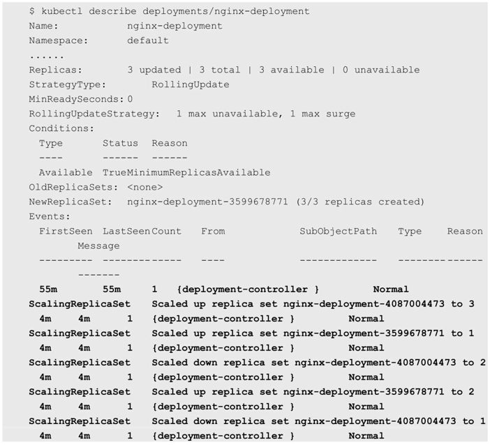

<!-- @import "[TOC]" {cmd="toc" depthFrom=1 depthTo=6 orderedList=false} -->

<!-- code_chunk_output -->

- [1. Deployment的升级](#1-deployment的升级)
- [2. Deployment的回滚](#2-deployment的回滚)
- [3. 暂停和恢复Deployment的部署操作, 以完成复杂的修改](#3-暂停和恢复deployment的部署操作以完成复杂的修改)
- [4. 使用kubectl rolling\-update命令完成RC的滚动升级](#4-使用kubectl-rolling-update命令完成rc的滚动升级)
- [5. 其他管理对象的更新策略](#5-其他管理对象的更新策略)
  - [5.1. DaemonSet的更新策略](#51-daemonset的更新策略)
  - [5.2. StatefulSet的更新策略](#52-statefulset的更新策略)

<!-- /code_chunk_output -->

当集群中的**某个服务需要升级**时, 我们需要**停止**目前**与该服务相关**的**所有Pod**, 然后**下载新版本镜像**并**创建新的Pod**. 如果集群**规模比较大**, 则这个工作变成了一个挑战, 而且先全部停止然后逐步升级的方式会导致**较长时间的服务不可用**. 

Kubernetes提供了**滚动升级**功能来解决上述问题. 

如果**Pod**是通过**Deployment创建**的, 则用户可以在**运行时**修改Deployment的**Pod定义**(**spec.template**)或**镜像名称**, 并应用到Deployment对象上, 系统即可完成Deployment的自动更新操作. 如果在更新过程中发生了错误, 则还可以通过回滚操作恢复Pod的版本. 

# 1. Deployment的升级

以Deployment nginx为例: 

```yaml
# nginx-deployment.yaml
---
apiVersion: apps/v1beta1
kind: Deployment
metadata:
  name: nginx-deployment
spec:
  replicas: 3
  template:
    metadata:
      labels:
        app: nginx
    spec:
      containers:
      - name: nginx
        image: nginx:1.7.9
        ports:
        - containerPort: 80
```

已运行的Pod副本数量有3个: 

```
# kubectl get pods
NAME                                READY   STATUS  RESTARTS    AGE
nginx-deployment-4087004473-9jqqs   1/1     Running 0           1m
nginx-deployment-4087004473-cq0cf   1/1     Running 0           1m
nginx-deployment-4087004473-vxn56   1/1     Running 0           1m
```

现在**Pod镜像**需要被更新为**Nginx:1.9.1**, 我们可以通过**kubectl set image**命令为Deployment设置新的镜像名称: 

```
# kubectl set image deployment/nginx-development nginx=nginx:1.9.1
deployment "nginx-deployment" image updated
```

**另一种**更新的方法是使用**kubectl edit**命令**修改Deployment的配置**, 将spec.template.spec.containers\[0].image从Nginx:1.7.9更改为Nginx:1.9.1: 

```
# kubectl edit deployment/nginx-deployment
deployment "nginx-deployment" edited
```

一旦**镜像名**(或**Pod定义**)发生了**修改**, 则将**触发系统**完成**Deployment所有运行Pod的滚动升级操作**. 

可以使用kubectl rollout status命令查看Deployment的更新过程: 


查看当前运行的Pod, 名称已经更新:

```
# kubectl get pods
NAME                                READY   STATUS  RESTARTS    AGE
nginx-deployment-3599678771-01h26   1/1     Running 0           1m
nginx-deployment-3599678771-57thr   1/1     Running 0           1m
nginx-deployment-3599678771-s8p21   1/1     Running 0           1m
```

查看Pod使用的镜像, 已经更新为Nginx:1.9.1了: 

```
# kubectl describe pod/nginx-deployment-3599678771-s8p21
Name:       nginx-deployment-3599678771-s8p21
......
    Image:          nginx:1.9.1
......
```

那么, Deployment是如何完成Pod更新的呢?

我们可以使用**kubectl describe deployments/nginx\-deployment**命令仔细观察Deployment的**更新过程**. 

初始创建Deployment时, 系统创建了一个ReplicaSet(nginx-deployment-4087004473), 并按用户的需求创建了3个Pod副本. 当更新Deployment时, 系统创建了一个新的ReplicaSet(nginx-deployment-3599678771), 并将其副本数量扩展到1, 然后将旧的ReplicaSet缩减为2. 之后, 系统继续按照相同的更新策略对新旧两个ReplicaSet进行逐个调整. 最后, 新的ReplicaSet运行了3个新版本Pod副本, 旧的ReplicaSet副本数量则缩减为0. 如图3.8所示. 

图3.8　Pod的滚动升级:


下面列出Deployment nginx-deployment的详细事件信息: 




运行kubectl get rs命令, 查看两个ReplicaSet的最终状态: 

```
# kubectl get rs
NAME                            DESIRED     CURRENT     READY   AGE
nginx-deployment-4087004473     0           0           0       52m
nginx-deployment-3599678771     3           3           3       1m
```

在整个升级的过程中, 系统会保证至少有两个Pod可用, 并且最多同时运行4个Pod, 这是Deployment通过复杂的算法完成的. Deployment需要确保在整个更新过程中只有一定数量的Pod可能处于不可用状态. 在默认情况下, Deployment确保可用的Pod总数至少为所需的副本数量(DESIRED)减1, 也就是最多1个不可用(maxUnavailable=1). Deployment还需要确保在整个更新过程中Pod的总数量不会超过所需的副本数量太多. 在默认情况下, Deployment确保Pod的总数最多比所需的Pod数多1个, 也就是最多1个浪涌值(maxSurge=1). Kubernetes从1.6版本开始, maxUnavailable和maxSurge的默认值将从1、1更新为所需副本数量的25%、25%. 

这样, 在升级过程中, Deployment就能够保证服务不中断, 并且副本数量始终维持为用户指定的数量(DESIRED). 

对更新策略的说明如下. 

在Deployment的定义中, 可以通过spec.strategy指定Pod更新的策略, 目前支持两种策略: Recreate(重建)和RollingUpdate(滚动更新), 默认值为RollingUpdate. 在前面的例子中使用的就是RollingUpdate策略. 

◎　Recreate: 设置spec.strategy.type=Recreate, 表示Deployment在更新Pod时, 会先杀掉所有正在运行的Pod, 然后创建新的Pod. 

◎　RollingUpdate: 设置spec.strategy.type=RollingUpdate, 表示Deployment会以滚动更新的方式来逐个更新Pod. 同时, 可以通过设置spec.strategy.rollingUpdate下的两个参数(maxUnavailable和maxSurge)来控制滚动更新的过程. 

下面对滚动更新时两个主要参数的说明如下. 

◎　spec.strategy.rollingUpdate.maxUnavailable: 用于指定Deployment在更新过程中不可用状态的Pod数量的上限. 该maxUnavailable的数值可以是绝对值(例如5)或Pod期望的副本数的百分比(例如10%), 如果被设置为百分比, 那么系统会先以向下取整的方式计算出绝对值(整数). 而当另一个参数maxSurge被设置为0时, maxUnavailable则必须被设置为绝对数值大于0(从Kubernetes 1.6开始, maxUnavailable的默认值从1改为25%). 举例来说, 当maxUnavailable被设置为30%时, 旧的ReplicaSet可以在滚动更新开始时立即将副本数缩小到所需副本总数的70%. 一旦新的Pod创建并准备好, 旧的ReplicaSet会进一步缩容, 新的ReplicaSet又继续扩容, 整个过程中系统在任意时刻都可以确保可用状态的Pod总数至少占Pod期望副本总数的70%. 

◎　spec.strategy.rollingUpdate.maxSurge: 用于指定在Deployment更新Pod的过程中Pod总数超过Pod期望副本数部分的最大值. 该maxSurge的数值可以是绝对值(例如5)或Pod期望副本数的百分比(例如10%). 如果设置为百分比, 那么系统会先按照向上取整的方式计算出绝对数值(整数). 从Kubernetes 1.6开始, maxSurge的默认值从1改为25%. 举例来说, 当maxSurge的值被设置为30%时, 新的ReplicaSet可以在滚动更新开始时立即进行副本数扩容, 只需要保证新旧ReplicaSet的Pod副本数之和不超过期望副本数的130%即可. 一旦旧的Pod被杀掉, 新的ReplicaSet就会进一步扩容. 在整个过程中系统在任意时刻都能确保新旧ReplicaSet的Pod副本总数之和不超过所需副本数的130%. 

这里需要注意多重更新(Rollover)的情况. 如果Deployment的上一次更新正在进行, 此时用户再次发起Deployment的更新操作, 那么Deployment会为每一次更新都创建一个ReplicaSet, 而每次在新的ReplicaSet创建成功后, 会逐个增加Pod副本数, 同时将之前正在扩容的ReplicaSet停止扩容(更新), 并将其加入旧版本ReplicaSet列表中, 然后开始缩容至0的操作. 

例如, 假设我们创建一个Deployment, 这个Deployment开始创建5个Nginx:1.7.9的Pod副本, 在这个创建Pod动作尚未完成时, 我们又将Deployment进行更新, 在副本数不变的情况下将Pod模板中的镜像修改为Nginx:1.9.1, 又假设此时Deployment已经创建了3个Nginx:1.7.9的Pod副本, 则Deployment会立即杀掉已创建的3个Nginx:1.7.9 Pod, 并开始创建Nginx:1.9.1 Pod. Deployment不会在等待Nginx:1.7.9的Pod创建到5个之后再进行更新操作. 

还需要注意更新Deployment的标签选择器(Label Selector)的情况. 通常来说, 不鼓励更新Deployment的标签选择器, 因为这样会导致Deployment选择的Pod列表发生变化, 也可能与其他控制器产生冲突. 如果一定要更新标签选择器, 那么请务必谨慎, 确保不会出现其他问题. 关于Deployment标签选择器的更新的注意事项如下. 

(1)添加选择器标签时, 必须同步修改Deployment配置的Pod的标签, 为Pod添加新的标签, 否则Deployment的更新会报验证错误而失败: 


添加标签选择器是无法向后兼容的, 这意味着新的标签选择器不会匹配和使用旧选择器创建的ReplicaSets和Pod, 因此添加选择器将会导致所有旧版本的ReplicaSets和由旧ReplicaSets创建的Pod处于孤立状态(不会被系统自动删除, 也不受新的ReplicaSet控制). 

为标签选择器和Pod模板添加新的标签(使用kubectl edit deployment命令)后, 效果如下: 

```
# kubectl get rs
NAME                            DESIRED     CURRENT     READY   AGE
nginx-deployment-4087004473     0           0           0       52m
nginx-deployment-3599678771     3           3           3       1m
nginx-deployment-3661742516     3           3           3       2s
```

可以看到新ReplicaSet(nginx\-deployment-3661742516)创建的3个新Pod: 

```
# kubectl get pods
NAME                                READY   STATUS  RESTARTS    AGE
nginx-deployment-3599678771-01h26   1/1     Running 0           2m
nginx-deployment-3599678771-57thr   1/1     Running 0           2m
nginx-deployment-3599678771-s8p21   1/1     Running 0           2m
nginx-deployment-3661742516-46djm   1/1     Running 0           52s
nginx-deployment-3661742516-kws84   1/1     Running 0           52s
nginx-deployment-3661742516-wq30s   1/1     Running 0           52s
```

(2)更新标签选择器, 即更改选择器中标签的键或者值, 也会产生与添加选择器标签类似的效果. 

(3)删除标签选择器, 即从Deployment的标签选择器中删除一个或者多个标签, 该Deployment的ReplicaSet和Pod不会受到任何影响. 但需要注意的是, 被删除的标签仍会存在于现有的Pod和ReplicaSets上. 

# 2. Deployment的回滚

有时(例如新的Deployment不稳定时)我们可能需要将Deployment回滚到旧版本. 在默认情况下, 所有Deployment的发布历史记录都被保留在系统中, 以便于我们随时进行回滚(可以配置历史记录数量). 

假设在更新Deployment镜像时, 将容器镜像名误设置成Nginx:1.91(一个不存在的镜像): 


```
# kubectl set image deployment/nginx-deployment nginx=nginx:1.9.1
deployment "nginx-deployment" image updated
```

则这时Deployment的部署过程会卡住: 

```
# kubectl rollout status deployments nginx-deployment
Waiting for rollout to finish: 1 out of 3 new replicas have been updated...
```

......

# 3. 暂停和恢复Deployment的部署操作, 以完成复杂的修改


# 4. 使用kubectl rolling\-update命令完成RC的滚动升级


# 5. 其他管理对象的更新策略

Kubernetes从1.6版本开始, 对DaemonSet和StatefulSet的更新策略也引入类似于Deployment的滚动升级, 通过不同的策略自动完成应用的版本升级. 

## 5.1. DaemonSet的更新策略

目前DaemonSet的升级策略包括两种: OnDelete和RollingUpdate. 

(1)OnDelete: DaemonSet的默认升级策略, 与1.5及以前版本的Kubernetes保持一致. 当使用OnDelete作为升级策略时, 在创建好新的DaemonSet配置之后, 新的Pod并不会被自动创建, 直到用户手动删除旧版本的Pod, 才触发新建操作. 

(2)RollingUpdate: 从Kubernetes 1.6版本开始引入. 当使用RollingUpdate作为升级策略对DaemonSet进行更新时, 旧版本的Pod将被自动杀掉, 然后自动创建新版本的DaemonSet Pod. 整个过程与普通Deployment的滚动升级一样是可控的. 不过有两点不同于普通Pod的滚动升级: 一是目前Kubernetes还不支持查看和管理DaemonSet的更新历史记录; 二是DaemonSet的回滚(Rollback)并不能如同Deployment一样直接通过kubectl rollback命令来实现, 必须通过再次提交旧版本配置的方式实现. 

## 5.2. StatefulSet的更新策略

Kubernetes从1.6版本开始, 针对StatefulSet的更新策略逐渐向Deployment和DaemonSet的更新策略看齐, 也将实现RollingUpdate、Paritioned和OnDelete这几种策略, 以保证StatefulSet中各Pod有序地、逐个地更新, 并且能够保留更新历史, 也能回滚到某个历史版本. 
