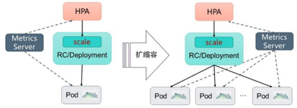
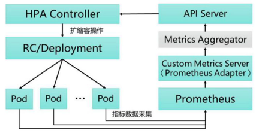

<!-- @import "[TOC]" {cmd="toc" depthFrom=1 depthTo=6 orderedList=false} -->

<!-- code_chunk_output -->

- [0 Deployment/RC的Scale机制: 对Pod的扩缩容](#0-deploymentrc的scale机制-对pod的扩缩容)
- [1 手动扩缩容机制](#1-手动扩缩容机制)
- [2 自动扩缩容机制](#2-自动扩缩容机制)
  - [2.1 HPA的工作原理](#21-hpa的工作原理)
  - [2.2 指标的类型](#22-指标的类型)
  - [2.3 扩缩容算法详解](#23-扩缩容算法详解)
  - [2.4 HorizontalPodAutoscaler配置详解](#24-horizontalpodautoscaler配置详解)
  - [2.5 基于自定义指标的HPA实践](#25-基于自定义指标的hpa实践)

<!-- /code_chunk_output -->

# 0 Deployment/RC的Scale机制: 对Pod的扩缩容

实际生产系统, 会遇到**某个服务需要扩容**的场景, 也可能会遇到由于**资源紧张**或者**工作负载降低**而需要**减少服务实例数量**的场景. 

此时可以利用**Deployment/RC**的**Scale机制**来完成这些工作. 

Kubernetes**对Pod的扩缩容**操作提供了**手动**和**自动**两种模式.

**手动模式**通过执行**kubectl scale命令**或通过**RESTful API**对一个**Deployment/RC**进行**Pod副本数量**的设置, 即可**一键完成**. 

**自动模式**则需要用户根据**某个性能指标**或者**自定义业务指标**, 并指定**Pod副本数量的范围**, 系统将自动在**这个范围内**根据**性能指标的变化**进行调整. 

# 1 手动扩缩容机制

以Deployment nginx为例: 

```yaml
---
apiVersion: apps/v1beta1
kind: Deployment
metadata:
  name: nginx-deployment
spec:
  replicas: 3
  template:
    metadata:
      labels:
        app: nginx
    spec:
      containers:
      - name: nginx
        image: nginx:1.7.9
        ports:
        - containerPort: 80
```

已运行的Pod副本数量为3个: 

```
# kubectl get pods
NAME                                READY   STATUS  RESTARTS    AGE
nginx-deployment-3973253433-scz37   1/1     Running 0           5s
nginx-deployment-3973253433-x8fsq   1/1     Running 0           5s
nginx-deployment-3973253433-x9z8z   1/1     Running 0           5s
```

通过kubectl **scale命令**可以将Pod副本数量从初始的3个更新为5个: 

```
# kubectl scale deployment nginx-deployment --replicas 5
deployment "nginx-deployment" scaled

# kubectl get pods
NAME                                READY   STATUS  RESTARTS    AGE
nginx-deployment-3973253433-scz37   1/1     Running 0           5s
nginx-deployment-3973253433-x8fsq   1/1     Running 0           5s
nginx-deployment-3973253433-x9z8z   1/1     Running 0           5s
nginx-deployment-3973253433-7jls2   1/1     Running 0           5s
nginx-deployment-3973253433-3gt27   1/1     Running 0           5s
```

将\-\-replicas设置为比当前Pod副本数量更小的数字, 系统将会"**杀掉**"一些运行中的Pod, 以实现应用集群缩容: 

```
# kubectl scale deployment nginx-deployment --replicas=1
deployment "nginx-deployment" scaled

# kubectl get pods
NAME                                READY   STATUS  RESTARTS    AGE
nginx-deployment-3973253433-x9z8z   1/1     Running 0           6m
```

# 2 自动扩缩容机制

Kubernetes从1.1版本开始, 新增了名为**Horizontal Pod Autoscaler(HPA**)的**控制器**, 用于实现**基于CPU使用率**进行**自动Pod扩缩容**的功能. 

**HPA控制器**基于**Master**的**kube\-controller\-manager**服务**启动参数**\-\-**horizontal\-pod\-autoscaler\-sync\-period**定义的**探测周期**(默认值为**15s**), 周期性地**监测目标Pod的资源性能指标**, 并与HPA资源对象中的扩缩容条件进行对比, 在**满足条件**时对Pod副本数量进行调整. 

## 2.1 HPA的工作原理

Kubernetes中的**某个Metrics Server**(**Heapster**或**自定义Metrics Server**)持续采集**所有Pod副本的指标数据**. 

**HPA控制器**通过**Metrics Server**的**API**(Heapster的API或聚合API)获取这些数据, 基于**用户定义的扩缩容规则**进行计算, 得到**目标Pod副本数量**. 

当目标Pod副本数量与当前副本**数量不同**时, **HPA控制器**就向**Pod的副本控制器**(**Deployment**、**RC**或**ReplicaSet**)发起**scale操作**, 调整Pod的副本数量, 完成扩缩容操作. 

图3.9描述了HPA体系中的关键组件和工作流程. 

图3.9　HPA的工作原理:



接下来首先对**HPA**能够管理的**指标类型**、**扩缩容算法**、**HPA对象的配置**进行详细说明, 然后通过一个完整的示例对如何搭建和使用基于自定义指标的HPA体系进行说明. 

## 2.2 指标的类型

Master的**kube\-controller\-manager**服务持续监测**目标Pod**的某种性能指标, 以计算是否需要调整副本数量. 

目前Kubernetes支持的指标类型如下. 

- **Pod资源使用率**: Pod级别的性能指标, 通常是一个**比率值**, 例如**CPU使用率**. 
- **Pod自定义指标**: Pod级别的性能指标, 通常是一个数值, 例如接收的请求数量. 
- **Object自定义指标或外部自定义指标**: 通常是一个数值, 需要**容器应用以某种方式提供**, 例如通过HTTP URL"/metrics"提供, 或者使用外部服务提供的指标采集URL. 

Kubernetes从1.11版本开始, **弃用！！！** 基于**Heapster组件**完成**Pod的CPU使用率**采集的机制, 全面转向**基于Metrics Server**完成**数据采集**. 

**Metrics Server**将采集到的**Pod性能指标数据**通过**聚合API(Aggregated API**)如metrics.k8s.io、custom.metrics.k8s.io和external.metrics.k8s.io提供给**HPA控制器**进行查询. 

关于**聚合API**和**API聚合器**(**API Aggregator**)的概念详见9.4节的说明. 

## 2.3 扩缩容算法详解

**Autoscaler控制器**从**聚合API**获取到**Pod性能指标数据**之后, 基于下面的算法计算出目标Pod副本数量, 与当前运行的Pod副本数量进行对比, 决定是否需要进行扩缩容操作: 

```
desiredReplicas = ceil[currentReplicas * ( currentMetricValue / desireMetricValue)]
```

即**当前副本数** ×(**当前指标值**/**期望的指标值**), 将**结果向上取整**. 

以**CPU请求数量**为例, 如果用户设置的**期望指标值为100m**, 当前**实际**使用的**指标值为200m**, 则计算得到期望的Pod副本数量应为两个(200/100=2). 如果设置的期望指标值为50m, 计算结果为0.5, 则向上取整值为1, 得到目标Pod副本数量应为1个. 

当计算结果与1非常接近时, 可以设置一个容忍度让系统不做扩缩容操作. 容忍度通过**kube\-controller\-manager服务**的启动参数\-\-**horizontal\-pod\-autoscaler\-tolerance**进行设置, **默认值为0.1**(即10%), 表示基于上述算法得到的结果在\[\-10% \- \+10%]区间内, 即\[**0.9 \- 1.1**], 控制器都不会进行扩缩容操作. 

也可以将**期望指标值(desiredMetricValue**)设置为指标的**平均值类型**, 例如**targetAverageValue**或**targetAverageUtilization**, 此时当前指标值(**currentMetricValue**)的算法为**所有Pod副本当前指标值的总和**除以**Pod副本数量**得到的平均值. 

此外, 存在几种Pod异常的情况, 如下所述. 

- Pod正在被删除(设置了删除时间戳): 将不会计入目标Pod副本数量. 

- Pod的当前指标值无法获得: 本次探测不会将这个Pod纳入目标Pod副本数量, 后续的探测会被重新纳入计算范围. 

- 如果指标类型是CPU使用率, 则对于正在启动但是还未达到Ready状态的Pod, 也暂时不会纳入目标副本数量范围. 可以通过kube\-controller\-manager服务的启动参数\-\-horizontal\-pod\-autoscaler\-initial\-readiness\-delay设置首次探测Pod是否Ready的延时时间, 默认值为30s. 另一个启动参数\-\-horizontal\-pod\-autoscaler\-cpuinitialization\-period设置首次采集Pod的CPU使用率的延时时间. 

在计算"当前指标值/期望的指标值"(currentMetricValue / desiredMetricValue)时将不会包括上述这些异常Pod. 

当存在缺失指标的Pod时, 系统将更保守地重新计算平均值. 系统会假设这些Pod在需要缩容(Scale Down)时消耗了期望指标值的100%, 在需要扩容(Scale Up)时消耗了期望指标值的0%, 这样可以抑制潜在的扩缩容操作. 

此外, 如果存在未达到Ready状态的Pod, 并且系统原本会在不考虑缺失指标或NotReady的Pod情况下进行扩展, 则系统仍然会保守地假设这些Pod消耗期望指标值的0%, 从而进一步抑制扩容操作. 

如果在HorizontalPodAutoscaler中设置了多个指标, 系统就会对每个指标都执行上面的算法, 在全部结果中以期望副本数的最大值为最终结果. 如果这些指标中的任意一个都无法转换为期望的副本数(例如无法获取指标的值), 系统就会跳过扩缩容操作. 

最后, 在HPA控制器执行扩缩容操作之前, 系统会记录扩缩容建议信息(Scale Recommendation). 控制器会在操作时间窗口(时间范围可以配置)中考虑所有的建议信息, 并从中选择得分最高的建议. 这个值可通过kube\-controller\-manager服务的启动参数\-\-horizontal\-pod\-autoscaler\-downscale\-stabilization\-window进行配置, 默认值为5min. 这个配置可以让系统更为平滑地进行缩容操作, 从而消除短时间内指标值快速波动产生的影响. 

## 2.4 HorizontalPodAutoscaler配置详解

Kubernetes将**HorizontalPodAutoscaler资源对象**提供给用户来定义扩缩容的规则. 

HorizontalPodAutoscaler资源对象处于Kubernetes的API组"**autoscaling**"中, 目前包括**v1**和**v2**两个版本. 

其中**autoscaling/v1**仅支持**基于CPU使用率**的**自动扩缩容**, **autoscaling/v2**则用于支持基于**任意指标**的自动扩缩容配置, 包括基于资源使用率、Pod指标、其他指标等类型的指标数据, 当前版本为**autoscaling/v2beta2**. 

下面对HorizontalPodAutoscaler的配置和用法进行说明. 

(1)基于**autoscaling/v1**版本的HorizontalPodAutoscaler配置, **仅可以设置CPU使用率**: 

```yaml
apiVersion: autoscaling/v1 
kind: HorizontalPodAutoscaler
metadata:
  name: php-apache
 spec:
  scaleTargetRef:
    apiVersion: apps/v1
    kind: Deployment
    name: php-apache
  minReplicas: 1
  maxReplicas: 10
  targetCPUUtilizationPercentage: 50
```

主要参数如下. 

- **scaleTargetRef**: **目标作用对象**, 可以是**Deployment**、**ReplicationController**或**ReplicaSet**. 

- **targetCPUUtilizationPercentage**: 期望**每个Pod**的**CPU使用率**都为50%, 该使用率基于**Pod设置的CPU Request值**进行计算, 例如**该值为200m**, 那么系统将维持Pod的实际CPU使用值为100m. 

- **minReplicas**和**maxReplicas**: Pod副本数量的最小值和最大值, 系统将在这个范围内进行自动扩缩容操作, 并维持每个Pod的CPU使用率为50%. 

为了使用**autoscaling/v1**版本的HorizontalPodAutoscaler, 需要**预先安装Heapster组件**或**Metrics Server**, 用于**采集Pod的CPU使用率**. 

**Heapster**从Kubernetes 1.11版本开始进入**弃用阶段**, 本节不再对Heapster进行详细说明. 关于Metrics Server的说明请参考9.4节的介绍, 本节主要对基于自定义指标进行自动扩缩容的设置进行说明. 

(2)基于**autoscaling/v2beta2**的HorizontalPodAutoscaler配置: 

```yaml
---
apiVersion: autoscaling/v2beta2
kind: HorizontalPodAutoscaler
metadata:
  name: php-apache
spec:
  scaleTargetRef:
    apiVersion: apps/v1
    kind: Deployment
    name: php-apache
  minReplicas: 1
  maxReplicas: 10
  metrics:
  - type: Resource
    resource:
      name: cpu
      target:
        type: Utilization
        averageUtilization: 50
```

主要参数如下. 

- scaleTargetRef: 目标作用对象, 可以是Deployment、ReplicationController或ReplicaSet. 

- minReplicas和maxReplicas: Pod副本数量的最小值和最大值, 系统将在这个范围内进行自动扩缩容操作, 并维持每个Pod的CPU使用率为50%. 

- **metrics**: 目标指标值. 在metrics中通过参数type定义指标的类型; 通过参数target定义相应的指标目标值, 系统将在指标数据达到目标值时(考虑容忍度的区间, 见前面算法部分的说明)触发扩缩容操作. 

可以将metrics中的**type(指标类型**)设置为以下三种, 可以设置一个或多个组合, 如下所述. 

(1)**Resource**: 基于**资源的指标值**, 可以设置的资源为**CPU**和**内存**. 

(2)**Pods**: 基于**Pod的指标**, 系统将对全部Pod副本的指标值进行**平均值计算**. 

(3)**Object**: 基于某种资源对象(如Ingress)的指标或应用系统的任意自定义指标. 

**Resource类型**的指标可以设置**CPU**和**内存**. 

- 对于**CPU使用率**, 在**target参数**中设置**averageUtilization**定义目标**平均CPU使用率**. 
- 对于**内存资源**, 在target参数中设置AverageValue定义目标**平均内存使用值**. 

指标数据可以通过API"**metrics.k8s.io**"进行查询, 要求**预先启动Metrics Server服务**. 

**Pods类型**和**Object类型**都属于**自定义指标类型**, 指标的数据通常需要搭建自定义Metrics Server和监控工具进行采集和处理. 指标数据可以通过API"custom.metrics.k8s.io"进行查询, 要求预先启动自定义Metrics Server服务. 

**类型为Pods**的指标数据来源于**Pod对象本身**, 其target指标类型**只能使用AverageValue**, 示例如下: 

```yaml
metrics:
- type: Pods
  pods:
    metric:
      name: packets-per-second
    target:
      type: AverageValue
      averageValue: 1k
```

其中, 设置Pod的**指标名**为**packets\-per\-second**, 在目标指标平均值为1000时触发扩缩容操作. 

类型为**Object**的指标数据来源于**其他资源对象**或**任意自定义指标**, 其target指标类型可以使用**Value**或**AverageValue**(根据**Pod副本数计算平均值**)进行设置. 下面对几种常见的自定义指标给出示例和说明. 

例1, 设置指标的名称为requests\-per\-second, 其值来源于Ingress "main\-route", 将目标值(value)设置为2000, 即在Ingress的每秒请求数量达到2000个时触发扩缩容操作: 

```yaml
metrics:
- type: Object
  object:
    metric:
      name: requests-per-second
    describedObject:
      apiVersion: extensions/v1beta1
      kind: Ingress
      name: main-route
    target:
      type: Value
      value: 1k
```

例2, 设置指标的名称为http\_requests, 并且该资源对象具有标签"verb=GET", 在指标平均值达到500时触发扩缩容操作: 

```yaml
metrics:
- type: Object
  object:
    metric:
      name: 'http_requests'
      selector: 'verb=GET'
    target:
      type: AverageValue
      AverageValue: 500
```

还可以在同一个HorizontalPodAutoscaler资源对象中定义多个类型的指标, 系统将针对每种类型的指标都计算Pod副本的目标数量, 以最大值为准进行扩缩容操作. 例如: 

```yaml
---
apiVersion: autoscaling/v2beta1
kind: HorizontalPodAutoscaler
metadata:
  name: php-apache
  namespace: default
 spec:
  scaleTargetRef:
    apiVersion: apps/v1
    kind: Deployment
    name: php-apache
  minReplicas: 1
  maxReplicas: 10
  metrics:
  - type: Resource
    resource:
      name: cpu
      target:
        type: AverageUtilization
        averageUtilization: 50
  - type: Pods
    pods:
      metric:
        name: packets-per-second
      targetAverageValue: 1k
  - type: Object
    object:
      metric:
        name: requests-per-second
      describedObject:
        apiVersion: extensions/v1beta1
        kind: Ingress
        name: main-route
      target:
        kind: Value
        value: 10k
```

从1.10版本开始, Kubernetes引入了对外部系统指标的支持. 例如, 用户使用了公有云服务商提供的消息服务或外部负载均衡器, 希望基于这些外部服务的性能指标(如消息服务的队列长度、负载均衡器的QPS)对自己部署在Kubernetes中的服务进行自动扩缩容操作. 这时, 就可以在metrics参数部分设置type为External来设置自定义指标, 然后就可以通过API"external.metrics.k8s.io"查询指标数据了. 当然, 这同样要求自定义Metrics Server服务已正常工作. 

例3, 设置指标的名称为queue\_messages\_ready, 具有queue=worker\_tasks标签在目标指标平均值为30时触发自动扩缩容操作: 

```yaml
- type: External
  external:
    metric:
      name: queue_messages_ready
      selector: "queue=worker_tasks"
    target:
      type: AverageValue
      averageValue: 30
```

在使用外部服务的指标时, 要安装、部署能够对接到Kubernetes HPA模型的监控系统, 并且完全了解监控系统采集这些指标的机制, 后续的自动扩缩容操作才能完成. 

Kubernetes**推荐**尽量使用**type为Object**的**HPA配置方式**, 这可以通过使用Operator模式, 将外部指标通过CRD(自定义资源)定义为API资源对象来实现. 

## 2.5 基于自定义指标的HPA实践

下面通过一个完整的示例, 对如何搭建和使用基于自定义指标的HPA体系进行说明. 

基于自定义指标进行自动扩缩容时, 需要**预先部署自定义Metrics Server**, 目前可以使用基于**Prometheus**、**Microsoft Azure**、**Datadog Cluster**等系统的Adapter实现自定义Metrics Server, 未来还将提供基于**Google Stackdriver**的实现自定义Metrics Server. 读者可以参考官网 https://github.com/kubernetes/metrics/blob/master/IMPLEMENTATIONS.md#custommetrics-api 的说明. 

本节基于Prometheus监控系统对HPA的基础组件部署和HPA配置进行详细说明. 

基于Prometheus的HPA架构如图3.10所示. 



关键组件包括如下. 

- Prometheus: **定期采集各Pod的性能指标数据**. 
- **Custom Metrics Server**: 自定义Metrics Server, 用**Prometheus Adapter**进行**具体实现**. 它从Prometheus服务采集**性能指标数据**, 通过Kubernetes的**Metrics Aggregation**层将自定义指标API注册到Master的API Server中, 以/apis/custom.metrics.k8s.io路径提供指标数据. 
- **HPA Controller**: Kubernetes的HPA控制器, 基于用户定义的**HorizontalPodAutoscaler**进行自动扩缩容操作. 

接下来对整个系统的部署过程进行说明. 

(1)在Master的API Server启动Aggregation层, 通过设置kube\-apiserver服务的下列启动参数进行开启. 

- \-\-requestheader\-client\-ca\-file=/etc/kubernetes/ssl\_keys/ca.crt: 客户端CA证书. 
- \-\-requestheader\-allowed\-names=: 允许访问的客户端common names列表, 通过header中由\-\-requestheader\-username\-headers参数指定的字段获取. 客户端common names的名称需要在client\-ca\-file中进行配置, 将其设置为空值时, 表示任意客户端都可以访问. 

- \-\-requestheader\-extra\-headers\-prefix=X\-Remote\-Extra\-: 请求头中需要检查的前缀名. 
- \-\-requestheader\-group\-headers=X\-Remote\-Group: 请求头中需要检查的组名. 
- \-\-requestheader\-username\-headers=X\-Remote\-User: 请求头中需要检查的用户名. 
- \-\-proxy\-client\-cert\-file=/etc/kubernetes/ssl\_keys/kubelet_client.crt: 在请求期间验证Aggregator的客户端CA证书. 
- \-\-proxy\-client\-key\-file=/etc/kubernetes/ssl\_keys/kubelet\_client.key: 在请求期间验证Aggregator的客户端私钥. 

配置kube\-controller\-manager服务中HPA的相关启动参数(可选配置)如下. 

- \-\-horizontal\-pod\-autoscaler\-sync\-period=10s: HPA控制器同步Pod副本数量的时间间隔, 默认值为15s. 
- \-\-horizontal\-pod\-autoscaler\-downscale\-stabilization=1m0s: 执行缩容操作的等待时长, 默认值为5min. 
- \-\-horizontal\-pod\-autoscaler\-initial\-readiness-delay=30s: 等待Pod达到Ready状态的时延, 默认值为30min. 
- \-\-horizontal\-pod\-autoscaler\-tolerance=0.1: 扩缩容计算结果的容忍度, 默认值为0.1, 表示\[\-10% \- \+10%]. 

(2)部署Prometheus, 这里使用Operator模式进行部署. 

首先, 使用下面的YAML配置文件部署prometheus\-operator: 

```yaml
# 1. prometheus-operator
---
apiVersion: apps/v1
kind: Deployment
metadata:
  labels:
    k8s-app: prometheus-operator
  name: prometheus-operator
spec:
  replicas: 1
  selector:
    matchLabels:
      k8s-app: prometheus-operator
  template:
    metadata:
      labels:
        k8s-app: prometheus-operator
    spec:
      containers:
      - image: quay.io/coreos/prometheus-operator:v0.17.0
        imagePullPolicy: IfNotPresent
        name: prometheus-operator
        ports:
        - containerPort: 8080
          name: http
        resources:
          limits:
            cpu: 200m
            memory: 100Mi
          requests:
            cpu: 100m
            memory: 50Mi
```

这个prometheus-operator会自动创建名为monitoring.coreos.com的CRD资源. 
然后, 通过Operator的配置部署Prometheus服务: 
