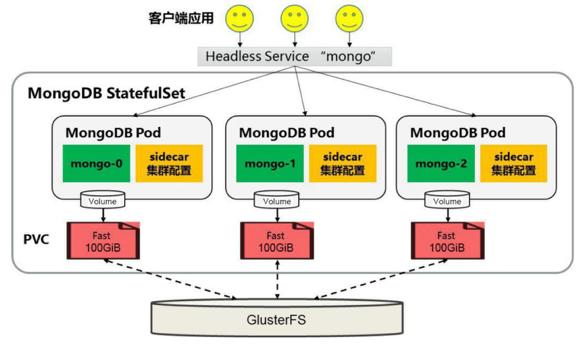

<!-- @import "[TOC]" {cmd="toc" depthFrom=1 depthTo=6 orderedList=false} -->

<!-- code_chunk_output -->

- [0 部署架构](#0-部署架构)
- [1 前提条件](#1-前提条件)
- [2 创建StatefulSet](#2-创建statefulset)

<!-- /code_chunk_output -->

# 0 部署架构

本节以MongoDB为例, 使用StatefulSet完成**MongoDB集群**的创建, 为**每个MongoDB实例**在**共享存储**中(这里采用**GlusterFS**)都申请一片**存储空间**, 以实现一个无单点故障、高可用、可动态扩展的MongoDB集群. 

部署架构如图3.11所示. 

图3.11 StatefulSet部署MongoDB集群的架构:



# 1 前提条件

在**创建StatefulSet之前**, 需要确保在Kubernetes集群中管理员**已经创建好共享存储**, 并**能够与StorageClass对接**, 以实现**动态存储供应**的模式. 

本节的示例将使用GlusterFS作为共享存储(GlusterFS的部署方法参见8.6节的说明). 

# 2 创建StatefulSet

为了完成MongoDB集群的搭建, 需要创建如下三个资源对象. 

- **一个StorageClass**, 用于**StatefulSet自动为各个应用Pod申请PVC**. 
- 一个**Headless Service**, 用于**维护MongoDB集群的状态**. 
- 一个**StatefulSet**. 

首先, 创建一个**StorageClass对象**. 

storageclass\-fast.yaml文件的内容如下: 

```yaml
---
apiVersion: storage.k8s.io/v1
kind: StorageClass
metadata:
  name: fast
provisioner: kubernetes.io/glusterfs
parameters:
  resturl: "http://<heketi-rest-url>"
```

执行kubectl create命令创建该StorageClass: 

```
# kubectl create -f storageclass-fast.yaml
storageClass "fast" created
```

接下来, 创建对应的**Headless Service**. 

**mongo\-sidecar**作为**MongoDB集群**的**管理者**, 将**使用此Headless Service**来维护**各个MongoDB实例**之间的集群关系, 以及集群规模变化时的自动更新. 

mongo\-headless\-service.yaml文件的内容如下: 

```yaml
---
apiVersion: v1
kind: Service
metadata:
  name: mongo
  labels:
    name: mongo
spec:
  ports:
  - port: 27017
    targetPort: 27017
  clusterIP: None
  selector:
    role: mongo
```

使用kubectl create命令创建该StorageClass: 

```
# kubectl create -f mongo-headless-service.yaml
service "mongo" created
```

最后, 创建**MongoDB StatefulSet**. 

statefulset\-mongo.yaml文件的内容如下: 

```yaml
---
apiVersion: apps/v1beta1
kind: StatefulSet
metadata:
  name: mongo
spec:
  serviceName: "mongo"
  replicas: 3
  template:
    metadata:
      labels:
        role: mongo
        environment: test
    spec:
      terminationGracePeriodSeconds: 10
      containers:
      - name: mongo
        image: mongo
        command:
        - mongod
        - "--replSet"
        - rs0
        - "--smallfiles"
        - "--noprealloc"
        ports:
        - containerPort: 27017
        volumeMounts:
        - name: mongo-persistent-storage
          mountPath: /data/db
      - name: mongo-sidecar
        image: cvallance/mongo-k8s-sidecar
        env:
        - name: MONGO_SIDECAR_POD_LABELS
          value: "role=mongo,environment=test"
        - name: KUBERNETES_MONGO_SERVICE_NAME
          value: "mongo"
  volumeClaimTemplates:
  - metadata:
      name: mongo-persistent-storage
      annotations:
        volume.beta.kubernetes.io/storage-class: "fast"
    spec:
      accessModes: [ "ReadWriteOnce" ]
      resources:
        requests:
          storage: 100Gi
```

其中的主要配置说明如下. 

(1)在该StatefulSet的定义中包括两个容器: mongo和mongo\-sidecar. mongo是主服务程序, mongo\-sidecar是将多个mongo实例进行集群设置的工具. mongo\-sidecar中的环境变量如下. 

- MONGO\_SIDECAR\_POD\_LABELS: 设置为mongo容器的标签, 用于sidecar查询它所要管理的MongoDB集群实例. 
- KUBERNETES\_MONGO\_SERVICE\_NAME: 它的值为mongo, 表示sidecar将使用mongo这个服务名来完成MongoDB集群的设置. 

(2)replicas=3表示这个MongoDB集群由**3个mongo实例**组成. 

(3)volumeClaimTemplates是StatefulSet最重要的存储设置. 在annotations段设置volume.beta.kubernetes.io/storage-class="fast"表示使用名为fast的StorageClass自动为每个mongo Pod实例分配后端存储. resources.requests.storage=100Gi表示为每个mongo实例都分配100GiB的磁盘空间. 

使用kubectl create命令创建这个StatefulSet: 

```
# kubectl create -f statefulset-mongo.yaml
statefulset "mongo" created
```

最终可以看到StatefulSet依次创建并启动了**3个mongo Pod实例**, 它们的名字依次为mongo\-0、mongo\-1、mongo\-2: 

```
# kubectl get pods -l role=mongo
NAME        READY   STATUS      RESTARTS    AGE
mongo-0     2/2     Running     0           4m
mongo-1     2/2     Running     0           3m
mongo-2     2/2     Running     0           2m
```

StatefulSet会用volumeClaimTemplates中的定义为每个Pod副本都创建一个PVC实例, 每个PVC的名称由StatefulSet定义中volumeClaimTemplates的名称和Pod副本的名称组合而成, 查看系统中的PVC, 可以验证这一点: 