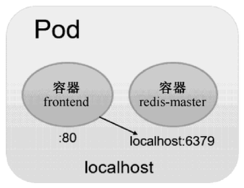
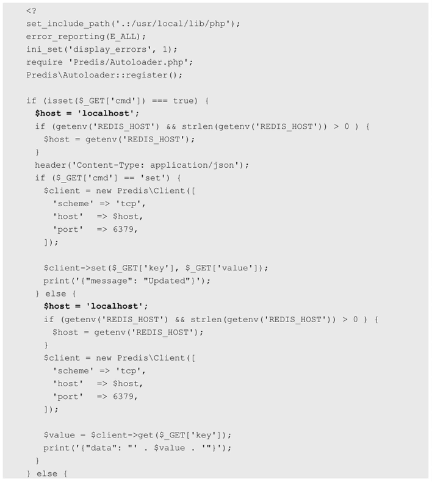
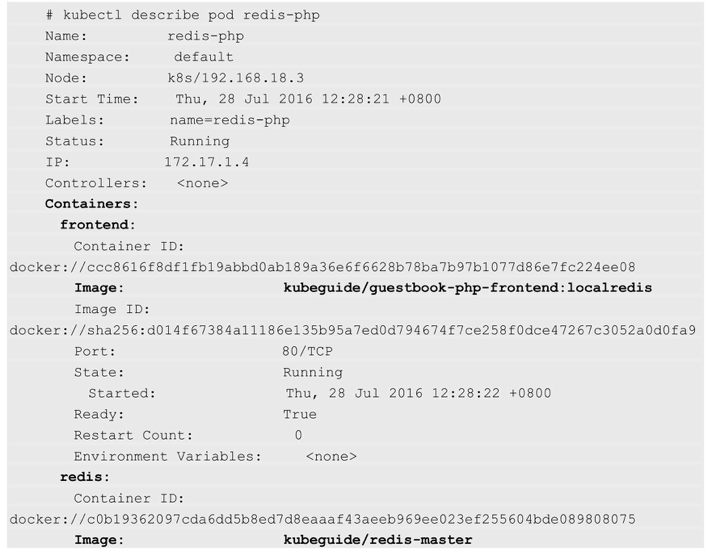
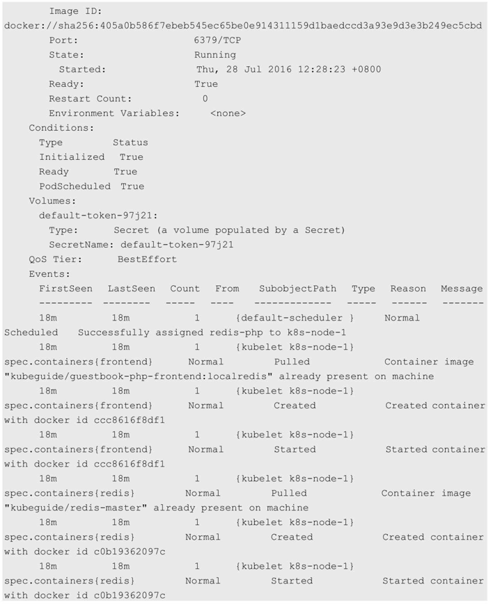

<!-- @import "[TOC]" {cmd="toc" depthFrom=1 depthTo=6 orderedList=false} -->

<!-- code_chunk_output -->

- [1. Kubernetes要求container主程序前台执行](#1-kubernetes要求container主程序前台执行)
- [2. 开源工具Supervisor辅助前台执行](#2-开源工具supervisor辅助前台执行)
- [3. Pod对container的封装](#3-pod对container的封装)
  - [3.1. Pod封装单个container](#31-pod封装单个container)
  - [3.2. Pod封装2个container](#32-pod封装2个container)

<!-- /code_chunk_output -->

# 1. Kubernetes要求container主程序前台执行

在对Pod的用法进行说明之前, 有必要先对Docker容器中应用的运行要求进行说明. 

在使用Docker时, 可以使用**docker run命令**创建并**启动一个容器**. 

而在Kubernetes系统中对**长时间运行容器！！！** 的要求是: 其**主程序需要一直在前台执行**. 

如果我们创建的Docker镜像的启动命令是**后台执行程序**, 例如Linux脚本: 

```
nohup ./start.sh &
```

则在**kubelet创建**包含**这个容器的Pod**之后运行完该命令, 即认为**Pod执行结束**, 将立刻销毁该Pod. 如果为该Pod定义了ReplicationController, 则系统会监控到该Pod已经终止, 之后根据RC定义中Pod的replicas副本数量生成一个新的Pod. 一旦创建新的Pod, 就在执行完启动命令后陷入无限循环的过程中. 这就是Kubernetes需要我们**自己创建的Docker镜像**并**以一个前台命令作为启动命令**的原因. 

# 2. 开源工具Supervisor辅助前台执行

对于无法改造为前台执行的应用, 也可以使用**开源工具Supervisor**辅助进行前台运行的功能. Supervisor提供了一种可以同时启动多个后台应用, 并保持**Supervisor自身在前台执行**的机制, 可以满足Kubernetes对容器的启动要求. 关于Supervisor的安装和使用, 请参考官网 http://supervisord.org 的文档说明. 

# 3. Pod对container的封装

接下来对Pod对容器的封装和应用进行说明. 

Pod可以由**1个或多个容器**组合而成. 

## 3.1. Pod封装单个container

在上一节Guestbook的例子中, 名为frontend的Pod只由一个容器组成: 

```yaml
apiVersion: v1
kind: Pod
metadata:
  name: frontend
  labels:
    name: frontend
spec:
  containers:
    - name: frontend
      image: kubeguide/guestbook-php-frontend
      env:
        - name: GET_HOSTS_FROM
          value: env
      ports:
        - containerPort: 80
```

这个frontend Pod在成功启动之后, 将启动1个Docker容器. 

## 3.2. Pod封装2个container

另一种场景是, 当frontend和redis**两个容器应用**为**紧耦合**的关系, 并组合成一个整体对外提供服务时, 应将这两个容器打包为一个Pod, 如图3.1所示. 

图3.1 包含两个容器的Pod



配置文件frontend-localredis-pod.yaml的内容如下: 

```yaml
apiVersion: v1
kind: Pod
metadata:
  name: redis-php
  labels:
    name: redis-php
spec:
  containers:
    - name: frontend
      image: kubeguide/guestbook-php-frontend:localredis
      ports:
        - containerPort: 80
    - name: redis
      image: kubeguide/redis-master
      ports:
        - containerPort: 6379
```

属于**同一个Pod**的**多个容器应用**之间**相互访问**时**仅需要通过localhost**就可以通信, 使得这一组容器被"绑定"在了一个环境中. 

在**Docker容器kubeguide/guestbook\-php\-frontend:localredis的PHP网页**中, 直接通过URL地址"localhost:6379"对同属于一个Pod的redis\-master进行访问. 

guestbook.php的内容如下: 




创建该Pod:

```
# kubectl create -f frontend-localredis-pod.yaml
```

查看已经创建的Pod: 

```
# kubectl get pods
NAME        READY   STATUS  RESTARTS    AGE
redis-php   2/2     Running 0           10m
```

可以看到READY信息为2/2, 表示Pod中的两个容器都成功运行了. 

查看这个Pod的详细信息, 可以看到两个容器的定义及创建的过程(Event事件信息): 



