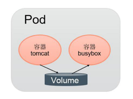
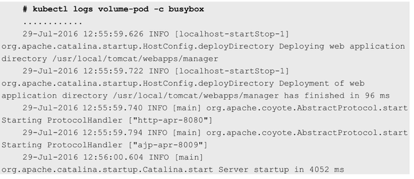
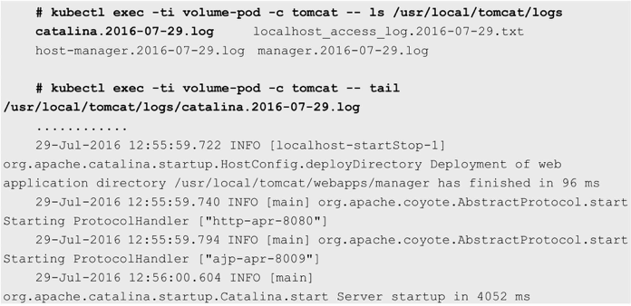

<!-- @import "[TOC]" {cmd="toc" depthFrom=1 depthTo=6 orderedList=false} -->

<!-- code_chunk_output -->


<!-- /code_chunk_output -->

同一个Pod中的多个容器能够**共享Pod级别**的**存储卷Volume**. 

Volume可以被定义为**各种类型**, 多个容器**各自进行挂载操作**, 将**一个Volume挂载**为容器内部**需要的目录**, 如图3.2所示. 

图3.2 Pod中多个容器共享Volume:



在下面的例子中, 在Pod内包含**两个容器**: **tomcat**和**busybox**, 在Pod级别设置Volume"app\-logs", 用于**tomcat向其中写日志文件**, **busybox读日志文件**. 

配置文件pod\-volume\-applogs.yaml的内容如下: 

```yaml
apiVersion: v1
kind: Pod
metadata:
  name: volume-pod
spec:
  containers:
  - name: tomcat
    image: tomcat
    ports:
    - containerPort: 8080
    volumeMounts:
    - name: app-logs
      mountPath: /usr/local/tomcat/logs
  - name: busybox
    image: busybox
    command: ["sh", "-c", "tail -f /logs/catalina*.log"]
    volumeMounts:
    - name: app-logs
      mountPath: /logs
  volumes:
  - name: app-logs
    emptyDir: {}
```

这里设置的**Volume名**为**app\-logs**, 类型为**emptyDir**(也可以设置为其他类型, 详见第1章对Volume概念的说明), **挂载**到**tomcat容器内**的/**usr/local/tomcat/logs目录**, 同时**挂载**到**busybox容器内**的/**logs目录**. 

**tomcat容器**在**启动后**会向/usr/local/tomcat/logs目录**写文件**, busybox容器就可以**读取其中的文件**了. 

busybox容器的启动命令为`tail -f /logs/catalina*.log`, 我们可以通过**kubectl logs命令**查看busybox容器的输出内容: 



这个文件为tomcat生成的日志文件/usr/local/tomcat/logs/catalina.\<date\>.log的内容. 登录tomcat容器进行查看: 

