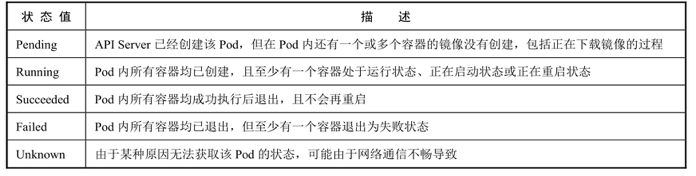
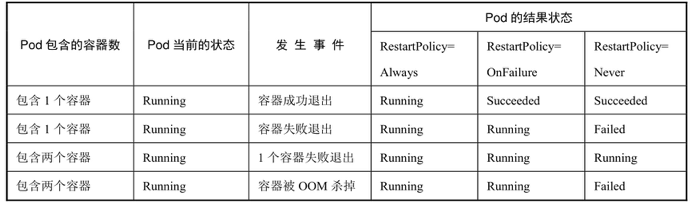

<!-- @import "[TOC]" {cmd="toc" depthFrom=1 depthTo=6 orderedList=false} -->

<!-- code_chunk_output -->

<!-- /code_chunk_output -->

Pod在整个生命周期中被系统定义为各种状态, 熟悉Pod的各种状态对于理解如何设置Pod的调度策略、重启策略是很有必要的. 

Pod的状态如表3.2所示. 

Pod的状态:

Pod的**重启策略(RestartPolicy**)应用于**Pod内！！！** 的**所有容器**, 并且**仅在Pod所处的Node！！！** 上由**kubelet**进行**判断和重启**操作. 

当**某个容器！！！** 异常退出或者健康检查(详见下节)失败时, kubelet将根据**RestartPolicy的设置**来进行相应的操作. 

Pod的重启策略包括Always、OnFailure和Never, 默认值为Always. 

- **Always**: 当容器失效时, 由kubelet自动重启该容器. 

- **OnFailure**: 当容器终止运行且退出码不为0时, 由kubelet自动重启该容器. 

- **Never**: 不论容器运行状态如何, kubelet都不会重启该容器. 

kubelet**重启失效容器**的**时间间隔**以**sync\-frequency**乘以**2n**来计算, 例如1、2、4、8倍等, **最长延时5min**, 并且在成功重启后的10min后重置该时间. 

Pod的重启策略与控制方式息息相关, 当前**可用于管理Pod的控制器**包括**ReplicationController**、**Job**、**DaemonSet**及**直接通过kubelet**管理(**静态Pod**). 

**每种控制器**对Pod的**重启策略要求！！！** 如下. 

- RC和DaemonSet: 必须设置为Always, 需要保证该容器持续运行. 
- Job: OnFailure或Never, 确保容器执行完成后不再重启. 
- kubelet: 在Pod失效时自动重启它, 不论将RestartPolicy设置为什么值, 也**不会对Pod进行健康检查**. 

结合Pod的状态和重启策略, 表3.3列出一些常见的状态转换场景. 

