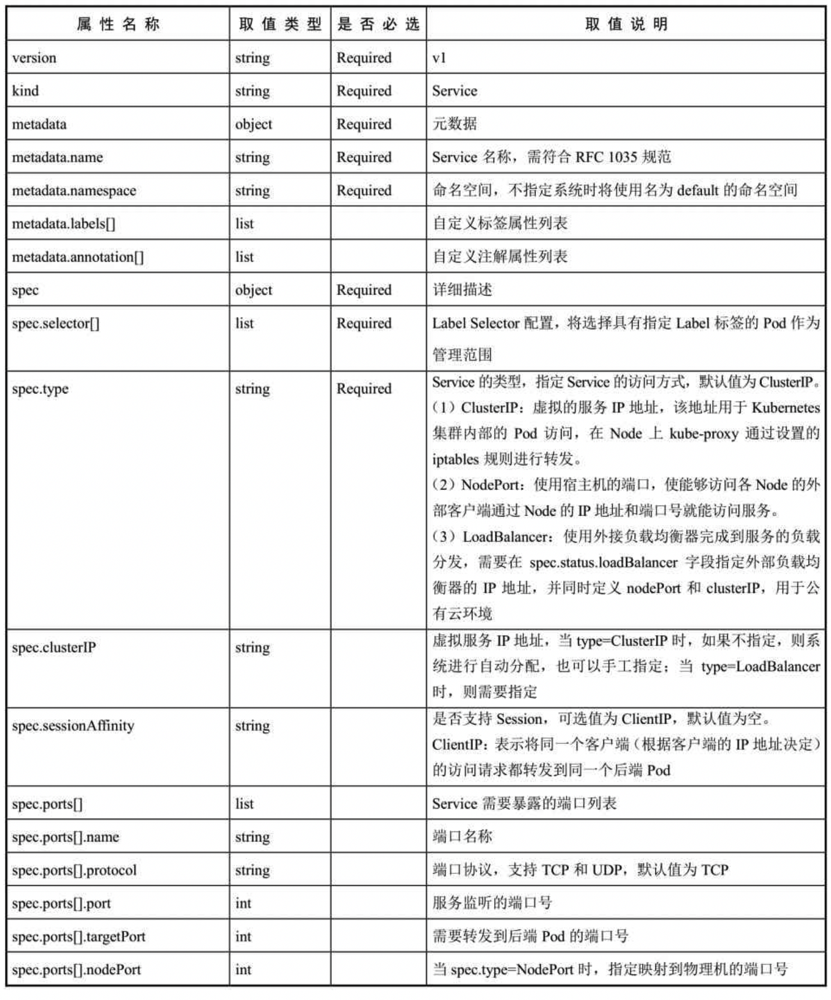
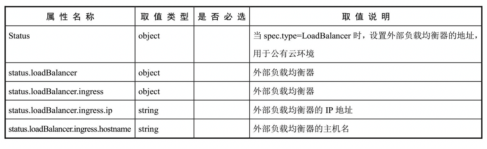

<!-- @import "[TOC]" {cmd="toc" depthFrom=1 depthTo=6 orderedList=false} -->

<!-- code_chunk_output -->

- [1 YAML文件定义](#1-yaml文件定义)
- [2 属性说明](#2-属性说明)

<!-- /code_chunk_output -->

# 1 YAML文件定义

YAML格式的Service定义文件的完整内容如下: 

```yaml
apiVersion: v1          # Required
kind: Service           # Required
metadata:               # Required
  name: string          # Required
  namespace: string     # Required
  labels: 
    - name: string
  annotations:
    - name: string
spec:                   # Required
  selector: []          # Required
  type: string          # Required
  clusterIP: string
  sessionAffinity: string
  ports:
  - name: string
    protocol: string
    port: int
    targetPort: int
    nodePort: int
  status:
    loadBalancer:
      ingress:
        ip: string
        hostname: string
```

# 2 属性说明

对各属性的说明如表4.1所示. 

表4.1　对Service的定义文件模板的各属性的说明:



