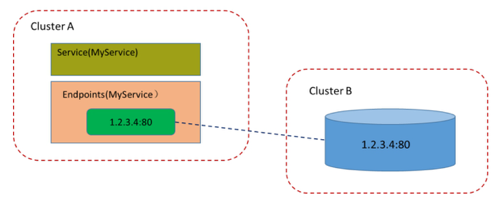

<!-- @import "[TOC]" {cmd="toc" depthFrom=1 depthTo=6 orderedList=false} -->

<!-- code_chunk_output -->

- [0 基本功能](#0-基本功能)
- [1 多端口Service](#1-多端口service)
- [2 外部服务Service](#2-外部服务service)

<!-- /code_chunk_output -->

# 0 基本功能

一般来说, **对外提供服务的应用程序**需要通过**某种机制**来实现, 对于**容器应用**最简便的方式就是通过**TCP/IP机制**及**监听IP和端口号**来实现. 

例如, 定义一个**提供Web服务的RC**, 由**两个Tomcat容器副本**组成, **每个容器**都通过**containerPort设置**提供服务的端口号为8080: 

```yaml
# webapp-rc.yaml
---
apiVersion: v1
kind: ReplicationController
metadata:
  name: webapp
spec:
  replicas: 2
  template:
    metadata:
      name: webapp
      labels:
        app: webapp
    spec:
      containers:
      - name: webapp
        image: tomcat
        ports:
        - containerPort: 8080
```

创建该RC:

```
# kubectl create -f webapp-rc.yaml
replicationcontroller "webapp" created
```

获取Pod的IP地址: 

```
# kubectl get pods -l app=webapp -o yaml | grep podIP
    podIP: 172.17.1.4
    podIP: 172.17.1.3
```

可以直接通过这两个Pod的IP地址和端口号访问Tomcat服务: 

```
# curl 172.17.1.3:8080
<!DOCTYPE html>
<html lang="en">
    <head>
        <meta charset="UTF-8" />
        <title>Apache Tomcat/8.0.35</title>
......

# curl 172.17.1.4:8080
<!DOCTYPE html>
<html lang="en">
    <head>
        <meta charset="UTF-8" />
        <title>Apache Tomcat/8.0.35</title>
......
```

**直接通过Pod的IP地址和端口号**可以**访问到容器应用内的服务**, 但是Pod的IP地址是不可靠的, 例如当Pod所在的**Node发生故障**时, Pod将被Kubernetes重新调度到另一个Node, **Pod的IP地址将发生变化**. 

更重要的是, 如果**容器应用**本身是**分布式的部署方式**, 通过多个实例共同提供服务, 就需要在**这些实例的前端**设置一个**负载均衡器**来实现请求的分发. 

Kubernetes中的**Service**就是用于**解决这些问题**的核心组件. 

以前面创建的webapp应用为例, 为了让**客户端应用**访问到**两个Tomcat Pod实例**, 需要**创建一个Service**来提供服务. Kubernetes提供了一种**快速的方法**, 即通过**kubectl expose命令**来**创建Service**: 

```
# kubectl expose rc webapp
service "webapp" exposed
```

查看**新创建的Service**, 可以看到系统为它分配了一个**虚拟的IP地址(ClusterIP**), **Service所需的端口号**则从**Pod中的containerPort**复制而来: 

```
# kubectl get svc
NAME        CLUSTER-IP      EXTERNAL-IP     PORT(S)     AGE
webapp      169.169.235.79  <none>          8080/TCP    3s
```

接下来就可以通过Service的IP地址和Service的端口号访问该Service了: 

```
# curl 169.169.235.79:8080
<!DOCTYPE html>
<html lang="en">
    <head>
        <meta charset="UTF-8" />
        <title>Apache Tomcat/8.0.35</title>
```

这里, 对**Service地址169.169.235.79:8080**的访问被**自动负载分发**到了**后端两个Pod之一！！！**: 172.17.1.3:8080或172.17.1.4:8080. 

除了使用**kubectl expose命令**创建**Service**, 我们也可以通过配置文件**定义Service**, 再通过kubectl create命令进行创建. 例如对于前面的webapp应用, 我们可以设置一个Service, 代码如下: 

```yaml
---
apiVersion: v1
kind: Service
metadata:
  name: webapp
spec:
  ports:
  - port: 8081
    targetPort: 8080
  selector:
    app: webapp
```

Service定义中的**关键字段**是**ports**和**selector**. 

* 本例中**ports定义部分**指定了**Service所需的虚拟端口号**为**8081**, 由于**与Pod容器端口号8080不一样**, 所以需要再通过**targetPort！！！** 来指定**后端Pod的端口号！！！**. 
* **selector**定义部分设置的是**后端Pod所拥有的label**: **app=webapp**. 

创建该Service并查看其ClusterIP地址: 

```
# kubectl create -f webapp-svc.yaml
service "webapp" created

# kubectl get svc
NAME        CLUSTER-IP      EXTERNAL-IP     PORT(S)     AGE
webapp      169.169.28.190  <none>          8081/TCP    3s
```

通过Service的IP地址和Service的端口号进行访问: 

```
# curl 169.169.28.190:8081
<!DOCTYPE html>
<html lang="en">
    <head>
        <meta charset="UTF-8" />
        <title>Apache Tomcat/8.0.35</title>
```

同样, 对Service地址169.169.28.190:8081的访问被**自动负载分发**到了**后端两个Pod之一**: 172.17.1.3:8080或172.17.1.4:8080. 

目前Kubernetes提供了**两种负载分发策略**: **RoundRobin**和**SessionAffinity**, 具体说明如下. 

- **RoundRobin**: **轮询模式**, 即**轮询将请求转发到后端的各个Pod**上. 

- **SessionAffinity**: 基于**客户端IP地址**进行**会话保持的模式**, 即第1次将某个客户端发起的请求转发到后端的某个Pod上, 之后从**相同的客户端**发起的请求都将被转发到**后端相同的Pod上**. 

在**默认情况**下, Kubernetes采用**RoundRobin模式**对客户端请求进行负载分发, 但我们也可以通过设置**service.spec.sessionAffinity=ClientIP**来启用SessionAffinity策略. 这样, 同一个客户端IP发来的请求就会被转发到后端固定的某个Pod上了. 

通过**Service的定义**, Kubernetes实现了一种**分布式应用统一入口的定义**和**负载均衡机制**. 

Service还可以进行其他类型的设置, 例如设置多个端口号、直接设置为集群外部服务, 或实现为Headless Service(无头服务)模式(将在4.3节介绍). 

# 1 多端口Service

有时**一个容器应用**也可能提供**多个端口的服务**, 那么在**Service的定义**中也可以相应地设置为将**多个端口**对应到**多个应用服务**. 

在下面的例子中, Service设置了两个端口号, 并且为每个端口号都进行了命名: 

```yaml
---
apiVersion: v1
kind: Service
metadata:
  name: webapp
spec:
  ports:
  - port: 8080
    targetPort: 8080
    name: web
  - port: 8005
    targetPort: 8005
    name: management
  selector:
    app: webapp
```

另一个例子是两个端口号使用了不同的4层协议—TCP和UDP: 

```yaml
---
apiVersion: v1
kind: Service
metadata:
  name: kube-dns
  namespace: kube-system
  labels:
    k8s-app: kube-dns
    kubernetes.io/cluster-service: "true"
    kubernetes.io/name: "KubeDNS"
spec:
  selector:
    k8s-app: kube-dns
  clusterIP: 169.169.0.100
  ports:
  - name: dns
    port: 53
    protocol: UDP
  - name: dns-tcp
    port: 53
    protocol: TCP
```

# 2 外部服务Service

在某些环境中, **应用系统**需要将一个**外部数据库**作为**后端服务**进行连接, 或将**另一个集群**或**Namespace**中的服务作为服务的后端, 这时可以通过创建一个**无Label Selector**的**Service**来实现: 

```yaml
---
kind: Service
apiVersion: v1
metadata:
  name: my-service
spec:
  ports:
  - protocol: TCP
    port: 80
    targetPort: 80
```

通过该定义创建的是一个**不带标签选择器的Service**, 即**无法选择后端的Pod**, 系统**不会自动创建Endpoint**, 因此需要**手动创建一个和该Service同名的Endpoint**, 用于**指向实际的后端访问地址**. 

创建Endpoint的配置文件内容如下: 

```yaml
---
kind: Endpoints
apiVersion: v1
metadata:
  name: my-service
subsets:
- addresses:
  - IP: 1.2.3.4
  ports:
  - port: 80
```

如图4.1所示, 访问没有标签选择器的Service和带有标签选择器的Service一样, 请求将会被**路由到**由**用户手动定义**的**后端Endpoint**上. 

图4.1 Service指向外部服务:


