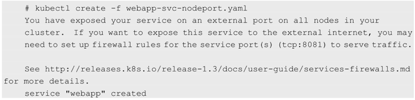

<!-- @import "[TOC]" {cmd="toc" depthFrom=1 depthTo=6 orderedList=false} -->

<!-- code_chunk_output -->

- [0 Pod和Service的外部访问](#0-pod和service的外部访问)
- [1 将容器应用的端口号映射到物理机](#1-将容器应用的端口号映射到物理机)
  - [1.1 容器级别的hostPort](#11-容器级别的hostport)
  - [1.2 Pod级别的hostNetwork=true](#12-pod级别的hostnetworktrue)
- [2 将Service的端口号映射到物理机](#2-将service的端口号映射到物理机)
  - [2.1](#21)
  - [2.2 设置LoadBalancer](#22-设置loadbalancer)

<!-- /code_chunk_output -->

# 0 Pod和Service的外部访问

由于**Pod**和**Service**都是Kubernetes**集群范围内的虚拟概念**, 所以**集群外**的客户端系统无**法通过Pod的IP地址**或者**Service的虚拟IP地址和虚拟端口号**访问它们. 

为了让**外部客户端**可以访问这些服务, 可以将**Pod或Service的端口号**映射到**宿主机**, 以使客户端应用能够通过物理机访问容器应用. 

# 1 将容器应用的端口号映射到物理机

## 1.1 容器级别的hostPort

(1)通过设置**容器级别的hostPort**, 将容器应用的端口号映射到物理机上: 

```yaml
---
apiVersion: v1
kind: Pod
metadata:
  name: webapp
  labels:
    app: webapp
spec:
  containers:
  - name: webapp
    image: tomcat
    ports:
    - containerPort: 8080
      hostPort: 8081
```

通过kubectl create命令创建这个Pod: 

```
# kubectl create -f pod-hostport.yaml
pod "webapp" created
```

通过**物理机的IP地址**和**8081端口号**访问**Pod内的容器服务**: 

```
# curl 192.168.18.3:8081
<!DOCTYPE html>
<html lang="en">
    <head>
        <meta charset="UTF-8" />
        <title>Apache Tomcat/8.0.35</title>
```

## 1.2 Pod级别的hostNetwork=true

(2)通过设置**Pod级别的hostNetwork=true**, 该**Pod中所有容器的端口号**都将被**直接映射到物理机**上. 

在设置hostNetwork=true时需要注意, 在**容器的ports**定义部分如果**不指定hostPort**, 则**默认hostPort等于containerPort**, 如果指定了**hostPort**, 则**hostPort必须等于containerPort**的值: 

```yaml
---
apiVersion: v1 
kind: Pod
metadata:
  name: webapp
  labels:
    app: webapp
spec:
  hostNetwork: true     # 重点
  containers:
  - name: webapp
    image: tomcat
    imagePullPolicy: Never
    ports:
    - containerPort: 8080
```

创建这个Pod: 

```
# kubectl create -f pod-hostnetwork.yaml
pod "webapp" created
```

通过**物理机的IP地址**和**8080端口号**访问Pod内的容器服务: 

```
# curl 192.168.18.4:8081
<!DOCTYPE html>
<html lang="en">
    <head>
        <meta charset="UTF-8" />
        <title>Apache Tomcat/8.0.35</title>
```

# 2 将Service的端口号映射到物理机

## 2.1 

(1)通过设置**nodePort**映射到物理机, 同时设置**Service的类型为NodePort**: 

```yaml
apiVersion: v1
kind: Service
metadata:
  name: webapp
spec:
  type: NodePort        # 重点
  ports:
  - port: 8080
    targetPort: 8080
    nodePort: 8081      # 重点
  selector:
    app: webapp
```

创建service



系统提示信息说明: 由于要使用物理机的端口号, 所以需要在防火墙上做好相应的配置, 以使外部客户端能够访问到该端口. 

通过物理机的IP地址和nodePort 8081端口号访问服务: 

```
# curl 192.168.18.3:8081
<!DOCTYPE html>
<html lang="en">
    <head>
        <meta charset="UTF-8" />
        <title>Apache Tomcat/8.0.35</title>
```

同样, 对该Service的访问也将被**负载分发**到后端的多个Pod上. 

## 2.2 设置LoadBalancer

(2)通过**设置LoadBalancer**映射到**云服务商**提供的**LoadBalancer地址**. 

这种用法仅用于在**公有云服务提供商**的云平台上**设置Service**的场景. 

在下面的例子中, **status.loadBalancer.ingress.ip**设置的**146.148.47.155**为云服务商提供的**负载均衡器的IP地址**. 对该Service的访问请求将会通过**LoadBalancer转发**到后端Pod上, **负载分发的实现方式**则依赖于云服务商提供的**LoadBalancer的实现机制**: 

