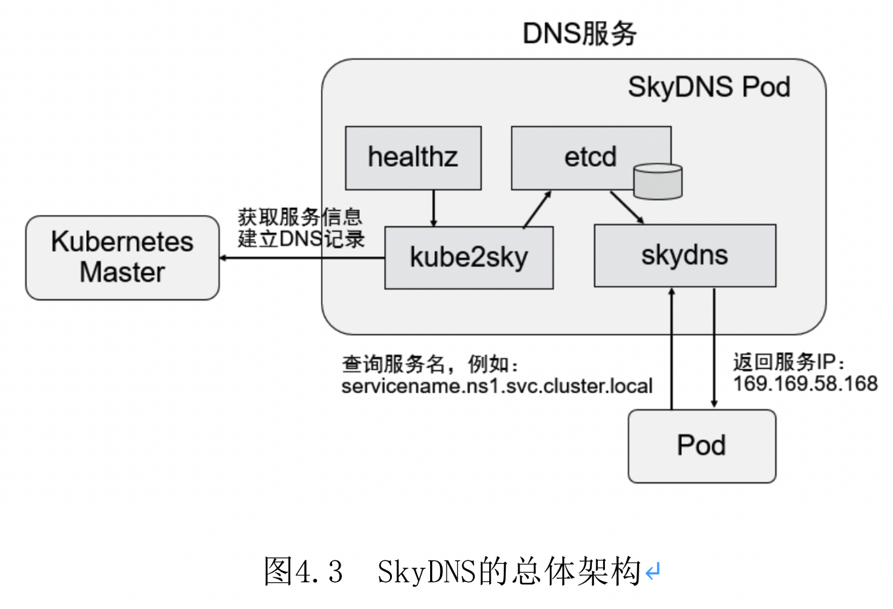
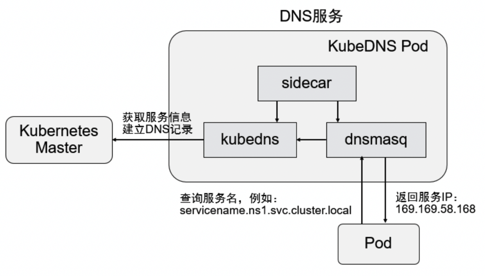
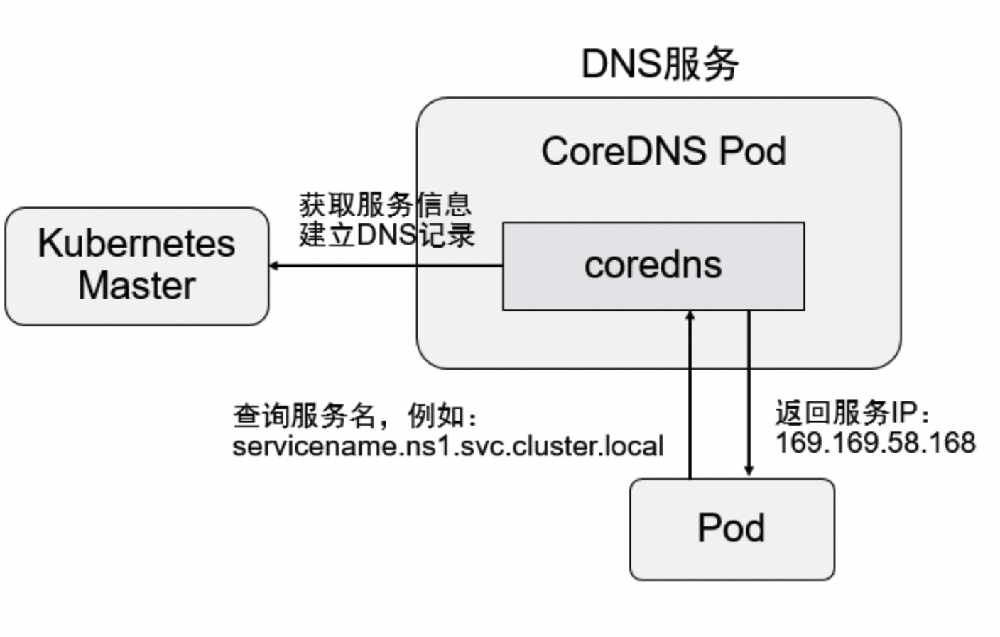
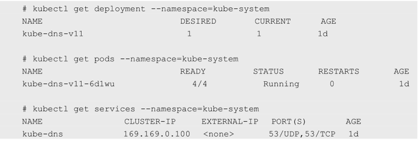

<!-- @import "[TOC]" {cmd="toc" depthFrom=1 depthTo=6 orderedList=false} -->

<!-- code_chunk_output -->

- [0 概述](#0-概述)
  - [0.1 服务名到ClusterIP的解析](#01-服务名到clusterip的解析)
  - [0.2 3个阶段](#02-3个阶段)
    - [0.2.1 SkyDNS: 1.2版本](#021-skydns-12版本)
    - [0.2.2 KubeDNS: 1.4版本](#022-kubedns-14版本)
    - [0.2.3 CoreDNS: 1.11版本](#023-coredns-111版本)
- [1 在创建DNS服务之前修改每个Node上kubelet的启动参数](#1-在创建dns服务之前修改每个node上kubelet的启动参数)
- [2 创建CoreDNS应用](#2-创建coredns应用)
- [3 服务名的DNS解析](#3-服务名的dns解析)
- [4 CoreDNS的配置说明](#4-coredns的配置说明)
- [5 Pod级别的DNS配置说明](#5-pod级别的dns配置说明)

<!-- /code_chunk_output -->

# 0 概述

## 0.1 服务名到ClusterIP的解析

作为**服务发现机制的基本功能**, 在集群内需要能够**通过服务名对服务进行访问**, 这就需要一个**集群范围内**的**DNS服务**来完成从**服务名到ClusterIP！！！** 的解析. 

## 0.2 3个阶段

**DNS服务**在Kubernetes的发展过程中经历了**3个阶段**, 接下来会进行讲解. 

### 0.2.1 SkyDNS: 1.2版本

在Kubernetes **1.2版本**时, DNS服务是由**SkyDNS**提供的, 它由**4个容器**组成: **kube2sky**、**skydns**、**etcd**和**healthz**. 

- **kube2sky**容器**监控**Kubernetes中**Service资源的变化**, 根据**Service的名称**和**IP地址**信息**生成DNS记录**, 并将其保存到**etcd**中; 
- **skydns容器**从**etcd**中**读取DNS记录**, 并为客户端容器应用**提供DNS查询服务**; 
- **healthz容器**提供对**skydns服务**的**健康检查功能**. 

图4.3展现了SkyDNS的总体架构:



### 0.2.2 KubeDNS: 1.4版本

从Kubernetes **1.4版本**开始, SkyDNS组件便被**KubeDNS**替换, 主要考虑是**SkyDNS组件之间通信较多**, 整体**性能不高**. 

KubeDNS由**3个容器**组成: **kubedns**、**dnsmasq**和**sidecar**, 去掉了SkyDNS中的**etcd存储**, 将**DNS记录**直接**保存在内存**中, 以**提高查询性能**. 

- **kubedns容器**监控Kubernetes中**Service资源的变化**, 根据**Service的名称**和**IP地址**生成**DNS记录**, 并将**DNS记录**保存在**内存**中; 
- **dnsmasq容器**从kubedns中**获取DNS记录**, 提供**DNS缓存**, 为**客户端容器应用**提供**DNS查询服务**; 
- **sidecar**提供对**kubedns**和**dnsmasq**服务的**健康检查**功能. 

图4.4展现了KubeDNS的总体架构. 



### 0.2.3 CoreDNS: 1.11版本

从Kubernetes **1.11版本**开始, Kubernetes集群的DNS服务由**CoreDNS**提供. CoreDNS是**CNCF基金会**的一个项目, 是用**Go语言**实现的**高性能**、**插件式**、**易扩展**的DNS服务端. 

CoreDNS解决了KubeDNS的一些问题, 例如**dnsmasq的安全漏洞**、**externalName不能使用stubDomains设置**, 等等. 

CoreDNS支持**自定义DNS记录**及**配置upstream DNS Server**, 可以统一管理Kubernetes**基于服务的内部DNS**和**数据中心的物理DNS**. 

CoreDNS**没有使用多个容器的架构**, 只用**一个容器**便实现了KubeDNS内3个容器的全部功能. 

图4.5展现了CoreDNS的总体架构:



下面以CoreDNS为例说明Kubernetes集群DNS服务的搭建过程. 

# 1 在创建DNS服务之前修改每个Node上kubelet的启动参数

修改每个Node上kubelet的启动参数, 加上以下两个参数. 

- \-\-cluster\-dns=169.169.0.100: 为DNS服务的ClusterIP地址. 
- \-\-cluster\-domain=cluster.local: 为在DNS服务中设置的域名. 

然后重启kubelet服务. 

# 2 创建CoreDNS应用

在**部署CoreDNS应用前**, 至少需要创建**一个ConfigMap**、**一个Deployment**和**一个Service**共**3个资源对象**. 在启用了**RBAC**的集群中, 还可以设置**ServiceAccount**、**ClusterRole**、**ClusterRoleBinding**对CoreDNS容器进行**权限设置**. 关于RBAC的内容详见6.2.3节的说明. 

**ConfigMap** "coredns"主要设置**CoreDNS**的**主配置文件Corefile**的内容, 其中可以定义各种**域名的解析方式**和**使用的插件**, 示例如下(Corefile的详细配置说明参见4.5.4节): 

```yaml
---
apiVersion: v1
kind: ConfigMap
metadata:
  name: coredns
  namespace: kube-system
  labels:
      addonmanager.kubernetes.io/mode: EnsureExists
data:
  Corefile: |           # 重点
    cluster.local {
        errors
        health
        kubernetes cluster.local in-addr.arpa ip6.arpa {
            pods insecure
            upstream
            fallthrough in-addr.arpa ip6.arpa
        }
        prometheus :9153
        forward . /etc/resolv.conf
        cache 30
        loop
        reload
        loadbalance
    }
    . {
        cache 30
        loadbalance
        forward . /etc/resolv.conf
    }
```

**Deployment** "coredns"主要**设置CoreDNS容器应用的内容**, 示例如下. 

其中, **replicas**副本的数量通常应该根据**集群的规模**和**服务数量**确定, 如果**单个CoreDNS进程**不足以支撑整个集群的DNS查询, 则可以通过**水平扩展**提高查询能力. 由于DNS服务是Kubernetes集群的**关键核心服务**, 所以建议为其Deployment设置**自动扩缩容控制器**, 自动管理其副本数量. 

另外, 对**资源限制部分**(**CPU限制**和**内存限制**)的设置也应根据实际环境进行调整: 

```yaml
---
apiVersion: apps/v1
kind: Deployment
metadata:
  name: coredns
  namespace: kube-system
  labels:
    k8s-app: kube-dns
    kubernetes.io/cluster-service: "true"
    addonmanager.kubernetes.io/mode: Reconcile
    kubernetes.io/name: "CoreDNS"
spec:
  replicas: 1           # 重点
  strategy:
    type: RollingUpdate
    rollingUpdate:
      maxUnavailable: 1
  selector:
    matchLabels:
      k8s-app: kube-dns
  template:
    metadata:
      labels:
        k8s-app: kube-dns
      annotations:
        seccomp.security.alpha.kubernetes.io/pod: 'docker/default'
    spec:
      priorityClassName: system-cluster-critical
      tolerations:
        - key: "CriticalAddonsOnly"
          operator: "Exists"
      nodeSelector:
        beta.kubernetes.io/os: linux
      containers:
      - name: coredns
        image: coredns/coredns:1.3.1
        imagePullPolicy: IfNotPresent
        resources:
          limits:
            memory: 170Mi
          requests:
            cpu: 100m
            memory: 70Mi
        args: [ "-conf", "/etc/coredns/Corefile" ]
        volumeMounts:
        - name: config-volume
          mountPath: /etc/coredns
          readOnly: true
        ports:
        - containerPort: 53
          name: dns
          protocol: UDP
        - containerPort: 53
          name: dns-tcp
          protocol: TCP
        - containerPort: 9153
          name: metrics
          protocol: TCP
        livenessProbe:
          httpGet:
            path: /health
            port: 8080
            scheme: HTTP
          initialDelaySeconds: 60
          timeoutSeconds: 5
          successThreshold: 1
          failureThreshold: 5
        securityContext:
          allowPrivilegeEscalation: false
          capabilities:
            add:
            - NET_BIND_SERVICE
            drop:
            - all
          readOnlyRootFilesystem: true
      dnsPolicy: Default
      volumes:
        - name: config-volume
          configMap:
            name: coredns
            items:
            - key: Corefile
              path: Corefile
```

**Service** "kube\-dns"是DNS服务的配置, 示例如下. 

这个服务需要设置固定的ClusterIP, 也需要将所有Node上的kubelet启动参数 \-\-cluster\-dns设置为这个ClusterIP: 

```yaml
---
apiVersion: v1
kind: Service
metadata:
  name: kube-dns
  namespace: kube-system
  annotations:
    prometheus.io/port: "9153"
    prometheus.io/scrape: "true"
  labels:
    k8s-app: kube-dns
    kubernetes.io/cluster-service: "true"
    addonmanager.kubernetes.io/mode: Reconcile
    kubernetes.io/name: "CoreDNS"
spec:
  selector:
    k8s-app: kube-dns
  clusterIP: 169.169.0.100
  ports:
  - name: dns
    port: 53
    protocol: UDP
  - name: dns-tcp
    port: 53
    protocol: TCP
  - name: metrics
    port: 9153
    protocol: TCP
```

通过kubectl create完成CoreDNS服务的创建: 

```
# kubectl create -f coredns.yaml
```

查看RC、Pod和Service, 确保容器成功启动: 



# 3 服务名的DNS解析

使用一个**带有nslookup工具**的**Pod**来验证DNS服务能否正常工作: 

```yaml
---
apiVersion: v1
kind: Pod
metadata:
  name: busybox
  namespace: default
spec:
  containers:
  - name: busybox
    image: gcr.io/google_containers/busybox
    command:
      - sleep
      - "3600"
```

运行kubectl create \-f busybox.yaml即可完成创建. 

在该容器成功启动后, 通过kubectl exec \<container\_id> nslookup进行测试: 

```
# kubectl exec busybox -- nslookup redis-master
Server: 169.169.0.100
Address 1: 169.169.0.100

Name: redis-master
Address 1: 169.169.8.10
```

可以看到, 通过**DNS服务器169.169.0.100**成功找到了**redis\-master服务**的**IP地址**: 169.169.8.10. 

如果**某个Service**属于**不同的命名空间**, 那么在进行Service查找时, 需要**补充Namespace的名称**, 组合成完整的域名. 

下面以查找kube\-dns服务为例, 将其所在的**Namespace** "kube\-system"补充在服务名之后, 用"."连接为"kube\-dns.kube\-system", 即可查询成功: 

```
# kubectl exec busybox -- nslookup kube-dns.kube-system
Server: 169.169.0.100
Address 1: 169.169.0.100

Name: kube-dns.kube-system
Address 1: 169.169.0.100
```

如果仅使用"kube\-dns"进行查找, 则会失败: 

```
# kubectl exec busybox -- nslookup kube-dns
nslookup: can't resolve 'kube-dns'
```

# 4 CoreDNS的配置说明

CoreDNS的**主要功能**是通过**插件系统**实现的. 

CoreDNS实现了一种**链式插件结构**, 将**DNS的逻辑抽象成了一个个插件**, 能够灵活组合使用. 

常用的插件如下. 
- loadbalance: 提供**基于DNS**的**负载均衡**功能. 
- loop: **检测**在**DNS解析过程中**出现的简单循环问题. 
- cache: 提供**前端缓存**功能. 
- health: 对**Endpoint**进行**健康检查**. 
- kubernetes: 从Kubernetes中读取zone数据. 
- etcd: 从etcd读取zone数据, 可以用于自定义域名记录. 
- file: 从RFC1035格式文件中读取zone数据. 
- hosts: 使用/etc/hosts文件或者其他文件读取zone数据, 可以用于自定义域名记录. 
- auto: 从磁盘中自动加载区域文件. 
- reload: 定时自动重新加载Corefile配置文件的内容. 
- forward: 转发域名查询到上游DNS服务器. 
- proxy: 转发特定的域名查询到多个其他DNS服务器, 同时提供到多个DNS服务器的负载均衡功能. 
- prometheus: 为Prometheus系统提供采集性能指标数据的URL. 
- pprof: 在URL路径/debug/pprof下提供运行时的性能数据. 
- log: 对DNS查询进行日志记录. 
- errors: 对错误信息进行日志记录. 

在下面的示例中**为域名"cluster.local**"设置了**一系列插件**, 包括errors、health、kubernetes、prometheus、forward、cache、loop、reload和loadbalance, 在进行域名解析时, 这些插件将以**从上到下的顺序依次执行**: 

```
cluster.local {
    errors
    health
    kubernetes cluster.local in-addr.arpa ip6.arpa{
        pods insecure
        upstream
        fallthrough in-addr.arpa ip6.arpa
    }
    prometheus :9153
    forward . /etc/resolv.conf
    cache 30
    loop
    reload
    loadbalance
}
```

另外, **etcd**和**hosts插件**都可以用于用户自定义域名记录. 

下面是使用etcd插件的配置示例, 将以"\.com"结尾的域名记录配置为从**etcd**中获取, 并将域名记录保存在/skydns路径下: 

```
{
    etcd com {
        path /skydns
        endpoint http://192.168.18.3:2379
        upstream /etc/resolv.conf
    }
    cache 160 com
    loadbalance
    proxy . /etc/resolv.conf
}
```

如果用户在etcd中插入一条"10.1.1.1 mycompany.com"DNS记录: 

```
# etcdctl put /skydns/com/mycompany '{"host": "10.1.1.1", "ttl": 60}'
```

客户端应用就能访问域名"mycompany.com"了: 

```
# nslookup mycompany.com
nslookup mycompany.com
Server:     169.169.0.100
Address:    169.169.0.100#53

Name:       mycompany.com
Address: 10.1.1.1
```

forward和proxy插件都可以用于配置上游DNS服务器或其他DNS服务器, 当在CoreDNS中查询不到域名时, 会到其他DNS服务器上进行查询. 

在**实际环境**中, 可以将Kubernetes**集群外部的DNS纳入CoreDNS**, 进行**统一的DNS管理**. 

# 5 Pod级别的DNS配置说明

除了使用**集群范围的DNS服务**(如**CoreDNS**), 在P**od级别**也能**设置DNS的相关策略和配置**. 

在Pod的YAML配置文件中通过**spec.dnsPolicy**字段设置**DNS策略**, 例如: 

```yaml
apiVersion: v1
kind: Pod
metadata:
  name: nginx
spec:
  containers:
    - name: nginx
      image: nginx
  dnsPolicy: Default
```

目前可以设置的DNS策略如下. 
- Default: 继承Pod所在宿主机的DNS设置. 
- ClusterFirst: 优先使用Kubernetes环境的DNS服务(如CoreDNS提供的域名解析服务), 将无法解析的域名转发到从宿主机继承的DNS服务器. 
- ClusterFirstWithHostNet: 与ClusterFirst相同, 对于以hostNetwork模式运行的Pod, 应明确指定使用该策略. 
- None: 忽略Kubernetes环境的DNS配置, 通过spec.dnsConfig自定义DNS配置. 这个选项从Kubernetes 1.9版本开始引入, 到Kubernetes 1.10版本升级为Beta版, 到Kubernetes 1.14版本升级为稳定版. 
自定义DNS配置可以通过spec.dnsConfig字段进行设置, 可以设置下列信息. 
- nameservers: 一组DNS服务器的列表, 最多可以设置3个. 
- searches: 一组用于域名搜索的DNS域名后缀, 最多可以设置6个. 
- options: 配置其他可选DNS参数, 例如ndots、timeout等, 以name或name/value对的形式表示. 

以下面的dnsConfig为例: 


```yaml
apiVersion: v1
kind: Pod
metadata:
  namespace: default
  name: dns-example
spec:
  containers:
    - name: test
      image: nginx
  dnsPolicy: "None"
  dnsConfig:
    nameservers:
      - 1.2.3.4
    searches:
      - ns1.svc.cluster.local
      - my.dns.search.suffix
    options:
      - name: ndots
        value: "2"
      - name: edns0
```

该Pod被成功创建之后, 容器内的DNS配置文件/etc/resolv.conf的内容将被系统设置为:

```
nameserver 1.2.3.4
search nsl.svc.cluster.local my.dns.search.suffix
opetions ndets:2 edns0
```

表示该Pod完全使用自定义的DNS配置, 不再使用Kubernetes环境的DNS服务. 