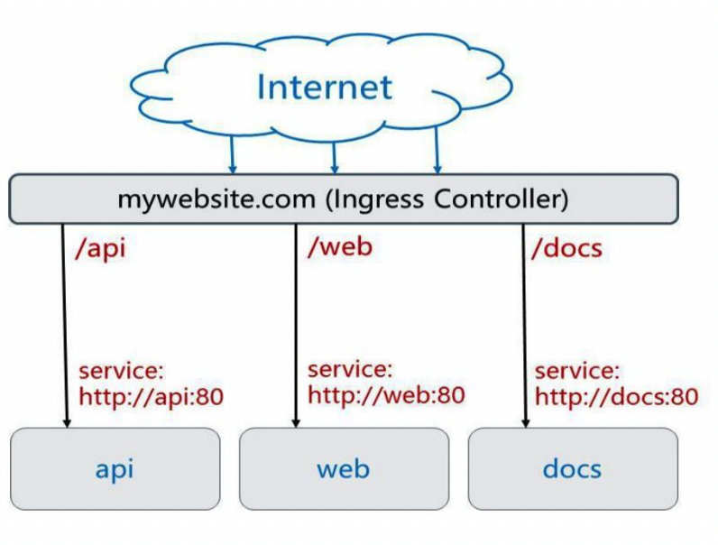
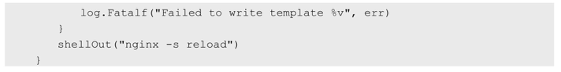
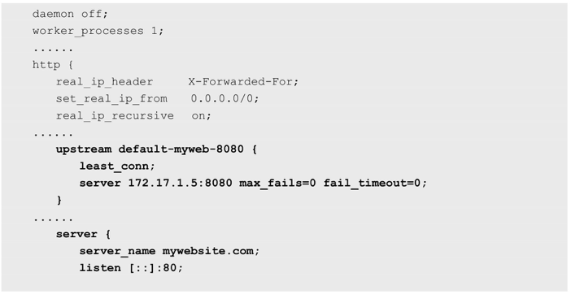
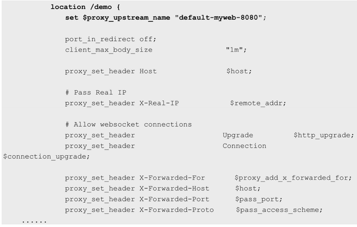
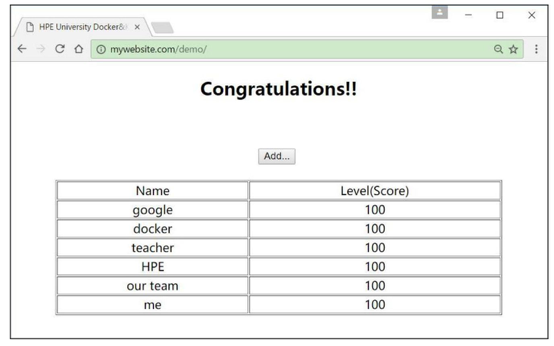

<!-- @import "[TOC]" {cmd="toc" depthFrom=1 depthTo=6 orderedList=false} -->

<!-- code_chunk_output -->

- [0 概述](#0-概述)
  - [0.1 背景: 不同URL地址不同HTTP服务](#01-背景-不同url地址不同http服务)
  - [0.1 Ingress资源对象](#01-ingress资源对象)
- [1 创建Ingress Controller和默认的backend服务](#1-创建ingress-controller和默认的backend服务)
- [2 定义Ingress策略](#2-定义ingress策略)
- [3 客户端访问http://mywebsite.com/demo](#3-客户端访问httpmywebsitecomdemo)
- [4 Ingress的策略配置技巧](#4-ingress的策略配置技巧)
  - [4.1 转发到单个后端服务上](#41-转发到单个后端服务上)
  - [4.2 统一域名下, 不同的URL路径被转发到不同的服务上](#42-统一域名下-不同的url路径被转发到不同的服务上)
  - [4.3 不同的域名(虚拟主机名)被转发到不同的服务上](#43-不同的域名虚拟主机名被转发到不同的服务上)
  - [4.4 不使用域名的转发规则](#44-不使用域名的转发规则)
- [5 Ingress的TLS安全设置](#5-ingress的tls安全设置)

<!-- /code_chunk_output -->

# 0 概述

## 0.1 背景: 不同URL地址不同HTTP服务

根据前面对Service的使用说明, 我们知道**Service**的**表现形式为IP:Port**, 即**工作**在**TCP/IP层**. 

而对于**基于HTTP的服务**来说, **不同的URL地址**经常对应到**不同的后端服务**或者**虚拟服务器(Virtual Host**), 这些应用层的**转发机制**仅通过Kubernetes的**Service机制**是**无法实现**的. 

## 0.1 Ingress资源对象

从Kubernetes **1.1版本**开始新增**Ingress资源对象**, 用于将**不同URL的访问请求！！！** 转发到**后端不同的Service！！！**, 以实现**HTTP层**的**业务路由机制**. 

Kubernetes使用了**一个Ingress策略定义！！！** 和**一个具体的Ingress Controller！！！**, 两者结合并实现了一个**完整的Ingress负载均衡器！！！**. 

使用Ingress进行**负载分发**时, **Ingress Controller**基于**Ingress规则**将客户端请求直接转发到**Service对应的后端Endpoint(Pod！！！** )上, 这样会**跳过kube\-proxy的转发功能！！！**, **kube\-proxy不再起作用**. 如果Ingress Controller提供的是**对外服务**, 则实际上实现的是**边缘路由器的功能**. 

图4.6显示了一个典型的HTTP层路由的例子. 



其中: 

- 对 http://mywebsite.com/api 的访问将被路由到后端名为**api的Service**; 
- 对 http://mywebsite.com/web 的访问将被路由到后端名为**web的Service**; 
- 对 http://mywebsite.com/docs 的访问将被路由到后端名为**docs的Service**. 

为使用Ingress, 需要**创建Ingress Controller**(带一个**默认backend服务**)和**Ingress策略设置**来共同完成. 

下面通过一个例子分三步说明Ingress Controller和Ingress策略的配置方法, 以及客户端如何访问Ingress提供的服务. 

# 1 创建Ingress Controller和默认的backend服务

在定义Ingress策略之前, 需要先**部署Ingress Controller**, 以实现为**所有后端Service！！！都提供一个统一的入口**. 

**Ingress Controller**需要实现基于**不同HTTP URL**向后转发的**负载分发规则**, 并可以**灵活设置7层负载分发策略**. 如果**公有云服务商**能够提供**该类型的HTTP路由LoadBalancer**, 则也可**设置其为Ingress Controller**. 

在Kubernetes中, **Ingress Controller**将**以Pod！！！的形式运行**, **监控API Server的/ingress接口后端的backend services**, 如果Service发生变化, 则Ingress Controller应自动更新其转发规则. 

下面的例子使用**Nginx**来实现一个**Ingress Controller**, 需要实现的基本逻辑如下. 

(1)**监听API Server**, 获取**全部Ingress的定义**. 

(2)基于Ingress的定义, 生成**Nginx**所需的配置文件/**etc/nginx/nginx.conf**. 

(3)执行nginx \-s reload命令, 重新加载nginx.conf配置文件的内容. 

基于Go语言的核心代码实现如下: 




本例使用**谷歌**提供的**nginx\-ingress\-controller镜像**来创建**Ingress Controller**. 该Ingress Controller以**daemonset的形式**进行创建, 在**每个Node**上都将**启动一个Nginx服务**. 

这里为**Nginx容器**设置了**hostPort**, 将**容器应用监听的80**和**443端口号**映射到**物理机上**, 使得客户端应用可以通过URL地址" http://物理机IP:80 "或" https://物理机IP:443 "来**访问该Ingress Controller**. 这使得**Nginx**类似于通过**NodePort**映射到物理机的**Service**, 成为**代替kube\-proxy**的**HTTP层的Load Balancer**: 

```yaml
# nginx-ingress-daemonset.yaml
---
apiVersion: extensions/v1beta1
kind: DaemonSet
metadata:
  name: nginx-ingress-lb
  labels:
    name: nginx-ingress-lb
  namespace: kube-system
spec:
  template:
    metadata:
      labels:
        name: nginx-ingress-lb
    spec:
      terminationGracePeriodSeconds: 60
      containers:
      - image: gcr.io/google_containers/nginx-ingress-controller:0.9.0-beta.2
        name: nginx-ingress-lb
        readinessProbe:
          httpGet:
            path: /healthz
            port: 10254
            scheme: HTTP
        livenessProbe:
          httpGet:
            path: /healthz
            port: 10254
            scheme: HTTP
          initialDelaySeconds: 10
          timeoutSeconds: 1
        ports:
        - containerPort: 80
          hostPort: 80          # 重点
        - containerPort: 443
          hostPort: 443         # 重点
        env:
          - name: POD_NAME
            valueFrom:
              fieldRef:
                fieldPath: metadata.name
          - name: POD_NAMESPACE
            valueFrom:
              fieldRef:
                fieldPath: metadata.namespace
        args:                   # 重点
        - /nginx-ingress-controller     
        - --default-backend-service=$(POD_NAMESPACE)/default-http-backend
```

为了让Ingress Controller正常启动, 还需要为它配置一个**默认的backend**, 用于在**客户端访问的URL地址不存在**时, 返回一个**正确的404应答**. 这个backend服务用**任何应用实现**都可以, 只要满足对**根路径"/"的访问**返回**404应答**, 并且提供/**healthz路径**以使**kubelet**完成对它的**健康检查**. 

另外, 由于Nginx通过**default\-backend\-service**的服务名称(Service Name)去访问它, 所以需要**DNS服务正确运行**: 

```yaml
# default-backend.yaml
---
apiVersion: extensions/v1beta1
kind: Deployment
metadata:
  name: default-http-backend
  labels:
    k8s-app: default-http-backend
  namespace: kube-system
spec:
  replicas: 1
  template:
    metadata:
      labels:
        k8s-app: default-http-backend
    spec:
      terminationGracePeriodSeconds: 60
      containers:
      - name: default-http-backend
        image: gcr.io/google_containers/defaultbackend:1.0
        livenessProbe:
          httpGet:
            path: /healthz
            port: 8080
            scheme: HTTP
          initialDelaySeconds: 30
          timeoutSeconds: 5
        ports:
        - containerPort: 8080
        resources:
          limits:
            cpu: 10m
            memory: 20Mi
          requests:
            cpu: 10m
            memory: 20Mi
---
apiVersion: v1
kind: Service
metadata:
  name: default-http-backend
  namespace: kube-system
  labels:
    k8s-app: default-http-backend
spec:
  ports:
  - port: 80
    targetPort: 8080
  selector:
    k8s-app: default-http-backend
```

通过kubectl create命令创建backend服务: 

```
# kubectl create -f default-backend.yaml
deployment "default-http-backend" created
service "default-http-backend" created
```

创建nginx\-ingress\-controller: 

```
# kubectl create -f nginx-ingress-daemonset.yaml
daemonset "nginx-ingress-lb" created
```

查看default\-http\-backend 和nginx\-ingress\-controller容器是否正确运行: 

```
# kubectl get po --namespace=kube-system
NAME                                    READY   STATUS      RESTARTS    AGE
default-http-backend-1132503640-841nv   1/1     Running     0           3m
kube-dns-vll-z3cb0                      4/4     Running     0           10m
nginx-ingress-lb-5jbwv                  1/1     Running     0           3m
nginx-ingress-lb-60j7h                  1/1     Running     0           3m
nginx-ingress-lb-dttr9                  1/1     Running     0           3m
```

用curl访问任意Node的80端口号, 验证nginx\-ingress\-controller和default\-http\-backend服务正常工作: 

```
# curl k8s-node0-2
default backend - 404
```

# 2 定义Ingress策略

本例对**mywebsite.com网站**的访问设置**Ingress策略**, 定义对其/**demo路径**的访问转发到**后端webapp Service**的规则: 

```yaml
---
apiVersion: extensions/v1beta1
kind: Ingress
metadata:
  name: mywebsite-ingress
spec:
  rules:    # 重点
  - host: mywebsite.com
    http:
      paths:
      - path: /demo
        backend:
          serviceName: webapp
          servicePort: 8080
```

这个Ingress的定义, 说明对目标地址 http://mywebsite.com/demo 的访问将被转发到集群中的Service webapp即**webapp:8080/demo**上. 

在Ingress生效之前, 需要先将**webapp服务部署完成**. 同时需要注意Ingress中path的定义, 需要与后端真实Service提供的path一致, 否则将被转发到一个不存在的path上, 引发错误. 这里以第1章的例子为例, 假设myweb服务已经部署完毕并正常运行, myweb提供的Web服务的路径也为/demo. 

创建该Ingress: 

```
# kubectl create -f ingress.yaml
ingress "mywebsite-ingress" created

# kubectl get ingress -o wide
NAME                HOSTS           ADDRESS                                 PORTS   AGE
mywebsite-ingress   mywebsite.com   192.168.18.3,192.168.18.4,192.168.18.5  80  59s
```

在成功创建该Ingress后, 查看其**ADDRESS列**, 如果显示了**所有nginx\-ingress\-controller Pod的IP地址**, 则表示Nginx已经设置好**后端Service的Endpoint**, 该Ingress可以正常工作了. 如果**ADDRESS列为空**, 则通常说明Nginx未能正确连接到后端Service, 需要排错. 

登录任一nginx\-ingress\-controller Pod, 查看其自动生成的**nginx.conf**配置文件的内容, 可以看到对mywebsite.com/demo的转发规则的正确配置: 





# 3 客户端访问http://mywebsite.com/demo

由于**Ingress Controller容器**通过**hostPort**将**服务端口号80**映射到了**所有Node上**, 所以客户端可以通过**任意Node**访问mywebsite.com提供的服务. 

需要说明的是, 客户端只能通过域名mywebsite.com访问服务, 这时要求客户端或者DNS将mywebsite.com域名解析到后端多个Node的真实IP地址上. 

通过curl访问mywebsite.com提供的服务(可以用--resolve参数模拟DNS解析, 目标地址为域名; 也可以用\-H 'Host:mywebsite.com'参数设置在HTTP头中要访问的域名, 目标地址为IP地址), 可以得到myweb服务返回的网页内容. 

```
# curl --resolve mywebsite.com:80:192.168.18.3 http://mywebsite.com/demo/
```

或

```
# curl -H 'Host:mywebsite.com' http://192.168.18.3/demo/
<!DOCTYPE html PUBLIC>
......
```

如果通过浏览器访问, 那么需要先在本机上设置域名mywebsite.com对应的IP地址, 再到浏览器上进行访问. 以Windows为例, 修改C:\Windows\System32\drivers\etc\hosts文件, 加入一行记录: 

```
192.168.18.3 mywebsite.com
```

然后在浏览器的地址栏输入http://mywebsite.com/demo/, 就能够访问Ingress提供的服务了, 如图4.7所示. 

通过浏览器访问Ingress服务:



# 4 Ingress的策略配置技巧

为了实现**灵活的负载分发策略**, Ingress策略可以按**多种方式**进行配置, 下面对几种常见的Ingress转发策略进行说明. 

## 4.1 转发到单个后端服务上

基于这种设置, **客户端到Ingress Controller**的**访问请求**都将被转发到**后端的唯一Service**上, 在这种情况下Ingress**无须定义任何rule**. 

通过如下所示的设置, 对Ingress Controller的访问请求都将被转发到"myweb:8080"这个服务上. 

```yaml
---
apiVersion: extensions/v1beta1
kind: Ingress
metadata:
  name: test-ingress
spec:
  backend:                  # 重点
    serviceName: myweb      # 重点
    servicePort: 8080       # 重点
```

## 4.2 统一域名下, 不同的URL路径被转发到不同的服务上

这种配置常用于**一个网站**通过**不同的路径**提供**不同的服务**的场景, 例如/web表示访问Web页面, /api表示访问API接口, 对应到后端的**两个服务**, 通过Ingress的设置很容易就能将基于URL路径的转发规则定义出来. 

通过如下所示的设置, 
- 对"**mywebsite.com/web**"的访问请求将被转发到"**web\-service:80**"服务上; 
- 对"**mywebsite.com/api**"的访问请求将被转发到"**api\-service:80**"服务上: 

```yaml
---
apiVersion: extensions/v1beta1
kind: Ingress
metadata:
  name: test-ingress
spec:
  rules:
  - host: mywebsite.com
    http:
      paths:
      - path: /web
        backend:
          serviceName: web-service
          servicePort: 80
      - path: /api
        backend:
          serviceName: api-service
          servicePort: 8081
```

## 4.3 不同的域名(虚拟主机名)被转发到不同的服务上

这种配置常用于一个网站通过不同的域名或虚拟主机名提供不同服务的场景, 例如foo.bar.com域名由service1提供服务, bar.foo.com域名由service2提供服务. 

通过如下所示的设置, 对"**foo.bar.com**"的访问请求将被转发到"**service1:80**"服务上, 对"**bar.foo.com**"的访问请求将被转发到"**service2:80**"服务上: 

```yaml
---
apiVersion: extensions/v1beta1
kind: Ingress
metadata:
  name: test-ingress
spec:
  rules:
  - host: foo.bar.com
    http:
      paths:
      - backend:
          serviceName: service1
          servicePort: 80
  - host: bar.foo.com
    http:
      paths:
      - backend:
          serviceName: service2
          servicePort: 80
```

## 4.4 不使用域名的转发规则

这种配置用于一个**网站不使用域名直接提供服务**的场景, 此时通过**任意一台运行ingress\-controller**的**Node**都能访问到**后端的服务**. 

以上节的后端服务webapp为例, 下面的配置为将"\<ingress\-controller\-ip>\/demo"的访问请求转发到"webapp:8080/demo"服务上: 

```yaml
---
apiVersion: extensions/v1beta1
kind: Ingress
metadata:
  name: test-ingress
spec:
  rules:
  - http:
      paths:
      - path: /demo
        backend:
          serviceName: webapp
          servicePort: 8080
```

注意, 使用**无域名的Ingress转发规则**时, 将默认**禁用非安全HTTP**, 强制启用**HTTPS**. 例如, 当使用Nginx作为Ingress Controller时, 在其配置文件/etc/nginx/nginx.conf中将会自动设置下面的规则, 将全部HTTP的访问请求直接返回301错误: 

# 5 Ingress的TLS安全设置

为了Ingress提供**HTTPS**的安全访问, 可以为Ingress中的域名进行**TLS安全证书的设置**. 设置的步骤如下. 

(1)创建**自签名的密钥**和**SSL证书文件**. 

(2)将**证书**保存到Kubernetes中的**一个Secret资源对象**上. 

(3)将**该Secret对象**设置到**Ingress**中. 

根据提供服务的网站域名是一个还是多个, 可以使用不同的操作完成前两步SSL证书和Secret对象的创建, 在只有一个域名的情况下设置相对简单. 第3步对于这两种场景来说是相同的. 

对于只有一个域名的场景来说, 可以通过OpenSSL工具直接生成密钥和证书文件, 将命令行参数-subj中的/CN设置为网站域名: 

......