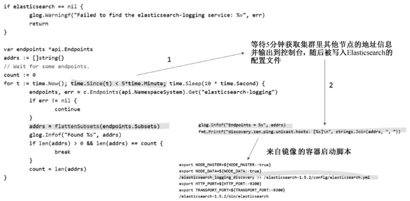
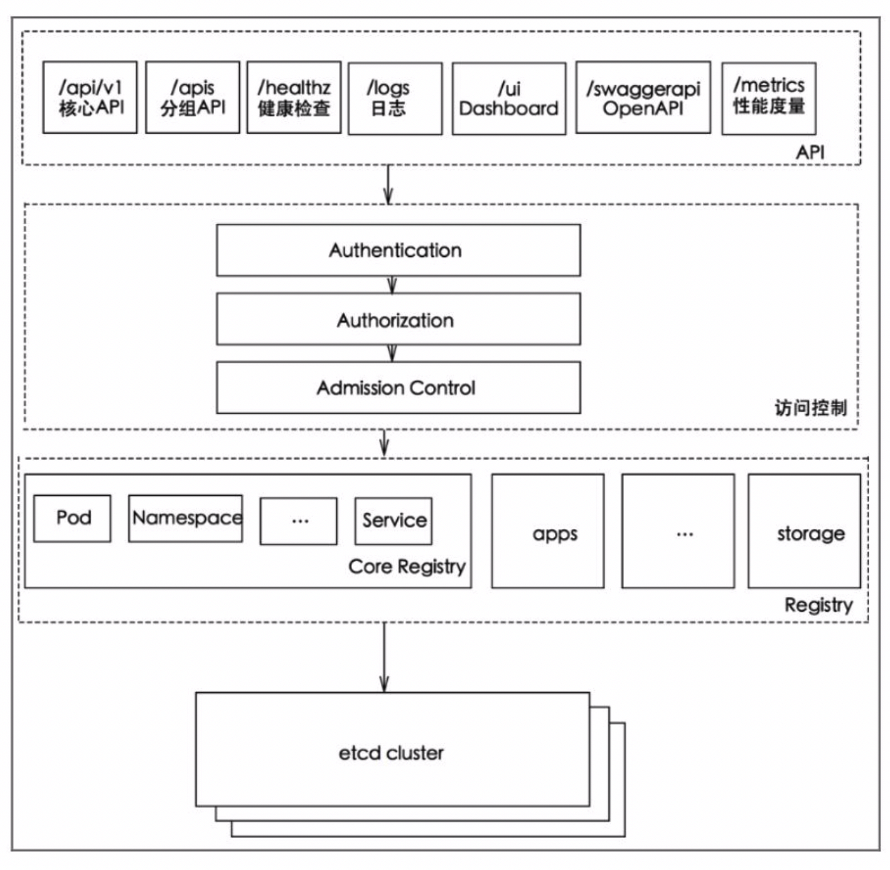
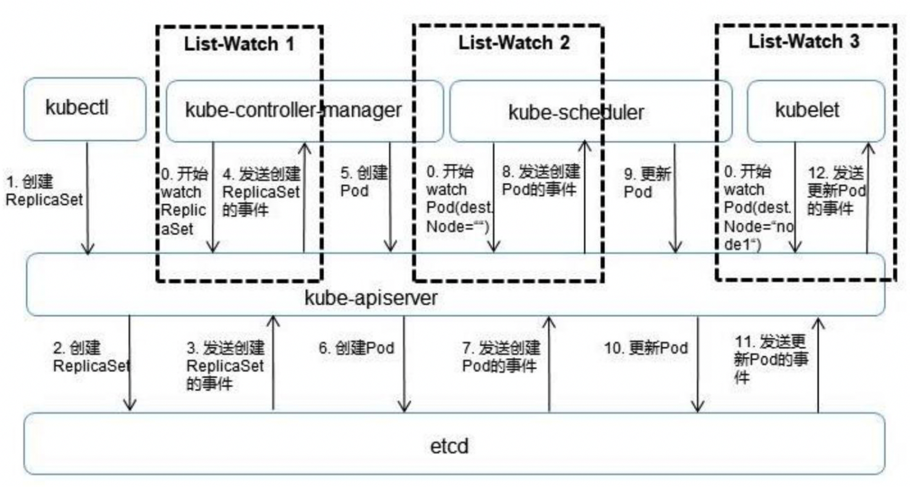
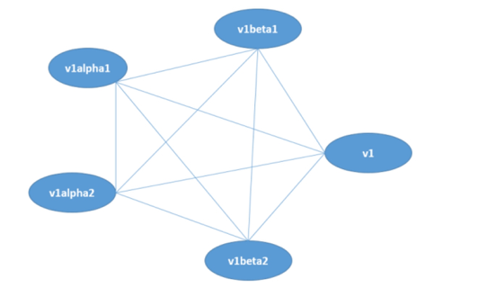
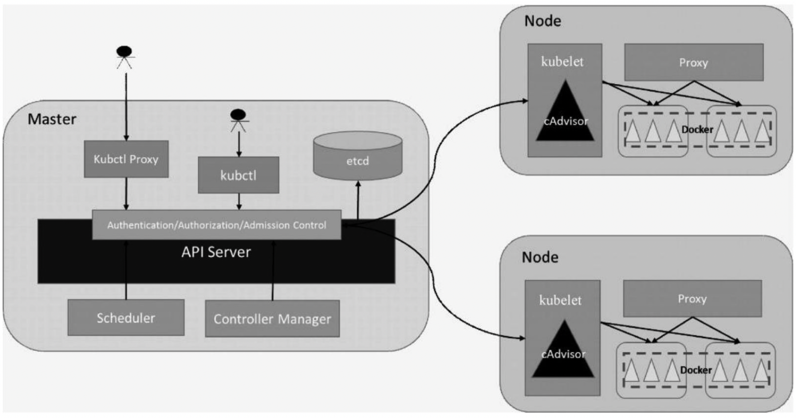

<!-- @import "[TOC]" {cmd="toc" depthFrom=1 depthTo=6 orderedList=false} -->

<!-- code_chunk_output -->

- [1. Kubernetes API Server概述](#1-kubernetes-api-server概述)
  - [1.1. 功能特性](#11-功能特性)
  - [1.2. 进程和端口(非安全和安全端口)](#12-进程和端口非安全和安全端口)
  - [1.3. 访问API Server方式](#13-访问api-server方式)
    - [1.3.1. kubectl命令行工具](#131-kubectl命令行工具)
    - [1.3.2. curl命令行工具](#132-curl命令行工具)
      - [1.3.2.1. 获取API版本信息](#1321-获取api版本信息)
      - [1.3.2.2. 获取支持的资源对象种类](#1322-获取支持的资源对象种类)
      - [1.3.2.3. 获取不同资源对象列表](#1323-获取不同资源对象列表)
      - [1.3.2.4. kubectl proxy的代理功能](#1324-kubectl-proxy的代理功能)
    - [1.3.3. 编程方式调用](#133-编程方式调用)
      - [1.3.3.1. Pod里的用户进程调用](#1331-pod里的用户进程调用)
      - [1.3.3.2. 管理平台](#1332-管理平台)
  - [1.4. 安全性和高性能](#14-安全性和高性能)
    - [1.4.1. 安全性: HTTPS/CA签名 \+ RBAC访问控制](#141-安全性-httpsca签名-rbac访问控制)
    - [1.4.2. 性能: 高性能底层代码 \+ 普通List结合异步Watch \+ 高性能etcd](#142-性能-高性能底层代码-普通list结合异步watch-高性能etcd)
- [2. API Server架构解析](#2-api-server架构解析)
  - [2.1. API Server四层架构](#21-api-server四层架构)
    - [2.1.1. API层](#211-api层)
    - [2.1.2. 访问控制层](#212-访问控制层)
    - [2.1.3. 注册表层](#213-注册表层)
    - [2.1.4. etcd数据库](#214-etcd数据库)
  - [2.2. List\-Watch: API Server中资源对象实时同步机制](#22-list-watch-api-server中资源对象实时同步机制)
  - [2.3. 数据转换和API接口版本兼容](#23-数据转换和api接口版本兼容)
  - [2.4. CRD的设计](#24-crd的设计)
- [3. 独特的Kubernetes Proxy API接口](#3-独特的kubernetes-proxy-api接口)
  - [3.1. Node的相关接口](#31-node的相关接口)
  - [3.2. Pod的相关接口](#32-pod的相关接口)
    - [3.2.1. 举例说明Proxy用法](#321-举例说明proxy用法)
  - [3.3. Service相关接口](#33-service相关接口)
- [4. 集群功能模块之间的通信](#4-集群功能模块之间的通信)
  - [4.1. kubectl进程与API Server的交互](#41-kubectl进程与api-server的交互)
  - [4.2. kube\-controller\-manager进程与API Server的交互](#42-kube-controller-manager进程与api-server的交互)
  - [4.3. kube\-scheduler与API Server的交互](#43-kube-scheduler与api-server的交互)
  - [4.4. 模块的本地缓存](#44-模块的本地缓存)

<!-- /code_chunk_output -->

# 1. Kubernetes API Server概述

## 1.1. 功能特性

总体来看, Kubernetes **API Server**的**核心功能**是提供Kubernetes**各类资源对象**(如Pod、RC、Service等)的增、删、改、查及Watch等**HTTP Rest接口**, 成为集群内各个功能模块之间数据交互和通信的中心枢纽, 是整个系统的**数据总线**和**数据中心**. 

除此之外, 它还有以下一些功能特性. 

(1) **集群管理**的API入口

(2) **资源配额控制**的入口

(3) 提供了完备的**集群安全机制**

## 1.2. 进程和端口(非安全和安全端口)

Kubernetes API Server通过一个名为**kube\-apiserver**的**进程**提供服务, 该进程运行在**Master**上. 

在**默认情况**下, kube\-apiserver进程在**本机的8080端口**(对应参数\-\-**insecure\-port**)提供REST服务. 

可以同时**启动HTTPS安全端口**(\-\-**secure\-port**=**6443**)来启动**安全机制**, 加强REST API访问的安全性. 

## 1.3. 访问API Server方式

### 1.3.1. kubectl命令行工具

通常可以通过**命令行工具kubectl**来与Kubernetes **API Server交互**, 它们之间的接口是**RESTful API**. 

### 1.3.2. curl命令行工具

为了测试和学习Kubernetes API Server所提供的接口, 我们也可以使用**curl命令行工具**进行快速验证. 

#### 1.3.2.1. 获取API版本信息

比如, **登录Master**并运行下面的curl命令, 得到以JSON方式返回的Kubernetes **API的版本信息**

```
# curl localhost:8080/api
{
    "kind": "APIVersions",
    "verdions": [
        "v1"
    ],
    "serverAddressByClientCIDRs": [
        {
            "clientCIDR": "0.0.0.0/0",
            "serverAddress": "192.168.18.131:6443"
        }
    ]
}
```

#### 1.3.2.2. 获取支持的资源对象种类

可以运行下面命令查看Kubernetes **API Server**目前支持的**资源对象的种类**:

```
# curl localhost:8080/api/v1
```

#### 1.3.2.3. 获取不同资源对象列表

根据以上命令的输出, 我们可以运行下面的curl命令, 分别返回**集群中的Pod列表**、**Service列表**、**RC列表**等: 

```
# curl localhost:8080/api/v1/pods
# curl localhost:8080/api/v1/services
# curl localhost:8080/api/v1/replicationcontrollers
```

#### 1.3.2.4. kubectl proxy的代理功能

如果**只**想对外暴露**部分REST服务**, 则可以在**Mater**或**其他节点**上运行**kubectl proxy进程**启动一个**内部代理**来实现.

运行下面命令, 在**8001端口启动代理**, 并且**拒绝客户端访问RC的API**:

```
# kubectl proxy --reject-paths="^/api/v1/replicationcontrollers" --port=8001 --v=2
Starting to server on 127.0.0.1:8001
```

运行下面命令进行验证:

```
# curl localhost:8001/api/v1/replicationcontrollers
<h3>Unauthorized</h3>
```

kubectl **proxy**具有**很多特性**, **最实用**的一个特性是提供**简单有效的安全机制**, 比如在采用**白名单限制非法客户端**访问时, 只需增加下面这个参数即可: 

```
--accept-hosts="^localhost$,^127\\.0\\.0\\.1$,^\\[::1\\]$"
```

### 1.3.3. 编程方式调用

最后一种方式就是通过**编程方式**调用kubernetes API Server. 具体场景又细分为以下两种.

#### 1.3.3.1. Pod里的用户进程调用

第1种使用场景: 运行在**Pod里的用户进程**调用Kubernetes API, 通常用来实现**分布式集群搭建**的目标. 

比如下面这段来自谷歌官方的Elasticsearch集群例子中的代码, Pod在启动的过程中通过访问Endpoints的API, 找到属于elasticsearch\-logging这个Service的所有Pod副本的IP地址, 用来构建集群, 如图5.1所示. 

图5.1 应用程序编程访问API Server:



在上述使用场景中, **Pod中的进程**如何知道**API Server的访问地址**呢?

答案很简单: Kubernetes **API Server！！！** 本身也是一个**Service！！！**, 它的名称就是**kubernetes**, 并且它的**Cluster IP地址**是**Cluster IP地址池**里的**第1个地址**！另外, 它所服务的端口是**HTTPS**端口**443**, 通过kubectl get service命令可以确认这一点: 

```
# kubectl get service
NAME        CLUSTER-IP          EXTERNAL-IP         PORT(S)     AGE
kubernetes  169.169.0.1         <none>              443/TCP     30d
```

#### 1.3.3.2. 管理平台

第2种使用场景: 开发基于Kubernetes的管理平台. 

比如调用Kubernetes API来完成Pod、Service、RC等资源对象的图形化创建和管理界面, 此时可以使用Kubernetes及各开源社区为开发人员提供的**各种语言版本**的 **Client Library**. 后面会介绍通过编程方式访问API Server的一些细节技术. 

## 1.4. 安全性和高性能

由于**API Server**是Kubernetes集群数据的**唯一访问入口！！！**, 因此**安全性**与**高性能**就成为API Server设计和实现的**两大核心目标**. 

### 1.4.1. 安全性: HTTPS/CA签名 \+ RBAC访问控制

通过采用**HTTPS安全传输通道**与**CA签名数字证书强制双向认证**的方式, API Server的**安全性**得以保障. 

此外, 为了**更细粒度！！！** 地控制**用户或应用**对Kubernetes**资源对象的访问权限！！！**, Kubernetes启用了**RBAC访问控制策略！！！**, 之后会深入讲解这一安全策略. 

### 1.4.2. 性能: 高性能底层代码 \+ 普通List结合异步Watch \+ 高性能etcd

API Server的**性能**是决定Kubernetes集群整体性能的关键因素, 因此Kubernetes的设计者综合运用以下方式来最大程度地保证API Server的性能. 

(1)API Server拥有**大量高性能的底层代码**. 

在API Server源码中使用**协程(Coroutine**) \+ **队列(Queue**)这种轻量级的高性能并发代码, 使得**单进程的API Server**具备了超强的多核处理能力, 从而以很快的速度并发处理大量的请求. 

(2)普通**List接口**结合**异步Watch接口**, 不但完美解决了Kubernetes中**各种资源对象的高性能同步**问题, 也极大提升了Kubernetes集群**实时响应各种事件的灵敏度**. 

(3)采用了**高性能的etcd数据库**而非传统的关系数据库, 不仅解决了数据的可靠性问题, 也极大提升了API Server数据访问层的性能. 在常见的公有云环境中, 一个**3节点的etcd集群**在轻负载环境中处理一个请求的时间可以**低于1ms**, 在**重负载环境**中可以**每秒处理超过30000个请求**. 

正是由于采用了上述提升性能的方法, API Server可以支撑很大规模的Kubernetes集群. 截至1.13版本时, Kubernetes已经可以支持**最多5000节点规模**的集群, 同时Kubernetes API Server也淘汰了etcd 2.0, 只支持etcd 3.0以上版本. 

# 2. API Server架构解析

## 2.1. API Server四层架构

API Server的架构从上到下可以分为以下几层, 如图5.2所示. 

图5.2 API Server的架构



### 2.1.1. API层

(1)**API层**

主要以**REST方式**提供**各种API接口**.

除了有Kubernetes资源对象的**CRUD**和**Watch**等主要API, 还有健康检查、UI、日志、性能指标等运维监控相关的API. 

Kubernetes从1.11版本开始**废弃Heapster监控组件**, 转而使用**Metrics Server**提供**Metrics API接口**, 进一步完善了自身的**监控**能力. 

### 2.1.2. 访问控制层

(2)**访问控制层**

当客户端访问API接口时, 访问控制层负责对**用户身份鉴权**, 验明用户身份, 核准用户对Kubernetes资源对象的访问权限, 然后根据配置的**各种资源访问许可逻辑**(**Admission Control**), 判断是否允许访问. 

### 2.1.3. 注册表层

(3)**注册表层**

Kubernetes把**所有资源对象！！！** 都保存在**注册表(Registry**)中. 

针对注册表中的**各种资源对象**都定义了: **资源对象的类型**、**如何创建资源对象**、**如何转换资源的不同版本**, 以及**如何将资源编码和解码为JSON或ProtoBuf格式**进行存储. 

### 2.1.4. etcd数据库

(4)**etcd数据库**

用于**持久化存储Kubernetes资源对象**的**KV数据库**. 

**etcd**的**watch API接口！！！** 对于API Server来说至关重要, 因为通过这个接口, **API Server** 创新性地设计了**List\-Watch**这种高性能的**资源对象实时同步机制！！！**, 使Kubernetes可以管理超大规模的集群, 及时响应和快速处理集群中的各种事件. 

## 2.2. List\-Watch: API Server中资源对象实时同步机制

从本质上看, **API Server**与常见的**MIS**或**ERP**系统中的**DAO模块**类似, 可以将**主要处理逻辑**视作对**数据库表的CRUD(Create\<创建> Read/Retrieve\<读取> Update\<更新> Delete\<删除>)操作**. 

这里解读**API Server**中**资源对象的List\-Watch机制**. 

图5.3**以一个完整的Pod调度过程**为例, 对API Server的List\-Watch机制进行说明. 

图5.3　Pod调度过程中的List\-Watch机制:



首先, 借助**etcd提供的Watch API接口**, **API Server**可以**监听(Watch**)在etcd上发生的**数据操作事件！！！**, 比如**Pod创建**事件、**更新**事件、**删除**事件等, 在这些**事件发生**后, **etcd**会及时**通知API Server**. 图5.3中**API Server**与**etcd**之间的**交互箭头**表明了这个过程: 当一个**ReplicaSet对象被创建**并**被保存到etcd**中后(图中的**2.Create RepliatSet箭头**), **etcd**会立即**发送一个对应的Create事件**给API Server(图中的3.Send RepliatSet Create Event箭头), 与其类似的6和7、10和11箭头都是针对Pod的创建、更新事件的. 

然后, 为了让Kubernetes中的**其他组件**在**不访问底层etcd数据库**的情况下, 也能及时**获取资源对象的变化事件**, **API Server**模仿etcd的Watch API接口提供了自己的**Watch接口**, 这样一来, 这些组件就能近乎实时地获取它们感兴趣的任意资源对象的相关事件通知了. 图5.3中controller\-manager、scheduler、kublet等组件与API Server之间的3个标记有List\-Watch的虚框表明了这个过程. 同时, 在监听自己感兴趣的资源的时候, **客户端**可以增加**过滤条件**, 以List\-Watch 3为例, **node1节点**上的**kubelet进程**只对自己节点上的Pod事件感兴趣. 

最后, Kubernetes **List\-Watch**用于实现**数据同步**的代码逻辑. 客户端首先调用API Server的**List接口**获取相关资源对象的**全量数据**并将其**缓存到内存**中, 然后**启动对应资源对象**的**Watch协程**, 在接收到Watch事件后, 再根据事件的类型(比如新增、修改或删除)对**内存中的全量资源对象列表**做出相应的**同步修改**, 从实现上来看, 这是一种全量结合增量的、高性能的、近乎实时的数据同步方式. 

## 2.3. 数据转换和API接口版本兼容

接下来说说API Server中的另一处精彩设计. 

我们知道, 对于**不断迭代更新的系统**, **对象的属性**一定是在**不断变化**的, **API接口的版本**也在不断升级, 此时就会面临**版本问题**, 即**同一个对象不同版本之间的数据转换问题**及**API接口版本的兼容**问题. 后面这个问题解决起来比较容易, 即**定义不同的API版本号**(比如v1alpha1、v1beta1)来加以区分, 但前面的问题就有点麻烦了, 比如**数据对象**经历**v1alpha1**、**v1beta1**、**v1beta1**、**v1beta2**等变化后最终变成**v1版本**, 此时该数据对象就**存在5个版本**, 如果这5个版本之间的数据**两两直接转换**, 就存在很**多种逻辑组合**, 变成一种典型的**网状网络**, 如图5.4所示, 为此我们不得不增加很多重复的转换代码. 

图5.4 对象版本转换的拓扑图



上述**直接转换**的设计模式还存在另一个不可控的变数, 即**每增加一个新的对象版本**, 之前每个版本的对象就都需要增加一个到新版本对象的转换逻辑. 如此一来, 对**直接转换的实现**就更难了. 于是, **API Server**针对**每种资源对象**都引入了一个**相对不变的internal版本**, 每个版本只要支持转换为internal版本, 就能够与其他版本进行间接转换. 于是对象版本转换的拓扑图就简化成了如图5.5所示的星状图. 

图5.5　星状图:


## 2.4. CRD的设计

CRD(Custom Resource Definitions, 自定义资源)

本节最后简单说说Kubernetes中的**CRD**在**API Server**中的设计和实现机制. 

根据Kubernetes的设计, **每种官方内建的资源对象**如Node、Pod、Service等的实现都包含以下主要功能. 

(1)资源对象的**元数据(Schema**)的定义: 可以将其理解为数据库Table的定义, 定义了对应资源对象的数据结构, 官方内建资源对象的元数据定义是固化在源码中的. 

(2)资源对象的**校验逻辑**: 确保用户提交的资源对象的属性的合法性. 

(3)资源对象的**CRUD操作代码**: 可以将其理解为数据库表的CRUD代码, 但比后者更难, 因为API Server对资源对象的CRUD操作都会保存到etcd数据库中, 对处理性能的要求也更高, 还要考虑版本兼容性和版本转换等复杂问题. 

(4)资源对象相关的"**自动控制器**"(如RC、Deployment等资源对象背后的控制器): 这是很重要的一个功能. 因为Kubernetes是一个**以自动化为核心目标**的平台, 用户给出期望的资源对象声明, 运行过程中则由资源背后的"自动控制器"负责, 确保对应资源对象的数量、状态、行为都始终符合用户的预期. 

类似地, 每个**自定义CRD**的开发人员都需要实现上面这些功能. 为了减小编程的难度与工作量, API Server的设计者们做出了大量的努力, 使得上面**前3个功能无须编程实现**, 直接**编写YAML定义文件**即可实现. 对于唯一需要编程的第4个功能来说, 由于API Server提供了大量的基础API库, 特别是易用的List\-Watch的编程框架, 也使得**CRD自动控制器**的编程难度大大减小. 

# 3. 独特的Kubernetes Proxy API接口

前面讲到, Kubernetes **API Server最主要的REST接口**是**资源对象**的**增、删、改、查**接口, 除此之外, 它还提供了一类很特殊的REST接口—**Kubernetes Proxy API接口**, 这类接口的作用是**代理REST请求！！！**, 即Kubernetes **API Server**把**收到的REST请求**转发到**某个Node**上的**kubelet守护进程的REST端口**, 由**该kubelet进程负责响应**. 

## 3.1. Node的相关接口

首先来说说Kubernetes **Proxy API**里**关于Node的相关接口**. 

该接口的REST路径为/api/v1/proxy/nodes/{name}, 其中{name}为**节点的名称或IP地址**, 包括以下几个具体接口: 

```
/api/v1/proxy/nodes/{name}/pods     # 列出指定节点内所有Pod的信息
/api/v1/proxy/nodes/{name}/stats    # 列出指定节点内物理资源的统计信息
/api/v1/proxy/nodes/{name}/spec     # 列出指定节点的概要信息
```

例如, 当前Node的名称为k8s\-node\-1, 用下面的命令即可获取该节点上所有运行中的Pod: 

```
curl localhost:8080/api/v1/proxy/nodes/k8s-node-1/pods
```

需要说明的是: 这里获取的**Pod的信息数据**来自**Node**而**非etcd数据库**, 所以两者可能在某些时间点**有所偏差**. 

此外, 如果kubelet进程在启动时包含\-\-**enable\-debugginghandlers**=true参数, 那么Kubernetes Proxy API还会增加下面的接口: 

```
/api/v1/proxy/nodes/{name}/run          # 在节点上运行某个容器
/api/v1/proxy/nodes/{name}/exec         # 在节点上的某个容器上运行某条命令
/api/v1/proxy/nodes/{name}/attach       # 在节点上attach某个容器
/api/v1/proxy/nodes/{name}/portForward  # 实现节点上的Pod端口转发
/api/v1/proxy/nodes/{name}/logs         # 列出节点的各类日志信息, 例如tallylog、
                                        # lastlog、wtmp、ppp/、rhsm/、audit/、
                                        # tuned/和anaconda/等
/api/v1/proxy/nodes/{name}/metrics      # 列出和该节点相关的Metrics信息
/api/v1/proxy/nodes/{name}/runningpods  # 列出节点内运行中的Pod信息
/api/v1/proxy/nodes/{name}/debug/pprof  # 列出节点内当前Web服务的状态
                                        # 包括CPU占用情况和内存使用情况等
```

## 3.2. Pod的相关接口

Kubernetes Proxy API里关于Pod的相关接口, 通过这些接口, 我们可以访问Pod里某个容器提供的服务(如Tomcat在8080端口的服务):

```
/api/v1/proxy/namespaces/{namespace}/pods/{name}/{path:*}   # 访问Pod的某个服务接口
/api/v1/proxy/namespaces/{namespace}/pods/{name}            # 访问Pod
/api/v1/namespaces/{namespace}/pods/{name}/proxy/{path:*}   # 访问Pod的某个服务接口
/api/v1/namespaces/{namespace}/pods/{name}/proxy            # 访问Pod
```

在上面的4个接口里, 后面两个接口的功能与前面两个完全一样, 只是写法不同. 

### 3.2.1. 举例说明Proxy用法

下面用第1章Java Web例子中的Tomcat Pod来说明上述Proxy接口的用法. 

首先, 得到Pod的名称:

```
# kubectl get pods
NAME            READY   STATUS      RESTARTS    AGE
mysql-c95jc     1/1     Running     0           8d
myweb-g9pmm     1/1     Running     0           8d
```

然后, 运行下面命令, 输出Tomcat的首页, 相当于访问 http://localhost:8080/ :

```
# curl http://localhost:8080/api/v1/proxy/namespaces/default/pods/myweb-g9pmm/
```

我们也可以在浏览器中访问上面的地址, 比如Master的IP地址是192.168.18.131, 我们在浏览器中输入 http://192.168.18.131:8080/api/v1/proxy/namespaces/default/pods/myweb-g9pmm/ , 就能够访问Tomcat首页了; 而如果输入/api/v1/proxy/namespaces/default/pods/myweb-g9pmm/demo, 就能访问Tomcat中Demo应用的页面了. 

看到这里, 你可能明白**Pod！！！** 的**Proxy接口**的作用和意义了: 在Kubernetes**集群之外**访问**某个Pod容器的服务**(HTTP服务)时, 可以用**Proxy API实现**, 这种场景**多用于管理目的**, 比如逐一排查Service的Pod副本, 检查哪些Pod的服务存在异常. 

## 3.3. Service相关接口

最后说说Service. 

Kubernetes Proxy API也有**Service的Proxy接口**, 其接口定义与Pod的接口定义基本一样: 

```
/api/v1/proxy/namespaces/{namespace}/services/{name}
```

比如, 若我们想访问MyWeb这个Service, 则可以在浏览器里输入 http://192.168.18.131:8080/api/v1/proxy/namespaces/default/services/myweb/demo/ . 

# 4. 集群功能模块之间的通信

从图5.6中可以看出, Kubernetes **API Server作为集群的核心**, 负责集群**各功能模块之间的通信**. 

图5.6　Kubernetes结构图:



集群内的**各个功能模块**通过**API Server**将信息存入**etcd**, 当需要获取和操作这些数据时, 则通过**API Server**提供的**REST接口**(用**GET**、**LIST**或**WATCH方法**)来实现, 从而实现各模块之间的信息交互. 

## 4.1. kubectl进程与API Server的交互

常见的一个交互场景是**kubelet进程**与**API Server**的交互. 

**每个Node**上的**kubelet**每隔一个时间周期, 就会调用一次API Server的REST接口**报告自身状态**, **API Server**在接收到这些信息后, 会将**节点状态信息**更新到**etcd**中. 

此外, kubelet也通过**API Server**的**Watch接口**监听**Pod信息**, 

- 如果监听到**新的Pod副本**被调度绑定到**本节点**, 则执行**Pod对应的容器创建和启动逻辑**; 
- 如果监听到**Pod对象被删除**, 则删除本节点上相应的Pod容器; 
- 如果监听到修改Pod的信息, kubelet就会相应地修改本节点的Pod容器. 

## 4.2. kube\-controller\-manager进程与API Server的交互

另一个交互场景是**kube\-controller\-manager进程**与**API Server**的交互. 

kube\-controller\-manager中的**Node Controller模块**通过API Server提供的**Watch接口**实时监控**Node的信息**, 并做相应处理. 

## 4.3. kube\-scheduler与API Server的交互

还有一个比较重要的交互场景是kube\-scheduler与API Server的交互. 

**Scheduler**通过API Server的**Watch接口**监听到**新建Pod副本的信息**后, 会检索所有符合该Pod要求的Node列表, 开始**执行Pod调度逻辑**, 在调度成功后将**Pod绑定到目标节点**上. 

## 4.4. 模块的本地缓存

为了缓解集群各模块对API Server的访问压力, **各功能模块**都采用**缓存机制**来缓存数据. 

各功能模块定时从API Server获取指定的资源对象信息(通过List\-Watch方法), 然后将这些信息保存到本地缓存中, 功能模块在**某些情况下**不直接访问API Server, 而是通过**访问缓存数据**来间接访问API Server. 