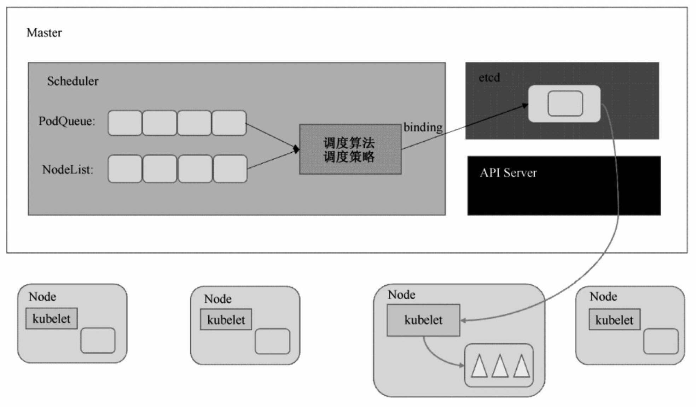
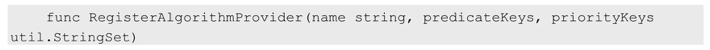
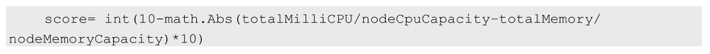

<!-- @import "[TOC]" {cmd="toc" depthFrom=1 depthTo=6 orderedList=false} -->

<!-- code_chunk_output -->

<!-- /code_chunk_output -->

前面深入分析了Controller Manager及它所包含的各个组件的运行机制, 本节将继续对Kubernetes中负责Pod调度的重要功能模块—Kubernetes Scheduler的工作原理和运行机制做深入分析. 

Kubernetes Scheduler在整个系统中承担了"承上启下"的重要功能, "承上"是指它负责接收Controller Manager创建的新Pod, 为其安排一个落脚的"家"—目标Node; "启下"是指安置工作完成后, 目标Node上的kubelet服务进程接管后继工作, 负责Pod生命周期中的"下半生". 

具体来说, Kubernetes Scheduler的作用是将待调度的Pod(API新创建的Pod、Controller Manager为补足副本而创建的Pod等)按照特定的调度算法和调度策略绑定(Binding)到集群中某个合适的Node上, 并将绑定信息写入etcd中. 在整个调度过程中涉及三个对象, 分别是待调度Pod列表、可用Node列表, 以及调度算法和策略. 简单地说, 就是通过调度算法调度为待调度Pod列表中的每个Pod从Node列表中选择一个最适合的Node. 

随后, 目标节点上的kubelet通过API Server监听到Kubernetes Scheduler产生的Pod绑定事件, 然后获取对应的Pod清单, 下载Image镜像并启动容器. 完整的流程如图5.11所示. 

图5.11　Scheduler流程:

Kubernetes Scheduler当前提供的默认调度流程分为以下两步. 

(1)预选调度过程, 即遍历所有目标Node, 筛选出符合要求的候选节点. 为此, Kubernetes内置了多种预选策略(xxx Predicates)供用户选择. 

(2)确定最优节点, 在第1步的基础上, 采用优选策略(xxx Priority)计算出每个候选节点的积分, 积分最高者胜出. 

Kubernetes Scheduler的调度流程是通过插件方式加载的"调度算法提供者"(AlgorithmProvider)具体实现的. 一个AlgorithmProvider其实就是包括了一组预选策略与一组优先选择策略的结构体, 注册AlgorithmProvider的函数如下: 

它包含三个参数: name string为算法名; predicateKeys为算法用到的预选策略集合; priorityKeys为算法用到的优选策略集合. 

Scheduler中可用的预选策略包含: NoDiskConflict、PodFitsResources、PodSelectorMatches、PodFitsHost、CheckNodeLabelPresence、CheckServiceAffinity和PodFitsPorts策略等. 其默认的AlgorithmProvider加载的预选策略Predicates包括: PodFitsPorts(PodFitsPorts)、PodFitsResources(PodFitsResources)、NoDiskConflict(NoDiskConflict)、MatchNodeSelector(PodSelectorMatches)和HostName(PodFitsHost), 即每个节点只有通过前面提及的5个默认预选策略后, 才能初步被选中, 进入下一个流程. 

下面列出的是对所有预选策略的详细说明. 

1)NoDiskConflict

判断备选Pod的gcePersistentDisk或AWSElasticBlockStore和备选的节点中已存在的Pod是否存在冲突. 检测过程如下. 

(1)首先, 读取备选Pod的所有Volume的信息(即pod.Spec.Volumes), 对每个Volume执行以下步骤进行冲突检测. 

(2)如果该Volume是gcePersistentDisk, 则将Volume和备选节点上的所有Pod的每个Volume都进行比较, 如果发现相同的gcePersistentDisk, 则返回false, 表明存在磁盘冲突, 检查结束, 反馈给调度器该备选节点不适合作为备选Pod; 如果该Volume是AWSElasticBlockStore, 则将Volume和备选节点上的所有Pod的每个Volume都进行比较, 如果发现相同的AWSElasticBlockStore, 则返回false, 表明存在磁盘冲突, 检查结束, 反馈给调度器该备选节点不适合备选Pod. 

(3)如果检查完备选Pod的所有Volume均未发现冲突, 则返回true, 表明不存在磁盘冲突, 反馈给调度器该备选节点适合备选Pod. 

2)PodFitsResources

判断备选节点的资源是否满足备选Pod的需求, 检测过程如下. 

(1)计算备选Pod和节点中已存在Pod的所有容器的需求资源(内存和CPU)的总和. 

(2)获得备选节点的状态信息, 其中包含节点的资源信息. 

(3)如果在备选Pod和节点中已存在Pod的所有容器的需求资源(内存和CPU)的总和, 超出了备选节点拥有的资源, 则返回false, 表明备选节点不适合备选Pod, 否则返回true, 表明备选节点适合备选Pod. 

3)PodSelectorMatches

判断备选节点是否包含备选Pod的标签选择器指定的标签. 

(1)如果Pod没有指定spec.nodeSelector标签选择器, 则返回true. 

(2)否则, 获得备选节点的标签信息, 判断节点是否包含备选Pod的标签选择器(spec.nodeSelector)所指定的标签, 如果包含, 则返回true, 否则返回false. 

4)PodFitsHost

判断备选Pod的spec.nodeName域所指定的节点名称和备选节点的名称是否一致, 如果一致, 则返回true, 否则返回false. 

5)CheckNodeLabelPresence

如果用户在配置文件中指定了该策略, 则Scheduler会通过RegisterCustomFitPredicate方法注册该策略. 该策略用于判断策略列出的标签在备选节点中存在时, 是否选择该备选节点. 

(1)读取备选节点的标签列表信息. 

(2)如果策略配置的标签列表存在于备选节点的标签列表中, 且策略配置的presence值为false, 则返回false, 否则返回true; 如果策略配置的标签列表不存在于备选节点的标签列表中, 且策略配置的presence值为true, 则返回false, 否则返回true. 

6)CheckServiceAffinity

如果用户在配置文件中指定了该策略, 则Scheduler会通过RegisterCustomFitPredicate方法注册该策略. 该策略用于判断备选节点是否包含策略指定的标签, 或包含和备选Pod在相同Service和Namespace下的Pod所在节点的标签列表. 如果存在, 则返回true, 否则返回false. 

7)PodFitsPorts

判断备选Pod所用的端口列表中的端口是否在备选节点中已被占用, 如果被占用, 则返回false, 否则返回true. 

Scheduler中的优选策略包含: LeastRequestedPriority、CalculateNodeLabelPriority和BalancedResourceAllocation等. 每个节点通过优先选择策略时都会算出一个得分, 计算各项得分, 最终选出得分值最大的节点作为优选的结果(也是调度算法的结果). 

下面是对所有优选策略的详细说明. 

1)LeastRequestedPriority

该优选策略用于从备选节点列表中选出资源消耗最小的节点. 

(1)计算出在所有备选节点上运行的Pod和备选Pod的CPU占用量totalMilliCPU. 

(2)计算出在所有备选节点上运行的Pod和备选Pod的内存占用量totalMemory. 

(3)计算每个节点的得分, 计算规则大致如下, 其中, NodeCpuCapacity为节点CPU计算能力, NodeMemoryCapacity为节点内存大小: 

2)CalculateNodeLabelPriority

如果用户在配置文件中指定了该策略, 则scheduler会通过RegisterCustomPriorityFunction方法注册该策略. 该策略用于判断策略列出的标签在备选节点中存在时, 是否选择该备选节点. 如果备选节点的标签在优选策略的标签列表中且优选策略的presence值为true, 或者备选节点的标签不在优选策略的标签列表中且优选策略的presence值为false, 则备选节点score=10, 否则备选节点score=0. 

3)BalancedResourceAllocation

该优选策略用于从备选节点列表中选出各项资源使用率最均衡的节点. 

(1)计算出在所有备选节点上运行的Pod和备选Pod的CPU占用量totalMilliCPU. 

(2)计算出在所有备选节点上运行的Pod和备选Pod的内存占用量totalMemory. 

(3)计算每个节点的得分, 计算规则大致如下, 其中, NodeCpuCapacity为节点的CPU计算能力, NodeMemoryCapacity为节点的内存大小: 

