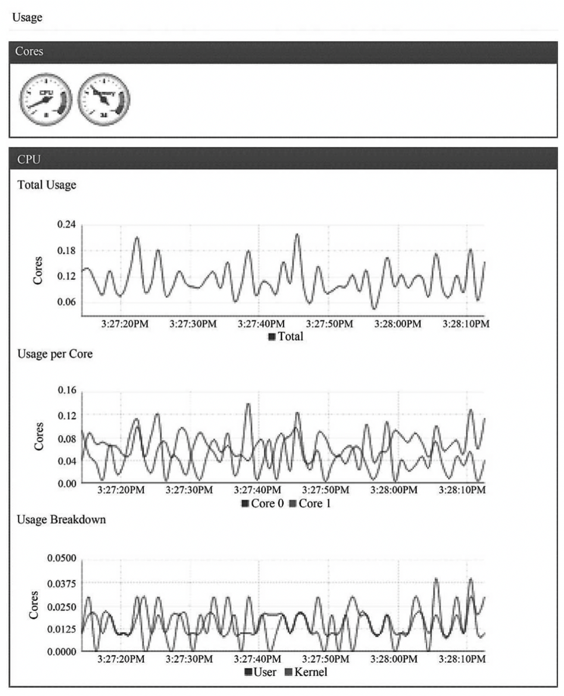

<!-- @import "[TOC]" {cmd="toc" depthFrom=1 depthTo=6 orderedList=false} -->

<!-- code_chunk_output -->

- [1. 节点管理](#1-节点管理)
- [2. Pod管理](#2-pod管理)
- [3. 容器健康检查](#3-容器健康检查)
- [4. cAdvisor资源监控](#4-cadvisor资源监控)

<!-- /code_chunk_output -->

在Kubernetes集群中, 在每个Node(又称Minion)上都会启动一个kubelet服务进程. 该进程用于处理Master下发到本节点的任务, 管理Pod及Pod中的容器. 每个kubelet进程都会在API Server上注册节点自身的信息, 定期向Master汇报节点资源的使用情况, 并通过cAdvisor监控容器和节点资源. 

# 1. 节点管理

节点通过设置kubelet的启动参数"\-\-register\-node", 来决定是否向API Server注册自己. 如果该参数的值为true, 那么kubelet将试着通过API Server注册自己. 在自注册时, kubelet启动时还包含下列参数. 

- \-\-api\-servers: API Server的位置. 
- \-\-kubeconfig: kubeconfig文件, 用于访问API Server的安全配置文件. 
- \-\-cloud\-provider: 云服务商(IaaS)地址, 仅用于公有云环境. 

当前每个kubelet都被授予创建和修改任何节点的权限. 但是在实践中, 它仅仅创建和修改自己. 将来, 我们计划限制kubelet的权限, 仅允许它修改和创建所在节点的权限. 如果在集群运行过程中遇到集群资源不足的情况, 用户就很容易通过添加机器及运用kubelet的自注册模式来实现扩容. 

在某些情况下, Kubernetes集群中的某些kubelet没有选择自注册模式, 用户需要自己去配置Node的资源信息, 同时告知Node上Kubelet API Server的位置. 集群管理者能够创建和修改节点信息. 如果管理者希望手动创建节点信息, 则通过设置kubelet的启动参数"\-\-register\-node=false"即可完成. 

kubelet在启动时通过API Server注册节点信息, 并定时向API Server发送节点的新消息, API Server在接收到这些信息后, 将这些信息写入etcd. 通过kubelet的启动参数"\-\-node\-status\-update\-frequency"设置kubelet每隔多长时间向API Server报告节点状态, 默认为10s. 

# 2. Pod管理

kubelet通过以下几种方式获取自身Node上要运行的Pod清单. 

(1)文件: kubelet启动参数"--config"指定的配置文件目录下的文件(默认目录为"/etc/ kubernetes/manifests/"). 通过--file-check-frequency设置检查该文件目录的时间间隔, 默认为20s. 

(2)HTTP端点(URL): 通过"--manifest-url"参数设置. 通过--http-check-frequency设置检查该HTTP端点数据的时间间隔, 默认为20s. 

(3)API Server: kubelet通过API Server监听etcd目录, 同步Pod列表. 

所有以非API Server方式创建的Pod都叫作Static Pod. kubelet将Static Pod的状态汇报给API Server, API Server为该Static Pod创建一个Mirror Pod和其相匹配. Mirror Pod的状态将真实反映Static Pod的状态. 当Static Pod被删除时, 与之相对应的Mirror Pod也会被删除. 在本章中只讨论通过API Server获得Pod清单的方式. kubelet通过API Server Client使用Watch加List的方式监听"/registry/nodes/$"当前节点的名称和"/registry/pods"目录, 将获取的信息同步到本地缓存中. 

kubelet监听etcd, 所有针对Pod的操作都会被kubelet监听. 如果发现有新的绑定到本节点的Pod, 则按照Pod清单的要求创建该Pod. 

如果发现本地的Pod被修改, 则kubelet会做出相应的修改, 比如在删除Pod中的某个容器时, 会通过Docker Client删除该容器. 

如果发现删除本节点的Pod, 则删除相应的Pod, 并通过Docker Client删除Pod中的容器. 

kubelet读取监听到的信息, 如果是创建和修改Pod任务, 则做如下处理. 

(1)为该Pod创建一个数据目录. 

(2)从API Server读取该Pod清单. 

(3)为该Pod挂载外部卷(External Volume). 

(4)下载Pod用到的Secret. 

(5)检查已经运行在节点上的Pod, 如果该Pod没有容器或Pause容器("kubernetes/pause"镜像创建的容器)没有启动, 则先停止Pod里所有容器的进程. 如果在Pod中有需要删除的容器, 则删除这些容器. 

(6)用"kubernetes/pause"镜像为每个Pod都创建一个容器. 该Pause容器用于接管Pod中所有其他容器的网络. 每创建一个新的Pod, kubelet都会先创建一个Pause容器, 然后创建其他容器. "kubernetes/pause"镜像大概有200KB, 是个非常小的容器镜像. 

(7)为Pod中的每个容器做如下处理. 

- 为容器计算一个Hash值, 然后用容器的名称去查询对应Docker容器的Hash值. 若查找到容器, 且二者的Hash值不同, 则停止Docker中容器的进程, 并停止与之关联的Pause容器的进程; 若二者相同, 则不做任何处理. 
- 如果容器被终止了, 且容器没有指定的restartPolicy(重启策略), 则不做任何处理. 
- 调用Docker Client下载容器镜像, 调用Docker Client运行容器. 

# 3. 容器健康检查

Pod通过两类探针来检查容器的健康状态. 一类是LivenessProbe探针, 用于判断容器是否健康并反馈给kubelet. 如果LivenessProbe探针探测到容器不健康, 则kubelet将删除该容器, 并根据容器的重启策略做相应的处理. 如果一个容器不包含LivenessProbe探针, 那么kubelet认为该容器的LivenessProbe探针返回的值永远是Success; 另一类是ReadinessProbe探针, 用于判断容器是否启动完成, 且准备接收请求. 如果ReadinessProbe探针检测到容器启动失败, 则Pod的状态将被修改, Endpoint Controller将从Service的Endpoint中删除包含该容器所在Pod的IP地址的Endpoint条目. 

kubelet定期调用容器中的LivenessProbe探针来诊断容器的健康状况. LivenessProbe包含以下3种实现方式. 

(1)ExecAction: 在容器内部执行一个命令, 如果该命令的退出状态码为0, 则表明容器健康. 

(2)TCPSocketAction: 通过容器的IP地址和端口号执行TCP检查, 如果端口能被访问, 则表明容器健康. 

(3)HTTPGetAction: 通过容器的IP地址和端口号及路径调用HTTP Get方法, 如果响应的状态码大于等于200且小于等于400, 则认为容器状态健康. 

LivenessProbe探针被包含在Pod定义的spec.containers.{某个容器}中. 下面的例子展示了两种Pod中容器健康检查的方式: HTTP检查和容器命令执行检查. 下面所列的内容实现了通过容器命令执行检查: 

```yaml
livenessProbe:
  exec:
    command:
    - cat
    - /tmp/health
  initialDelaySeconds: 15
  timeoutSeconds: 1
```

kubelet在容器中执行"cat /tmp/health"命令, 如果该命令返回的值为0, 则表明容器处于健康状态, 否则表明容器处于不健康状态. 

下面所列的内容实现了容器的HTTP检查: 

```yaml
livenessProbe:
  httpGet:
    path: /healthz
    port: 8080
  initialDelaySeconds: 15
  timeoutSeconfs: 1
```

kubelet发送一个HTTP请求到本地主机、端口及指定的路径, 来检查容器的健康状况. 

# 4. cAdvisor资源监控

在Kubernetes集群中, 应用程序的执行情况可以在不同的级别上监测到, 这些级别包括: 容器、Pod、Service和整个集群. 作为Kubernetes集群的一部分, Kubernetes希望提供给用户详细的各个级别的资源使用信息, 这将使用户深入地了解应用的执行情况, 并找到应用中可能的瓶颈. 

cAdvisor是一个开源的分析容器资源使用率和性能特性的代理工具, 它是因为容器而产生的, 因此自然支持Docker容器, 在Kubernetes项目中, cAdvisor被集成到Kubernetes代码中, kubelet则通过cAdvisor获取其所在节点及容器的数据. cAdvisor自动查找所有在其所在Node上的容器, 自动采集CPU、内存、文件系统和网络使用的统计信息. 在大部分Kubernetes集群中, cAdvisor通过它所在Node的4194端口暴露一个简单的UI. 

如图5.12所示是cAdvisor的一个截图. 

图5.12　cAdvisor的一个截图:



kubelet作为连接Kubernetes Master和各Node之间的桥梁, 管理运行在Node上的Pod和容器. kubelet将每个Pod都转换成它的成员容器, 同时从cAdvisor获取单独的容器使用统计信息, 然后通过该REST API暴露这些聚合后的Pod资源使用的统计信息. 

cAdvisor只能提供2~3min的监控数据, 对性能数据也没有持久化, 因此在Kubernetes早期版本中需要依靠Heapster来实现集群范围内全部容器性能指标的采集和查询功能. 从Kubernetes 1.8版本开始, 性能指标数据的查询接口升级为标准的Metrics API, 后端服务则升级为全新的Metrics Server. 因此, cAdvisor在4194端口提供的UI和API服务从Kubernetes 1.10版本开始进入弃用流程, 并于1.12版本完全关闭. 如果还希望使用cAdvisor的这个特性, 则从1.13版本开始可以通过部署一个DaemonSet在每个Node上启动一个cAdvisor来提供UI和API, 请参考cAdvisor在GitHub上的说明(https://github.com/google/cadvisor). 

在新的Kubernetes监控体系中, Metrics Server用于提供Core Metrics(核心指标), 包括Node和Pod的CPU和内存使用数据. 其他Custom Metrics(自定义指标)则由第三方组件(如Prometheus)采集和存储. 

