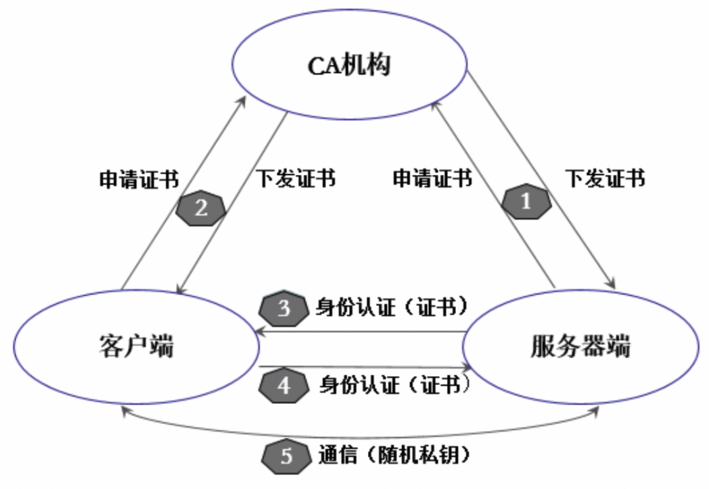

<!-- @import "[TOC]" {cmd="toc" depthFrom=1 depthTo=6 orderedList=false} -->

<!-- code_chunk_output -->

<!-- /code_chunk_output -->

我们知道, Kubernetes集群中所有资源的访问和变更都是通过Kubernetes API Server的REST API来实现的, 所以集群安全的关键点就在于如何识别并认证客户端身份(Authentication), 以及随后访问权限的授权(Authorization)这两个关键问题, 本节对认证管理进行说明. 

我们知道, Kubernetes集群提供了3种级别的客户端身份认证方式. 

- 最严格的HTTPS证书认证: 基于CA根证书签名的双向数字证书认证方式. 
- HTTP Token认证: 通过一个Token来识别合法用户. 
- HTTP Base认证: 通过用户名+密码的方式认证. 

首先说说HTTPS证书认证的原理. 

这里需要有一个CA证书, 我们知道CA是PKI系统中通信双方都信任的实体, 被称为可信第三方(Trusted Third Party, TTP). CA作为可信第三方的重要条件之一就是CA的行为具有非否认性. 作为第三方而不是简单的上级, 就必须能让信任者有追究自己责任的能力. CA通过证书证实他人的公钥信息, 证书上有CA的签名. 用户如果因为信任证书而有了损失, 则证书可以作为有效的证据用于追究CA的法律责任. 正是因为CA承担责任的承诺, 所以CA也被称为可信第三方. 在很多情况下, CA与用户是相互独立的实体, CA作为服务提供方, 有可能因为服务质量问题(例如, 发布的公钥数据有错误)而给用户带来损失. 在证书中绑定了公钥数据和相应私钥拥有者的身份信息, 并带有CA的数字签名; 在证书中也包含了CA的名称, 以便于依赖方找到CA的公钥, 验证证书上的数字签名. 

CA认证涉及诸多概念, 比如根证书、自签名证书、密钥、私钥、加密算法及HTTPS等, 本书大致讲述SSL协议的流程, 有助于理解CA认证和Kubernetes CA认证的配置过程. 

如图6.1所示, CA认证大概包含下面几个步骤. 

图6.1　CA认证流程:

(1)HTTPS通信双方的服务器端向CA机构申请证书, CA机构是可信的第三方机构, 它可以是一个公认的权威企业, 也可以是企业自身. 企业内部系统一般都用企业自身的认证系统. CA机构下发根证书、服务端证书及私钥给申请者. 

(2)HTTPS通信双方的客户端向CA机构申请证书, CA机构下发根证书、客户端证书及私钥给申请者. 

(3)客户端向服务器端发起请求, 服务端下发服务端证书给客户端. 客户端接收到证书后, 通过私钥解密证书, 并利用服务器端证书中的公钥认证证书信息比较证书里的消息, 例如, 比较域名和公钥与服务器刚刚发送的相关消息是否一致, 如果一致, 则客户端认可这个服务器的合法身份. 

(4)客户端发送客户端证书给服务器端, 服务端在接收到证书后, 通过私钥解密证书, 获得客户端证书公钥, 并用该公钥认证证书信息, 确认客户端是否合法. 

(5)客户端通过随机密钥加密信息, 并发送加密后的信息给服务端. 在服务器端和客户端协商好加密方案后, 客户端会产生一个随机的密钥, 客户端通过协商好的加密方案加密该随机密钥, 并发送该随机密钥到服务器端. 服务器端接收这个密钥后, 双方通信的所有内容都通过该随机密钥加密. 

上述是双向认证SSL协议的具体通信过程, 这种情况要求服务器和用户双方都有证书. 单向认证SSL协议则不需要客户端拥有CA证书, 对于上面的步骤, 只需将服务器端验证客户证书的过程去掉, 之后协商对称密码方案和对称通话密钥时, 服务器发送给客户的密码没被加密即可. 

然后说说HTTP Token的认证原理. 

HTTP Token的认证是用一个很长的特殊编码方式的并且难以被模仿的字符串—Token来表明客户身份的一种方式. 在通常情况下, Token是一个很复杂的字符串, 比如我们用私钥签名一个字符串后的数据就可以被当作一个Token. 此外, 每个Token对应一个用户名, 存储在API Server能访问的一个文件中. 当客户端发起API调用请求时, 需要在HTTP Header里放入Token, 这样一来, API Server就能识别合法用户和非法用户了. 

最后说说HTTP Base认证. 

我们知道, HTTP是无状态的, 浏览器和Web服务器之间可以通过Cookie来进行身份识别. 桌面应用程序(比如新浪桌面客户端、SkyDrive客户端、命令行程序)一般不会使用Cookie, 那么它们与Web服务器之间是如何进行身份识别的呢?这就用到了HTTP Base认证, 这种认证方式是把"用户名+冒号+密码"用BASE64算法进行编码后的字符串放在HTTP Request中的Header Authorization域里发送给服务端, 服务端在收到后进行解码, 获取用户名及密码, 然后进行用户身份鉴权. 
