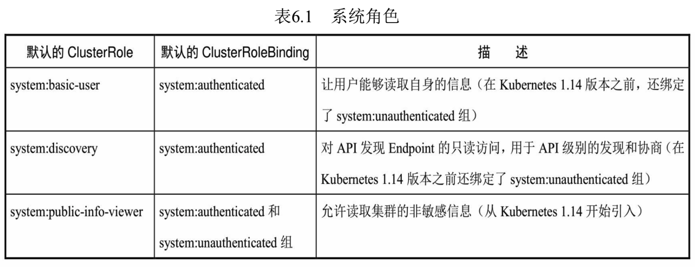
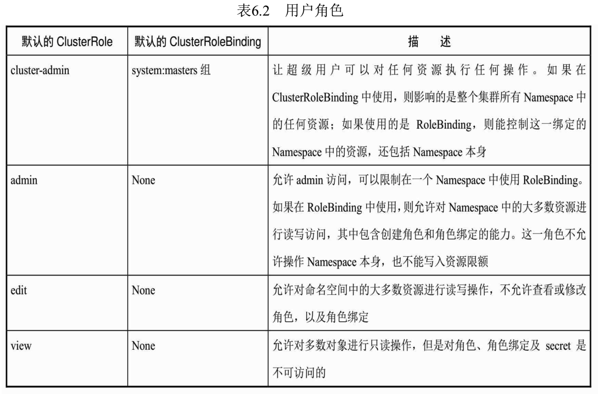
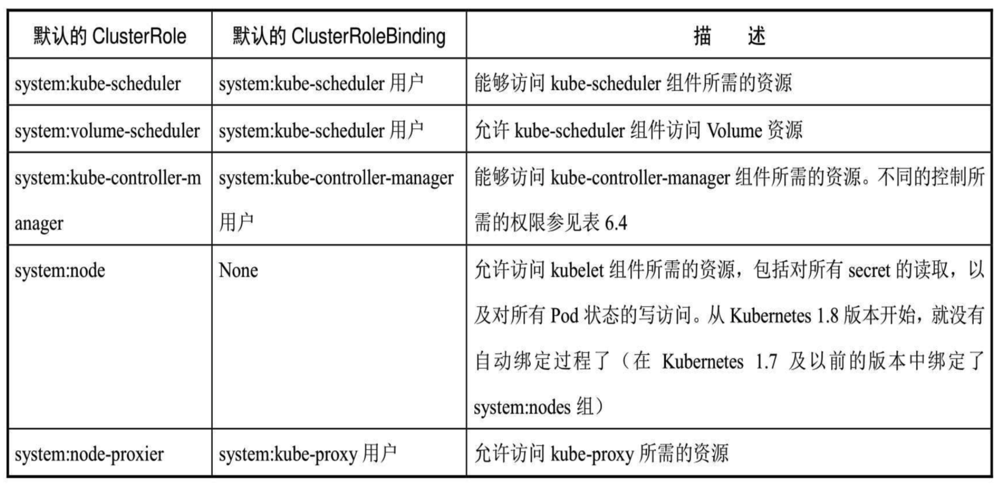
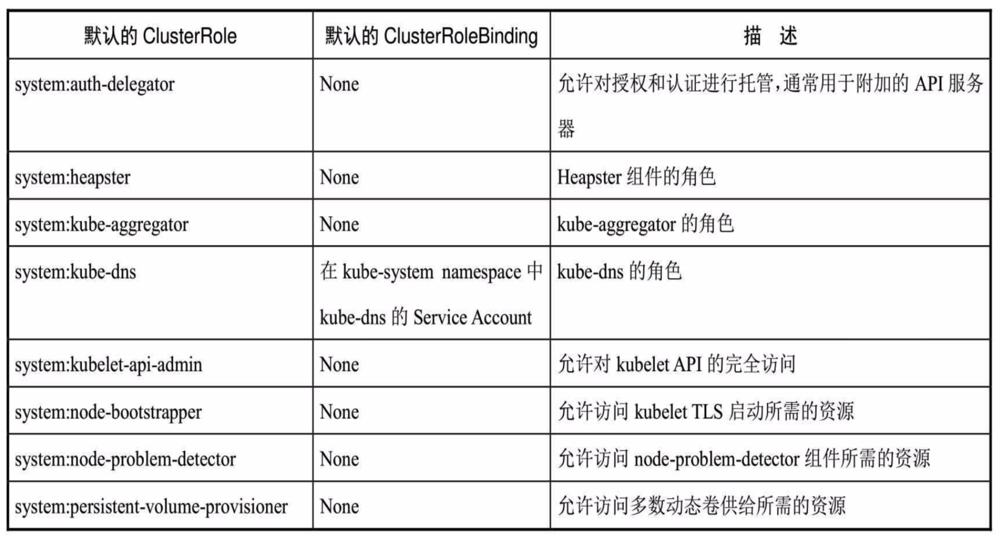
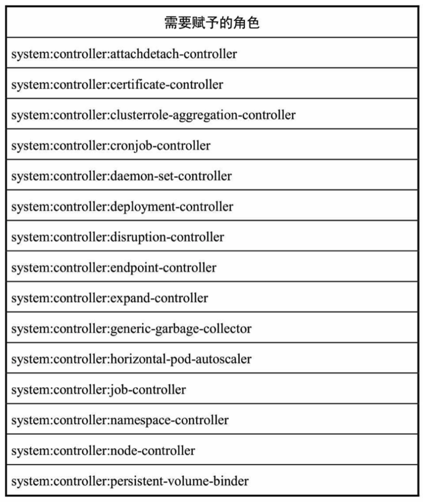
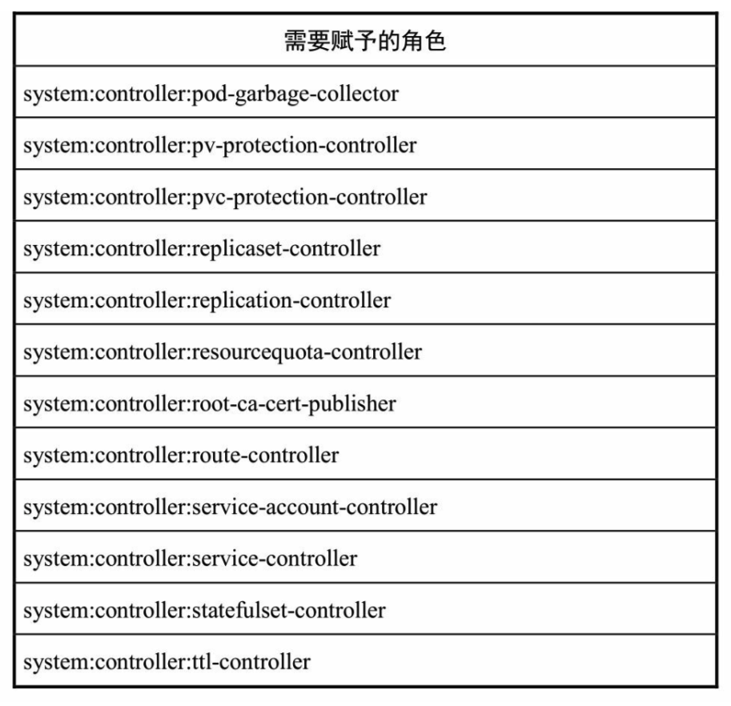
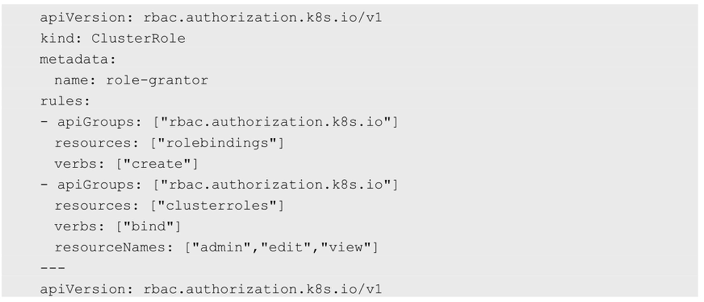
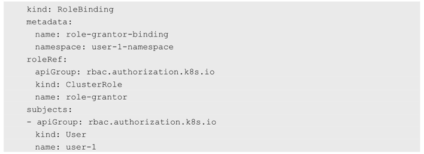

<!-- @import "[TOC]" {cmd="toc" depthFrom=1 depthTo=6 orderedList=false} -->

<!-- code_chunk_output -->

- [1. 概述](#1-概述)
  - [1.1. 用户认证和用户授权](#11-用户认证和用户授权)
  - [1.2. 几种授权策略](#12-几种授权策略)
  - [1.3. 鉴权流程](#13-鉴权流程)
- [2. ABAC授权模式详解](#2-abac授权模式详解)
  - [2.1. 访问策略对象](#21-访问策略对象)
    - [2.1.1. 主体属性](#211-主体属性)
    - [2.1.2. 资源属性](#212-资源属性)
    - [2.1.3. 非资源属性](#213-非资源属性)
  - [2.2. ABAC授权算法](#22-abac授权算法)
  - [2.3. 使用kubectl时的授权机制](#23-使用kubectl时的授权机制)
  - [2.4. 常见的ABAC授权示例](#24-常见的abac授权示例)
  - [2.5. 对Service Account进行授权](#25-对service-account进行授权)
- [3. Webhook授权模式详解](#3-webhook授权模式详解)
- [4. RBAC授权模式详解](#4-rbac授权模式详解)

<!-- /code_chunk_output -->

# 1. 概述

## 1.1. 用户认证和用户授权

当客户端发起API Server调用时, API Server内部要

- **先**进行**用户认证**, 
- 然后执行**用户授权流程**, 即通过**授权策略**来决定一个**API调用是否合法**. 

**对合法用户进行授权**并且随后在**用户访问时进行鉴权**, 是权限与安全系统的重要一环. 简单地说, 授权就是授予**不同的用户不同的访问权限**. 

## 1.2. 几种授权策略

**API Server**目前支持**以下几种授权策略**(通过API Server的启动参数"\-\-**authorization\-mode**"设置). 

- **AlwaysDeny**: 表示**拒绝所有请求**, 一般用于测试. 
- **AlwaysAllow**: 允许**接收所有请求**, 如果集群**不需要授权流程**, 则可以采用该策略, 这也是Kubernetes的**默认配置**. 
- ABAC(**Attribute\-Based Access Control**): **基于属性的访问控制**, 表示使用**用户配置的授权规则**对用户请求进行匹配和控制. 
- Webhook: 通过调用**外部REST服务**对用户进行授权. 
- RBAC: Role\-Based Access Control, 基于**角色**的访问控制. 
- Node: 是一种**专用模式**, 用于对kubelet发出的请求进行访问控制. 

## 1.3. 鉴权流程

**API Server**在**接收到请求**后, 会读取该请求中的数据, 生成一个**访问策略对象！！！**, 如果在该请求中**不带某些属性(如Namespace**), 则这些属性的值将根据属性类型的不同, 设置**不同的默认值**(例如, 为字符串类型的属性设置一个空字符串; 为布尔类型的属性设置false; 为数值类型的属性设置0). 

然后将**这个访问策略对象**和**授权策略文件**中的**所有访问策略对象**逐条匹配, 如果**至少有一个策略对象被匹配**, 则该请求被鉴权通过, 否则终止API调用流程, 并返回客户端的错误调用码. 

# 2. ABAC授权模式详解

## 2.1. 访问策略对象

在**API Server启用ABAC模式**时, 需要指定**授权策略文件**的路径和名称(\-\-**authorization\-policy\-file**=SOME\_FILENAME), **授权策略文件**里的**每一行！！！** 都以一个**Map类型的JSON对象！！！** 进行设置, 这被称为"**访问策略对象**". 

通过设置访问策略对象中的**apiVersion**、**kind**、**spec属性**来确定**具体的授权策略**, 其中, 

- **apiVersion**当前版本为**abac.authorization.kubernetes.io/v1beta1**; 
- **kind**被设置为**Policy**; 
- **spec**指**详细的策略设置**, 包括**主题属性**、**资源属性**、**非资源属性**这三个字段, 如下所述. 

### 2.1.1. 主体属性

(1)主体属性

- **user**(用户名): **字符串类型**, 该字符串类型的**用户名**来源于**Token文件**(\-\-token\-auth\-file参数设置的文件)或**基本认证文件**中**用户名称段**的值. 
- **group**(用户组): 在被设置为"**system:authenticated**"时表示**匹配所有已认证的请求**, 在被设置为"system:**unauthenticated**"时表示匹配**所有未认证的请求**. 

### 2.1.2. 资源属性

(2)资源属性

- **apiGroup**(API组): 字符串类型, 表明匹配**哪些API Group**, 例如**extensions**或\*(表示匹配所有API Group). 
- **namespace**(命名空间): 字符串类型, 表明该策略允许访问**某个Namespace的资源**, 例如**kube\-system**或\*(表示匹配所有Namespace). 
- **resource**(资源): 字符串类型, **API资源对象**, 例如pods或\*(表示匹配所有资源对象). 

### 2.1.3. 非资源属性

(3)非资源属性

- **nonResourcePath(非资源对象类路径**): 非资源对象类的URL路径, 例如\/**version**或\/**apis**, \*表示匹配**所有非资源对象类的请求路径**, 也可以设置为子路径, \/foo/\*表示匹配所有\/foo路径下的**所有子路径**. 
- **readonly**(只读标识): 布尔类型, 当它的值为**true**时, 表明**仅允许GET请求通过**. 

下面对ABAC授权算法、使用kubectl时的授权机制、常见ABAC授权示例、以及如何对Service Account进行授权进行说明. 

## 2.2. ABAC授权算法

1.ABAC授权算法

API Server进行ABAC授权的算法为: 

- 在**API Server收到请求**之后, 首先识别出**请求携带的策略对象的属性**, 
- 然后根据在**策略文件**中定义的策略对这些属性进行**逐条匹配**, 以判定是否允许授权. 
- 如果有至少一条匹配成功, 那么这个请求就通过了授权(不过还是可能在**后续其他授权校验！！！中失败**). 

常见的策略配置如下. 

- 要允许**所有认证用户！！！** 做某件事, 可以**写一个策略**, 将**group属性**设置为**system:authenticated**. 
- 要允许**所有未认证用户**做某件事, 可以把**策略**的group属性设置为system:**unauthenticated**. 
- 要允许**一个用户做任何事**, 将**策略**的**apiGroup**、**namespace**、**resource**和**nonResourcePath属性**设置为"\*"即可. 

## 2.3. 使用kubectl时的授权机制

2.使用kubectl时的授权机制

kubectl使用**API Server**的/**api**和/**apis**端点来**获取版本信息**. 

要验证kubectl **create/update命令**发送给**服务器的对象**, kubectl需要向**OpenAPI**进行查询, 对应的URL路径为/**openapi/v2**. 

当使用**ABAC授权模式**时, 下列**特殊资源**必须**显式地通过nonResourcePath属性**进行设置. 

- **API版本协商**过程中的/api、/api/\*、/apis、和/apis/\*. 
- 使用kubectl **version命令**从服务器获取版本时的/version. 
- **create/update操作**过程中的/swaggerapi/\*. 

在使用kubectl操作时, 如果需要查看发送到**API Server**的**HTTP请求**, 则可以将**日志级别设置为8**, 例如: 

```
# kubectl --v=8 version
```

## 2.4. 常见的ABAC授权示例

3.常见的ABAC授权示例

下面通过几个授权策略文件(JSON格式)示例说明ABAC的访问控制用法. 

(1)允许用户alice对所有资源做任何操作: 


(2)kubelet可以读取任意Pod: 


(3)kubelet可以读写Event对象: 


(4)用户bob只能读取projectCaribou中的Pod: 


(5)任何用户都可以对非资源类路径进行只读请求: 


如果添加了新的ABAC策略, 则需要重启API Server以使其生效. 

## 2.5. 对Service Account进行授权

4.对Service Account进行授权

Service Account会**自动生成**一个**ABAC用户名**(username), 用户名按照以下命名规则生成: 

```
system:serviceaccount:<namespace>:<serviceaccountname>
```

创建**新的命名空间**时, 会产生一个如下名称的**Service Account**: 

```
system:serviceaccount:<mamespace>:default
```

如果希望**kube\-system命名空间**中的Service Account"default"具有全部权限, 就要在策略文件中加入如下内容: 


# 3. Webhook授权模式详解

Webhook定义了一个HTTP回调接口, 实现Webhook的应用会在指定事件发生时, 向一个URL地址发送(POST)通知信息. 启用Webhook授权模式后, Kubernetes会调用外部REST服务对用户进行授权. 

Webhook模式用参数\-\-authorization\-webhook\-config\-file=SOME\_FILENAME来设置远端授权服务的信息. 

配置文件使用的是kubeconfig文件的格式. 文件里user一节的内容指的是API Server. 相对于远程授权服务来说, API Server是客户端, 也就是用户; cluster一节的内容指的是远程授权服务器的配置. 下面的例子为设置一个使用HTTPS客户端认证的配置: 


在授权开始时, API Server会生成一个api.authorization.v1beta1.SubjectAccessReview对象, 用于描述操作信息, 在进行JSON序列化之后POST出来. 在这个对象中包含用户尝试访问资源的请求动作的描述, 以及被访问资源的属性. 

Webhook API对象和其他API对象一样, 遵循同样的版本兼容性规则, 在实现时要注意apiVersion字段的版本, 以实现正确的反序列化操作. 另外, API Server必须启用authorization.k8s.io/v1beta1 API扩展(\-\-runtime\-config=authorization.k8s.io/v1beta1=true). 

下面是一个希望获取Pod列表的请求报文示例: 


远端服务需要填充请求中的SubjectAccessReviewStatus字段, 并返回允许或不允许访问的结果. 应答报文中的spec字段是无效的, 也可以省略. 

一个返回"运行访问"的应答报文示例如下: 


一个返回"不允许访问"的应答报文示例如下: 

非资源的访问请求路径包括/api、/apis、/metrics、/resetMetrics、/logs、/debug、/healthz、/swagger\-ui/、/swaggerapi/、/ui和/version. 通常可以对/api、/api/\*、/apis、/apis/\*和/version对于客户端发现服务器提供的资源和版本信息给予"允许"授权, 对于其他非资源的访问一般可以禁止, 以限制客户端对API Server进行没有必要的查询. 

查询/debug的请求报文示例如下: 

```json
{
    "apiVersion": "authorization.k8s.io/v1beta1",
    "kind": "SubjectAccessReview",
    "spec": {
        "nonResourceAttribures": {
            "path": "/debug",
            "verb": "get"
        },
        "user": "jane",
        "group": {
            "group1",
            "group2"
        }
    }
}
```

# 4. RBAC授权模式详解

RBAC(Role\-Based Access Control, 基于角色的访问控制)在Kubernetes的1.5版本中引入, 在1.6版本时升级为Beta版本, 在1.8版本时升级为GA. 作为kubeadm安装方式的默认选项, 足见其重要程度. 相对于其他访问控制方式, 新的RBAC具有如下优势. 

- 对集群中的资源和非资源权限均有完整的覆盖. 
- 整个RBAC完全由几个API对象完成, 同其他API对象一样, 可以用kubectl或API进行操作. 
- 可以在运行时进行调整, 无须重新启动API Server. 

要使用RBAC授权模式, 需要在API Server的启动参数中加上\-\-authorization\-mode=RBAC. 

下面对RBAC的原理和用法进行说明. 

1.RBAC的API资源对象说明

RBAC引入了4个新的顶级资源对象: Role、ClusterRole、RoleBinding和ClusterRoleBinding. 同其他API资源对象一样, 用户可以使用kubectl或者API调用等方式操作这些资源对象. 

1)角色(Role)

一个角色就是一组权限的集合, 这里的权限都是许可形式的, 不存在拒绝的规则. 在一个命名空间中, 可以用角色来定义一个角色, 如果是集群级别的, 就需要使用ClusterRole了. 

角色只能对命名空间内的资源进行授权, 在下面例子中定义的角色具备读取Pod的权限: 

```yaml
---
kind: Role
apiVersion: rbac.authorization.k8s.io/v1
metadata:
  namespace: default
  name: pod-reader
rules:
- apiGroups: [""]   # "" 空字符串, 表示核心API群
  resources: ["pods"]
  verbs: ["get", "watch", "list"]
```

rules中的参数说明如下. 

- apiGroups: 支持的API组列表, 例如"apiVersion: batch/v1""apiVersion: extensions:v1beta1""apiVersion: apps/v1beta1"等, 详细的API组说明参见第9章的说明. 
- resources: 支持的资源对象列表, 例如pods、deployments、jobs等. 
- verbs: 对资源对象的操作方法列表, 例如get、watch、list、delete、replace、patch等, 详细的操作方法说明参见第9章的说明. 

2)集群角色(ClusterRole)

集群角色除了具有和角色一致的命名空间内资源的管理能力, 因其集群级别的范围, 还可以用于以下特殊元素的授权. 

- 集群范围的资源, 例如Node. 
- 非资源型的路径, 例如"/healthz". 
- 包含全部命名空间的资源, 例如pods(用于kubectl get pods \-\-all\-namespaces这样的操作授权). 

下面的集群角色可以让用户有权访问任意一个或所有命名空间的secrets(视其绑定方式而定): 

```yaml
---
kind: ClusterRole
apiVersion: rbac.authorization.k8s.io/v1
metadata:   # ClusterRole不受限于命令空间, 所以无须设置Namespace的名称
rules:
- apiGroups: [""]
  resources: ["secrets"]
  verbs: ["get", "watch", "list"]
```

3)角色绑定(RoleBinding)和集群角色绑定(ClusterRoleBinding)

角色绑定或集群角色绑定用来把一个角色绑定到一个目标上, 绑定目标可以是User(用户)、Group(组)或者Service Account. 使用RoleBinding为某个命名空间授权, 使用ClusterRoleBinding为集群范围内授权. 

RoleBinding可以引用Role进行授权. 下面的例子中的RoleBinding将在default命名空间中把pod\-reader角色授予用户jane, 这一操作可以让jane读取default命名空间中的Pod: 

```yaml
---
kind: RoleBinding       # 重点1
apiVersion: rbac.authorization.k8s.io/v1
metadata:
  name: read-pods
  namespace: default    # 重点2
subjects:
- kind: User            # 重点3
  name: jane            # 重点4
  apiGroup: rbac.authorization.k8s.io
roleRef:    
  kind: Role            # 重点5
  name: pod-reader      # 重点6
  apiGroup: rbac.authorization.k8s.io
```

RoleBinding也可以引用ClusterRole, 对属于同一命名空间内ClusterRole定义的资源主体进行授权. 一种常见的做法是集群管理员为集群范围预先定义好一组ClusterRole, 然后在多个命名空间中重复使用这些ClusterRole. 

例如, 在下面的例子中, 虽然secret\-reader是一个集群角色, 但是因为使用了RoleBinding, 所以dave只能读取development命名空间中的secret: 

```yaml
---
kind: RoleBinding           # 重点1
apiVersion: rbac.authorization.k8s.io/v1
metadata:
  name: read-secrets
  namespace: development    # 集群角色中, 只有development命令空间中的权限才能赋予dave
subjects:
- kind: User                # 重点2
  name: dave                # 重点3
  apiGroup: rbac.authorization.k8s.io
roleRef:
  kind: ClusterRole         # 重点4
  name: secret-reader       # 重点5
  apiGroup: rbac.authorization.k8s.io
```

集群角色绑定中的角色只能是集群角色, 用于进行集群级别或者对所有命名空间都生效的授权. 下面的例子允许manager组的用户读取任意Namespace中的secret: 

```yaml
---
kind: ClusterRoleBinding        # 重点1
apiVersion: rbac.authorization.k8s.io/v1
metadata:
  name: read-secrets-global
subjects:
- kind: Group                   # 重点2
  name: manager                 # 重点3
  apiGroup: rbac.authorization.k8s.io
roleRef:
  kind: ClusterRole             # 重点4
  name: secret-reader           # 重点5
  apiGroup: rbac.authorization.k8s.io
```

图6.2展示了上述对Pod的get/watch/list操作进行授权的Role和RoleBinding的逻辑关系. 

图6.2　RoleBinding、Role与对Pod的操作授权:


2.对资源的引用方式

多数资源可以用其名称的字符串来表达, 也就是Endpoint中的URL相对路径, 例如pods. 然而, 某些Kubernetes API包含下级资源, 例如Pod的日志(logs). Pod日志的Endpoint是GET/ api/v1/namespaces/{namespace}/pods/{name}/log. 

在这个例子中, Pod是一个命名空间内的资源, log就是一个下级资源. 要在一个RBAC角色中体现, 就需要用斜线"/"来分隔资源和下级资源. 若想授权让某个主体同时能够读取Pod和Pod log, 则可以配置resources为一个数组: 

```yaml
# resources reference
---
kind: Role
apiVersion: rbac.authorization.k8s.io/v1
metadata:
  namespace: default
  name: pod-and-pod-logs-reader
rules:
- apiGroups: [""]
  resources: ["pods", "pods/log"]   # 重点
  verbs: ["get", "list"]
```

资源还可以通过名称(ResourceName)进行引用. 在指定ResourceName后, 使用get、delete、update和patch动词的请求, 就会被限制在这个资源实例范围内. 例如, 下面的声明让一个主体只能对一个ConFigmap进行get和update操作: 

```yaml
---
kind: Role
apiVersion: rbac.authorization.k8s.io/v1
metadata:
  namespace: default
  name: configmap\-updater
rules:
- apiGroups: [""]
  resources: ["configmap"]
  resourceNames: ["my-configmap"]
  verbs: ["update", "get"]
```

可想而知, resourceName这种用法对list、watch、create或deletecollection操作是无效的, 这是因为必须要通过URL进行鉴权, 而资源名称在list、watch、create或deletecollection请求中只是请求Body数据的一部分. 

下面对常见的角色和角色绑定给出示例, 提供参考用法. 

3.常用的角色示例

注意, 下面的例子只展示了rules部分的内容. 

(1)允许读取核心API组中的Pod资源: 

```yaml
rules:
- apiGroups: [""]
  resources: ["pods"]
  verbs: ["get", "list", "watch"]
```

(2)允许读写extensions和apps两个API组中的deployment资源: 

```yaml
rules:
- apiGroups: ["extensions", "apps"]
  resources: ["deployments"]
  verbs: ["get", "list", "watch", "create", "update", "patch", "delete"]
```

(3)允许读取pods及读写jobs: 

```yaml
rules:
- apiGroups: [""]
  resources: ["pods"]
  verbs: ["get", "list", "watch"]
- apiGroups: ["batch", "extensions"]
  resources: ["jods"]
  verbs: ["get", "list", "watch", "create", "update", "patch", "delete"]
```

(4)允许读取一个名为my\-config的ConfigMap(必须绑定到一个RoleBinding来限制到一个Namespace下的ConfigMap): 

```yaml
rules:
- apiGroups: [""]
  resources: ["configmaps"]
  resourceName: ["my-config"]
  verbs: ["get"]
```

(5) 读取核心组的Node资源(Node属于集群级的资源, 所以必须存在于ClusterRole中, 并使用ClusterRoleBinding进行绑定): 

```yaml
rules:
- apiGroups: [""]
  resources: ["nodes"]
  verbs: ["get", "list", "watch"]
```

(6)允许对非资源端点"/healthz"及其所有子路径进行GET和POST操作(必须使用ClusterRole和ClusterRoleBinding): 

```yaml
rules:
- nonResourceURLs: ["/healthz", "/healthz/*"]
  verbs: ["get", "post"]
```

4.常见的角色绑定示例

注意, 在下面的例子中只包含subjects部分的内容. 

(1)用户名alice@example.com: 

```yaml
subjects:
- kind: User
  name: "alice@example.com"
  apiGroup: rbac.authorization.k8s.io
```

(2)组名frontend\-admins: 

```yaml
subjects:
- kind: Group
  name: "frontend-admins"
  apiGroup: rbac.authorization.k8s.io
```

(3)kube\-system命名空间中的默认Service Account: 

```yaml
subjects:
- kind: ServiceAccount
  name: default
  namespace: kube-system
```

(4)qa命名空间中的所有Service Account: 

```yaml
subjects:
- kind: Group
  name: system:serviceaccounts:qa
  apiGroup: rbac.authorization.k8s.io
```

(5)所有Service Account: 

```yaml
subjects:
- kind: Group
  name: system:authenticated
  apiGroup: rbac.authorization.k8s.io
```

(6)所有认证用户(Kubernetes 1.5以上版本): 

```yaml
subjects:
- kind: Group
  name: system:authenticated
  apiGroup: rbac.authorization.k8s.io
```

(7)所有未认证用户(Kubernetes 1.5以上版本): 

```yaml
subjects:
- kind: User
  name: "alice@example.com"
  apiGroup: tbac.authorization.k8s.io
```

(8)全部用户(Kubernetes 1.5以上版本): 

```yaml
subjects:
- kind: User
  name: "alice@example.com"
  apiGroup: tbac.authorization.k8s.io
```

5.默认的角色和角色绑定

API Server会创建一套默认的ClusterRole和ClusterRoleBinding对象, 其中很多是以"system:"为前缀的, 以表明这些资源属于基础架构, 对这些对象的改动可能造成集群故障. 举例来说, system:node这个ClusterRole为kubelet定义了权限, 如果这个集群角色被改动了, kubelet就会停止工作. 

所有默认的ClusterRole和RoleBinding都会用标签kubernetes.io/bootstrapping=rbac\-defaults进行标记. 

下面对一些常见的默认ClusterRole和ClusterRoleBinding对象进行说明. 

对系统角色的说明如表6.1所示. 

表6.1　系统角色



对用户角色的说明如表6.2所示. 有些默认角色不是以"system:"为前缀的, 这部分角色是针对用户的. 其中包含超级用户角色(cluster\-admin), 有的用于集群一级的角色(cluster\-status), 还有针对Namespace的角色(admin、edit、view). 

表6.2　用户角色



对核心Master组件角色的说明如表6.3所示. 

表6.3　核心组件角色



对其他组件角色的说明如表6.4所示. 

表6.4　其他组件角色



Controller角色如表6.5所示. 

表6.5　Controller角色





Kubernetes Controller Manager负责的是核心控制流. 如果用\-\-use\-service\-accountcredentials调用, 则每个控制过程都会使用不同的Service Account启动, 因此就有了对应各个控制过程的角色, 前缀是system:controller. 如果Controller Manager没有用\-\-use\-service\-account\-credentials启动参数, 则将使用自己的凭据运行各个控制流程, 这就需要为该凭据授予所有相关角色. 

6.授权注意事项: 预防提升权限和授权初始化

RBAC API拒绝用户通过编辑角色或者角色绑定进行提升权限. 这一限制是在API层面做出的, 因此即使RBAC没有启用也仍然有效. 

用户要对角色进行创建或更新操作, 需要满足下列至少一个条件: 

(1)拥有一个角色的所有权限, 且与该角色的生效范围一致(如果是集群角色, 则是集群范围; 如果是普通角色, 则可能是同一个命名空间或者整个集群); 

(2)为用户显式授予针对该角色或集群角色的提权(escalate)操作的权限(要求Kubernetes 1.12及以上版本). 

例如, 用户user\-1没有列出集群中所有secret的权限, 就不能创建具有这一权限的集群角色. 要让一个用户能够创建或更新角色, 需要: 

(1)为其授予一个允许创建或更新Role或ClusterRole资源对象的角色; 

(2)为其授予绑定某一角色的权限, 有隐式或显式两种方法. 

- 隐式: 为用户授予权限, 要覆盖该用户所能控制的所有权限范围. 用户如果尝试创建超出其自身权限的角色或者集群角色, 则该API调用会被禁止. 
- 显式: 为用户显式授予针对该Role或ClusterRole的提权(Escalate)操作的权限(要求Kubernetes 1.12及以上版本). 

如果一个用户的权限包含一个角色的所有权限, 就可以为其创建和更新角色绑定(要求同样的作用范围); 或者如果被授予了针对某个角色的绑定授权, 则也有权完成此操作. 例如, 如果用户user\-1没有列出集群内所有secret的权限, 就无法为一个具有这样权限的角色创建集群角色绑定. 要使用户能够创建、更新这一角色绑定, 则需要这样做, 如下所述. 

(1)为其授予一个允许创建和更新RoleBinding或ClusterRoleBinding的角色. 

(2)为其授予绑定某一角色的权限, 有隐式或显式两种方法. 

- 隐式: 让其具有该角色的所有权限. 
- 显式: 为用户授予针对该角色(或集群角色)的绑定操作的权限. 

例如, 下面的集群角色和角色绑定能让user\-1为其他用户在user\-1\-namespace命名空间中授予admin、edit及view角色: 





在进行第1个角色和角色绑定时, 必须让初始用户具备其尚未被授予的权限. 要进行初始的角色和角色绑定设置, 有以下两种办法. 

(1)使用属于system:masters组的身份, 这一群组默认具有cluster\-admin这一超级角色的绑定. 

(2)如果API Server以\-\-insecure\-port参数运行, 则客户端通过这个非安全端口进行接口调用, 这一端口没有认证鉴权的限制. 

7.对Service Account的授权管理

默认的RBAC策略为控制平台组件、节点和控制器授予有限范围的权限, 但是除kube\-system外的Service Account是没有任何权限的(除了所有认证用户都具有的discovery权限). 

这就要求用户为Service Account赋予所需的权限. 细粒度的角色分配能够提高安全性, 但也会提高管理成本. 粗放的授权方式可能会给Service Account多余的权限, 但更易于管理. 

下面的实践以安全性递减的方式排序. 

(1)为一个应用专属的Service Account赋权(最佳实践). 

这个应用需要在Pod的Spec中指定一个serviceAccountName, 用API、Application Manifest、kubectl create serviceaccount命令等创建Service Account, 例如为my\-namespace中的"my\-sa"Service Account授予只读权限: 

```
# kubectl create rolebinding my-sa-view \
--clusterrole=view \
--serviceaccount=my-namespace:my-sa \
--namespace=my-namespace
```

(2)为一个命名空间中名为default的Service Account授权. 

如果一个应用没有指定serviceAccountName, 则会使用名为default的Service Account. 注意, 赋给Service Account"default"的权限会让所有没有指定serviceAccountName的Pod都具有这些权限. 

例如, 在my\-namespace命名空间中为Service Account"default"授予只读权限: 

```
# kubectl create rolebinding default-view \
--clusterrole=view \
--serviceaccount=my-namespace:default \
--namespace=my-namespace
```

另外, 许多系统级Add\-Ons都需要在kube\-system命名空间中运行. 要让这些Add\-Ons能够使用超级用户权限, 则可以把cluster\-admin权限赋予kube\-system命名空间中名为default的Service Account. 注意, 这一操作意味着kube\-system命名空间包含了通向API超级用户的捷径: 

```
# kubectl create clusterrolebinding add-on-cluster-admin \
--clusterrole=cluster-admin \
--serviceaccount=kube-system:default \
```

(3)为命名空间中的所有Service Account都授予一个角色. 
如果希望在一个命名空间中, 任何Service Account的应用都具有一个角色, 则可以为这一命名空间的Service Account群组进行授权. 

例如, 为my\-namespace命名空间中的所有Service Account赋予只读权限: 

```
# kubectl create rolebinding serviceaccount-view \
--clusterrole=view \
--serviceaccount=serviceaccount:my-namespace \
--namespace=my-namespace
```

(4)为集群范围内的所有Service Account都授予一个低权限角色(不推荐). 

如果不想为每个命名空间管理授权, 则可以把一个集群级别的角色赋给所有Service Account. 

例如, 为所有命名空间中的所有Service Account授予只读权限: 

```
# kubectl create rolebinding serviceaccount-view \
--clusterrole=view \
--group=system:serviceaccounts
```

(5)为所有Service Account授予超级用户权限(强烈不建议这样设置). 

如果完全不在意权限, 则可以把超级用户权限分配给每个Service Account. 

注意, 这让所有具有读取Secret权限的用户都可以创建Pod来访问超级用户的专属权限: 

```
# kubectl create rolebinding serviceaccounts-cluster-admin \
--clusterrole=cluster-admin \
--group=system:serviceaccounts
```

8.使用kubectl命令行工具创建资源对象

除了使用YAML配置文件来创建这些资源对象, 也可以直接使用kubectl命令行工具对它们进行创建. 下面通过几个例子进行说明. 

(1)在命名空间acme中为用户bob授权admin ClusterRole: 

```
# kubectl create rolebinding bob-admin-binding --clusterrole=admin --user=bob --namespace=acme
```

(2)在命名空间acme中为名为myapp的Service Account授予view ClusterRole: 

```
# kubectl create rolebinding myapp-view-binding --clusterrole=view --serviceaccout=acme:myapp --namespace=acme
```

(3)在全集群范围内为用户root授予cluster\-admin ClusterRole: 

```
# kubectl create clusterrolebinding root-cluster-admin-binding --clusterrole=cluster-admin --user=root
```

(4)在全集群范围内为用户kubelet授予system:node ClusterRole: 

```
# kubectl create rolebinding bob-admin-binding --clusterrole=admin --user=bob --namespace=acme
```

(5)在全集群范围内为名为myapp的Service Account授予view ClusterRole: 

```
# kubectl create rolebinding bob-admin-binding --clusterrole=admin --user=bob --namespace=acme
```

可以在kubectl \-\-help的帮助中查看更详细的说明. 
9.RBAC的Auto\-reconciliation(自动恢复)功能
自动恢复从Kubernetes 1.6版本开始引入. 每次启动时, API Server都会更新默认的集群角色的缺失权限, 也会刷新在默认的角色绑定中缺失的主体, 这样就防止了一些破坏性的修改, 也保证了在集群升级的情况下相关内容能够及时更新. 
如果不希望使用这一功能, 则可以将一个默认的集群角色或者角色绑定的Annotation注解"rbac.authorization.kubernetes.io/autoupdate"值设置为false. 
10.从旧版本的授权策略升级到RBAC
在Kubernetes 1.6之前, 很多Deployment都试用了比较宽松的ABAC策略, 包含为所有Service Account都开放完全API访问权限. 
默认的RBAC策略为控制台组件、节点和控制器授予了范围受限的权限, 但是不会为kube\-system以外的Service Account授予任何权限. 
这样一来, 可能会对现有的一些工作负载造成影响, 这时有两种办法来解决这一问题. 
(1)并行认证. RBAC和ABAC同时运行, 并包含传统的ABAC策略: 

首先会由RBAC尝试对请求进行鉴权, 如果得到的结果是拒绝, 就轮到ABAC生效. 这样, 所有应用只要满足RBAC或ABAC之一即可工作. 
使用5或者更详细的日志级别(\-\-v=5或\-\-vmodule=rbac*=5), 则可以在API Server日志中看到RBAC的拒绝行为(前缀: RBAC DENY). 可以利用这一信息来确定需要授予何种权限给用户、组或Service Account. 等到集群管理员按照RBAC的方式对相关组件进行了授权, 并且在日志中不再出现RBAC的拒绝信息, 就可以移除ABAC认证方式了. 
(2)粗放管理. 可以使用RBAC的角色绑定, 复制一个粗放的策略. 
警告: 下面的策略让所有Service Account都具备了集群管理员权限, 所有容器运行的应用都会自动接收Service Account的认证, 能够对任何API做任何事情, 包括查看secret和修改授权. 注意, 这不是一个值得推荐的策略. 
