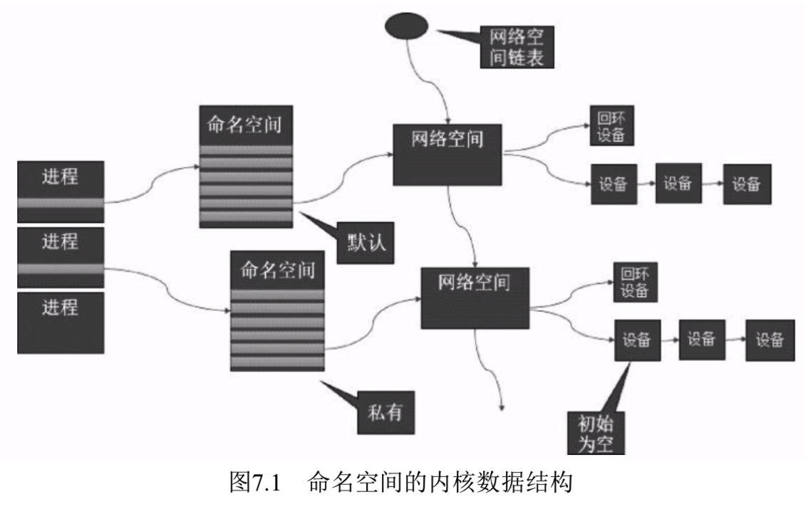
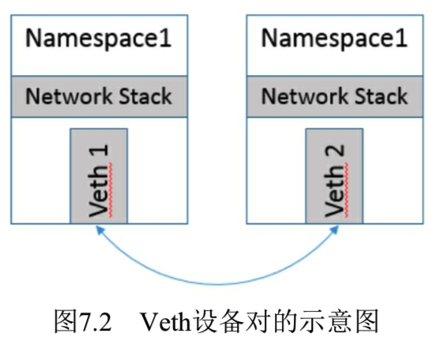
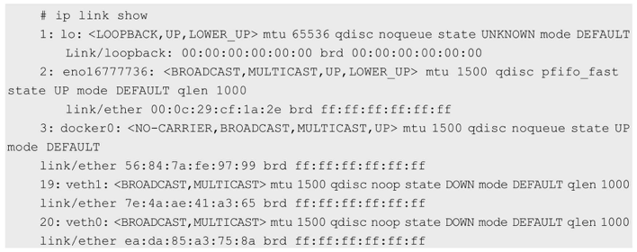
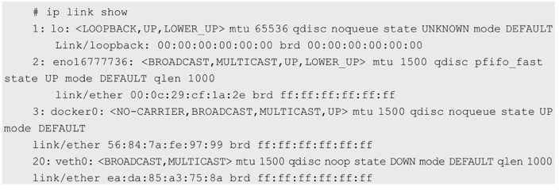
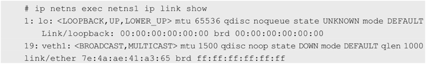
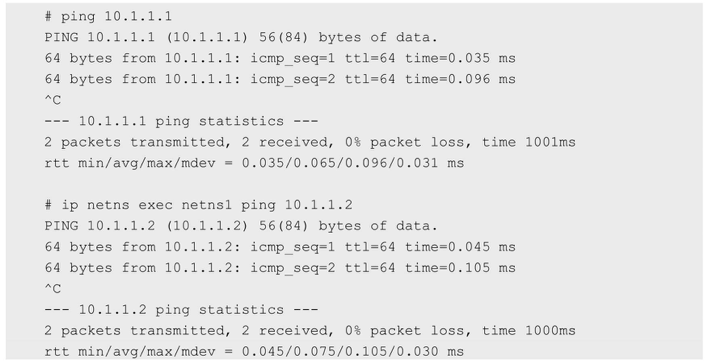
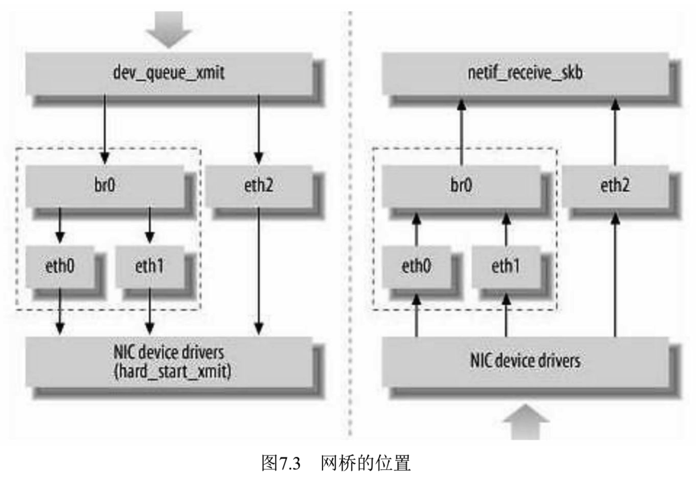
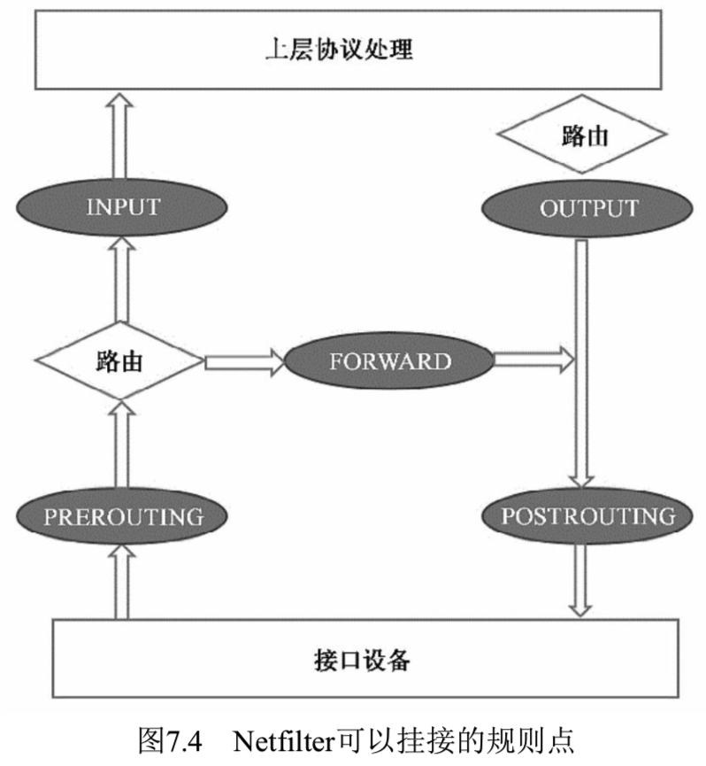
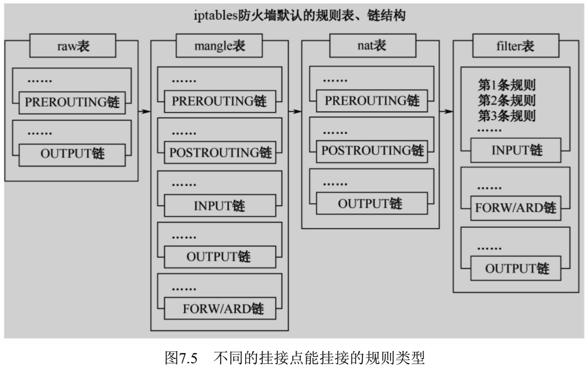

<!-- @import "[TOC]" {cmd="toc" depthFrom=1 depthTo=6 orderedList=false} -->

<!-- code_chunk_output -->

- [1. 网络命令空间](#1-网络命令空间)
  - [1.1. 网络命名空间的实现](#11-网络命名空间的实现)
    - [1.1.1. 全局变量成为Net Namespace变量](#111-全局变量成为net-namespace变量)
    - [1.1.2. 网络设备](#112-网络设备)
    - [1.1.3. 不同网络命名空间的通信](#113-不同网络命名空间的通信)
  - [1.2. 网络命名空间的操作](#12-网络命名空间的操作)
  - [1.3. 网络命名空间的使用技巧](#13-网络命名空间的使用技巧)
- [2. Veth设备对](#2-veth设备对)
  - [2.1. Veth设备对的操作命令](#21-veth设备对的操作命令)
    - [2.1.1. 创建veth设备对](#211-创建veth设备对)
    - [2.1.2. 将设备转到到另外的命令空间](#212-将设备转到到另外的命令空间)
    - [2.1.3. veth设备设置IP并启动](#213-veth设备设置ip并启动)
  - [2.2. Veth设备对如何查看对端](#22-veth设备对如何查看对端)
- [3. 网桥: 二层/三层虚拟网络设备](#3-网桥-二层三层虚拟网络设备)
  - [3.1. Linux网桥的实现](#31-linux网桥的实现)
  - [3.2. 网桥的常用操作命令](#32-网桥的常用操作命令)
- [4. iptables和Netfilter: 挂接点技术](#4-iptables和netfilter-挂接点技术)
  - [4.1. 规则表Table](#41-规则表table)
  - [4.2. 处理规则](#42-处理规则)
  - [4.3. iptables命令](#43-iptables命令)
- [5. 路由](#5-路由)
  - [5.1. 路由表条目以及一般性转发逻辑](#51-路由表条目以及一般性转发逻辑)
  - [5.2. 路由表的创建](#52-路由表的创建)
    - [5.2.1. LOCAL表: 本地地址](#521-local表-本地地址)
    - [5.2.2. MAIN表: 各类网络IP地址的转发](#522-main表-各类网络ip地址的转发)
  - [5.3. 路由表的查看](#53-路由表的查看)

<!-- /code_chunk_output -->

Docker本身的技术依赖于近年来**Linux内核虚拟化技术**的发展, 所以Docker对**Linux内核的特性**有很强的依赖. 

这里将Docker使用到的与Linux网络有关的主要技术进行简要介绍, 这些技术有: **网络命名空间(Network Namespace**)、**Veth设备对**、**网桥**、**ipatables**和**路由**. 

# 1. 网络命令空间

为了支持**网络协议栈的多个实例！！！**, Linux在网络栈中引入了**网络命名空间**, 这些**独立的协议栈！！！** 被隔离到**不同的命名空间！！！** 中. 处于**不同命名空间中的网络栈**是**完全隔离！！！** 的, **彼此之间无法通信！！！**, 就好像两个"平行宇宙". 通过**对网络资源的隔离**, 就能在**一个宿主机**上**虚拟多个不同的网络环境**. 

Docker正是利用了**网络的命名空间特性**, 实现了**不同容器之间**的**网络隔离**. 

在Linux的**网络命名空间**中可以有自己**独立的路由表**及**独立的iptables设置**来提供**包转发**、**NAT**及**IP包过滤**等功能. 

为了隔离出**独立的协议栈**, 需要**纳入命名空间**的元素有**进程**、**套接字**、**网络设备**等. 

* **进程创建的套接字**必须属于**某个命名空间**, **套接字的操作**也必须在**命名空间**中进行. 
* 同样, **网络设备**也必须属于**某个命名空间**. 因为**网络设备**属于**公共资源**, 所以可以通过修改属性实现**在命名空间之间移动**. 当然, 是否允许移动与设备的特征有关. 

让我们稍微深入Linux操作系统内部, 看它是如何实现网络命名空间的, 这也会对理解后面的概念有帮助. 

## 1.1. 网络命名空间的实现

### 1.1.1. 全局变量成为Net Namespace变量

Linux的网络协议栈是十分复杂的, 为了支持**独立的协议栈！！！**, 相关的这些**全局变量！！！** 都必须被**修改**为**协议栈私有！！！**. 

最好的办法就是让**这些全局变量**成为一个**Net Namespace变量！！！** 的**成员**, 然后为**协议栈的函数调用！！！** 加入一个**Namespace参数！！！**. 这就是Linux**实现网络命名空间的核心**. 

同时, 为了保证对**已经开发的应用程序**及**内核代码的兼容性**, 内核代码**隐式**地使用了**命名空间中的变量**. 程序如果**没有对命名空间有特殊需求**, 就不需要编写额外的代码, 网络命名空间对应用程序而言是透明的. 

在**建立了新的网络命名空间**, 并将**某个进程！！！关联到这个网络命名空间**后, 就出现了类似于如图7.1所示的内核数据结构, **所有网络栈变量**都被放入了**网络命名空间的数据结构**中. 



这个**网络命名空间！！！** 是其**进程组私有的！！！**, 和其他进程组不冲突. 

### 1.1.2. 网络设备

在**新生成的私有命名空间！！！** 中**只有回环设备！！！**(名为"**lo"且是停止状态！！！**), 其他设备默认都不存在, 如果我们需要, 则要一一手工建立. **Docker容器**中的**各类网络栈设备**都是Docker Daemon在启动时**自动创建和配置**的. 

**所有的网络设备**(**物理的**或**虚拟接口**、**桥**等在**内核**里都叫作**Net Device**)都**只能属于一个命名空间**. 

* **物理设备**(连接实际硬件的设备)**通常只能关联到root这个命名空间**中. 
* **虚拟的网络设备**(虚拟的以太网接口或者虚拟网口对)则可以被创建并关联到一个给定的命名空间中, 而且可以**在这些命名空间之间移动**. 

### 1.1.3. 不同网络命名空间的通信

前面提到, 由于**网络命名空间**代表的是一个**独立的协议栈**, 所以它们**之间是相互隔离的**, 彼此**无法通信**, 在协议栈内部都看不到对方. 那么有没有办法打破这种限制, 让处于**不同命名空间！！！的网络相互通信**, 甚至**和外部的网络进行通信**呢?答案就是"有, **应用Veth设备对**即可". 

**Veth设备对**的**一个重要作用**就是**打通互相看不到的协议栈之间的壁垒**, 它就像一条管子, 一端连着**这个网络命名空间的协议栈**, 一端连着**另一个网络命名空间的协议栈**. 所以如果想在**两个命名空间之间通信**, 就必须有一个**Veth设备对**. 

后面会介绍如何操作Veth设备对来打通不同命名空间之间的网络. 

## 1.2. 网络命名空间的操作

下面列举网络命名空间的一些操作. 

我们可以使用**Linux iproute2**系列配置工具中的IP命令来操作网络命名空间. 

注意, 这个命令需要由root用户运行. 

创建一个命令空间:

```
ip netns add <name>
```

在命名空间中执行命令: 

```
ip netns exec <name> <command>
```

也可以先通过bash命令进入内部的shell界面, 然后执行各种命令: 

```
ip netns exec <name> bash
```

退出到外面的命名空间时, 请输入"exit". 

## 1.3. 网络命名空间的使用技巧

我们可以在**不同的网络命名空间之间转移设备！！！**, 例如下面会提到的**Veth设备对的转移**. 因为**一个设备只能属于一个命名空间**, 所以转移后在这个命名空间中就看不到这个设备了. 

具体**哪些设备能被转移到不同的命名空间**呢?

在**设备**里面有一个重要的**属性**: `NETIF_F_ETNS_LOCAL`, 如果这个**属性为on**, 就**不能被转移到其他命名空间**中. 

**Veth设备**属于**可以转移的设备**, 而很多其他设备如**lo设备**、**vxlan设备**、**ppp设备**、**bridge设备**等都是**不可以转移的**. 

将无法转移的设备移动到别的命名空间时, 会得到无效参数的错误提示. 

```
# ip link set br0 netns ns1
RTNETLINK answers: Invalid argument
```

如何知道这些设备是否可以转移呢?可以使用ethtool工具查看: 

```
# ethtool -k br0
netns-local: on [fixed]
```

netns\-local的值是on, 说明不可以转移, 否则可以转移. 

# 2. Veth设备对

引入**Veth设备对**是为了在**不同的网络命名空间之间通信**, 利用它可以直接**将两个网络命名空间连接起来**. 

由于要**连接两个网络命名空间**, 所以**Veth设备都是成对出现**的, 很像**一对以太网卡**, 并且中间有一根直连的网线. 既然是一对网卡, 那么我们将**其中一端称为另一端的peer**. 在Veth设备的一端发送数据时, 它会将数据直接发送到另一端, 并**触发另一端的接收操作**. 

**整个Veth的实现**非常简单, 有兴趣的读者可以参考源代码"**drivers/net/veth.c**"的实现. 如图7.2所示是Veth设备对的示意图. 



## 2.1. Veth设备对的操作命令

接下来看看如何创建Veth设备对, 如何连接到不同的命名空间, 并设置它们的地址, 让它们通信. 

### 2.1.1. 创建veth设备对

创建Veth设备对:

```
ip link add veth0 type veth peer name veth1
```

创建后, 可以查看Veth设备对的信息. 

使用`ip link show`命令**查看所有网络接口**: 



有两个设备生成了, 一个是veth0, 它的peer是veth1. 

### 2.1.2. 将设备转到到另外的命令空间

现在这**两个设备**都在**自己的命名空间**中, 那怎么能行呢?好了, 如果将Veth看作有两个头的网线, 那么我们将另一个头甩给另一个命名空间: 

```
ip link set veth1 netns netns1
```

这时可在外面这个命名空间中看两个设备的情况: 



只剩一个veth0设备了, 已经看不到另一个设备了, 另一个设备已经被转移到另一个网络命名空间中了. 

在netns1网络命名空间中可以看到veth1设备了, 符合预期: 

(`ip netns exec netns1 ip link show`)



现在看到的结果是, **两个不同的命名空间**各自有一个**Veth的"网线头**", **各显示为一个Device**(在Docker的实现里面, 它除了**将Veth放入容器内**, 还将它的**名字改成了eth0**, 简直以假乱真, 你以为它是一个本地网卡吗). 

### 2.1.3. veth设备设置IP并启动

现在可以通信了吗?不行, 因为它们还没有任何地址, 我们现在给它们分配IP地址: 

```
# ip netns exec netns1 ip addr add 10.1.1.1/24 dev veth1
# ip addr add 10.1.1.2/24 dev veth0
```

再启动它们: 

```
# ip netns exec netns1 ip link set dev veth1 up
# ip link set dev veth0 up
```

现在两个网络命名空间可以互相通信了: 



至此, 我们就能够理解Veth设备对的原理和用法了. 

在**Docker内部**, Veth设备对也是连通**容器！！！** 与**宿主机！！！** 的主要网络设备, 离开它是不行的. 

## 2.2. Veth设备对如何查看对端

我们在操作Veth设备对时有一些实用技巧, 如下所示. 

一旦将**Veth设备对**的**对端**放入**另一个命名空间**, 在**本命名空间！！！中就看不到它！！！**了. 那么我们**怎么知道这个Veth设备的对端在哪里**呢, 也就是说它到底连接到哪个命名空间呢?可以使用**ethtool工具**来查看(当网络命名空间特别多时, 这可不是一件很容易的事情). 

首先, 在**命名空间netns1**中查询**Veth设备对端接口**在**设备列表**中的**序列号**: 

```
# ip netns exec netns1 ethtool -S veth1
NIC statistics:
    peer_ifindex: 5
```

得知**另一端的接口设备的序列号是5**, 我们再到**命名空间netns2**中查看序列号5代表什么设备: 

```
# ip netns exec netns2 ip link | grep 5
veth0
```

现在就找到序列号为5的设备了, 它是veth0, 它的另一端自然就是命名空间netns1中的veth1了, 因为它们互为peer. 

# 3. 网桥: 二层/三层虚拟网络设备

Linux可以支持**多个不同的网络**, 它们之间能够相互通信, 如何将**这些网络连接起来**并**实现各网络中主机的相互通信**呢?可以用**网桥**. 

网桥是一个**二层！！！的虚拟网络设备(在数据链路层实现**), 把**若干个网络接口！！！"连接"起来**, 以使得**网络接口之间**的**报文**能够**互相转发**. **网桥**能够**解析收发的报文**, **读取目标MAC地址的信息**, 和**自己记录的MAC表**结合, 来决策**报文的转发目标网络接口**. 

为了实现这些功能, 网桥会学习**源MAC地址**(**二层网桥转发的依据就是MAC地址！！！**). 

在**转发报文**时, **网桥**只需要向**特定的网口**进行**转发**, 来避免不必要的网络交互. 如果它遇到一个自己**从未学习到的地址**, 就**无法**知道这个报文应该**向哪个网络接口转发**, 就将报文**广播给所有的网络接口**(报文来源的网络接口除外). 

在实际的网络中, 网络拓扑不可能永久不变. 设备如果被移动到另一个端口上, 却没有发送任何数据, **网桥设备**就**无法感知到这个变化**, 网桥还是向**原来的端口转发数据包**, 在这种情况下**数据就会丢失**. 所以网桥还要对学习到的**MAC地址表加上超时时间(默认为5min**). 如果网桥收到了对应端口MAC地址回发的包, 则重置超时时间, 否则过了超时时间后, 就认为设备已经不在那个端口上了, 它就会**重新广播发送**. 

在Linux的**内部网络栈**里实现的**网桥设备**, 作用和上面的描述相同. 过去Linux主机一般都只有一个网卡, 现在多网卡的机器越来越多, 而且有很多虚拟的设备存在, 所以Linux的网桥提供了在这些设备之间互相转发数据的二层设备. 

**Linux内核**支持**网口的桥接**(目前**只支持以太网接口！！！**). 但是**与单纯的交换机不同**, 交换机只是一个**二层设备！！！**, 对于接收到的**报文**, 要么**转发！！！**, 要么**丢弃**. 运行着Linux内核的机器本身就是一台主机, 有可能是**网络报文的目的地**, 其收到的报文除了转发和丢弃, 还可能被送到**网络协议栈的上层(网络层**), 从而**被自己**(这台主机**本身的协议栈！！！** )消化, 所以我们既可以把**网桥**看作一个**二层设备**, 也可以把它看作一个**三层设备**. 

## 3.1. Linux网桥的实现

**Linux内核**是通过一个**虚拟的网桥设备(Net Device**)来**实现桥接**的. 

**这个虚拟设备**可以**绑定若干个以太网接口设备**, 从而将它们**桥接起来**. 如图7.3所示, 这种**Net Device网桥**和普通的设备不同, 最明显的一个特性是它**还可以有一个IP地址！！！**. 



如图7.3所示, **网桥设备br0**绑定了**eth0**和**eth1**. 

对于**网络协议栈的上层！！！**来说, **只看得到br0**就行. 因为**桥接！！！** 是在**数据链路层**实现的, **上层不需要关心桥接的细节**, 所以**协议栈上层！！！** 需要发送的**报文被送到br0！！！**, **网桥设备的处理代码**判断报文该被转发到**eth0还是eth1**, 或者两者皆转发; 反过来, 从eth0或从eth1接收到的报文被提交给**网桥的处理代码**, 在这里会判断报文应该被转发、丢弃还是被提交到**协议栈上层**. 

而有时**eth0**、**eth1**也可能会作为**报文的源地址！！！** 或**目的地址！！！**, 直接参与报文的发送与接收, 从而**绕过网桥！！！**. 

## 3.2. 网桥的常用操作命令

**Docker自动完成**了对**网桥的创建和维护**. 

为了进一步理解网桥, 下面举几个常用的网桥操作例子, 对网桥进行手工操作: 

新增一个网桥设备: 

```
# brctl addbr XXXX
```

之后可以**为网桥增加网口**, 在Linux中, **一个网口！！！** 其实就是**一个物理网卡！！！**. 将**物理网卡**和**网桥连接**起来: 

```
# brctl addif XXXX ethx
```

**网桥的物理网卡！！！** 作为一个**网口！！！**, 由于在**链路层工作！！！**, 就**不再需要IP地址！！！** 了, 这样上面的IP地址自然失效: 

```
# ifconfig ethx 0.0.0.0
```

给网桥配置一个IP地址:

```
# ifconfig brxxx xxx.xxx.xxx.xxx
```

这样**网桥**就有了**一个IP地址**, 而**连接到上面的网卡**就是一个**纯链路层设备**了. 

# 4. iptables和Netfilter: 挂接点技术

我们知道, Linux网络协议栈非常高效, 同时比较复杂. 如果我们希望在**数据的处理过程中**对关心的**数据进行一些操作**, 则该怎么做呢?Linux提供了一套机制来为用户实现**自定义的数据包处理过程！！！**. 

在**Linux网络协议栈！！！** 中有**一组回调函数挂接点！！！**, 通过这些挂接点挂接的**钩子函数**可以在Linux网络栈处理数据包的过程中**对数据包进行一些操作**, 例如**过滤**、**修改**、**丢弃**等. **整个挂接点技术！！！** 叫作**Netfilter**和**iptables**. 

* **Netfilter**负责在**内核！！！** 中**执行各种挂接的规则！！！**, 运行在**内核模式！！！** 中; 

* 而iptables是在**用户模式**下**运行的进程**, 负责**协助和维护内核中Netfilter的各种规则表**. 

二者互相配合来实现**整个Linux网络协议栈**中灵活的**数据包处理机制**. 

**Netfilter**可以挂接的**规则点有5个**, 如图7.4中的深色椭圆所示. 



图中"接口设备"工作在链路层吗? 没有网络层功能?

## 4.1. 规则表Table

这些**挂接点**能挂接的**规则**也分**不同的类型**(也就是**规则表Table**), 我们可以在**不同类型的Table**中加入我们的规则. 

目前**主要支持的Table类型**有: **RAW**、**MANGLE**、**NAT**和**FILTER**. 

上述4个Table(规则链)的**优先级**是**RAW最高**, **FILTER最低**. 

在实际应用中, **不同的挂接点！！！** 需要的**规则类型通常不同！！！**. 

例如, 在**Input的挂接点**上明显**不需要FILTER过滤规则**, 因为**根据目标地址**已经选择好**本机的上层协议栈**了, 所以无须再挂接FILTER过滤规则. 

目前Linux系统支持的不同挂接点能挂接的规则类型如图7.5所示. 



当Linux协议栈的数据处理**运行到挂接点！！！** 时, 它会**依次调用挂接点上所有的挂钩函数**, 直到**数据包的处理**结果是**明确地接受或者拒绝**. 

## 4.2. 处理规则

**每个规则**的特性都分为以下几部分. 

* **表类型**(准备干什么事情). 
* **什么挂接点**(什么时候起作用). 
* **匹配的参数**是什么(针对**什么样的数据包**). 
* 匹配后有**什么动作**(**匹配后具体的操作**是什么). 

前面已经介绍了表类型和挂接点, 接下来看看匹配的参数和匹配后的动作. 

(1)匹配的参数

匹配的参数用于对**数据包**或者**TCP数据连接的状态**进行匹配. 当有多个条件存在时, 它们一起发挥作用, 来达到只针对某部分数据进行修改的目的. 常见的匹配参数如下. 

* 流入、流出的网络接口. 
* 来源、目的地址. 
* 协议类型. 
* 来源、目的端口. 

(2)匹配后的动作

一旦有数据匹配, 就会执行相应的动作. 动作类型既可以是标准的预定义的几个动作, 也可以是自定义的模块注册的动作, 或者是一个新的规则链, 以便更好地组织一组动作. 

## 4.3. iptables命令

iptables命令用于协助用户**维护各种规则**. 我们在使用Kubernetes、Docker的过程中, 通常都会去查看相关的Netfilter配置. 这里只介绍如何查看规则表, 详细的介绍请参照Linux的iptables帮助文档. 

查看系统中已有规则的方法如下. 

* iptables\-save: 按照命令的方式打印iptables的内容. 
* iptables \-vnL: 以另一种格式显示Netfilter表的内容. 

# 5. 路由

**Linux系统**包含一个**完整的路由功能！！！**. 

当**IP层！！！** 在**处理数据！！！发送或者转发**时, 会使用**路由表！！！** 来决定**发往哪里**. 

在通常情况下, 如果**主机与目的主机直接相连**, 那么主机可以**直接发送IP报文**到目的主机, 这个过程比较简单. 例如, 通过**点对点的链接或网络共享**. 

如果主机与目的主机**没有直接相连**, 那么主机会将**IP报文**发送给**默认的路由器**, 然后由**路由器！！！** 来决定往哪里发送IP报文. 

**路由功能！！！** 由**IP层！！！** 维护的一张**路由表**来实现. 

当**主机**收到**数据报文**时, 它用**此表**来决策接下来应该做什么操作. 当从**网络侧**接收到**数据报文**时, **IP层处理逻辑！！！** 首先会检查**报文的IP地址**是否与**主机自身的地址相同**. 

* 如果**数据报文中的IP地址**是**主机自身的地址**, 那么报文将被发送到**传输层！！！相应的协议**中. 
* 如果报文中的IP地址**不是主机自身的地址**, 并且主机配置了**路由功能**, 那么**报文将被转发**, 否则, 报文**将被丢弃**. 转发的逻辑见下面.

## 5.1. 路由表条目以及一般性转发逻辑

路由表中的**数据**一般是以**条目形式存在**的. 一个典型的**路由表条目**通常包含以下主要的条目项. 

(1)**目的IP地址**: 此字段表示目标的IP地址. 这个IP地址可以是**某主机的地址**, 也可以是一个**网络地址**. 如果这个条目包含的是一个**主机地址**, 那么它的**主机ID将被标记为非零**; 如果这个条目包含的是一个网络地址, 那么它的主机ID将被标记为零. 

(2)**下一个路由器的IP地址！！！**: 这里采用"下一个"的说法, 是因为下一个路由器并不总是最终的目的路由器, 它很可能是一个中间路由器. 条目给出的下一个路由器的地址用来转发在相应接口接收到的IP数据报文. 

(3)**标志**: 这个字段提供了另一组重要信息, 例如, 目的IP地址是一个主机地址还是一个网络地址. 此外, 从标志中可以得知下一个路由器是一个真实路由器还是一个直接相连的接口. 

(4)**网络接口规范**: 为一些数据报文的网络接口规范, 该规范将与报文一起被转发. 

在通过**路由表转发**时, 如果任何条目的**第1个字段**完全匹配**目的IP地址**(主机)或**部分匹配条目的IP地址**(网络), 它将指示**下一个路由器！！！的IP地址**. 这是一个重要的信息, 因为这些信息直接告诉主机(具备路由功能的)数据包应该被**转发到哪个路由器！！！**. 而条目中的所有其他字段将提供更多的辅助信息来为路由转发做决定. 

如果**没有**找到一个**完全匹配的IP**, 就接着搜索相匹配的网络ID. 如果找到, 那么该数据报文会被转发到指定的路由器上. 可以看出, 网络上的所有主机都通过这个路由表中的单个(这个)条目进行管理. 

如果上述两个条件都不匹配, 那么该数据报文将被转发到一个**默认的路由器**上. 

如果上述步骤都失败, **默认路由器也不存在**, 那么该**数据报文最终无法被转发**. **任何无法投递的数据报文**都将产生一个**ICMP主机不可达**或**ICMP网络不可达**的错误, 并将此错误返回给生成此数据报文的应用程序.

## 5.2. 路由表的创建

Linux的路由表**至少包括两个表！！！**(当启用**策略路由**时, 还会有其他表): 一个是**LOCAL**, 另一个是**MAIN**. 

### 5.2.1. LOCAL表: 本地地址

在**LOCAL表**中会包含**所有的本地设备地址！！！**. LOCAL路由表是在**配置网络设备地址时自动创建！！！** 的. 

LOCAL表用于供**Linux协议栈**识别**本地地址**, 以及进行**本地！！！各个不同网络接口之间的数据转发**. 

可以通过下面的命令查看LOCAL表的内容, `ip route show table local type local`: 

```
# ip route show table local type local
local 127.0.0.0/8 dev lo proto kernel scope host src 127.0.0.1
local 127.0.0.1 dev lo proto kernel scope host src 127.0.0.1
local 192.168.1.128 dev ens33 proto kernel scope host src 192.168.1.128
local 172.17.42.1 dev docker proto kernel scope host src 172.17.42.1
```

### 5.2.2. MAIN表: 各类网络IP地址的转发

MAIN表用于**各类网络IP地址的转发**. 它的建立既可以使用**静态配置生成**, 也可以使用**动态路由发现协议！！！生成**. 

动态路由发现协议一般使用**组播功能**来通过**发送路由发现数据**, **动态地交换**和**获取网络的路由信息**, 并更新到路由表中. 

Linux下支持**路由发现协议**的开源软件有许多, 常用的有**Quagga**、**Zebra**等. 7.8节会介绍如何使用Quagga动态容器路由发现的机制来实现Kubernetes的网络组网. 

## 5.3. 路由表的查看

可以使用ip route list命令查看当前的路由表: 

```
# ip route list
192.168.6.0/24 dev eno16777736 proto kernel scope link src 192.168.6.140 metric 1
```

在上面的例子中**只有一个子网的路由**, **源地址**是**192.168.6.140**(**本机**), **目标地址**在**192.168.6.0/24网段**的数据包都将通过**eno16777736接口**发送出去. 

netstat \-rn另一个查看路由表的工具

```
# netstat -rn
Kernel IP routing table
Destination     Gateway         Genmask         Flags   MSS Window  irtt Iface
0.0.0.0         192.168.6.2     0.0.0.0         UG        0 0          0 eth0
192.168.6.0     0.0.0.0         255.255.255.0   U         0 0          0 eth0
```

在它显示的信息中, 

* 如果**标志是U**, 则说明是**可达路由**; 
* 如果**标志是G**, 则说明**这个网络接口连接的是网关**; 
* 否则说明**这个接口直连主机**. 