<!-- @import "[TOC]" {cmd="toc" depthFrom=1 depthTo=6 orderedList=false} -->

<!-- code_chunk_output -->

- [1. Docker支持的4类网络模式](#1-docker支持的4类网络模式)
  - [1.1. Docker守护进程](#11-docker守护进程)
  - [1.2. Docker容器创建的网络](#12-docker容器创建的网络)
- [2. Bridge模式](#2-bridge模式)
  - [2.1. 虚拟网桥docker0](#21-虚拟网桥docker0)
  - [2.2. 容器的veth设备对](#22-容器的veth设备对)
  - [2.3. docker的默认桥接网络模型](#23-docker的默认桥接网络模型)
  - [2.4. 容器跨节点通信](#24-容器跨节点通信)
- [3. 查看Docker启动后的系统情况(未启动容器)](#3-查看docker启动后的系统情况未启动容器)
- [4. 查看容器启动后的情况(容器无端口映射)](#4-查看容器启动后的情况容器无端口映射)
- [5. 查看容器启动后的情况(容器有端口映射)](#5-查看容器启动后的情况容器有端口映射)
- [6. Docker的网络局限](#6-docker的网络局限)
  - [6.1. 跨主机容器通信](#61-跨主机容器通信)
  - [6.2. Docker虚拟化网络解决方案: Libnetwork](#62-docker虚拟化网络解决方案-libnetwork)

<!-- /code_chunk_output -->

# 1. Docker支持的4类网络模式

标准的Docker支持以下4类网络模式. 

* host模式: 使用\-\-net=host指定. 
* container模式: 使用\-\-net=container:NAME\_or\_ID指定. 
* none模式: 使用\-\-net=none指定. 
* bridge模式: 使用\-\-net=bridge指定, 为**默认设置**. 

**Bridge模型**借助于**虚拟网桥设备**为容器建立网络连接, 

**Host模型**则设定容器**直接共享使用节点主机的网络名称空间**, 

而**Container模型**则是指**多个容器共享同一个网络名称空间**, 从而彼此之间能够以本地通信的方式建立连接. 

四种网络模型可以使用在很多地方, 比如Docker守护进程启动后的初始化配置、Docker容器启动的网络配置.

## 1.1. Docker守护进程

Docker守护进程首次启动时, 它会在当前节点上创建一个名为**docker0**的**桥设备**, 并默认配置其使用172.17.0.0/16网络, 该网络是**Bridge模型**的**一种实现**, 也是创建Docker容器时默认使用的网络模型. 

## 1.2. Docker容器创建的网络

图11-1　Docker容器网络:

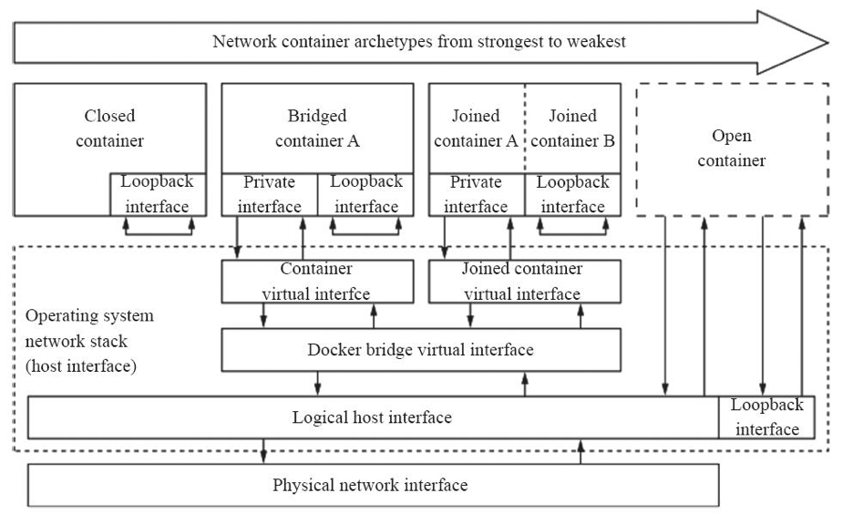

如图11-1所示, 创建Docker容器时, 默认有四种网络可供选择使用, 从而表现出了四种不同类型的容器, 具体如下. 

* **Closed container(封闭式容器**): 此类容器使用"None"网络, 它们没有对外通信的网络接口, 而是仅具有I/O接口, 通常仅用于**不需要网络**的**后端作业处理场景**. 

* **Bridged container(桥接式容器**): 此类容器使用"Bridge"模型的网络, 对于每个网络接口, 容器引擎都会为每个容器创建**一对(两个)虚拟以太网设备**, 一个配置为容器的接口设备, 另一个则在节点主机上接入指定的虚拟网桥设备(默认为docker0). 

* Joined container(联盟式容器): 此类容器**共享**使用**某个已存在的容器的网络名称空间**, 即共享并使用**指定的容器的网络及其接口**. 

* Open container(开放式容器): 此类容器使用"**Host**"模型的网络, 它们**共享使用Docker主机的网络及其接口**. 

# 2. Bridge模式

在**Kubernetes管理模式**下通常**只会使用bridge模式**, 所以本节只介绍在bridge模式下Docker是如何支持网络的. 

## 2.1. 虚拟网桥docker0

在**bridge模式**下, Docker Daemon**第1次启动**时会**创建一个虚拟的网桥！！！**, **默认的名称**是**docker0**, 然后按照**RPC1918的模型**在**私有网络空间！！！** 中给**这个网桥**分配一个**子网**. 

## 2.2. 容器的veth设备对

针对由**Docker**创建的**每一个容器**, 都会创建一个**虚拟的以太网设备(Veth设备对**), 其中**一端关联到网桥**上, 另一端使用**Linux的网络命名空间技术！！！**, 映射到**容器内的eth0设备**, 然后从**网桥的地址段！！！** 内给eth0接口分配一个IP地址. 

## 2.3. docker的默认桥接网络模型

如图7.6所示就是Docker的**默认桥接网络模型**. 

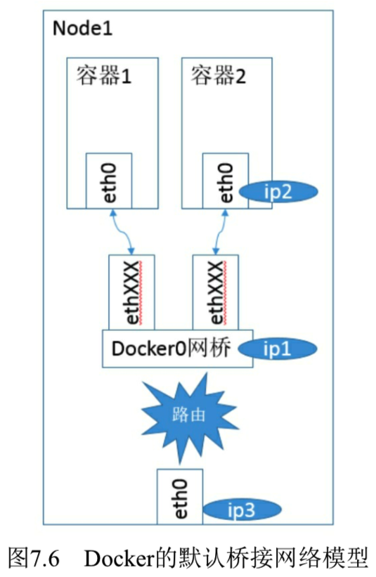

其中

* **ip1**是**网桥的IP地址**, Docker Daemon会在**几个备选地址段**里给它选一个地址, 通常是以**172开头**的一个地址. 这个地址和主机的IP地址是**不重叠**的. 

* **ip2**是Docker在**启动容器**时, 在这个地址段选择的一个没有使用的IP地址分配给容器. 相应的**MAC地址**也**根据这个IP地址**, 在**02:42:ac:11:00:00**和**02:42:ac:11:ff:ff**的范围内生成, 这样做可以确保**不会有ARP冲突**. 启动后, Docker还将**Veth对**的名称映射到**eth0网络接口**. 

* **ip3**就是**主机的网卡地址**. 

在一般情况下, ip1、ip2和ip3是**不同的IP段**, 所以在默认不做任何特殊配置的情况下, 在**外部是看不到ip1和ip2的！！！**. 

这样做的结果就是, 在**同一台机器内**的**容器之间**可以**相互通信**, **不同主机**上的**容器不能相互通信**, 实际上它们甚至有可能在相同的网络地址范围内(不同主机上的docker0的地址段可能是一样的). 

## 2.4. 容器跨节点通信

为了让它们**跨节点互相通信**, 就必须在**主机的地址**上**分配端口**, 然后通过这个**端口路由**或**代理到容器**上. 这种做法显然意味着一定要在**容器之间**小心谨慎地协调好**端口的分配**, 或者使用**动态端口的分配技术**. 

在不同应用之间协调好端口分配是十分困难的事情, 特别是集群水平扩展时. 

而**动态的端口分配**也会带来高度复杂性, 例如: 每个应用程序都**只能将端口看作一个符号**(因为是动态分配的, 所以**无法提前设置**). 

而且API Server要在分配完后, 将动态端口插入配置的合适位置, 服务也必须能互相找到对方等. 这些都是Docker的网络模型在跨主机访问时面临的问题. 

# 3. 查看Docker启动后的系统情况(未启动容器)

**Docker网络**在**bridge模式**下Docker Daemon启动时**创建docker0网桥**, 并在网桥使用的网段为容器分配IP. 让我们看看实际的操作. 

在**刚刚启动Docker Daemon**并且**还没有启动任何容器**时, 网络协议栈的配置情况如下: 

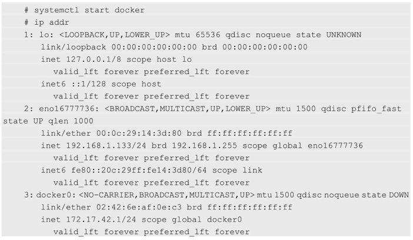

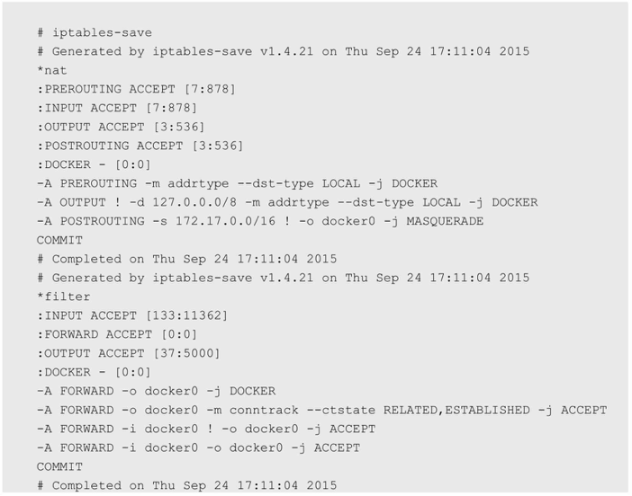

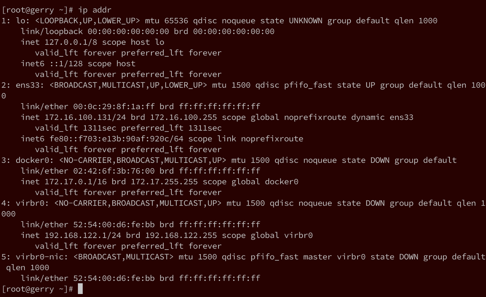

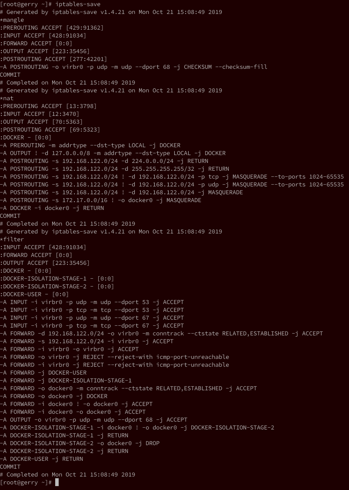

```
# ip addr
1: lo: <LOOPBACK,UP,LOWER_UP> mtu 65536 qdisc noqueue state UNKNOWN group default qlen 1000
    link/loopback 00:00:00:00:00:00 brd 00:00:00:00:00:00
    inet 127.0.0.1/8 scope host lo
       valid_lft forever preferred_lft forever
    inet6 ::1/128 scope host
       valid_lft forever preferred_lft forever
2: ens33: <BROADCAST,MULTICAST,UP,LOWER_UP> mtu 1500 qdisc pfifo_fast state UP group default qlen 1000
    link/ether 00:0c:29:8f:1a:ff brd ff:ff:ff:ff:ff:ff
    inet 172.16.100.131/24 brd 172.16.100.255 scope global noprefixroute dynamic ens33
       valid_lft 1709sec preferred_lft 1709sec
    inet6 fe80::f703:e13b:90af:920c/64 scope link noprefixroute
       valid_lft forever preferred_lft forever
3: docker0: <NO-CARRIER,BROADCAST,MULTICAST,UP> mtu 1500 qdisc noqueue state DOWN group default
    link/ether 02:42:6f:3b:76:00 brd ff:ff:ff:ff:ff:ff
    inet 172.17.0.1/16 brd 172.17.255.255 scope global docker0
       valid_lft forever preferred_lft forever
4: virbr0: <NO-CARRIER,BROADCAST,MULTICAST,UP> mtu 1500 qdisc noqueue state DOWN group default qlen 1000
    link/ether 52:54:00:d6:fe:bb brd ff:ff:ff:ff:ff:ff
    inet 192.168.122.1/24 brd 192.168.122.255 scope global virbr0
       valid_lft forever preferred_lft forever
5: virbr0-nic: <BROADCAST,MULTICAST> mtu 1500 qdisc pfifo_fast master virbr0 state DOWN group default qlen 1000
    link/ether 52:54:00:d6:fe:bb brd ff:ff:ff:ff:ff:ff

# iptables-save
# Generated by iptables-save v1.4.21 on Mon Oct 21 15:08:49 2019
*mangle
:PREROUTING ACCEPT [429:91362]
:INPUT ACCEPT [428:91034]
:FORWARD ACCEPT [0:0]
:OUTPUT ACCEPT [223:35456]
:POSTROUTING ACCEPT [277:42201]
-A POSTROUTING -o virbr0 -p udp -m udp --dport 68 -j CHECKSUM --checksum-fill
COMMIT
# Completed on Mon Oct 21 15:08:49 2019
# Generated by iptables-save v1.4.21 on Mon Oct 21 15:08:49 2019
*nat
:PREROUTING ACCEPT [13:3798]
:INPUT ACCEPT [12:3470]
:OUTPUT ACCEPT [70:5363]
:POSTROUTING ACCEPT [69:5323]
:DOCKER - [0:0]
-A PREROUTING -m addrtype --dst-type LOCAL -j DOCKER
-A OUTPUT ! -d 127.0.0.0/8 -m addrtype --dst-type LOCAL -j DOCKER
-A POSTROUTING -s 192.168.122.0/24 -d 224.0.0.0/24 -j RETURN
-A POSTROUTING -s 192.168.122.0/24 -d 255.255.255.255/32 -j RETURN
-A POSTROUTING -s 192.168.122.0/24 ! -d 192.168.122.0/24 -p tcp -j MASQUERADE --to-ports 1024-65535
-A POSTROUTING -s 192.168.122.0/24 ! -d 192.168.122.0/24 -p udp -j MASQUERADE --to-ports 1024-65535
-A POSTROUTING -s 192.168.122.0/24 ! -d 192.168.122.0/24 -j MASQUERADE
-A POSTROUTING -s 172.17.0.0/16 ! -o docker0 -j MASQUERADE
-A DOCKER -i docker0 -j RETURN
COMMIT
# Completed on Mon Oct 21 15:08:49 2019
# Generated by iptables-save v1.4.21 on Mon Oct 21 15:08:49 2019
*filter
:INPUT ACCEPT [428:91034]
:FORWARD ACCEPT [0:0]
:OUTPUT ACCEPT [223:35456]
:DOCKER - [0:0]
:DOCKER-ISOLATION-STAGE-1 - [0:0]
:DOCKER-ISOLATION-STAGE-2 - [0:0]
:DOCKER-USER - [0:0]
-A INPUT -i virbr0 -p udp -m udp --dport 53 -j ACCEPT
-A INPUT -i virbr0 -p tcp -m tcp --dport 53 -j ACCEPT
-A INPUT -i virbr0 -p udp -m udp --dport 67 -j ACCEPT
-A INPUT -i virbr0 -p tcp -m tcp --dport 67 -j ACCEPT
-A FORWARD -d 192.168.122.0/24 -o virbr0 -m conntrack --ctstate RELATED,ESTABLISHED -j ACCEPT
-A FORWARD -s 192.168.122.0/24 -i virbr0 -j ACCEPT
-A FORWARD -i virbr0 -o virbr0 -j ACCEPT
-A FORWARD -o virbr0 -j REJECT --reject-with icmp-port-unreachable
-A FORWARD -i virbr0 -j REJECT --reject-with icmp-port-unreachable
-A FORWARD -j DOCKER-USER
-A FORWARD -j DOCKER-ISOLATION-STAGE-1
-A FORWARD -o docker0 -m conntrack --ctstate RELATED,ESTABLISHED -j ACCEPT
-A FORWARD -o docker0 -j DOCKER
-A FORWARD -i docker0 ! -o docker0 -j ACCEPT
-A FORWARD -i docker0 -o docker0 -j ACCEPT
-A OUTPUT -o virbr0 -p udp -m udp --dport 68 -j ACCEPT
-A DOCKER-ISOLATION-STAGE-1 -i docker0 ! -o docker0 -j DOCKER-ISOLATION-STAGE-2
-A DOCKER-ISOLATION-STAGE-1 -j RETURN
-A DOCKER-ISOLATION-STAGE-2 -o docker0 -j DROP
-A DOCKER-ISOLATION-STAGE-2 -j RETURN
-A DOCKER-USER -j RETURN
COMMIT
# Completed on Mon Oct 21 15:08:49 2019
```

可以看到, Docker创建了**docker0网桥**, 并添加了**iptables规则**. 

**docker0网桥**和**iptables规则**都处于**root命名空间**中. 

通过解读这些规则, 我们发现, 在还**没有启动任何容器**时, 如果**启动了D1ocker Daemon**, 那么它已经做好了**通信准备**. 对这些规则的说明如下. 

(1)在**NAT表**中有**3条记录**, **前两条匹配生效**后, 都会继续执行**DOCKER链**, 而此时DOCKER链为空, 所以前两条只是做了一个框架, 并没有实际效果. 

(2)**NAT表**第3条的含义是, 若**本地发出的数据包不是发往docker0**的, 即是发往**主机之外的设备**的, 则都需要进行**动态地址修改(MASQUERADE！！！**), 将**源地址**从**容器的地址(172段**)修改为**宿主机网卡的IP地址**, 之后就可以发送给外面的网络了. 

(3)在**FILTER表**中, 第1条也是一个框架, 因为后继的DOCKER链是空的. 

(4)在FILTER表中, 第3条是说, docker0发出的包, 如果需要Forward到非docker0的本地IP地址的设备, 则是允许的. 这样, docker0设备的包就可以根据路由规则中转到宿主机的网卡设备, 从而访问外面的网络. 

(5)FILTER表中, 第4条是说, docker0的包还可以被中转给docker0本身, 即连接在docker0网桥上的不同容器之间的通信也是允许的. 

(6)FILTER表中, 第2条是说, 如果接收到的数据包属于以前已经建立好的连接, 那么允许直接通过. 这样接收到的数据包自然又走回docker0, 并中转到相应的容器. 

除了这些Netfilter的设置, Linux的ip\_forward功能也被Docker Daemon打开了: 

```
# cat /proc/sys/net/ipv4/ip_forward
1
```

另外, 我们可以看到刚刚启动Docker后的Route表, **和启动前没有什么不同**: 

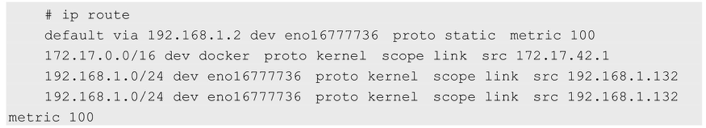

# 4. 查看容器启动后的情况(容器无端口映射)

刚才查看了Docker服务启动后的网络情况. 现在**启动一个Registry容器**(不使用任何端口镜像参数), 看一下网络堆栈部分相关的变化: 

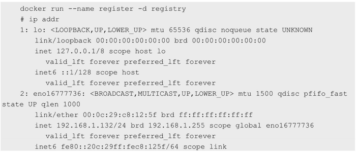

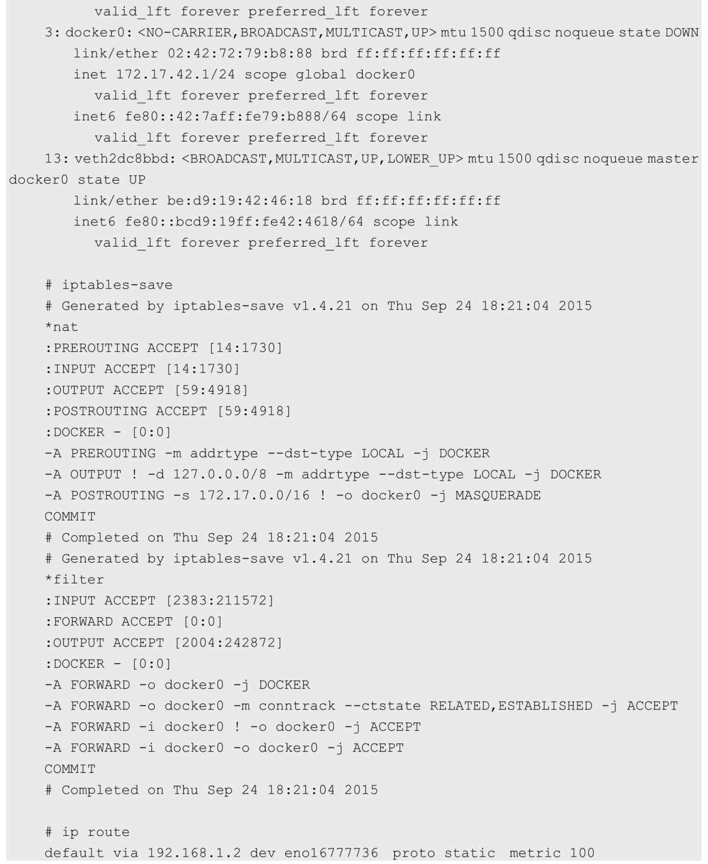

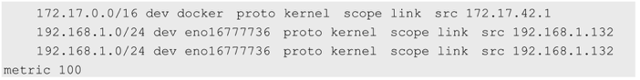

可以看到如下情况. 

(1)宿主机器上的**Netfilter**和**路由表**都**没有变化**, 说明在**不进行端口映射**时, **Docker的默认网络**是没有特殊处理的. 相关的**NAT**和**FILTER**这两个**Netfilter链**还是空的. 

(2)宿主机上的Veth对已经建立, 并连接到容器内. 

我们再次进入刚刚启动的容器内, 看看网络栈是什么情况. 容器内部的IP地址和路由如下: 

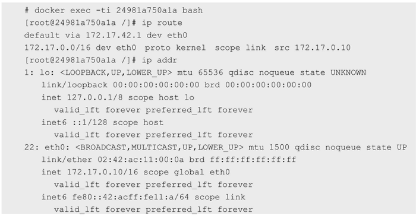

可以看到, 默认停止的回环设备lo已经被启动, 外面宿主机连接进来的Veth设备也被命名成了eth0, 并且已经配置了地址172.17.0.10. 

路由信息表包含一条到**docker0的子网路由**和一条**到docker0的默认路由**. 

# 5. 查看容器启动后的情况(容器有端口映射)

下面用带端口映射的命令启动registry: 

```
docker run --name register -d -p 1180:5000 registry
```

在启动后查看iptables的变化: 

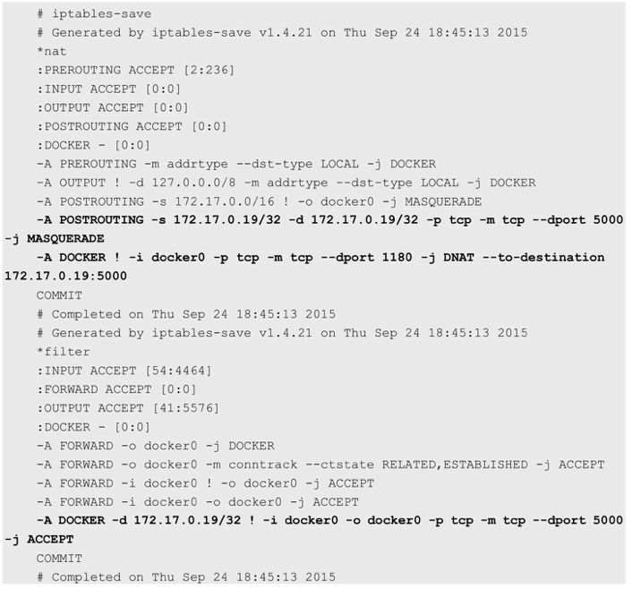

从**新增的规则**可以看出, **Docker服务**在**NAT**和**FILTER两个表**内添加的**两个DOCKER子链**都是给**端口映射**用的. 

在本例中我们需要把**外面宿主机**的**1180端口**映射到**容器**的**5000端口**. 通过前面的分析我们知道, 无论是**宿主机接收到**的还是**宿主机本地协议栈发出**的, **目标地址**是**本地IP地址**的包都会经过**NAT表中的DOCKER子链**. Docker为**每一个端口映射**都在**这个链**上增加了到**实际容器目标地址和目标端口的转换**. 

经过这个DNAT的规则修改后的IP包, 会重新经过路由模块的判断进行转发. 由于目标地址和端口已经是容器的地址和端口, 所以数据自然就被转发到docker0上, 从而被转发到对应的容器内部. 

当然在Forward时, 也需要在DOCKER子链中添加一条规则, 如果目标端口和地址是指定容器的数据, 则允许通过. 

在Docker按照端口映射的方式启动容器时, **主要的不同**就是上述**iptables部分**. 而**容器内部**的**路由和网络设备**, 都和不做端口映射时一样, 没有任何变化. 

# 6. Docker的网络局限

## 6.1. 跨主机容器通信

根据\<Docker容器创建的网络>内容以及对bridge详解, 四种网络模型实现的容器间通信仅描述了**同一节点**上的**容器间通信**的可用方案, 这应该也是**Docker设计者**早期最为关注的容器通信目标. 

然而, 在**生产环境中使用容器技术**时, **跨节点的容器间通信**反倒更为常见, 可根据**网络类型**将其实现方式简单划分为如下几种. 

* 为**各Docker节点**创建**物理！！！网络桥接接口**, 设定**各节点上的容器**使用此桥设备从而**直接暴露于物理网络**中. 
* 配置**各节点上的容器**直接**共享**使用**其节点！！！的网络名称空间**. 
* 将容器接入**指定的桥设备**, 如docker0, 并设置其**借助NAT机制**进行通信. 

第三种方案是较为流行且默认的解决方案. 不过, 此种方案的**IPAM(IP Address Management**)是基于**容器主机本地！！！范围进行**的, **每个节点上的容器**都将从**同一个网络172.17.0.0/16(docker0的**)中获取**IP地址**, 这就意味着**不同Docker主机**上的容器可能会**使用相同的地址**, 因此它们也就**无法直接通信**. 

解决此问题的通行方式是为NAT. **所有接入到此桥设备**上的**容器**均会**被NAT隐藏**, 它们**发往Docker主机外部**的所有流量都会在执行过**源地址转换**后发出, 并且**默认**是**无法直接接收节点之外的其他主机**发来的请求的. 若要接入**Docker主机外部的流量**, 则需要事先通过**目标地址转换**甚至**额外的端口转换**将其暴露于外部网络中, 如图11-2所示. 

图11-2　跨节点容器间的通信示例图:

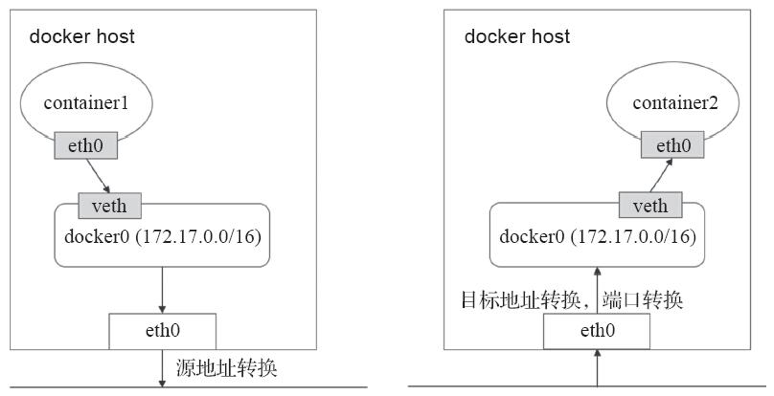

故此, **传统的解决方案**中, **多节点**上的**Docker容器间通信**依赖于**NAT机制转发实现**. 这种解决方案在**网络规模庞大**时将变得极为复杂、对系统资源的消耗较大且转发效率低下. 此外, **docker host的端口**也是一种稀缺资源, 静态分配和映射极易导致冲突, 而动态分配又很容易导致模型的进一步复杂化. 

事实上, Docker网络也可借助于**第三方解决方案**来规避NAT通信模型导致的复杂化问题, 后来还发布了**CNM(Container Network Model)规范**, 现在已经被Cisco Contiv、Kuryr、Open Virtual Networking(OVN)、Project Calico、VMware或Weave这些公司和项目所采纳. 不过, 这种模型被采用时, 也就属于了**容器编排的范畴**. 

## 6.2. Docker虚拟化网络解决方案: Libnetwork

我们从Docker对Linux网络协议栈的操作可以看到, **Docker**一开始**没有考虑**到**多主机互联**的网络解决方案. 

Docker一直以来的理念都是"简单为美", 几乎所有尝试Docker的人都被它"用法简单, 功能强大"的特性所吸引, 这也是Docker迅速走红的一个原因. 

我们都知道, **虚拟化技术**中最为复杂的部分就是**虚拟化网络技术**, 即使是单纯的物理网络部分, 也是一个门槛很高的技能领域, 通常只被少数网络工程师所掌握, 所以我们可以理解结合了物理网络的虚拟网络技术有多难. 在**Docker之前**, 所有接触过OpenStack的人都对其网络问题讳莫如深, Docker明智地避开这个"雷区", 让其他专业人员去用现有的虚拟化网络技术解决Docker主机的互联问题, 以免让用户觉得Docker太难, 从而放弃学习和使用Docker. 

Docker成名以后, 重新开始重视网络解决方案, 收购了一家Docker网络解决方案公司—**Socketplane**, 原因在于这家公司的产品广受好评, 但有趣的是Socketplane的方案就是以**Open vSwitch为核心**的, 其还为Open vSwitch提供了Docker镜像, 以方便部署程序. 

之后, Docker开启了一个宏伟的**虚拟化网络解决方案**—**Libnetwork**, 如图7.7所示是其概念图. 

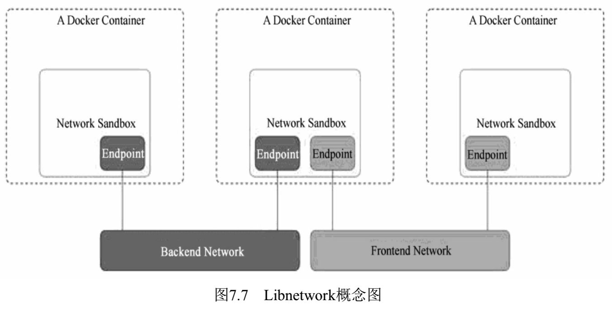

这个概念图没有了IP, 也没有了路由, 已经颠覆了我们的网络常识, 对于不怎么懂网络的大多数人来说, 它的确很有诱惑力, 未来是否会对虚拟化网络的模型产生深远冲击, 我们还不得而知, 但它仅仅是Docker官方当前的一次"尝试". 

针对目前Docker的网络实现, Docker使用的**Libnetwork**组件**只是**将**Docker平台中的网络子系统模块化**为一个**独立库**的简单尝试, 离成熟和完善还有一段距离. 