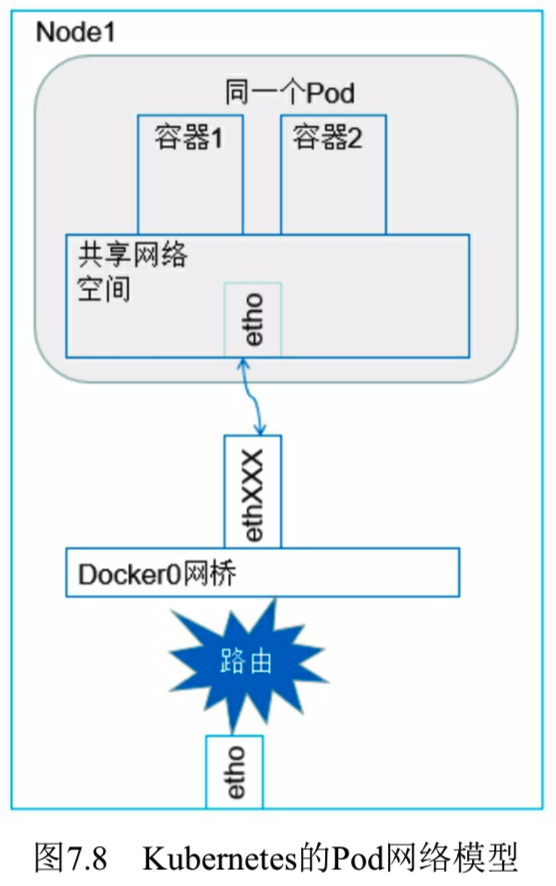
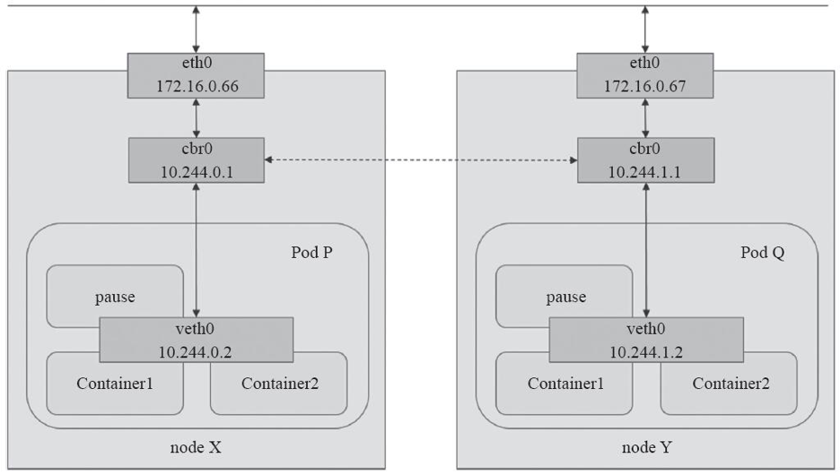
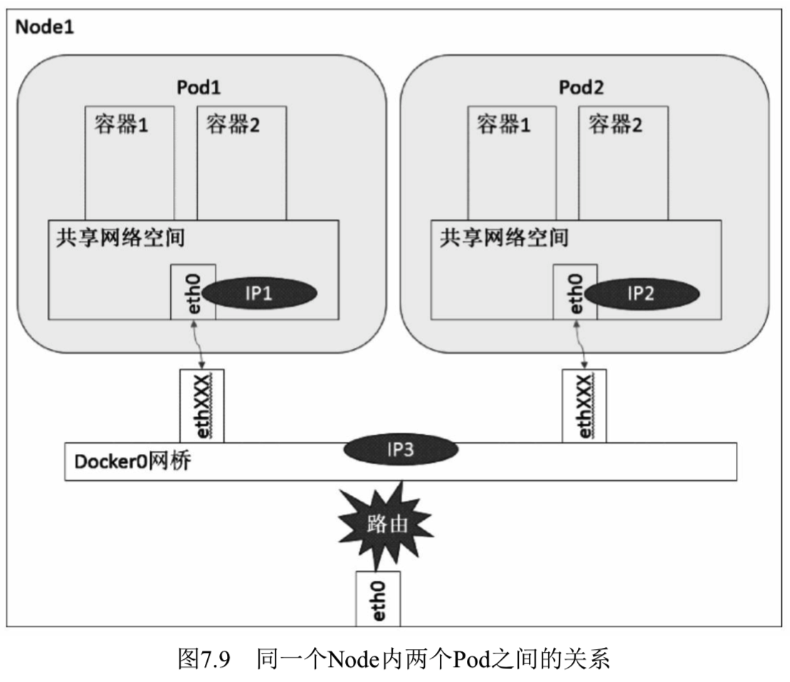
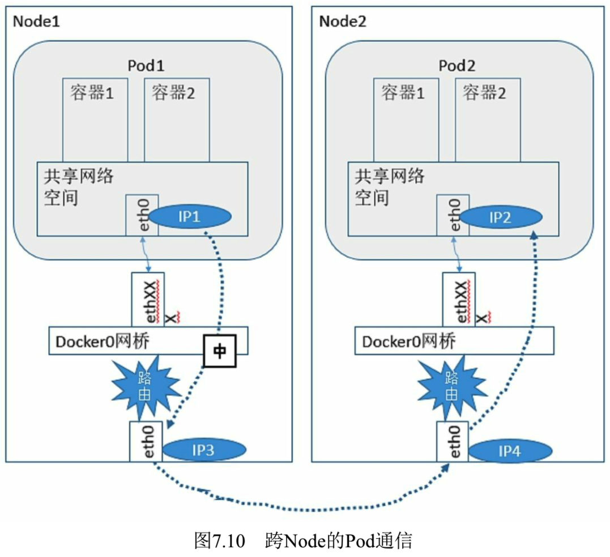
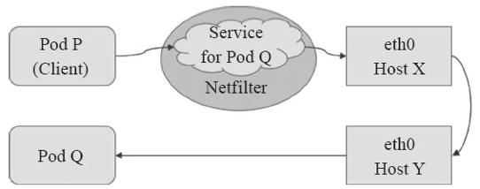

<!-- @import "[TOC]" {cmd="toc" depthFrom=1 depthTo=6 orderedList=false} -->

<!-- code_chunk_output -->

- [1. 容器到容器的通信](#1-容器到容器的通信)
- [2. Pod之间的通信](#2-pod之间的通信)
  - [2.1. 同一个Node内Pod之间的通信](#21-同一个node内pod之间的通信)
  - [2.2. 不同Node上Pod之间的通信: 额外网络组件](#22-不同node上pod之间的通信-额外网络组件)
- [3. Service与Pod之间的通信](#3-service与pod之间的通信)
- [4. 集群外部到Pod对象之间的通信](#4-集群外部到pod对象之间的通信)

<!-- /code_chunk_output -->

在实际的业务场景中, 业务组件之间的关系十分复杂, 特别是随着微服务理念逐步深入人心, 应用部署的粒度更加细小和灵活. 为了支持业务应用组件的通信, **Kubernetes网络的设计**主要致力于解决以下问题. 

(1)同一Pod内**容器到容器之间的直接通信**. 

(2)**抽象的Pod到Pod之间的通信**. 

(3)**Pod到Service之间的通信**. 

(4)**集群外部**与**内部组件(service)之间的通信**. 

Kubernetes为**Pod**和**Service资源对象**分别使用了**各自的专用网络**, **Pod网络**由Kubernetes的**网络插件配置**实现, 而**Service的网络**则由**Kubernetes集群予以指定**. 

其中第3条、第4条在之前的章节里都有所讲解, 本节对更为基础的第1条与第2条进行深入分析和讲解. 

# 1. 容器到容器的通信

**同一个Pod**内的**容器**(**Pod内的容器是不会跨宿主机的！！！**)共享**同一个网络命名空间**, 共享**同一个Linux协议栈**. 它通常由构建Pod对象的**基础架构容器所提供**, 例如, 由**pause镜像启动的容器**. 所有运行于**同一个Pod**内的**容器**与**同一主机**上的**多个进程**类似, 彼此之间可通过**lo接口**完成交互, 如图11\-3所示, Pod P内的Container1和Container2之间的通信即为容器间通信. 

所以对于网络的各类操作, 就和它们在同一台机器上一样, 它们甚至可以用**localhost地址**访问彼此的**端口**. 

这么做的结果是简单、安全和高效, 也能减小将已经存在的程序从物理机或者虚拟机移植到容器下运行的难度. 其实, 在**容器技术出来之前**, 大家早就积累了如何在**一台机器上**运行一组应用程序的经验, 例如, **如何让端口不冲突**, 以及**如何让客户端发现它们**等. 

我们来看一下**Kubernetes**是**如何利用Docker的网络模型**的. 

如图7.8中的阴影部分所示, 在Node上运行着一个Pod实例. 

在我们的例子中, 容器就是图7.8中的容器1和容器2. 

**容器1**和**容器2**共享**一个网络的命名空间**, **共享一个命名空间**的结果就是它们好像**在一台机器上运行**, 它们打开的**端口不会有冲突**, 可以直接使用Linux的**本地IPC进行通信**(例如**消息队列**或者**管道**). 

其实, 这和传统的一组普通程序运行的环境是完全一样的, **传统程序不需要针对网络做特别的修改就可以移植**了, 它们之间的互相访问**只需要使用localhost**就可以. 例如, 如果容器2运行的是MySQL, 那么容器1使用localhost:3306就能直接访问这个运行在容器2上的MySQL了. 

# 2. Pod之间的通信

图11-3 Pod网络:

各Pod对象需要运行于**同一个平面网络**中, **每个Pod对象**拥有**一个集群全局唯一的地**址并可**直接用于与其他Pod进行通信**, 如图11-3中的Pod P和Pod Q之间的通信. 此网络也称为Pod网络. 另外, **运行Pod的各节点！！！** 也会通过**桥接设备**等持有**此平面网络**中的**一个IP地址**, 如图11-3中的**cbr0接口(网桥的IP地址！！！**), 这就意味着Node到Pod间的通信也可在此网络上直接进行. 因此, Pod间的通信或Pod到Node间的通信比较类似于同一IP网络中主机间进行的通信. 

**每一个Pod**都有一个**真实的全局IP地址**, 同一个Node内的不同Pod之间可以直接采用对方Pod的IP地址通信, 而且不需要采用其他发现机制, 例如DNS、Consul或者etcd. 

**Pod容器**既有可能在**同一个Node**上运行, 也有可能在**不同的Node**上运行, 所以通信也分为两类: 

* **同一个Node**内Pod之间的通信
* **不同Node**上Pod之间的通信. 

## 2.1. 同一个Node内Pod之间的通信

同一个Node内两个Pod之间的关系, 如图7.9所示. 

可以看出, Pod1和Pod2都是通过**Veth**连接到**同一个docker0网桥**上的, 它们的**IP地址**IP1、IP2都是从**docker0的网段上动态获取**的, 它们和**网桥本身的IP3**是**同一个网段**的. 

另外, 在**Pod1**、**Pod2**的**Linux协议栈！！！** 上, **默认路由！！！** 都是**docker0的地址！！！**, 也就是说**所有非本地地址的网络数据**, 都会被**默认发送到docker0网桥**上, 由**docker0网桥直接中转**. 

综上所述, 由于它们都**关联在同一个docker0网桥**上, **地址段相同**, 所以它们之间是**能直接通信**的. 

## 2.2. 不同Node上Pod之间的通信: 额外网络组件

**Pod的地址**是与**docker0**在**同一个网段**的, 我们知道**docker0网段**与**宿主机网卡**是两个**完全不同的IP网段**, 并且不同Node之间的通信**只能通过宿主机的物理网卡**进行, 因此要想实现不同Node上Pod容器之间的通信, 就必须想办法**通过主机的这个IP地址进行寻址和通信**. 

另一方面, 这些**动态分配**且藏在docker0之后的所谓"私有"IP地址也是可以找到的. **Kubernetes**会记录所有正在运行的**Pod的IP分配信息**, 并将这些信息保存在**etcd**中(作为Service的Endpoint). 这些私有IP信息对于Pod到Pod的通信也是十分重要的, 因为我们的**网络模型**要求**Pod到Pod使用私有IP**进行通信. 所以首先要知道这些IP是什么. 

之前提到, **Kubernetes的网络对Pod！！！的地址是平面的和直达的**, 所以这些**Pod的IP**规划也很重要, **不能有冲突**. 只要没有冲突, 我们就可以想办法在整个Kubernetes的集群中找到它. 

综上所述, 要想支持**不同Node**上**Pod之间**的通信, 就要满足两个条件: 

(1)在**整个Kubernetes集群！！！** 中对**Pod的IP分配**进行规划, **不能有冲突**; 

(2)找到一种办法, 将**Pod的IP**和**所在Node的IP关联**起来, 通过这个关联让Pod可以互相访问. 

根据条件1的要求, 我们需要在**部署Kubernetes**时对**docker0的IP地址进行规划**, 保证**每个Node上的docker0！！！** 地址都没有冲突. 我们可以在规划后**手工配置到每个Node**上, 或者做一个**分配规则**, 由安装的程序自己去分配占用. 例如, Kubernetes的网络增强开源软件**Flannel！！！** 就能够管理资源池的分配. 

根据条件2的要求, **Pod中的数据在发出**时, 需要**有一个机制！！！** 能够知道**对方Pod的IP地址！！！** 挂在**哪个具体的Node！！！** 上. 也就是说先要找到**Node对应宿主机的IP地址**, 将数据发送到这个**宿主机的网卡**, 然后在**宿主机**上将相应的数据转发到**具体的docker0**上. 一旦数据到达宿主机Node, 则**那个Node内部**的**docker0**便知道**如何将数据发送到Pod**. 如图7.10所示. 

在图7.10中, IP1对应的是Pod1, IP2对应的是Pod2. **Pod1**在访问**Pod2**时, 首先要将数据从**源Node的eth0**发送出去, 找到并到达**Node2的eth0**. 即先是从IP3到IP4的递送, 之后才是从IP4到IP2的递送. 

在谷歌的GCE环境中, **Pod的IP管理(类似docker0**)、**分配**及它们**之间的路由打通**都是由GCE完成的. **Kubernetes**作为主要在GCE上面运行的框架, 它的设计是**假设底层已经具备这些条件**, 所以它**分配完地址**并**将地址记录下来**就完成了它的工作. 在实际的GCE环境中, **GCE的网络组件！！！** 会读取这些信息, **实现具体的网络打通！！！**. 

而在实际生产环境中, 因为安全、费用、合规等种种原因, **Kubernetes的客户**不可能全部使用谷歌的GCE环境, 所以在实际的**私有云环境**中, 除了需要部署Kubernetes和Docker, 还需要**额外的网络配置**, 甚至通过一些软件来实现Kubernetes对网络的要求. 做到这些后, Pod和Pod之间才能无差别地进行透明通信. 

为了达到这个目的, 开源界有不少应用增强了Kubernetes、Docker的网络, 在后面的章节中会介绍几个常用的组件及其组网原理. 

# 3. Service与Pod之间的通信

Service资源的专用网络也称为**集群网络(Cluster Network**), 需要在启动**kube\-apiserver**时经由"\-\-service\-cluster\-ip\-range"选项进行指定, 如10.96.0.0/12, 而**每个Service对象**在此网络中均拥一个称为Cluster-IP的**固定地址**. 管理员或用户**对Service对象的创建或更改**操作由**API Server存储完成**后**触发各节点上的kube\-proxy**, 并根据**代理模式的不同**将其定义为相应节点上的**iptables规则**或**ipvs规则**, 借此完成从**Service**的**Cluster\-IP**与**Pod\-IP之间**的报文转发, 如图11-4所示. 

图11-4: Service与Pod

# 4. 集群外部到Pod对象之间的通信

将**集群外部的流量**引入到**Pod对象的方式**有受限于**Pod所在的工作节点**范围的**节点端口(nodePort**)和**主机网络(hostNetwork**)两种, 以及工作于**集群级别的NodePort**或**LoadBalancer类型的Service对象**. 

不过, 即便是**四层代理的模式**也要经由**两级转发**才能到达**目标Pod资源**: 请求流量首先到达**外部负载均衡器**, 由其调度至**某个工作节点**之上, 而后再由**工作节点的netfilter(kube\-proxy)组件**上的规则(iptables或ipvs)调度至某个目标Pod对象. 