<!-- @import "[TOC]" {cmd="toc" depthFrom=1 depthTo=6 orderedList=false} -->

<!-- code_chunk_output -->

- [第1步: 部署一个RC/Pod](#第1步部署一个rcpod)
- [第2步: 发布一个服务](#第2步-发布一个服务)

<!-- /code_chunk_output -->

**Docker**给我们带来了**不同的网络模式**, Kubernetes也以一种**不同的方式！！！** 来解决这些网络模式的挑战, 但其方式有些难以理解, 特别是对于刚开始接触Kubernetes的网络的开发者来说. 我们在前面学习了Kubernetes、Docker的理论, 本节将通过一个完整的实验, 从部署一个Pod开始, 一步一步地部署那些Kubernetes的组件, 来剖析**Kubernetes在网络层是如何实现及工作**的. 

这里使用虚拟机来完成实验. 如果要部署在物理机器上或者云服务商的环境中, 则涉及的**网络模型**很可能稍微有所不同. 不过, 从网络角度来看, Kubernetes的机制是类似且一致的. 

好了, 来看看我们的实验环境, 如图7.11所示. 

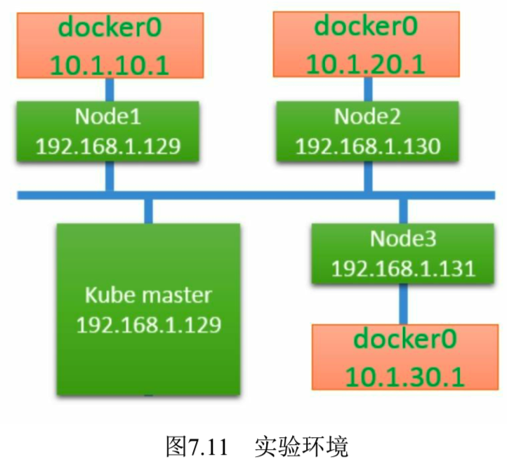

Kubernetes的网络模型要求每个Node上的容器都可以相互访问. 

**默认的Docker网络模型**提供了一个**IP地址段**是**172.17.0.0/16**的**docker0网桥**. **每个容器**都会在**这个子网**内获得**IP地址**, 并且将**docker0网桥的IP地址**(**172.17.42.1**)作为其**默认网关**. 需要注意的是, Docker宿主机外面的网络不需要知道任何关于这个172.17.0.0/16的信息或者知道如何连接到其内部, 因为**Docker的宿主机**针对**容器发出的数据**, 在**物理网卡地址**后面都做了**IP伪装MASQUERADE(隐含NAT**). 也就是说, 在网络上看到的**任何容器数据流**都来源于那台Docker节点的**物理IP地址**. 这里所说的网络都指连接这些主机的物理网络. 

这个模型**便于使用**, 但是并**不完美**, 需要依赖**端口映射的机制**. 

在**Kubernetes的网络模型**中, **每台主机**上的**docker0网桥**都是**可以被路由到**的. 也就是说, 在**部署了一个Pod**时, 在**同一个集群内**, **各主机**都可以访问**其他主机**上的**Pod IP**, 并**不需要！！！在主机上做端口映射！！！**. 

综上所述, 我们可以在**网络层**将**Kubernetes的节点**看作一个**路由器！！！**. 如果将实验环境改画成一个网络图, 那么它看起来如图7.12所示. 

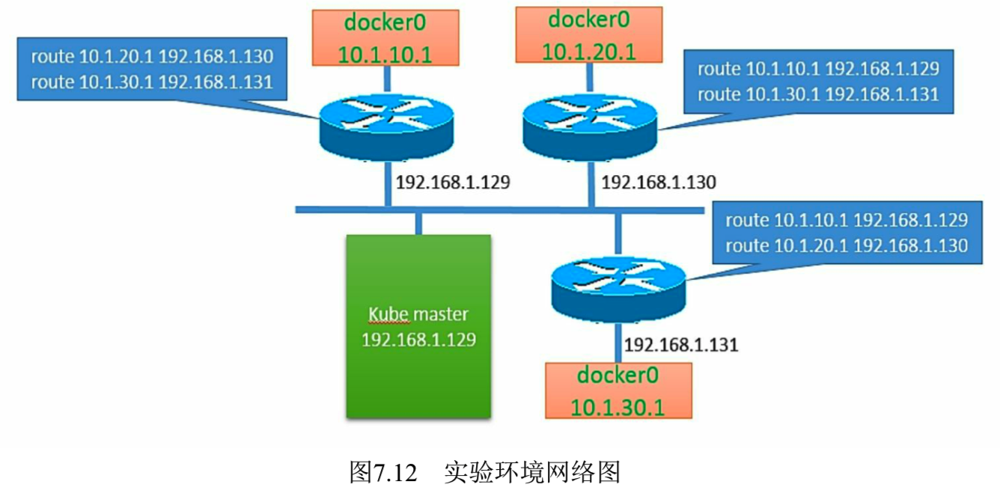

为了支持Kubernetes网络模型, 我们采取了**直接路由！！！** 的方式来实现, 在**每个Node**上都**配置相应的静态路由项**, 例如在192.168.1.129这个Node上配置了两个路由项: 

```
# route add -net 10.1.20.0 netmask 255.255.255.0 gw 192.168.130
# route add -net 10.1.30.0 netmask 255.255.255.0 gw 192.168.131
```

这意味着, **每一个新部署的容器**都将使用这个**Node(docker0的网桥IP**)作为它的**默认网关**. 而这些Node(类似路由器)都有其他docker0的路由信息, 这样它们就能够相互连通了. 

接下来通过一些实际的案例, 来看看Kubernetes在不同的场景下其网络部分到底做了什么. 

# 第1步: 部署一个RC/Pod

部署的RC/Pod描述文件如下(frontend-controller.yaml): 

```yaml
---
apiVersion: v1
kind: ReplicationController
metadata:
  name: frontend
  labels:
    name: frontend
spec:
  replicas: 1
  selector:
    name: frontend
  template:
    metadata:
      labels:
        name: frontend
    spec:
      containers:
      - name: php-redis
        image: kubeguide/guestbook-php-frontend
        env:
        - name: GET_HOSTS_FROM
          value: env
        ports:
        - containerPort: 80
          hostPort: 80
```

为了便于观察, 我们假定在一个空的Kubernetes集群上运行, 提前清理了所有Replication Controller、Pod和其他Service: 

```
# kubectl get rc
CONTROLLER  CONTAINER(S)    IMAGE(S)    SELECTOR    REPLICAS

# kubectl get services
NAME        LABELS                                  SELECTOR    IP(S)   PORT(S)
kubernetes  component=apiserver,provider=kubernetes <none>      20.1.0.1    443/TCP

# kubectl get pods
NAME    READY   STATUS  RESTARTS    AGE
```

让我们检查一下此时**某个Node**上的**网络接口**都有哪些. Node1的状态是: 

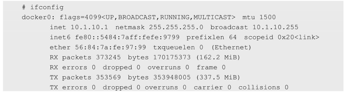

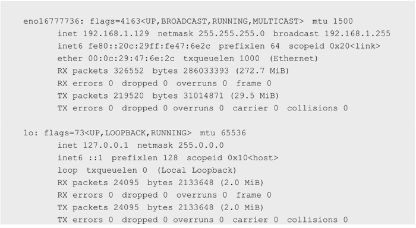

可以看出, 有一个**docker0网桥**和一个**本地地址的网络端口**. 

现在部署一下我们在前面准备的RC/Pod配置文件, 看看发生了什么: 

```
# kubectl create -f frontend-controller.yaml
replication controllers frontend

# kubectl get pods
NAME            READY   STATUS      RESTARTS    AGE     NODE
frontend-4o11g  1/1     Running     0           11s     192.168.1.130
```

可以看到一些有趣的事情. Kubernetes为**这个Pod**找了一个主机**192.168.1.130(Node2**)来运行它. 另外, **这个Pod**获得了一个在**Node2的docker0网桥**上的**IP地址**. 

我们**登录Node2**查看正在运行的容器: 

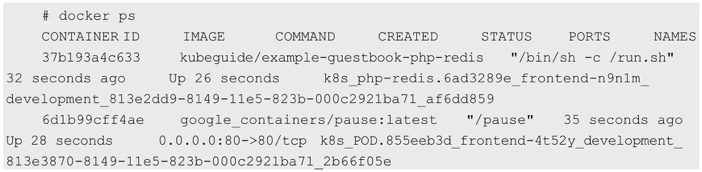

在Node2上现在运行了**两个容器**, 在我们的RC/Pod定义文件中仅仅包含了一个, 那么这第2个是从哪里来的呢?**第2个**看起来运行的是一个叫作`google_containers/pause:latest`的镜像, 而且**这个容器已经有端口映射！！！到它上面** 了, 为什么是这样呢?让我们深入容器内部去看一下具体原因. 

使用Docker的inspect命令来查看容器的详细信息, 特别要关注**容器的网络模型**: 

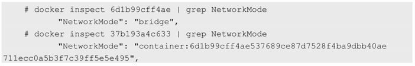

有趣的结果是, 在**查看完每个容器的网络模型**后, 我们可以看到这样的配置: 

* 我们检查的**第1个容器**是运行了"**google\_containers/pause:latest**"镜像的容器, 它使用了**Docker默认的网络模型 bridge**; 

* 而我们检查的**第2个容器**, 也就是在RC/Pod中定义运行的**php\-redis容器**, 使用了**非默认！！！的网络配置和映射容器的模型**, 指定了**映射目标容器！！！** 为"google\_containers/ pause:latest". 

一起来仔细思考这个过程, 为什么Kubernetes要这么做呢?

首先, **一个Pod！！！内的所有容器！！！** 都需要**共用！！！同一个IP地址！！！**, 这就意味着**一定要使用网络的容器映射模式！！！**. 

然而, 为什么不能**只启动1个容器**, 而将**第2个容器**关联到**第1个容器**呢?我们认为Kubernetes是从两方面来考虑这个问题的: 

* 首先, 如果在**Pod内有多个容器**的话, 则可能**很难连接这些容器**; 
* 其次, **后面的容器**还要**依赖第1个被关联的容器**, 如果第2个容器关联到第1个容器, 且第1个容器死掉的话, 第2个容器也将死掉. 

启动一个**基础容器**, 然后将**Pod内的所有容器**都**连接到它上面**会更容易一些. 因为我们**只需要**为基础的这个google\_containers/pause容器**执行端口映射规则**, 这也**简化了端口映射的过程**. 

所以我们**启动Pod后**的**网络模型**类似于图7.13. 

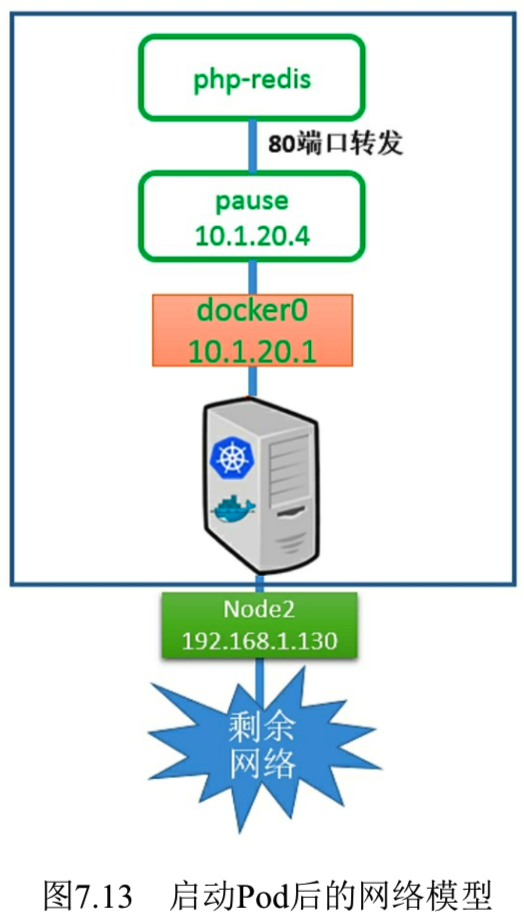

在这种情况下, **实际Pod**的**IP数据流**的**网络目标**都是这个**google\_containers/pause容器**. 图7.13有点儿取巧地显示了是google_containers/pause容器将端口80的流量转发给了相关的容器. 而pause容器只是看起来**转发了网络流量**, 但它并**没有真的这么做**. 实际上, **应用容器！！！直接监听！！！了这些端口！！！**, 和google_containers/pause容器**共享了同一个网络堆栈！！！**. 

这就是为什么在**Pod内部实际容器的端口映射**都显示到google\_containers/**pause容器**上了. 我们可以通过docker port命令来检验一下: 

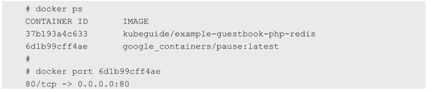

综上所述, google\_containers/pause容器实际上**只是负责接管这个Pod的Endpoint！！！**, 并没有做更多的事情. 

那么**Node**呢?它需要将数据流传给google\_containers/pause容器吗?我们来检查一下iptables的规则, 看看有什么发现: 

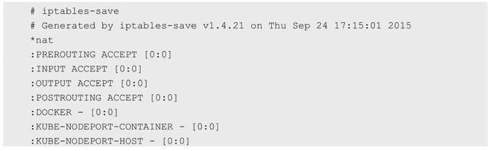

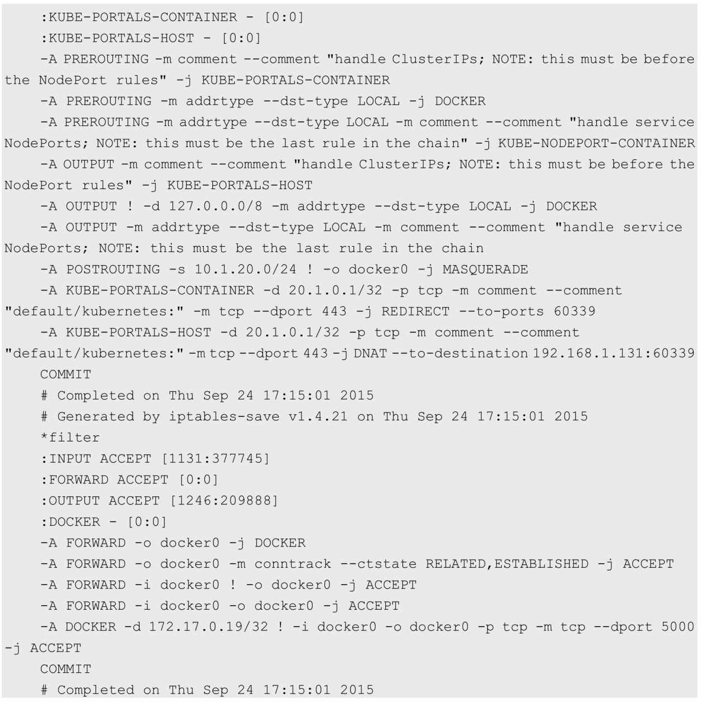

上面的这些规则并没有被应用到我们刚刚定义的Pod上. 当然, Kubernetes会给每一个Kubernetes节点都提供一些默认的服务, 上面的规则就是Kubernetes的默认服务所需要的. 关键是, 我们**没有看到任何IP伪装**的规则, 并且**没有任何指向Pod 10.1.20.4内部的端口映射**. 

# 第2步: 发布一个服务

我们已经了解了Kubernetes如何处理最基本的元素即Pod的连接问题, 接下来看一下它是如何处理Service的. 

**Service**允许我们在**多个Pod**之间**抽象一些服务**, 而且**服务**可以通过提供在**同一个Service！！！** 的**多个Pod之间！！！** 的**负载均衡机制**来支持**水平扩展**. 

我们再次将环境初始化, 删除刚刚创建的RC或Pod来确保集群是空的: 

```
# kubectl stop rc frontend
replication controllers frontend

# kubectl get rc
CONTROLLER  CONTAINER(S)    IMAGE(S)    SELECTOR    REPLICAS

# kubectl get services
NAME        LABELS                                  SELECTOR    IP(S)   PORT(S)
kubernetes  component=apiserver,provider=kubernetes <none>      20.1.0.1    443/TCP

# kubectl get pods
NAME    READY   STATUS  RESTARTS    AGE
```

然后准备一个名为frontend的Service配置文件: 

```yaml
---
apiVersion: v1
kind: Service
metadata:
  name: frontend
  labels:
    name: frontend
spec:
  ports:
  - port: 80
  selector:
    name: frontend
```

在Kubernetes集群中定义这个服务: 

```
# kubectl create -f frontend-service.yaml
services/frontend

# kubectl get services
NAME        LABELS                                  SELECTOR        IP(S)         PORT(S)
frontend    name=frontend                           name=frontend   20.1.244.75   80/TCP
kubernetes  component=apiserver,provider=kubernetes <none>          20.1.0.1      443/TCP
```

在**服务正确创建**后, 可以看到Kubernetes集群已经为**这个服务**分配了一个**虚拟IP地址20.1.244.75**, 这个IP地址是在**Kubernetes**的**Portal Network！！！** 中分配的. 而这个Portal Network的地址范围是我们在Kubmaster上**启动API服务进程**时, 使用\-\-service\-cluster\-ip\-range=xx命令行参数指定的: 

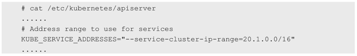

这个IP段可以是**任何段**, 只要**不和docker0**或者**物理网络的子网冲突**就可以. 选择**任意其他网段**的原因是**这个网段**将**不会！！！在物理网络**和**docker0网络上进行路由！！！**. 

这个**Portal Network**针对**每一个Node！！！** 都有**局部的特殊性！！！**, 实际上它存在的意义是让**容器的流量！！！** 都指向**默认网关！！！(也就是docker0网桥！！！**). 

在继续实验前, 先登录到Node1上看一下在我们定义服务后发生了什么变化. 

首先检查一下**iptables**或**Netfilter**的规则: 

```
# iptables-save
......
-A KUBE-PORTALS-CONTAINER -d 20.1.244.75/32 -p tcp -m comment --comment "default/frontend:" -m tcp --dport 80 -j REDIRECT --to-ports 33761
-A KUBE-PORTALS-HOST -d 20.1.244.75/32 -p tcp -m comment --comment "default/kubernetes:" -m tcp --dport 80 -j DNAT --to-destination 192.168.1.131:33761 
......
```

* 进入的流量: 第1行是挂在**PREROUTING链**上的**端口重定向规则**, **所有进入的流量**如果满足**20.1.244.75:80**, 则都会被重定向到**端口33761**. 
* 第2行是挂在**OUTPUT链**上的**目标地址NAT**, 做了和上述第1行规则类似的工作, 但针对的是**当前主机生成的外出流量**. **所有主机生成的流量！！！** 都需要使用这个**DNAT规则**来处理. 

简而言之, 这**两个规则**使用了**不同的方式**做了**类似的事情**, 就是将所有从节点生成的发送给**20.1.244.75:80的流量**重定向到**本地的33761端口**. 

至此, 目标为**Service IP地址**和**端口**的**任何流量**都将被重定向到**本地！！！的33761端口**. 这个**端口连到哪里**去了呢?这就到了**kube\-proxy**发挥作用的地方了. 

这个kube\-proxy服务给**每一个新创建的服务！！！** 都关联了一个**随机的端口号！！！**, 并且**监听那个特定的端口！！！**, 为服务创建相关的**负载均衡！！！** 对象. 

在我们的实验中, **随机生成的端口**刚好是**33761**. 通过监控Node1上的Kubernetes\-Service的日志, 在**创建服务**时可以看到下面的记录: 

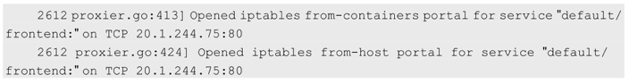

现在我们知道, **所有流量！！！都被导入kube\-proxy！！！**中了. 我们现在需要它完成一些**负载均衡的工作**, 创建Replication Controller并观察结果, 下面是Replication Controller的配置文件: 

```yaml
---
apiVersion: v1
kind: ReplicationController
metadata:
  name: frontend
  labels:
    name: frontend
spec:
  replicas: 3
  selector:
    name: frontend
  template:
    metadata:
      labels:
        name: frontend
    spec:
      containers:
      - name: php-redis
        image: kubeguide/example-guestbook-php-redis
        env:
        - name: GET_HOSTS_FROM
          value: env
        ports:
        - containerPort: 80
          hostPort: 80
```

在集群发布上述配置文件后, 等待并观察, 确保所有Pod都运行起来了: 

```
# kubectl create -f frontend-controller.yaml
replicationcontroller/frontend

# kubectl get pods -o wide
NAME            READY   STATUS  RESTARTS  AGE   NODE
frontend-64t8q  1/1     Running 0         5s    192.168.1.130
frontend-dzqve  1/1     Running 0         5s    192.168.1.131
frontend-x5dwy  1/1     Running 0         5s    192.168.1.129
```

现在**所有的Pod**都运行起来了, **Service**将会把**客户端请求**负载分发到包含"**name=frontend**"标签的**所有Pod**上. 现在的实验环境如图7.14所示. 

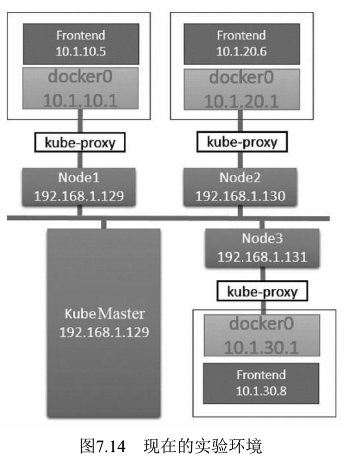

Kubernetes的**kube\-proxy**看起来只是一个夹层, 但实际上它**只是在Node上运行的一个服务！！！**. 

上述**重定向规则**的结果就是**针对目标地址！！！为服务IP！！！的流量**, 将Kubernetes的kube\-proxy变成了一个中间的夹层. 

为了查看具体的重定向动作, 我们会使用**tcpdump**来进行网络抓包操作. 

首先, 安装tcpdump: 

```
# yum install tcpdump
```

安装完成后, **登录Node1**, 运行tcpdump命令:

```
# tcpdump -nn -i eno16777736 port 80
```

需要捕获物理服务器以太网接口的数据包, **Node1**机器上的**以太网接口**名字叫作**eno16777736**. 

再打开**第1个窗口**运行**第2个tcpdump程序**, 不过我们需要一些额外的信息去运行它, 即挂接在**docker0桥**上的**虚拟网卡Veth的名称**. 

我们看到**只有一个frontend容器**在**Node1主机**上运行, 所以可以使用简单的"ip addr"命令来查看唯一的Veth网络接口: 

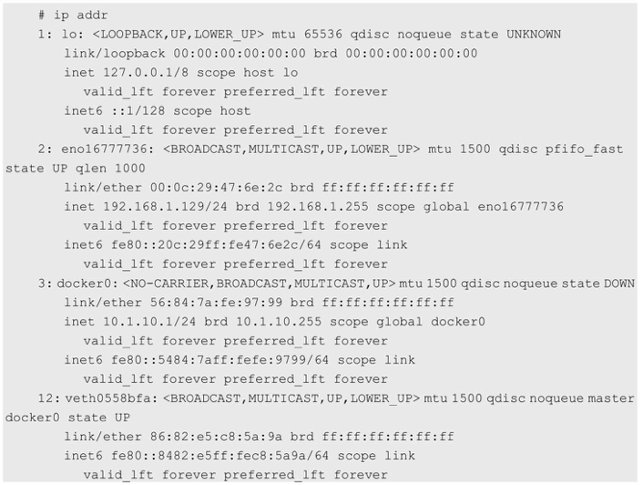

复制这个接口的名字, 在第2个窗口中运行tcpdump命令: 

```
# tcpdump -nn -q -i veth0558bfa host 20.1.224.75
```

同时运行这两个命令, 并且将窗口并排放置, 以便同时看到两个窗口的输出: 

```
# tcpdump -nn -i eno16777736 port 80
tcpdump: verbose output suppressed, user -v or -vv for full protocol decode listening on eno16777736, link-type EN10MB(Ethernet), capture size 65535 bytes
```

```
# tcpdump -nn -q -i veth0558bfa host 20.1.224.75
tcpdump: verbose output suppressed, user -v or -vv for full protocol decode listening on veth0558bfa, link-type EN10MB(Ethernet), capture size 65535 bytes
```

好了, 我们已经在同时捕获两个接口的网络包了. 这时再启动第3个窗口, 运行一个"docker exec"命令来连接到我们的frontend容器内部(你可以先执行docker ps来获得这个容器的ID): 

```
# docker exec -it 268ccdfb9524 bash
root@frontend-x5dwy:/#
```

一旦进入运行的容器内部, 我们就可以通过**Pod的IP地址**来**访问服务**了. 使用curl来尝试访问服务: 

```
# curl 20.1.244.75
```

在使用curl访问服务时, 将在抓包的两个窗口内看到: 

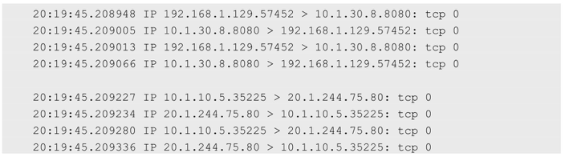

这些信息说明了什么问题呢?让我们在网络图上用**实线**标出**第1个窗口**中网络抓包信息的含义(**物理网卡上的网络流量**), 并用**虚线**标出**第2个窗口**中网络抓包信息的含义(**docker0网桥上的网络流量**), 如图7.15所示. 

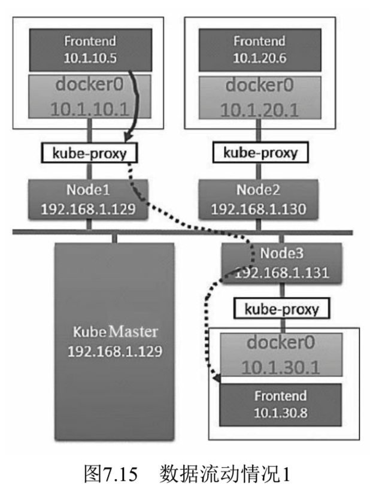

注意, 在图7.15中, **虚线绕过了Node3的kube-proxy**, 这么做是因为Node3上的kube-proxy没有参与这次网络交互. 换句话说, Node1的kube-proxy服务直接和负载均衡到的Pod进行网络交互. 

在查看第2个捕获包的窗口时, 我们能够站在容器的视角看这些流量. 首先, 容器尝试使用20.1.244.75:80打开TCP的Socket连接. 同时, 我们可以看到从服务地址20.1.244.75返回的数据. 从容器的视角来看, 整个交互过程都是在服务之间进行的. 但是在查看一个捕获包的窗口时(上面的窗口), 我们可以看到物理机之间的数据交互, 可以看到一个TCP连接从Node1的物理地址(192.168.1.129)发出, 直接连接到运行Pod的主机Node3(192.168.1.131). 总而言之, Kubernetes的kube-proxy作为一个全功能的代理服务器管理了两个独立的TCP连接: 一个是从容器到kube-proxy: 另一个是从kube-proxy到负载均衡的目标Pod. 

如果清理一下捕获的记录, 再次运行curl, 则还可以看到网络流量被负载均衡转发到另一个节点Node2上了: 

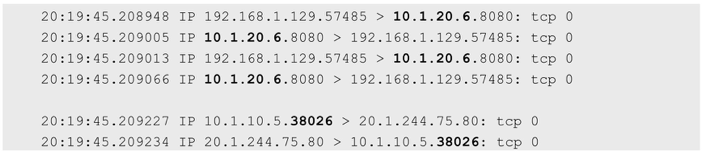


这一次, Kubernetes的Proxy将选择运行在Node2(10.1.20.1)上的Pod作为目标地址. 网络流动图如图7.16所示. 

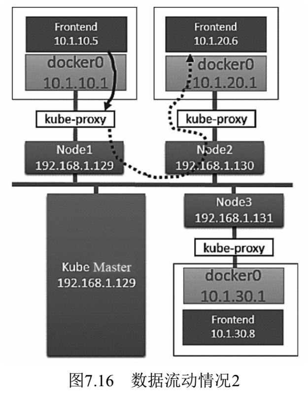

到这里, 你肯定已经知道另一个可能的负载均衡的路由结果了. 