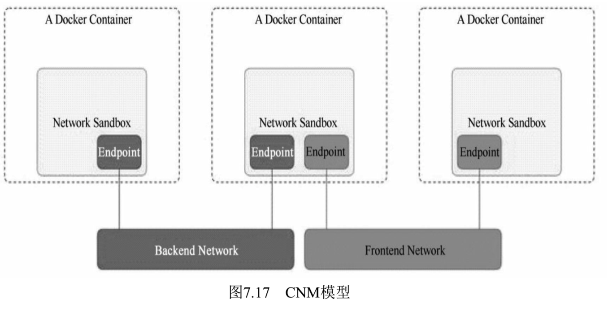
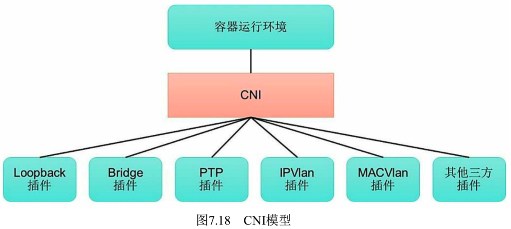
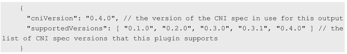

<!-- @import "[TOC]" {cmd="toc" depthFrom=1 depthTo=6 orderedList=false} -->

<!-- code_chunk_output -->

- [1. CNM模型](#1-cnm模型)
- [2. CNI模型](#2-cni模型)
  - [2.1. 设计考量](#21-设计考量)
  - [2.2. CNI规范概述](#22-cni规范概述)
  - [2.3. CNI Plugin插件详解](#23-cni-plugin插件详解)
    - [2.3.1. 将容器添加到网络](#231-将容器添加到网络)
    - [2.3.2. 从网络中删除容器](#232-从网络中删除容器)
    - [2.3.3. 检查容器网络是否正确](#233-检查容器网络是否正确)
    - [2.3.4. 查询网络插件支持的CNI规范版本号](#234-查询网络插件支持的cni规范版本号)
    - [2.3.5. 参数传递](#235-参数传递)
  - [2.4. IPAM Plugin插件详解](#24-ipam-plugin插件详解)
    - [2.4.1. IP分配](#241-ip分配)
    - [2.4.2. IPAM插件](#242-ipam插件)
  - [2.5. 多网络插件](#25-多网络插件)
- [3. 在Kubernetes中使用网络插件](#3-在kubernetes中使用网络插件)
- [4. 可用插件](#4-可用插件)
  - [4.1. Main: 接口创建](#41-main接口创建)
  - [4.2. IPAM: IP地址分配](#42-ipamip地址分配)
  - [4.3. Meta: 其它插件](#43-meta其它插件)
- [5. 参考](#5-参考)

<!-- /code_chunk_output -->

随着容器技术在企业生产系统中的逐步落地, 用户对容器云的网络特性要求也越来越高. 

**跨主机！！！容器间！！！的网络互通**已经成为**基本要求**, 

更高的要求包括**容器固定IP地址！！！**、**一个容器多个IP地址！！！**、**多个子网隔离！！！**、**ACL控制策略！！！**、**与SDN集成！！！** 等. 

目前主流的**容器网络模型**主要有**Docker公司**提出的**Container Network Model(CNM)模型**和**CoreOS**公司提出的**Container Network Interface(CNI)模型**. 

# 1. CNM模型

CNM模型是由Docker公司提出的容器网络模型, 现在已经被Cisco Contiv、Kuryr、Open Virtual Networking(OVN)、Project Calico、VMware、Weave和Plumgrid等项目所采纳. 

另外, Weave、Project Calico、Kuryr和Plumgrid等项目也为CNM提供了**网络插件的具体实现**. 

CNM模型主要通过**Network Sandbox**、**Endpoint**和**Network**这3个组件进行实现, 如图7.17所示. 



# 2. CNI模型

Kubernetes设计了网络模型, 但将其实现交给了网络插件. 于是, 各种解决方案不断涌现. 为了规范及兼容各种解决方案, CoreOS和Google联合制定了CNI(Container Network Interface)标准, 旨在定义**容器网络模型规范**. 它连接了**两个组件**: **容器管理系统**和**网络插件**. 它们之间通过**JSON格式的文件进行通信**, 以实现容器的网络功能. **具体的工作均由插件来实现**, 包括**创建容器netns**、**关联网络接口**到**对应的netns**以及**为网络接口分配IP**等. 

CNI的基本思想是: **容器运行时环境**在**创建容器**时, 先**创建好网络名称空间(netns**), 然后**调用CNI插件**为这个**netns**配置网络, 而后再**启动容器内的进程**. 

CNI(Container Network Interface)是CNCF旗下的一个项目, 由一组用于**配置Linux容器的网络接口的规范**和**库**组成, 同时还包含了一些插件. 

CNI仅关心**容器创建时！！！的网络分配！！！**, 和当**容器被删除！！！** 时**释放网络资源！！！**. 

通过此链接浏览该项目: https://github.com/containernetworking/cni . 

CNI是由**CoreOS公司**提出的另一种**容器网络规范**, 现在已经被Kubernetes、rkt、Apache Mesos、Cloud Foundry和Kurma等项目采纳

另外, Contiv Networking, Project Calico、**Weave**、SR\-IOV、Cilium、Infoblox、Multus、Romana、Plumgrid和Midokura等项目也**为CNI提供网络插件**的**具体实现**. 

图7.18描述了**容器运行环境**与**各种网络插件**通过CNI进行连接的模型. 



**CNI**定义的是**容器运行环境！！！** 与**网络插件！！！** 之间的**简单接口规范**, 通过一个**JSON Schema**定义**CNI插件**提供的**输入**和**输出参数**. **一个容器**可以通过**绑定多个网络插件**加入**多个网络**中. 

Kubernetes源码的**vendor/github.com/containernetworking/cni/libcni目录**中已经包含了CNI的代码, 也就是说kubernetes中已经**内置了CNI！！！**. 

本节将对Kubernetes如何实现CNI模型进行详细说明. 

## 2.1. 设计考量

CNI设计的时候考虑了以下问题: 

* **容器运行时**必须在**调用任何插件之前**为容器创建一个**新的网络命名空间**(不同CR不同实现). 
* 然后, **运行时**必须确定**这个容器！！！**应**属于哪个网络！！！**, 并为**每个网络** 确定**哪些插件！！！必须被执行**. 
* **网络配置**采用**JSON格式**, 可以很容易地存储在文件中. 网络配置包括**必填字段**, 如name和**type**以及**插件(类型**). 网络配置允许字段在**调用之间改变值**. 为此, 有一个**可选的字段args**, 必须包含**不同的信息**. 
* **容器运行时**必须**按顺序！！！**为**每个网络**执行**相应的插件**, 将**容器添加到每个网络**中. 
* 在**完成容器生命周期**后, **运行时**必须以**相反的顺序执行插件**(相对于执行添加容器的顺序)以将**容器与网络断开连接**. 
* **容器运行时**不能为同一容器调用并行操作, 但可以为**不同的容器调用并行操作**. 
* **容器运行时**必须为**容器订阅ADD和DEL操作**, 这样ADD后面总是跟着相应的DEL.  DEL可能跟着额外的DEL, 但是, 插件应该允许处理多个DEL(即插件DEL应该是幂等的). 
* **容器**必须由**ContainerID唯一标识**. 存储状态的插件应该使用(网络名称, 容器ID)的主键来完成. 
* 运行时不能调用同一个网络名称或容器ID执行两次ADD(没有相应的DEL). 换句话说, 给定的容器ID必须只能添加到特定的网络一次. 

## 2.2. CNI规范概述

CNI提供了一种**应用容器的插件化网络！！！** 解决方案, 定义**对容器网络进行操作和配置**的规范, 通过**插件的形式！！！** 对**CNI接口**进行**实现**. 

CNI是由**rkt Networking Proposal**发展而来的, 试图提供一种普适的容器网络解决方案. 

CNI**仅关注**在**创建容器！！！** 时**分配网络资源！！！**, 和在**销毁容器！！！** 时**删除网络资源！！！**, 这使得CNI规范非常轻巧、易于实现, 得到了广泛的支持. 

在CNI模型中**只涉及两个概念**: **容器**和**网络**. 

* 容器(Container): 是拥有**独立Linux网络命名空间**的环境, 例如使用Docker或rkt创建的容器. 关键之处是**容器需要拥有自己的Linux网络命名空间**, 这是加入网络的必要条件. 
* 网络(Network): 表示**可以互连的一组实体**, 这些实体拥有**各自独立**、**唯一的IP地址**, 可以是**容器**、**物理机**或者**其他网络设备(比如路由器**)等. 

对**容器网络！！！** 的**设置和操作**都通过**插件(Plugin！！！**)进行**具体实现！！！**, CNI插件包括**两种类型**: **CNI Plugin**和**IPAM(IP Address Management)Plugin**. 

* CNI Plugin负责**为容器配置网络资源**, 
* IPAM Plugin负责**对容器的IP地址进行分配和管理**. 

IPAM Plugin作为CNI Plugin的一部分, 与CNI Plugin一起工作. 

## 2.3. CNI Plugin插件详解

代码在 vendor/github.com/containernetworking/cni/libcni/api.go

```go
type CNI interface {
	AddNetworkList(ctx context.Context, net *NetworkConfigList, rt *RuntimeConf) (types.Result, error)
	CheckNetworkList(ctx context.Context, net *NetworkConfigList, rt *RuntimeConf) error
	DelNetworkList(ctx context.Context, net *NetworkConfigList, rt *RuntimeConf) error
	GetNetworkListCachedResult(net *NetworkConfigList, rt *RuntimeConf) (types.Result, error)

	AddNetwork(ctx context.Context, net *NetworkConfig, rt *RuntimeConf) (types.Result, error)
	CheckNetwork(ctx context.Context, net *NetworkConfig, rt *RuntimeConf) error
	DelNetwork(ctx context.Context, net *NetworkConfig, rt *RuntimeConf) error
	GetNetworkCachedResult(net *NetworkConfig, rt *RuntimeConf) (types.Result, error)

	ValidateNetworkList(ctx context.Context, net *NetworkConfigList) ([]string, error)
	ValidateNetwork(ctx context.Context, net *NetworkConfig) ([]string, error)
}
```

CNI Plugin包括**3个基本接口的定义**: **添加(ADD**)、**删除(DELETE**)、**检查(CHECK**)和**版本查询(VERSION**). 

这些接口的具体实现**要求插件**提供一个**可执行的程序！！！**, 在容器网络**添加**或**删除**时进行调用, 以完成具体的操作. 

CNI插件的详细说明请参考: CNI SPEC, https://github.com/containernetworking/cni/blob/master/SPEC.md

### 2.3.1. 将容器添加到网络

(1)添加: 将**容器添加到某个网络**. 

主要过程为在**Container Runtime创建容器！！！**时, **先**创建好**容器内的网络命名空间(Network Namespace**), 然后**调用CNI插件**为**该netns**进行**网络配置**, 最后**启动容器内的进程**. 

添加接口的参数如下. 

* Version: CNI版本号. 
* Container ID: 容器ID. 由运行时分配的容器的唯一明文标识符. 一定不能是空的. 
* Network namespace path: 要添加的网络命名空间路径, 例如/proc/\[pid]/ns/net或绑定挂载/链接. 
* Network configuration: 网络配置JSON文档, 用于描述容器待加入的网络. 
* Extra arguments: 其他参数, 提供了一个替代机制, 允许在每个容器上简单配置CNI插件. 
* Name of the interface inside the container: 容器内的网卡名. 这是应该分配给容器(网络命名空间)内创建的接口的名称; 因此它必须符合Linux接口名称上的标准限制. 

返回的信息如下. 

* Interfaces list: 网卡列表, 根据Plugin的实现, 可能包括Sandbox Interface名称、主机Interface名称、每个Interface的地址等信息. 
* IPs assigned to the interface: IPv4或者IPv6地址、网关地址、路由信息等. 
* DNS information: DNS相关的信息. 

### 2.3.2. 从网络中删除容器

(2)删除: **容器销毁**时**将容器从某个网络中删除**. 

删除接口的参数如下. 

* Version: CNI版本号. 
* Container ID: 容器ID. 
* Network namespace path: 容器的网络命名空间路径, 例如/proc/[pid]/ns/net. 
* Network configuration: 网络配置JSON文档, 用于描述容器待加入的网络. 
* Extra arguments: 其他参数, 提供基于容器的CNI插件简单配置机制. 
* Name of the interface inside the container: 容器内的网卡名. 

### 2.3.3. 检查容器网络是否正确

(3)检查: **检查容器网络是否正确设置**. 

检查接口的参数如下. 

* Container ID: 容器ID. 
* Network namespace path: 容器的网络命名空间路径, 例如/proc/\[pid]/ns/net. 
* Network configuration: 网络配置JSON文档, 用于描述容器待加入的网络. 
* Extra arguments: 其他参数, 提供基于容器的CNI插件简单配置机制. 
* Name of the interface inside the container: 容器内的网卡名. 

### 2.3.4. 查询网络插件支持的CNI规范版本号

(4)版本查询: 查询**网络插件支持的CNI规范版本号**. 

无参数, 返回值为网络插件支持的CNI规范版本号, 例如: 



### 2.3.5. 参数传递

**CNI插件**应能够支持通过**环境变量**和**标准输入**传入参数. 

可执行文件通过**网络配置参数**中的**type字段**标识的文件名在**环境变量CNI\_PATH**设定的路径下进行查找. 一旦找到, 容器运行时将调用该可执行程序, 并传入以下环境变量和网络配置参数, 供该插件完成容器网络资源和参数的设置. 

**环境变量参数**如下. 

* CNI\_COMMAND: 接口方法, 包括ADD、DEL和VERSION. 
* CNI\_CONTAINERID: 容器ID. 
* CNI\_NETNS: 容器的网络命名空间路径, 例如/proc/\[pid]/ns/net. 
* CNI\_IFNAME: 待设置的网络接口名称. 
* CNI\_ARGS: 其他参数, 为key=value格式, 多个参数之间用分号分隔, 例如"FOO=BAR; ABC=123". 
* CNI\_PATH: 可执行文件的查找路径, 可以设置多个. 

**网络配置参数**则由一个**JSON报文**组成, 以**标准输入(stdin)的方式**传递给可执行程序. 

网络配置参数如下. 

* cniVersion(string): CNI版本号. 
* name(string): 网络名称, 应在一个管理域内唯一. 
* type(string): CNI插件的可执行文件的名称. 
* args(dictionary): 其他参数. 
* ipMasq(boolean): 是否设置IP Masquerade(需插件支持), 适用于主机可作为网关的环境中. 
* ipam: IP地址管理的相关配置. 
- type(string): IPAM可执行的文件名. 
* dns: DNS服务的相关配置. 
- nameservers(list of strings): 名字服务器列表, 可以使用IPv4或IPv6地址. 
- domain(string): 本地域名, 用于短主机名查询. 
- search(list of strings): 按优先级排序的域名查询列表. 
- options(list of strings): 传递给resolver的选项列表. 

下面的例子定义了一个名为dbnet的网络配置参数, IPAM使用host-local进行设置: 

```json
{
  "cniVersion": "0.4.0",
  "name": "dbnet",
  "type": "bridge",
  "bridge": "cni0",
  "ipam": {
    "type": "host-local",
    "subnet": "10.1.0.0/16",
    "gateway": "10.1.0.1"
  },
  "dns": {
    "nameservers": [ "10.1.0.1" ]
  }
}
```

## 2.4. IPAM Plugin插件详解

### 2.4.1. IP分配

作为容器网络管理的一部分, CNI插件需要为接口分配(并维护)IP地址, 并安装与该接口相关的所有必要路由. 这给了CNI插件很大的灵活性, 但也给它带来了很大的负担. 众多的CNI Plugin插件需要编写相同的代码来支持用户需要的多种IP管理方案(例如dhcp、host-local). 

为了减轻CNI Plugin对IP地址管理的负担, 在CNI规范中设置了一个新的插件**专门**用于**管理容器的IP地址**(还包括**网关**、**路由**等信息), 被称为IPAM Plugin. 

通常由**CNI Plugin！！！** 在**运行时自动调用**IPAM Plugin完成**容器IP地址的分配**. 

IPAM Plugin负责**为容器分配IP地址/subnet、网关、路由和DNS**, 典型的**实现**包括**host\-local**和**dhcp**. 并将此信息返回到"主"插件来应用配置.  

IPAM插件可以通过协议(例如dhcp)、存储在本地文件系统上的数据、网络配置文件的"ipam"部分或上述的组合来获得信息. 

### 2.4.2. IPAM插件

与CNI Plugin类似, IPAM插件也通过**可执行程序**完成IP地址分配的具体操作. **可执行文件**位于**预定义的路径列表**中, 通过**CNI\_PATH**指示给CNI插件. 

IPAM可执行程序也处理**传递给CNI插件的环境变量**和**通过标准输入(stdin**)传入的**网络配置参数**. 

如果成功完成了容器IP地址的分配, 则IPAM插件应该通过标准输出(stdout)返回以下JSON报文: 

```json
{
  "cniVersion": "0.4.0",
  "ips": [
      {
          "version": "<4-or-6>",
          "address": "<ip-and-prefix-in-CIDR>",
          "gateway": "<ip-address-of-the-gateway>"  (optional)
      },
      ......
  ],
  "routes": [                                       (optional)
      {
          "dst": "<ip-and-prefix-in-cidr>",
          "gw": "<ip-of-next-hop>"                  (optional)
      },
      ......
  ]
  "dns": {
    "nameservers": <list-of-nameservers>            (optional)
    "domain": <name-of-local-domain>                (optional)
    "search": <list-of-search-domains>              (optional)
    "options": <list-of-options>                    (optional)
  }
}
```

其中包括ips、routes和dns三段内容. 

* ips段: 分配给容器的IP地址(也可能包括网关). 
* routes段: 路由规则记录. 
* dns段: DNS相关的信息. 

## 2.5. 多网络插件

在很多情况下, **一个容器**需要连接**多个网络**, CNI规范支持为**一个容器运行多个！！！CNI Plugin！！！** 来实现这个目标. 

**多个网络插件**将按照**网络配置列表**中的**顺序执行**, 并将**前一个网络配置**的**执行结果**传递给**后面的网络配置**. 多网络配置用JSON报文进行配置, 包括如下信息. 

* cniVersion(string): CNI版本号. 
* name(string): 网络名称, 应在一个管理域内唯一, 将用于下面的所有Plugin. 
* plugins(list): 网络配置列表. 

下面的例子定义了**两个网络配置参数**, 分别作用于**两个插件**, 第1个为**bridge**, 第2个为**tuning**. CNI将首先执行第1个bridge插件设置容器的网络, 然后执行第2个tuning插件: 

```json
{
  "cniVersion": "0.4.0",
  "name": "dbnet",
  "plugins": [
    {
      "type": "bridge",
      // type (plugin) specific
      "bridge": "cni0",
      // args may be ignored by plugins
      "args": {
        "labels" : {
            "appVersion" : "1.0"
        }
      },
      "ipam": {
        "type": "host-local",
        // ipam specific
        "subnet": "10.1.0.0/16",
        "gateway": "10.1.0.1"
      },
      "dns": {
        "nameservers": [ "10.1.0.1" ]
      }
    },
    {
      "type": "tuning",
      "sysctl": {
        "net.core.somaxconn": "500"
      }
    }
  ]
}
```

在容器运行且执行第1个bridge插件时, 网络配置参数将被设置为: 

```json
{
    "cniVersion": "0.4.0",
    "name": "dbnet",
    "type": "bridge",
    "bridge": "cni0",
    "args": {
            "labels" : {
                "appVersion" : "1.0"
            }
        },
    "ipam": {
    "type": "host-local",
    // ipam specific
    "subnet": "10.1.0.0/16",
    "gateway": "10.1.0.1"
    },
    "dns": {
    "nameservers": [ "10.1.0.1" ]
    }
}
```

接下来执行第2个tuning插件, 网络配置参数将被设置为: 

```json
{
  "cniVersion": "0.4.0",
  "name": "dbnet",
  "type": "tuning",
  "bridge": "cni0",
  "sysctl": {
      "net.core.somaxconn": "500"
  },
  "prevResult": {
      "ips": [
          {
              "version": "4",
              "address": "10.0.0.5/32",
              "interface": 2
          }
      ],
      "interface": [
          {
              "name": "cni0",
              "mac": "00:11:22:33:44:55",
          },
          {
              "name": "veth3243",
              "mac": "55:44:33:22:11:11",
          },
          {
              "name": "eth0",
              "mac": "99:88:77:66:55:44",
              "sandbox": "/var/run/netns/blue",
          }
      ],
      "dns": {
          "nameservers": ["10.1.0.1"]
      }
  }
} 
```

其中, **prevResult字段**包含的信息为**上一个bridge插件执行的结果**. 

在**删除多个CNI Plugin时**, 则以**逆序执行删除操作**, 以上例为例, 将先删除tuning插件的网络配置, 其中prevResult字段包含的信息为新增操作(ADD)时补充的信息: 

.............

# 3. 在Kubernetes中使用网络插件

Kubernetes目前支持**两种网络插件的实现**. 

* **CNI插件**: 根据CNI规范**实现其接口**, 以与插件提供者进行对接. 
* **kubenet插件**: 使用**bridge**和**host\-local CNI插件**实现一个基本的cbr0. 

为了在Kubernetes集群中使用**网络插件**, 需要在**kubelet服务！！！** 的**启动参数**上设置下面两个参数. 

* \-\-network\-plugin\-dir: **kubelet启动**时扫描**网络插件的目录**. 
* \-\-network\-plugin: **网络插件名称**, 对于CNI插件, 设置为cni即可, 无须关注\-\-network\-plugin\-dir的路径. 对于kubenet插件, 设置为kubenet, 目前仅实现了一个简单的cbr0 Linux网桥. 

在设置\-\-network\-plugin="cni"时, **kubelet**还需设置下面两个参数. 

* \-\-cni\-conf-dir: CNI插件的配置文件目录, 默认为/etc/cni/net.d. 该目录下配置文件的内容需要符合CNI规范. 
* \-\-cni\-bin\-dir: CNI插件的可执行文件目录, 默认为/opt/cni/bin. 

目前已有**多个开源项目**支持以**CNI网络插件**的形式部署到Kubernetes集群中, 进行Pod的网络设置和网络策略的设置, 包括Calico、Canal、Cilium、Contiv、**Flannel**、Romana、Weave Net等. 

# 4. 可用插件

## 4.1. Main: 接口创建

* bridge: 创建网桥, 并添加主机和容器到该网桥
* ipvlan: 在容器中添加一个ipvlan接口
* loopback: 创建一个回环接口
* macvlan: 创建一个新的MAC地址, 将所有的流量转发到容器
* ptp: 创建veth对
* vlan: 分配一个vlan设备

## 4.2. IPAM: IP地址分配

* dhcp: 在主机上运行守护程序, 代表容器发出DHCP请求
* host-local: 维护分配IP的本地数据库

## 4.3. Meta: 其它插件

* flannel: 根据flannel的配置文件创建接口
* tuning: 调整现有接口的sysctl参数
* portmap: 一个基于iptables的portmapping插件. 将端口从主机的地址空间映射到容器. 

# 5. 参考

- https://github.com/containernetworking/cni
- https://github.com/containernetworking/plugins
- [Container Networking Interface Specification](https://github.com/containernetworking/cni/blob/master/SPEC.md#container-networking-interface-specification)
- [CNI Extension conventions](https://github.com/containernetworking/cni/blob/master/CONVENTIONS.md)
