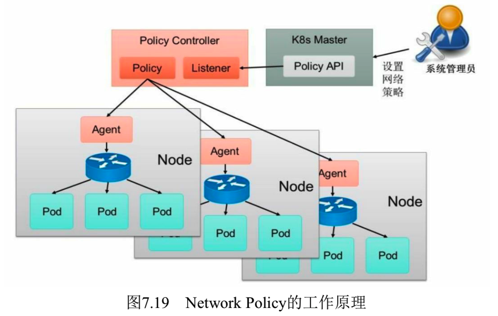

<!-- @import "[TOC]" {cmd="toc" depthFrom=1 depthTo=6 orderedList=false} -->

<!-- code_chunk_output -->

- [](#)
- [1. 网络策略配置说明](#1-网络策略配置说明)
- [2. 在Namespace级别设置默认的网络策略](#2-在namespace级别设置默认的网络策略)
- [3. NetworkPolicy的发展](#3-networkpolicy的发展)

<!-- /code_chunk_output -->

# 

为了实现**细粒度**的**容器间网络访问隔离策略**, Kubernetes从1.3版本开始, 由**SIG\-Network小组**主导研发了**Network Policy机制**, 目前已升级为networking.k8s.io/v1稳定版本. 

Network Policy的主要功能是对**Pod间的网络通信**进行**限制和准入控制**, 设置方式为**将Pod的Label**作为查询条件, 设置允许访问或禁止访问的客户端Pod列表. 目前查询条件可以作用于Pod和Namespace级别. 

为了使用Network Policy, Kubernetes引入了一个新的资源对象NetworkPolicy, 供用户设置Pod间网络访问的策略. 但仅定义一个网络策略是无法完成实际的网络隔离的, 还需要一个策略控制器(Policy Controller)进行策略的实现. 策略控制器由第三方网络组件提供, 目前Calico、Cilium、Kube\-router、Romana、Weave Net等开源项目均支持网络策略的实现. 

Network Policy的工作原理如图7.19所示, policy controller需要实现一个API Listener, 监听用户设置的NetworkPolicy定义, 并将网络访问规则通过各Node的Agent进行实际设置(Agent则需要通过CNI网络插件实现). 



# 1. 网络策略配置说明

网络策略的设置主要用于对目标Pod的网络访问进行限制, 在默认情况下对所有Pod都是允许访问的, 在设置了指向Pod的NetworkPolicy网络策略之后, 到Pod的访问才会被限制. 

下面通过一个例子对NetworkPolicy资源对象的使用进行说明: 

```yaml
---
apiVersion: networking.k8s.io/v1
kind: NetworkPolicy
metadata:
  name: test-network-policy
  namespace: default
spec:
  podSelector:
    matchLabels:
      role: db
  policyTypes:
  - Ingress
  - Egress
  ingress:
  - from:
    - ipBlock:
        cidr: 172.17.0.0/16
        except:
        - 172.17.1.0/24
    - namespaceSelector:
        matchLabels:
          project: myproject
    - podSelector:
        matchLabels:
          role: frontend
    ports:
    - protocol: TCP
      port: 6379
  egress:
  - to:
    - ipBlock:
        cidr: 10.0.0.0/24
    ports:
    - protocol: TCP
      port: 5978
```

主要的参数说明如下. 

* podSelector: 用于定义该网络策略作用的Pod范围, 本例的选择条件为包含"role=db"标签的Pod. 
* policyTypes: 网络策略的类型, 包括ingress和egress两种, 用于设置目标Pod的入站和出站的网络限制. 
* ingress: 定义允许访问目标Pod的入站白名单规则, 满足from条件的客户端才能访问ports定义的目标Pod端口号. 
    - from: 对符合条件的客户端Pod进行网络放行, 规则包括基于客户端Pod的Label、基于客户端Pod所在的Namespace的Label或者客户端的IP范围. 
    - ports: 允许访问的目标Pod监听的端口号. 
* egress: 定义目标Pod允许访问的"出站"白名单规则, 目标Pod仅允许访问满足to条件的服务端IP范围和ports定义的端口号. 
    - to: 允许访问的服务端信息, 可以基于服务端Pod的Label、基于服务端Pod所在的Namespace的Label或者服务端IP范围. 
    - ports: 允许访问的服务端的端口号. 

通过本例的NetworkPolicy设置, 对目标Pod的网络访问的效果如下. 

* 该网络策略作用于Namespace"default"中含有"role=db"Label的全部Pod. 
* 允许与目标Pod在同一个Namespace中的包含"role=frontend"Label的客户端Pod访问目标Pod. 
* 允许属于包含"project=myproject"Label的Namespace的客户端Pod访问目标Pod. 
* 允许从IP地址范围"172.17.0.0/16"的客户端Pod访问目标Pod, 但是不包括IP地址范围"172.17.1.0/24"的客户端. 
* 允许目标Pod访问IP地址范围"10.0.0.0/24"并监听5978端口的服务. 

这里是关于namespaceSelector和podSelector的说明: 在from或to的配置中, namespaceSelector和podSelector可以单独设置, 也可以组合配置. 如果仅配置podSelector, 则表示与目标Pod属于相同的Namespace, 而组合设置则可以设置Pod所属的Namespace, 例如: 

```yaml
- from:
    - namespaceSelector:
        matchLabels:
          project: myproject
    - podSelector:
        matchLabels:
          role: frontend
```

表示允许访问目标Pod的来源客户端Pod应具有如下属性: 属于有"project=myproject"标签的Namespace, 并且有"role=frontend"标签. 

# 2. 在Namespace级别设置默认的网络策略

在Namespace级别还可以设置一些默认的全局网络策略, 以方便管理员对整个Namespace进行统一的网络策略设置. 

默认禁止任何客户端访问该Namespace中的所有Pod: 

```yaml
# default deny ingress
---
apiVersion: networking.k8s.io/v1
kind: NetworkPolicy
metadata:
  name: default-deny
spec:
  podSelector: {}
  policyTypes:
  - Ingress
```

默认允许任何客户端访问该Namespace中的所有Pod: 

```yaml
# default allow ingress
---
apiVersion: networking.k8s.io/v1
kind: NetworkPolicy
metadata:
  name: allow-all
spec:
  podSelector: {}
  ingress:
  - {}
  policyTypes:
  - Ingress
```

默认禁止该Namespace中的所有Pod访问外部服务: 

```yaml
# default deny egress
---
apiVersion: networking.k8s.io/v1
kind: NetworkPolicy
metadata:
  name: default-deny
spec:
  podSelector: {}
  policyTypes:
  - Egress
```

默认允许该Namespace中的所有Pod访问外部服务: 

```yaml
# default allow egress
---
apiVersion: networking.k8s.io/v1
kind: NetworkPolicy
metadata:
  name: allow-all
spec:
  podSelector: {}
  egress:
  - {}
  policyTypes:
  - Egress
```

默认禁止任何客户端访问该Namespace中的所有Pod, 同时禁止访问外部服务: 

```yaml
# default deny ingress and egress
---
apiVersion: networking.k8s.io/v1
kind: NetworkPolicy
metadata:
  name: default-deny
spec:
  podSelector: {}
  policyTypes:
  - Ingress
  - Egress
```

# 3. NetworkPolicy的发展

Kubernetes从1.12版本开始, 引入了对SCTP协议的支持, 目前为Alpha版本的功能, 可以通过打开\-\-feature\-gates=SCTPSupport=true特性开关启用. 开启之后, 可以在NetworkPolicy资源对象中设置protocol字段的值为SCTP, 启用对SCTP协议的网络隔离设置. 这要求CNI插件提供对SCTP协议的支持. 