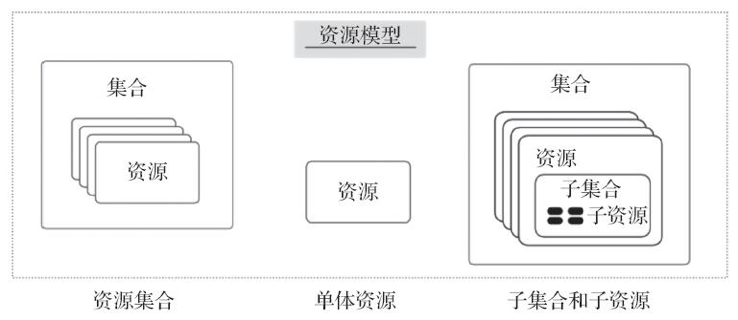

<!-- @import "[TOC]" {cmd="toc" depthFrom=1 depthTo=6 orderedList=false} -->

<!-- code_chunk_output -->

- [1. 架构风格, 而非标准](#1-架构风格-而非标准)
- [2. 架构和规范](#2-架构和规范)
- [3. B/S架构和规范](#3-bs架构和规范)
  - [3.1. 客户端-服务端规范](#31-客户端-服务端规范)
  - [3.2. 无状态性](#32-无状态性)
  - [3.3. 客户端缓存](#33-客户端缓存)
- [4. REST架构和规范](#4-rest架构和规范)
  - [4.1. 统一接口](#41-统一接口)
  - [4.2. 分层系统](#42-分层系统)
  - [4.3. 按需代码](#43-按需代码)
- [5. REST的设计准则](#5-rest的设计准则)
  - [5.1. 资源](#51-资源)
  - [5.2. 资源标识符](#52-资源标识符)
  - [5.3. HTTP规范和RESTful的URI](#53-http规范和restful的uri)
  - [5.4. 无状态](#54-无状态)

<!-- /code_chunk_output -->

# 1. 架构风格, 而非标准

**REST**(**Representational State Transfer**, **表述性！！！状态传递**)是由Roy Thomas Fielding博士在他的论文**Architectural Styles and the Design of Network-based Software Architectures**中提出的一个术语. 

**REST**本身只是为**分布式超媒体系统**设计的一种**架构风格**, 而**不是标准！！！**. 

REST的基本元素为**资源(resource**)、**表征(representation**)和**行为(action**). 

**资源即对象**, **一个资源**通常意味着**一个附带类型**和**关联数据**、**支持的操作方法**以及**与其他对象的关系**的对象, 它们是**持有状态的事物**, 即**REST中的S(State**). 

REST组件通过使用"**表征**"来捕获**资源的当前或预期状态**并在组件之间**传输该表征**从而**对资源执行操作**. 表征是一个**字节序列**, 由**数据**、**描述数据的元数据**以及**偶尔描述元数据的元数据**组成(通常用于**验证消息的完整性**), 表征还有一些其他常用但不太精确的名称, 如**文档**、**文件**和**HTTP消息实体**等. 表征的**数据格式**称为**媒体类型(media type**), 常用的有JSON或XML. 

API客户端**不能直接访问资源**, 它们需要执行"**动作**"(action)来改变**资源的状态**, 于是资源的状态从一种形式"转移"(Transfer)为另一种形式. 

**资源**可以分组为**集合(collection**), 每个集合只包含**单一类型的资源**, 并且各资源间是无序的. 当然, 资源也可以不属于任何集合, 它们称为**单体资源**. 事实上, **集合本身也是资源**, 它可以部署于全局级别, 位于API的顶层, 也可以包含于某个资源中, 表现为"子集合". 集合、资源、子集合及子资源间的关系如图3-1所示. 

图3-1　集合、资源和子资源:

# 2. 架构和规范

**基于Web的架构！！！** 实际上就是**各种规范！！！的集合！！！**, 比如**HTTP是一种规范**, **客户端服务器模式！！！** 是**另一种规范**. 

每当我们在**原有规范**的基础上增加**新的规范**时, 就会形成**新的架构**. 而REST正是这样一种架构, 它**结合了一系列规范**, 形成了一种新的**基于Web**的**架构风格**. 

# 3. B/S架构和规范

**传统的Web应用**大多是**B/S架构**, **涉及如下规范**. 

## 3.1. 客户端-服务端规范

(1)**客户端-服务器**: 这种规范的提出, 改善了用户接口跨多个平台的可移植性, 并且通过简化服务器组件, 改善了系统的可伸缩性. 最为关键的是通过**分离用户接口和数据存储**, 使得不同的用户终端共享相同的数据成为可能. 

## 3.2. 无状态性

(2)**无状态性**: 无状态性是在客户端-服务器规范的基础上添加的又一层规范, 它要求**通信必须在本质上是无状态的！！！**, 即从**客户端到服务器**的**每个request！！！** 都必须包含**理解该request必需的所有信息**. 这个规范改善了系统的可见性(**无状态性**使得**客户端和服务器端不必保存！！！对方的详细信息**, 服务器**只需要处理当前的request**, 而不必了解所有request的历史)、可靠性(无状态性减少了服务器从局部错误中恢复的任务量)、可伸缩性(无状态性使得服务器端可以很容易释放资源, 因为服务器端不必在多个request中保存状态). 同时, 这种规范的缺点也是显而易见的, **不能将状态数据保存在服务器**上, 导致增加了在一系列request中发送重复数据的开销, **严重降低了效率！！！**. 

## 3.3. 客户端缓存

(3)**缓存**: 为了改善**无状态性**带来的网络的低效性, **客户端！！！缓存规范！！！** 出现. 缓存规范允许**隐式或显式！！！** 地**标记一个response中的数据！！！**, 赋予了**客户端缓存response数据的功能**, 这样就可以为**以后的request共用缓存的数据消除部分或全部交互**, 提高了网络效率. 但是**客户端缓存了信息**, 所以**客户端数据**与**服务器数据不一致**的可能性增加, 从而**降低了可靠性！！！**. 

**B/S架构**的优点是**部署非常方便**, 在**用户体验方面却不很理想**. 为了改善这种状况, **REST规范**出现. 

# 4. REST架构和规范

**REST规范**在原有B/S架构的基础上**增加！！！了三个新规范**: **统一接口**、**分层系统**和**按需代码**. 

## 4.1. 统一接口

(1)**统一接口**: REST架构风格的**核心特征**就是强调**组件之间有一个统一的接口**, 表现为在**REST世界**里, 网络上的**所有事物**都**被抽象为资源！！！**, REST通过**通用！！！的链接器接口！！！** 对资源进行操作. 

这样设计的好处是**保证系统提供的服务都是解耦的！！！**, 可极大简化系统, 改善系统的交互性和可重用性. 

## 4.2. 分层系统

(2)**分层系统**: 分层系统规则的加入提高了**各种层次之间的独立性**, 为整个系统的复杂性设置了边界, 通过封装遗留的服务, 使新的服务器免受遗留客户端的影响, 也提高了**系统的可伸缩性**. 

## 4.3. 按需代码

(3)**按需代码**: REST允许**对客户端的功能进行扩展**. 比如, 通过下载并执行applet或脚本形式的代码来扩展客户端的功能. 但这在改善系统可扩展性的同时降低了可见性, 所以它只是REST的一个可选约束. 

# 5. REST的设计准则

REST架构是针对**Web应用！！！**而设计的, 其目的是为了**降低开发的复杂性**, 提高系统的可伸缩性. REST提出了如下设计准则. 

(1)网络上的**所有事物**都被抽象为**资源(Resource**). 

(2)**每个资源**都对应**唯一的资源标识符(Resource Identifier**). 

(3)通过**通用的连接器接口**(**Generic Connector Interface**)对**资源进行操作**. 

(4)对**资源的各种操作**都**不会改变资源标识符**. 

(5)**所有操作**都是**无状态的(Stateless**). 

## 5.1. 资源

REST中的**资源**指的**不是数据**, 而是**数据！！！和表现形式！！！** 的组合, 比如"**最新访问的10位会员**"和"**最活跃的10位会员**"在**数据**上可能有**重叠或者完全相同**, 而它们由于**表现形式不同**, 被归为**不同的资源**, 这也就是为什么**REST的全名**是**Representational State Transfer**. 

## 5.2. 资源标识符

**资源标识符**就是**URI(Uniform Resource Identifier**), 不管是图片、Word还是视频文件, 甚至只是一种**虚拟的服务**, 也不管是XML、TXT还是其他文件格式, 全部通过**URI对资源进行唯一标识**. 

## 5.3. HTTP规范和RESTful的URI

REST是**基于HTTP！！！** 的, 任何**对资源的操作行为**都通过**HTTP**来实现. 以往的**Web开发**大多数用的是**HTTP**中的**GET和POST方法**, 很少使用其他方法, 这实际上是对HTTP的片面理解造成的. 

**HTTP**不仅仅是一个简单的**运载数据的协议**, 还是一个具有丰富内涵的**网络软件的协议**, 它不仅能对**互联网资源进行唯一定位**, 还能告诉我们**如何对该资源进行操作**. HTTP把**对一个资源的操作**限制在**4种方法**(**GET**、**POST**、**PUT**和**DELETE**)中, 这正是**对资源CRUD操作**的实现. 

由于**资源和URI是一一对应**的, 在**执行这些操作**时**URI没有变化**, 和以往的Web开发有很大的区别, 所以极大地**简化了Web开发**, 也使得**URI！！！** 可以被设计成能**更直观地反映资源的结构！！！**. **这种URI的设计**被称作**RESTful的URI**, 为开发人员引入了一种新的思维方式: **通过URL来设计系统结构**. 

当然, 这种设计方式对于一些特定情况也是不适用的, 也就是说**不是所有URI都适用于RESTful**. 

## 5.4. 无状态

REST之所以可以**提高系统的可伸缩性**, 就是因为它要求**所有操作**都是**无状态**的. **没有了上下文(Context)的约束**, 做**分布式**和**集群**时就更为简单, 也可以让**系统**更为有效地**利用缓冲池(Pool**), 并且由于服务器端不需要记录客户端的一系列访问, 也就减少了服务器端的**性能损耗**. 

Kubernetes API也符合RESTful规范, 下面对其进行介绍. 
