<!-- @import "[TOC]" {cmd="toc" depthFrom=1 depthTo=6 orderedList=false} -->

<!-- code_chunk_output -->

- [1. Kubernetes API概述](#1-kubernetes-api概述)
  - [1.1. 主要功能](#11-主要功能)
  - [1.2. 资源对象和API](#12-资源对象和api)
  - [1.3. HTTP REST格式](#13-http-rest格式)
  - [1.4. API资源或域](#14-api资源或域)
  - [1.5. API文档官网](#15-api文档官网)
  - [1.6. 13版本以及以前: API server通过swagger提供API网页](#16-13版本以及以前-api-server通过swagger提供api网页)
  - [1.7. API的5个顶层(Top Level)元素](#17-api的5个顶层top-level元素)
    - [1.7.1. Kind](#171-kind)
    - [1.7.2. apiVersion](#172-apiversion)
    - [1.7.3. Metadata](#173-metadata)
    - [1.7.4. spec](#174-spec)
    - [1.7.5. Status](#175-status)
  - [1.8. 14版本以后: 使用OpenAPI格式查询API](#18-14版本以后-使用openapi格式查询api)
- [2. Kubernetes API版本的演进策略](#2-kubernetes-api版本的演进策略)
  - [2.1. 不同的API版本号表示不同级别](#21-不同的api版本号表示不同级别)
  - [2.2. API更新和废弃策略](#22-api更新和废弃策略)
- [3. API Groups(API组)](#3-api-groupsapi组)
  - [3.1. 两类API Groups](#31-两类api-groups)
  - [3.2. 启用或禁用特定的API组](#32-启用或禁用特定的api组)
- [4. API REST的方法说明](#4-api-rest的方法说明)
  - [4.1. 对资源对象的操作方法](#41-对资源对象的操作方法)
  - [4.2. 三种类型的PATCH操作(修改资源详细域)](#42-三种类型的patch操作修改资源详细域)
  - [4.3. 资源变动的观察者API](#43-资源变动的观察者api)
  - [4.4. 特殊的API接口](#44-特殊的api接口)
- [5. API Server响应说明](#5-api-server响应说明)

<!-- /code_chunk_output -->

# 1. Kubernetes API概述

Kubernetes系统将一切事物都抽象为**API资源**, 其遵循REST架构风格组织并管理这些资源及其对象, 同时还支持通过标准的HTTP方法(POST、PUT、PATCH、DELETE和GET)对资源进行增、删、改、查等管理操作. 

不过, 在Kubernetes系统的语境中, "资源"用于表示"对象"的集合, 例如, Pod资源可用于描述所有Pod类型的对象, 但本书将不加区别地使用资源、对象和资源对象, 并将它们统统理解为资源类型生成的实例—对象. 

## 1.1. 主要功能

Kubernetes API是集群系统中的重要组成部分, 

* Kubernetes中**各种资源(对象！！！**)的数据都**通过该API接口！！！** 被提交到**后端的持久化存储(etcd**)中, 
* Kubernetes集群中的**各部件之间！！！** 通过**该API接口**实现**解耦合！！！**, 
* 同时Kubernetes集群中一个重要且便捷的**管理工具kubectl**也是通过访问**该API接口**实现其强大的**管理功能**的. 

## 1.2. 资源对象和API

Kubernetes API中的**资源对象**都拥有**通用的元数据！！！**, 资源对象也可能存在**嵌套现象**, 比如在**一个Pod**里面嵌套**多个Container**. 创建一个**API对象**是指通过**API调用**创建一条有意义的记录, 该记录一旦被创建, Kubernetes就将确保**对应的资源对象**会被**自动创建并托管维护**. 

## 1.3. HTTP REST格式

在Kubernetes系统中, 在**大多数情况**下, **API定义**和**实现**都**符合标准的HTTP REST格式**, 比如通过**标准的HTTP动词**(POST、PUT、GET、DELETE)来完成对相关资源对象的查询、创建、修改、删除等操作. 但同时, Kubernetes也为某些**非标准的REST行为**实现了**附加的API接口**, 例如**Watch某个资源的变化**、**进入容器执行某个操作**等. 另外, **某些API接口**可能**违背严格的REST模式**, 因为**接口返回**的**不是单一的JSON对象**, 而是**其他类型的数据**, 比如**JSON对象流**或**非结构化的文本日志数据**等. 

## 1.4. API资源或域

Kubernetes开发人员认为, 任何成功的系统都会经历一个不断成长和不断适应各种变更的过程. 因此, 他们期望Kubernetes **API**是**不断变更和增长**的. 同时, 他们在设计和开发时, 有意识地兼容了已存在的客户需求. 通常, 我们**不希望**将**新的API资源**和**新的资源域**频繁地加入系统, **资源或域**的删除需要一个**严格的审核流程**. 

## 1.5. API文档官网

Kubernetes API文档官网为 https://kubernetes.io/docs/reference , 可以通过相关链接查看**不同版本的API文档**, 例如Kubernetes 1.14版本的链接为 https://kubernetes.io/docs/reference/generated/kubernetes-api/v1.14 . 

## 1.6. 13版本以及以前: API server通过swagger提供API网页

在Kubernetes **1.13版本及之前的版本**中, **Master**的**API Server**服务提供了**Swagger格式**的**API网页**. 

Swagger UI是一款**REST API文档在线自动生成和功能测试软件**, 关于Swagger的内容请访问官网 http://swagger.io . 

我们通过设置kube\-apiserver服务的启动参数\-\-enable\-swagger\-ui=true来**启用Swagger UI页面**, 其访问地址为 http://\<master-ip\>:\<master\-port\>/swagger-ui/ . 

假设API Server启动了192.168.18.3服务器上的8080端口, 则可以通过访问 http://192.168.18.3:8080/swagger-ui/ 来查看API列表, 如图9.1所示. 

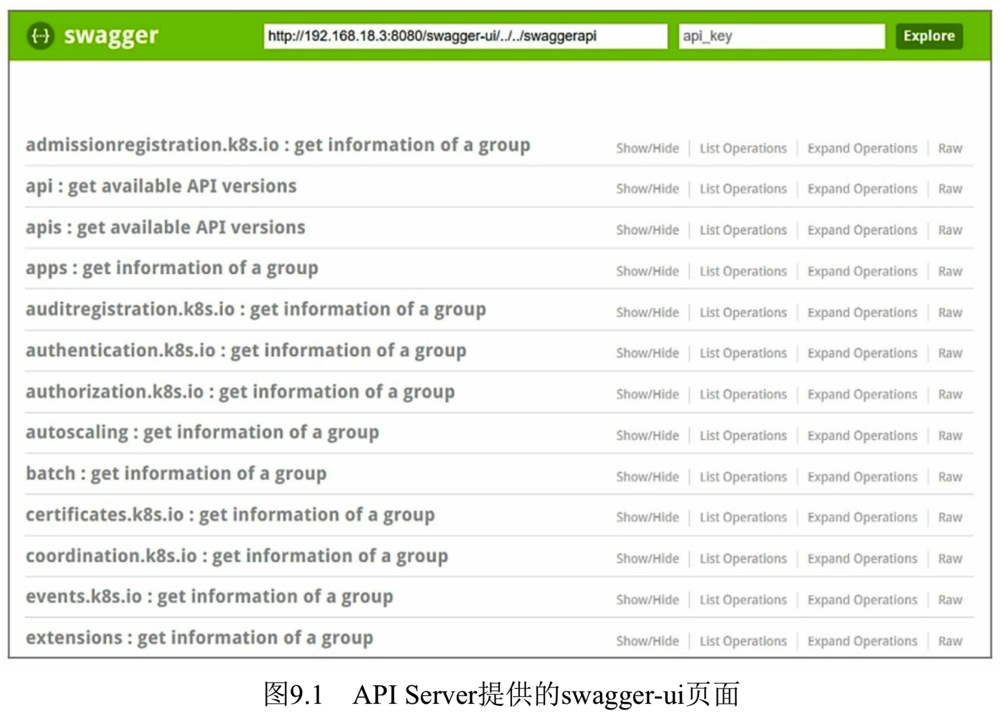

单击 **api/v1** 可以查看**所有API的列表**, 如图9.2所示. 

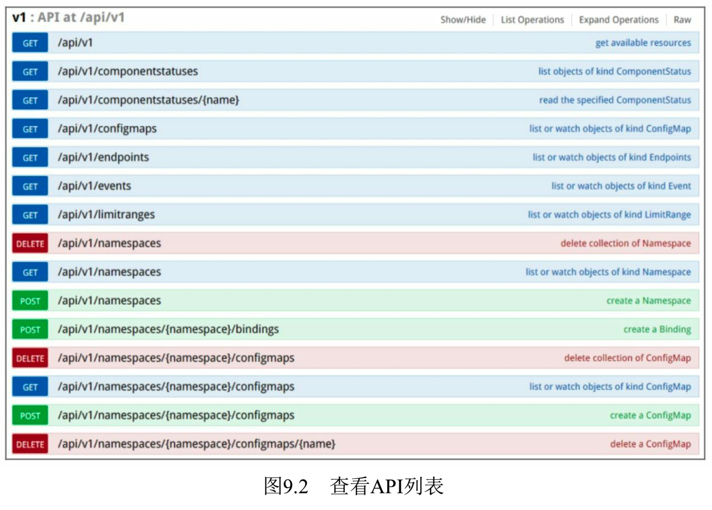

以**创建一个Pod**为例, 找到**Rest API的访问路径**为" /api/v1/namespaces/{namespace}/pods ", 如图9.3所示. 

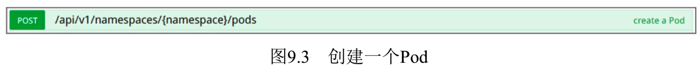

单击链接展开, 即可查看**详细的API接口说明**, 如图9.4所示. 

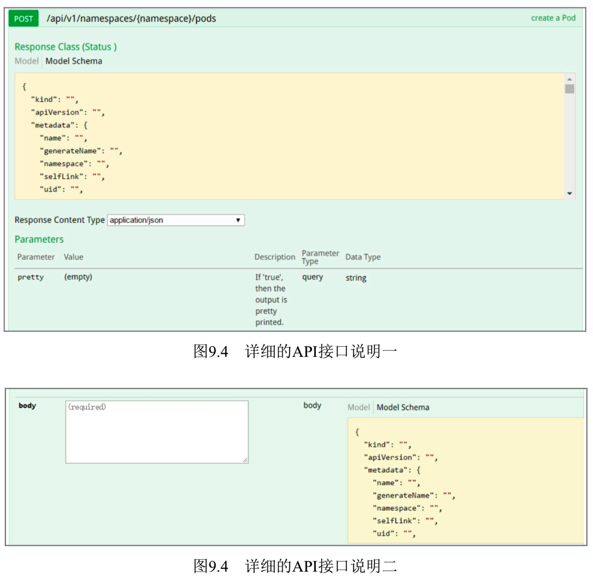

单击**Model链接**, 则可以查看**文本格式**显示的**API接口描述**, 如图9.5所示. 

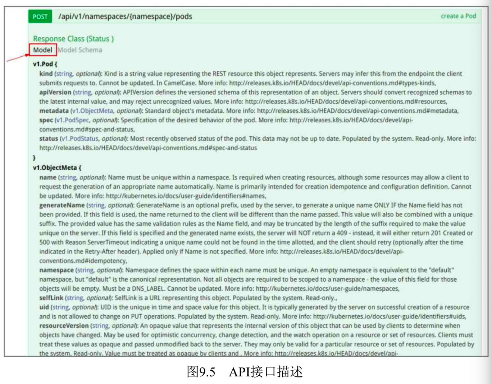

## 1.7. API的5个顶层(Top Level)元素

我们看到, 在Kubernetes API中, **一个API的顶层(Top Level)元素**由**kind**、**apiVersion**、**metadata**、**spec**和**status**这**5部分！！！** 组成, 接下来分别对这5部分进行说明. 

### 1.7.1. Kind

kind表明对象有以下三大类别. 

(1)**对象(objects**): 代表系统中的一个**永久资源(实体**), 例如Pod、RC、Service、Namespace及Node等. 通过操作这些资源的属性, 客户端可以对该对象进行创建、修改、删除和获取操作. 

(2)**列表(list**): **一个或多个资源类别**的**集合**. 所有列表都通过**items域**获得对象数组, 例如PodLists、ServiceLists、NodeLists. 大部分被定义在系统中的对象都有一个返回所有资源集合的端点, 以及零到多个返回所有资源集合的子集的端点. 某些对象有可能是**单例对象(singletons**), 例如当前用户、系统默认用户等, 这些对象没有列表. 

(3)**简单类别(simple**): 该类别包含作用在对象上的特殊行为和非持久实体. 该类别限制了使用范围, 它有一个通用元数据的有限集合, 例如Binding、Status. 

### 1.7.2. apiVersion

apiVersion表明API的版本号, **当前版本默认只支持v1**. 

### 1.7.3. Metadata

Metadata是资源对象的**元数据定义**, 是**集合类**的**元素类型**, 包含一组由不同名称定义的属性. 在Kubernetes中**每个资源对象**都**必须**包含以下**3种Metadata**. 

(1)**namespace**: 对象**所属的命名空间**, 如果不指定, 系统则会将对象置于名为**default**的系统命名空间中. 

(2)**name**: 对象的名称, 在**一个命名空间**中名称应具备**唯一性**. 

(3)**uid**: 系统为**每个对象**都生成的**唯一ID**, 符合**RFC 4122规范**的定义. 

此外, **每种对象**都还应该包含以下**几个重要元数据**. 

(1)**labels**: 用户可定义的"**标签**", **键和值**都为**字符串**的map, 是对象进行组织和分类的一种手段, 通常用于**标签选择器**, 用来匹配目标对象. 

(2)**annotations**: 用户可定义的"**注解**", 键和值都为字符串的map, 被Kubernetes内部进程或者某些外部工具使用, 用于存储和获取关于**该对象**的**特定元数据**. 

(3)**resourceVersion**: 用于识别该资源**内部版本号**的字符串, 在用于**Watch操作**时, 可以避免在**GET操作**和**下一次Watch操作**之间造成的**信息不一致**, 客户端可以用它来**判断资源是否改变**. 该值应该**被客户端看作不透明**, 且**不做任何修改**就**返回给服务端**. 客户端不应该假定版本信息具有跨命名空间、跨不同资源类别、跨不同服务器的含义. 

(4)creationTimestamp: 系统记录创建对象时的时间戳, 符合RFC 3339规范. 

(5)deletionTimestamp: 系统记录删除对象时的时间戳, 符合RFC 3339规范. 

(6)selfLink: 通过API访问资源自身的URL, 例如一个Pod的link可能是"/api/v1/namespaces/default/pods/frontend\-o8bg4". 

### 1.7.4. spec

spec是集合类的元素类型, 用户对需要管理的对象进行详细描述的主体部分都在spec里给出, 它会被Kubernetes持久化到etcd中保存, 系统通过spec的描述来创建或更新对象, 以达到用户期望的对象运行状态. spec的内容既包括用户提供的配置设置、默认值、属性的初始化值, 也包括在对象创建过程中由其他相关组件(例如schedulers、auto-scalers)创建或修改的对象属性, 比如Pod的Service IP地址. 如果spec被删除, 那么该对象将会从系统中删除. 

### 1.7.5. Status

Status用于记录对象在系统中的当前状态信息, 它也是集合类元素类型, status在一个自动处理的进程中被持久化, 可以在流转的过程中生成. 如果观察到一个资源丢失了它的状态(Status), 则该丢失的状态可能被重新构造. 以Pod为例, Pod的status信息主要包括conditions、containerStatuses、hostIP、phase、podIP、startTime等, 其中比较重要的两个状态属性如下. 

(1)phase: 描述对象所处的生命周期阶段, phase的典型值是Pending(创建中)、Running、Active(正在运行中)或Terminated(已终结), 这几种状态对于不同的对象可能有轻微的差别, 此外, 关于当前phase附加的详细说明可能包含在其他域中. 

(2)condition: 表示条件, 由条件类型和状态值组成, 目前仅有一种条件类型: Ready, 对应的状态值可以为True、False或Unknown. 一个对象可以具备多种condition, 而condition的状态值也可能不断发生变化, condition可能附带一些信息, 例如最后的探测时间或最后的转变时间. 

## 1.8. 14版本以后: 使用OpenAPI格式查询API

Kubernetes从**1.14版本**开始, 使用**OpenAPI**(https://www.openapis.org)的格式**对API进行查询！！！**, 其访问地址为 http://\<master\-ip\>: \<master\-port\>/openapi/v2. 

例如, 使用命令行工具curl进行查询: 

```
# curl http://192.168.18.3:8080/openapi/v2 | jq
```


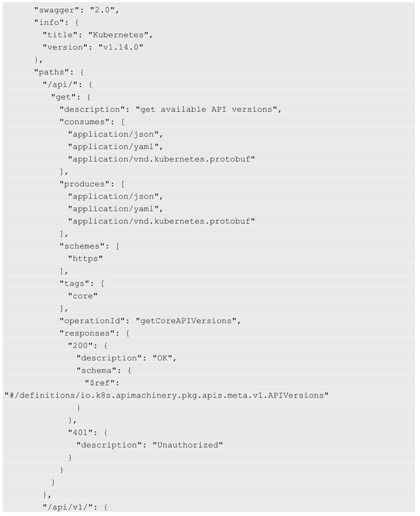

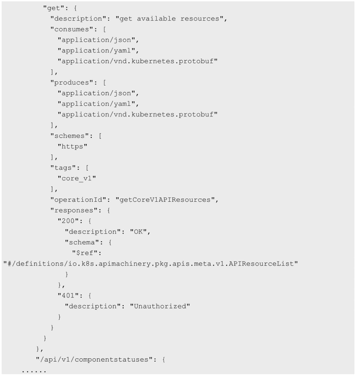

# 2. Kubernetes API版本的演进策略

为了在**兼容旧版本**的同时**不断升级新的API**, Kubernetes提供了**多版本API的支持能力**, **每个版本的API**都通过一个**版本号路径前缀！！！** 进行区分, 例如/**api/v1beta3**. 在通常情况下, **新旧几个不同的API版本**都能涵盖**所有的Kubernetes资源对象**, 在不同的版本之间, 这些API接口存在一些细微差别. 

Kubernetes开发团队基于**API级别！！！** 选择**版本**而**不是基于资源和域级别**, 是为了确保API能够清晰、连续地描述一个系统资源和行为的视图, 能够控制访问的整个过程和控制实验性API的访问. 

## 2.1. 不同的API版本号表示不同级别

API的版本号通常用于描述API的成熟阶段, 例如: 

* **v1**表示**GA稳定版本**; 
* **v1beta3**表示**Beta版本**(**预发布版本**); 
* **v1alpha1**表示**Alpha版本**(**实验性的版本**). 

## 2.2. API更新和废弃策略

当**某个API**的实现达到一个**新的GA稳定版本**时(如**v2！！！**), **旧的GA版本**(如**v1！！！**)和**Beta版本**(例如**v2beta1**)将**逐渐被废弃**, Kubernetes建议废弃的时间如下. 

* 对于**旧的GA版本(如v1**), Kubernetes建议废弃的时间应**不少于12个月**或**3个大版本Release的时间**, 选择最长的时间. 
* 对旧的**Beta版本**(如v2beta1), Kubernetes建议废弃的时间应**不少于9个月**或**3个大版本Release的时间**, 选择最长的时间. 
* 对旧的Alpha版本, 则无须等待, 可以直接废弃. 

完整的API更新和废弃策略请参考官方网站 https://kubernetes.io/docs/reference/usingapi/deprecation-policy/ 的说明. 

# 3. API Groups(API组)

为了**更容易对API进行扩展**, Kubernetes使用**API Groups(API组**)进行**标识！！！**. **API Groups**以**REST URL**中的路径进行定义. 

## 3.1. 两类API Groups

当前支持**两类API groups**. 

* **Core Groups(核心组**), 也可以称之为**Legacy Groups**, 作为Kubernetes最核心的API, 其**特点**是**没有"组"的概念**, 例如"**v1**", 在**资源对象的定义**中表示为"**apiVersion:v1**". 
* **具有分组信息的API**, 以/**apis/\$GROUP\_NAME/\$VERSION** URL路径**进行标识**, 在**资源对象的定义**中表示为"**apiVersion: \$GROUP\_NAME/\$VERSION**", 例如: "**apiVersion:batch/v1**""apiVersion:extensions:v1beta1""apiVersion:apps/v1beta1"等, 详细的**API列表**请参见官网 https://kubernetes.io/docs/reference , 目前根据Kubernetes的不同版本有不同的API说明页面. 

例如, **Pod的API说明**如图9.6所示, 由于**Pod属于核心资源对象**, 所以**不存在某个扩展API Group**, 页面显示为**Core**, 在Pod的定义中为"apiVersion: v1". 

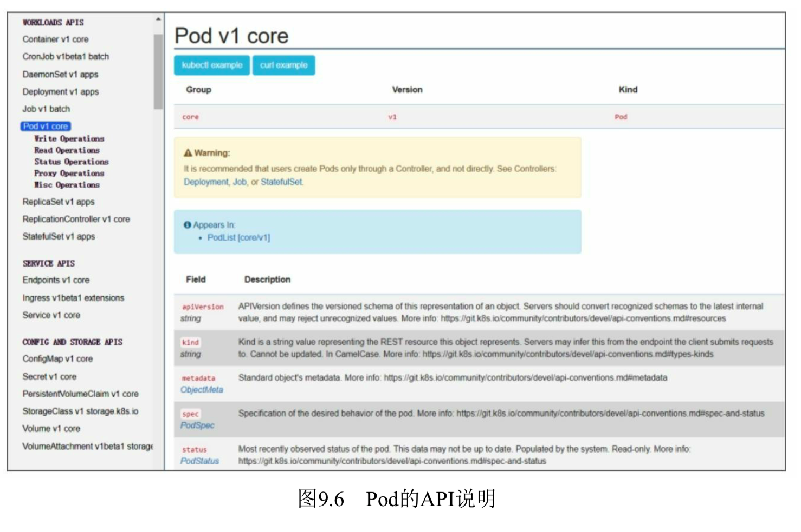

StatefulSet则属于名为**apps的API组**, 版本号为v1, 在StatefulSet的定义中为"apiVersion: apps/v1", 如图9.7所示. 

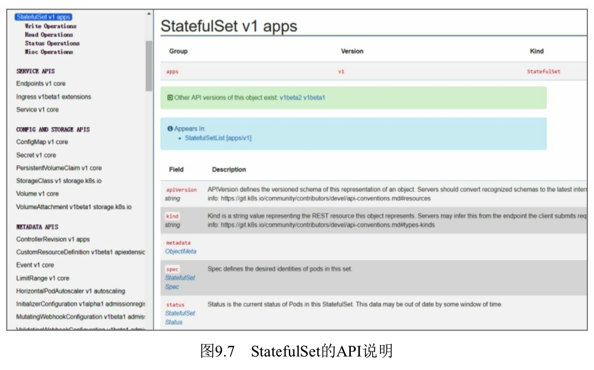

## 3.2. 启用或禁用特定的API组

如果要启用或禁用特定的API组, 则需要在**API Server**的**启动参数**中设置\-\-**runtime\-config**进行声明.

例如, 

* \-\-runtime\-config=batch/v2alpha1表示启用API组"batch/v2alpha1"; 
* 也可以设置\-\-runtime\-config=batch/v1=false表示禁用API组"batch/v1". 

**多个API组**的设置以**逗号分隔**. 

在当前的API Server服务中, DaemonSets、Deployments、HorizontalPodAutoscalers、Ingress、Jobs和ReplicaSets所属的**API组**是默认启用的. 

# 4. API REST的方法说明

## 4.1. 对资源对象的操作方法

API资源使用**REST模式**, 对**资源对象**的操作方法如下. 

(1)**GET** /<资源名的**复数格式**>: 获得**某一类型的资源列表**, 例如GET /pods返回一个Pod资源列表. 

(2)**POST** /<资源名的**复数格式**>: **创建一个资源**, 该资源来自用户提供的JSON对象. 

(3)**GET** /<资源名**复数格式**>/<**名称**>: 通过给出的名称获得**单个资源**, 例如GET/pods/first返回一个**名为first**的Pod. 

(4)**DELETE** /<资源名**复数格式**>/<**名称**>: 通过给出的名称**删除单个资源**, 在**删除选项(DeleteOptions**)中可以指定**优雅删除(Grace Deletion**)的**时间(GracePeriodSeconds**), 该选项表明了从服务端接收到删除请求到资源被删除的时间间隔(单位为s). **不同的类别(Kind**)可能为优雅删除时间(Grace Period)声明默认值. 用户提交的优雅删除时间将覆盖该默认值, 包括值为0的优雅删除时间. 

(5)**PUT** /<资源名复数格式>/<**名称**>: 通过**给出的资源名**和客户端提供的**JSON对象**来**更新**或**创建资源**. 

(6)**PATCH** /<资源名复数格式>/<**名称**>: 选择**修改资源详细指定的域**. 

对于**PATCH操作**, 目前Kubernetes API通过相应的**HTTP首部"Content\-Type**"对其进行识别. 

## 4.2. 三种类型的PATCH操作(修改资源详细域)

目前支持以下**三种类型的PATCH操作**. 

(1)**JSON Patch**, Content\-Type: application/**json\-patch** \+ json. 在RFC6902的定义中, JSON Patch是执行**在资源对象上**的一系列操作, 例如 {"op": "add", "path": "/a/b/c", "value": \["foo","bar"]}. 详情请查看RFC6902说明, 网址为 https://tools.ietf.org/html/rfc6902 . 

(2)**Merge Patch**, Content\-Type: application/**merge\-json\-patch** \+ json. 在RFC7386的定义中, Merge Patch**必须**包含对**一个资源对象的部分描述**, 这个资源对象的部分描述就是一个JSON对象. 该JSON对象被提交到服务端, 并**和服务端的当前对象合并**, 从而创建一个新的对象. 详情请查看RFC73862说明, 网址为 https://tools.ietf.org/html/rfc7386 . 

(3)**Strategic Merge Patch**, Content\-Type: application/**strategic\-merge\-patch** \+ json. Strategic Merge Patch是一个**定制化的Merge Patch实现**. 接下来将详细讲解Strategic Merge Patch. 

在标准的JSON Merge Patch中, **JSON对象总被合并(Merge**), 但是**资源对象**中的**列表域**总被**替换**, 用户通常不希望如此. 例如, 我们通过下列定义创建一个Pod资源对象: 

```yaml
spec:
  containers:
    - name: nginx
      image: nginx-1.0
```

接着, 我们希望添加一个容器到这个Pod中, 代码和上传的JSON对象如下: 

```
PATCH /api/v1/namespaces/default/pods/pod-name
spec:
  containers:
    - name: log-tailer
      image: log-tailer-1.0
```

如果我们使用**标准的Merge Patch**, 则其中的**整个容器列表**将被**单个"log\-tailer"容器**所**替换**, 然而我们的目的是**使两个容器列表合并**. 

为了解决这个问题, **Strategic Merge Patch**添加**元数据到API对象**中, 并通过这些新元数据来决定**哪个列表被合并**, **哪个列表不被合并**. 当前这些元数据作为结构标签, 对于API对象自身来说是合法的. 对于客户端来说, 这些元数据作为Swagger annotations也是合法的. 在上述例子中向containers中添加了patchStrategy域, 且它的值为merge, 通过添加patchMergeKey, 它的值为name. 也就是说, **containers**中的列表将会**被合并而不是替换**, 合并的依据为name域的值. 

## 4.3. 资源变动的观察者API

此外, Kubernetes API添加了**资源变动**的**观察者模式**的API接口. 

* GET /watch/<资源名复数格式>: 随**时间变化**, **不断接收**一连串的**JSON对象**, 这些JSON对象记录了**给定资源类别内所有资源对象的变化情况**. 
* GET /watch/<资源名复数格式>/\<name\>: 随时间变化, 不断接收一连串的JSON对象, 这些JSON对象记录了**某个给定资源对象**的变化情况. 

上述接口**改变了返回数据的基本类别**, watch动词返回的是**一连串JSON对象**, 而**不是单个JSON对象**. 并**不是所有对象类别**都支持观察者模式的API接口, 在后续的章节中将会说明哪些资源对象支持这种接口. 

## 4.4. 特殊的API接口

另外, Kubernetes还增加了**HTTP Redirect**与**HTTP Proxy**这两种**特殊的API接口**, 前者实现**资源重定向访问**, 后者则实现**HTTP请求的代理**. 

# 5. API Server响应说明

API Server在响应用户请求时**附带一个状态码**, 该状态码**符合HTTP规范**. 表9.1列出了API Server可能返回的状态码. 

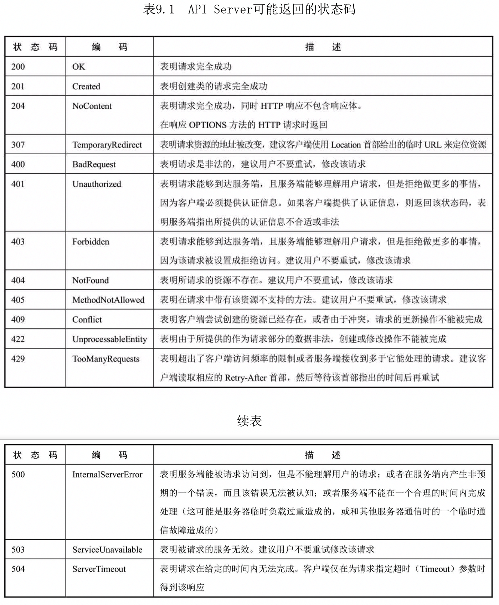

在调用API接口**发生错误**时, Kubernetes将会返回一个**状态类别(Status Kind**). 下面是两种常见的错误场景. 

(1)当一个**操作不成功**时(例如, 当服务端返回一个非2xx HTTP状态码时). 

(2)当一个HTTP **DELETE方法调用失败**时. 

**状态对象**被编码成**JSON格式**, 同时**该JSON对象**被作为**请求的响应体**. 该状态对象包含人和机器使用的域, 在这些域中包含来自API的关于失败原因的详细信息. 状态对象中的信息补充了对HTTP状态码的说明. 例如: 

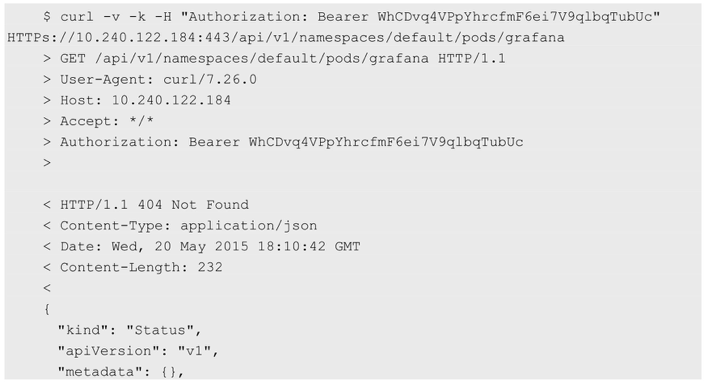

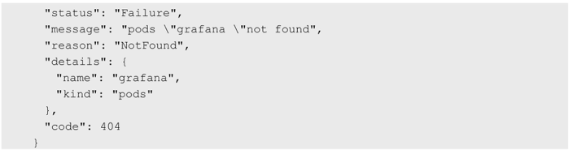

其中: 

* status域包含两个可能的值: Success或Failure. 
* message域包含对错误的描述信息. 
* reason域包含说明该操作失败原因的描述. 
* details可能包含和reason域相关的扩展数据. 每个reason域都可以定义它的扩展的details域. 该域是可选的, 返回数据的格式是不确定的, 不同的reason类型返回的details域的内容不一样. 
