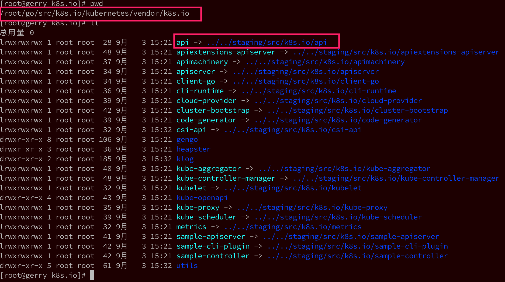

<!-- @import "[TOC]" {cmd="toc" depthFrom=1 depthTo=6 orderedList=false} -->

<!-- code_chunk_output -->

- [1. 环境准备](#1-环境准备)
  - [1.1. golang安装与配置](#11-golang安装与配置)
- [2. 源码下载](#2-源码下载)
- [3. 源码编译](#3-源码编译)
  - [3.1. Make方式](#31-make方式)

<!-- /code_chunk_output -->

# 1. 环境准备

操作系统: Linux作为k8s源码分析和调试环境, 这里使用CentOS

## 1.1. golang安装与配置

见Golang部分

# 2. 源码下载

在上面我们设置的**GOPATH目录**下, 新建文件夹: \$**GOPATH/src/k8s.io/kubernetes**; 

```
# mkdir -p $GOPATH/src/k8s.io/kubernetes

# cd $GOPATH/src/k8s.io/kubernetes

# git clone https://github.com/kubernetes/kubernetes.git

# git checkout -b release-1.13 origin/release-1.13
```

下载后本地目录

```
[root@gerry kubernetes]# ls
api                cmd                 LICENSE                   pkg                test
build              code-of-conduct.md  logo                      plugin             third_party
BUILD.bazel        CONTRIBUTING.md     Makefile                  README.md          translations
CHANGELOG-1.13.md  docs                Makefile.generated_files  SECURITY_CONTACTS  vendor
CHANGELOG.md       Godeps              OWNERS                    staging            WORKSPACE
cluster            hack                OWNERS_ALIASES            SUPPORT.md
```

# 3. 源码编译

Kubernetes支持两种编译: 

* 在docker容器中编译
* 本地环境编译

参见: https://github.com/kubernetes/community/blob/master/contributors/devel/development.md

更多build信息见: https://git.k8s.io/kubernetes/build/README.md

我们先看一下几个主要的目录: 

目录名 | 用途
----|---
cmd | 每个组件代码入口(main函数)
pkg | 各个组件的具体功能实现
staging | 已经分库的项目
vendor | 依赖

考虑到国内网络环境等因素, 我们**不使用容器化方式构建**. 

我们尝试在kubernetes项目**cmd目录**下**构建一个组件**(执行路径: /root/go/src/k8s.io/kubernetes/cmd/kube\-scheduler): 

```
# cd /root/go/src/k8s.io/kubernetes/cmd/kube-scheduler
# ls
app  BUILD  OWNERS  scheduler.go
# go build .
# ls
app  BUILD  kube-scheduler  OWNERS  scheduler.go
```

这里需要注意一下, 如果报**依赖错误**, 找不到k8s.io下的某些项目, 就到vendor下看一下**软链接是不是都还在**, 如下: 



注意到k8s是使用这种方式解决k8s.io下的依赖问题的, 如果我们在windows下下载的代码, 然后copy到linux下, 就很容易遇到这些软链接丢失的情况, 导致go找不到依赖, 编译失败. 

## 3.1. Make方式

验证当前设置的最佳方法是构建Kubernetes的一部分. 这样就可以在不用完整构建了

要构建特定部分, 在Kubernetes根目录下, 使用`WHAT`环境变量让构建脚本知道只想构建某个包/可执行文件.

```
# make WHAT=cmd/{$package_you_want}
```

注: 这只适合Kubernetes/cmd下的所有顶级文件夹

对于cli, 可以运行

```
# make WHAT=cmd/kubectl
+++ [0912 11:32:34] Building go targets for linux/amd64:
    ./vendor/k8s.io/code-generator/cmd/deepcopy-gen
+++ [0912 11:32:40] Building go targets for linux/amd64:
    ./vendor/k8s.io/code-generator/cmd/defaulter-gen
+++ [0912 11:32:44] Building go targets for linux/amd64:
    ./vendor/k8s.io/code-generator/cmd/conversion-gen
+++ [0912 11:32:48] Building go targets for linux/amd64:
    ./vendor/k8s.io/kube-openapi/cmd/openapi-gen
2019/09/12 11:32:54 Code for OpenAPI definitions generated
+++ [0912 11:32:54] Building go targets for linux/amd64:
    ./vendor/github.com/jteeuwen/go-bindata/go-bindata
+++ [0912 11:32:56] Building go targets for linux/amd64:
    cmd/kubectl
```

在`_output/bin`目录中有一个可执行文件

```
# ll _output/bin/
-rwxr-xr-x 1 root root  6004896 9月  12 11:32 conversion-gen
-rwxr-xr-x 1 root root  6004800 9月  12 11:32 deepcopy-gen
-rwxr-xr-x 1 root root  5988448 9月  12 11:32 defaulter-gen
-rwxr-xr-x 1 root root  4709220 9月  12 11:32 go2make
-rwxr-xr-x 1 root root  2055040 9月  12 11:32 go-bindata
-rwxr-xr-x 1 root root 41373344 9月  12 11:33 kubectl
-rwxr-xr-x 1 root root 11138112 9月  12 11:32 openapi-gen
```

............