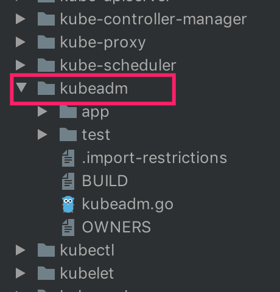

<!-- @import "[TOC]" {cmd="toc" depthFrom=1 depthTo=6 orderedList=false} -->

<!-- code_chunk_output -->

- [1. 概述](#1-概述)
- [2. kubeadm简介](#2-kubeadm简介)

<!-- /code_chunk_output -->

# 1. 概述

大家注意哦, **不一定**要**先搭建好环境**再**看源码**, 大可以先看一个组件, 感觉差不多理解了, 想要run一把, 想要改几行试试的时候回过头来搭建k8s环境. 

当然, 大家开始看源码的时候, 我相信各位都是搭建过不少次k8s集群, 敲过N多次kubectl命令了, 所以下面我不会解释太基础的命令是做什么的. 

# 2. kubeadm简介

kubeadm是Kubernetes官方提供的用于快速安装Kubernetes集群的工具, 这不是一个单独的项目哦, 我们在kubernetes源码里可以看到这个组件(**kubernetes/cmd/kubeadm**/): 

kubeadm这个工具可以通过简单的kubeadm init和kubeadm join命令来创建一个kubernetes集群, kubeadm提供的其他命令都比较通俗易懂: 

* kubeadm init 启动一个**master节点**; 
* kubeadm join 启动一个**node节点**, 加入master; 
* kubeadm upgrade 更新**集群版本**; 
* kubeadm config 从1.8.0版本开始已经用处不大, 可以**用来view一下配置**; 
* kubeadm token 管理kubeadm join的token; 
* kubeadm reset 把kubeadm init或kubeadm join做的**更改恢复原状**; 
* kubeadm version **打印版本信息**; 
* kubeadm alpha 预览一些alpha特性的命令. 

关于kubeadm的成熟度官方有一个表格: 

Area | Maturity Level
-----|---------------
Command line UX | GA
Implementation | GA
Config file API | beta
CoreDNS | GA
kubeadm alpha subcommands | alpha
High availability | alpha
DynamicKubeletConfig | alpha
Self-hosting | alpha

