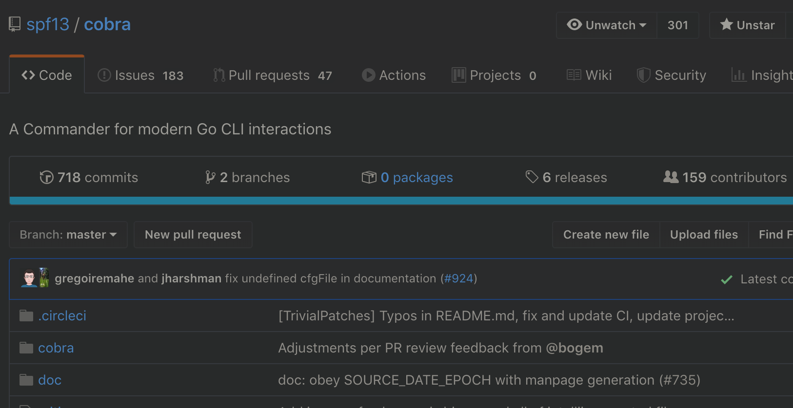
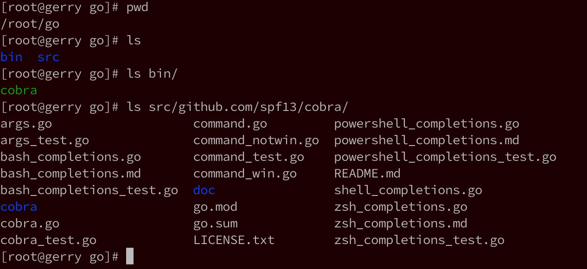
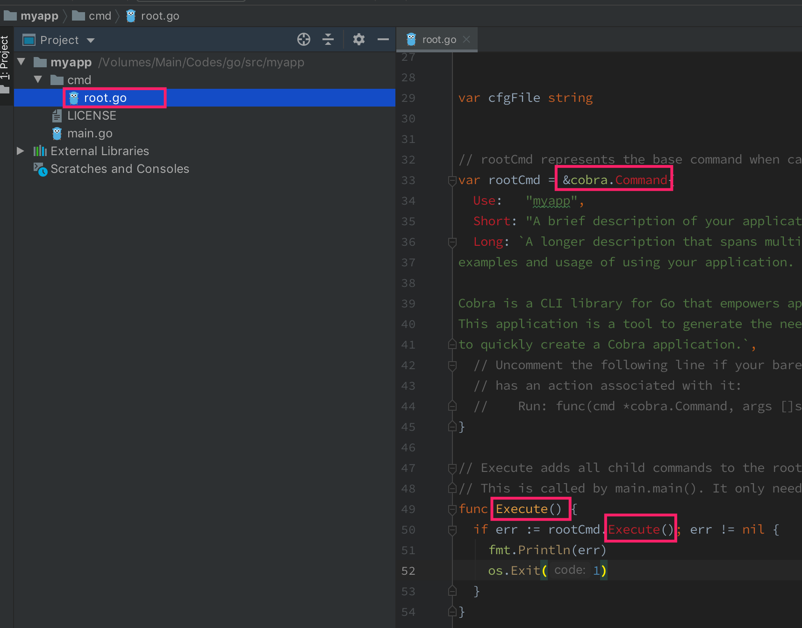
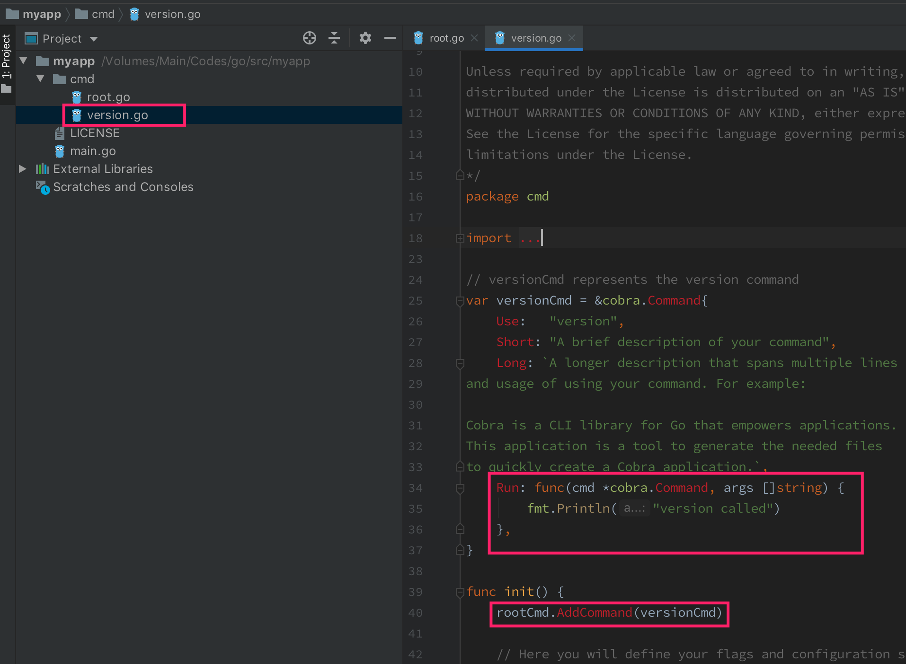

<!-- @import "[TOC]" {cmd="toc" depthFrom=1 depthTo=6 orderedList=false} -->

<!-- code_chunk_output -->

- [1. 概述](#1-概述)
- [2. cobra和main](#2-cobra和main)
  - [2.1. cobra是啥](#21-cobra是啥)
  - [2.2. 使用cobra](#22-使用cobra)
  - [2.3. Scheduler的main](#23-scheduler的main)
    - [2.3.1. 入口和初始化](#231-入口和初始化)
      - [2.3.1.1. 入口: cmd/kube-scheduler/scheduler.go](#2311-入口-cmdkube-schedulerschedulergo)
      - [2.3.1.2. 处理配置: cmd/kube-scheduler/app/server.go](#2312-处理配置-cmdkube-schedulerappservergo)
    - [sched定义: pkg/scheduler/scheduler.go](#sched定义-pkgschedulerschedulergo)

<!-- /code_chunk_output -->

# 1. 概述

scheduler程序可以分为三层, 第一层是**调度器启动前的逻辑**, 包括**命令行参数解析**、**参数校验**、**调度器初始化**等一系列逻辑. 这个部分我不会太详细地介绍, 因为这些代码位于调度框架之前, 相对比较枯燥无趣

# 2. cobra和main

如果你之前没有用过cobra, 那么在第一次见到cobra之后, 很可能以后你自己写的程序, 开发的小工具会全部变成cobra风格. 

## 2.1. cobra是啥



Cobra官方描述是: 

> Cobra is both a library for creating powerful modern CLI applications as well as a program to generate applications and command files.

也就是这个意思: Cobra既是一个**创建强大的现代化命令行程序的库**, 又是一个用于**生成应用和命令行文件的程序**. 

有很多流行的**Go项目用了Cobra**, 其中当然包括我们最最熟知的k8s和docker, 大致列出来有这些: 

- Kubernetes
- Hugo
- rkt
- etcd
- Moby (former Docker)
- Docker (distribution)
- OpenShift
- Delve
- GopherJS
- CockroachDB
- Bleve
- ProjectAtomic (enterprise)
- Giant Swarm's gsctl
- Nanobox/Nanopack
- rclone
- nehm
- Pouch

## 2.2. 使用cobra

下面我们实践一下cobra, 先下载这个项目编译一下: 

```shell
# 如果你的网络很给力, 那么下面这个命令就够了; 
go get -u github.com/spf13/cobra/cobra
# 如果你的网络不给力, 那就下载cobra的zip包, 丢到GOPATH下对应目录, 然后解决依赖, 再build
```

于是我们得到了这样一个可执行文件及项目源码: 



我们试一下这个命令: `cobra init ${project-name}`

```shell
# cobra init --pkg-name myapp /root/go/src/myapp
Your Cobra application is ready at
/root/go/src/myapp

# ls -Ra /root/go/src/myapp
/root/go/src/myapp:
.  ..  cmd  LICENSE  main.go

/root/go/src/myapp/cmd:
.  ..  root.go
```

如上, 本地可以看到一个main.go和一个cmd目录, 这个cmd和k8s源码里的cmd很像

main.go里面的代码很精简, 如下: 

```go
package main

import "myapp/cmd"

func main() {
        cmd.Execute()
}
```

这里注意到调用了一个cmd的Execute()方法, 我们继续看cmd是什么: 



如上图, 在`main.go`里面import了`myapp/cmd`, 也就是这个`root.go`文件. 所以Execute()函数就很好找了. 在`Execute`里面调用了`rootCmd.Execute()`方法, 这个`rootCmd`是`*cobra.Command`类型的. 我们关注一下这个类型. 

下面我们继续使用cobra命令给myapp添加一个子命令: 

```
[root@gerry myapp]# ls
cmd  LICENSE  main.go
[root@gerry myapp]# cobra add version
version created at /root/go/src/myapp
[root@gerry myapp]# go run main.go version
version called
```

如上, 我们的程序可以使用version子命令了！我们看一下源码发生了什么变化: 



多了一个`version.go`, 在这个源文件的init()函数里面调用了一个`rootCmd.AddCommand(versionCmd)`, 这里可以猜到是根命令下添加一个子命令的意思, 根命令表示的就是我们直接执行这个可执行文件, 子命令就是version, 放在一起的感觉就类似大家使用`kubectl version`的感觉. 

另外注意到这里的**Run属性是一个匿名函数**, 这个函数中输出了"version called"字样, 也就是说我们执行version子命令的时候其实是调用到了这里的Run.

最后我们实践一下多级子命令: 

```
[root@gerry myapp]# cobra add server
server created at /root/go/src/myapp
[root@gerry myapp]# cobra add create -p serverCmd
create created at /root/go/src/myapp
[root@gerry myapp]# ls cmd/
create.go  root.go  server.go  version.go
```

套路也就这样, 通过`serverCmd.AddCommand(createCmd)`调用后就能够把`*cobra.Command`类型的createCmd变成serverCmd的子命令了, 这个时候我们玩起来就像`kubectl get pods`.

行, 看到这里我们回头看一下scheduler的源码就能找到**main的逻辑**了. 

## 2.3. Scheduler的main

### 2.3.1. 入口和初始化

#### 2.3.1.1. 入口: cmd/kube-scheduler/scheduler.go

我们打开文件: `cmd/kube-scheduler/scheduler.go`可以找到scheduler的main()函数, 很简短, 去掉枝干后如下: 

```go
// 这是关键, 表明入口
package main

// cmd/kube-scheduler/scheduler.go:34
func main() {
	command := app.NewSchedulerCommand()
	if err := command.Execute(); err != nil {
		fmt.Fprintf(os.Stderr, "%v\n", err)
		os.Exit(1)
	}
}
```

看到这里猜都能猜到`kube-scheduler`这个**二进制文件**在运行的时候是调用了`command.Execute()`函数背后的那个Run, 那个Run躲在`command := app.NewSchedulerCommand()`这行代码调用的`NewSchedulerCommand()`方法里, 这个方法一定返回了一个\***cobra.Command类型**的对象. 

看一下: 

```go
// cmd/kube-scheduler/app/server.go:70
/ NewSchedulerCommand creates a *cobra.Command object with default parameters
func NewSchedulerCommand() *cobra.Command {
	cmd := &cobra.Command{
		Use: "kube-scheduler",
		Long: `The Kubernetes scheduler is a policy-rich, topology-aware,
workload-specific function that significantly impacts availability, performance,
and capacity. The scheduler needs to take into account individual and collective
resource requirements, quality of service requirements, hardware/software/policy
constraints, affinity and anti-affinity specifications, data locality, inter-workload
interference, deadlines, and so on. Workload-specific requirements will be exposed
through the API as necessary.`,
		Run: func(cmd *cobra.Command, args []string) {
			if err := runCommand(cmd, args, opts); err != nil {
				fmt.Fprintf(os.Stderr, "%v\n", err)
				os.Exit(1)
			}
		},
	}
	return cmd
}
```

#### 2.3.1.2. 处理配置: cmd/kube-scheduler/app/server.go

如上, 同样我先删掉了一些枝干代码, 剩下的可以很清楚地看到, schduler启动时调用了`runCommand(cmd, args, opts)`, 这个函数在哪里呢, 继续跟一下: 

```go
// cmd/kube-scheduler/app/server.go:117
// runCommand runs the scheduler.
func runCommand(cmd *cobra.Command, args []string, opts *options.Options) error {
	c, err := opts.Config()
	stopCh := make(chan struct{})
	// Get the completed config
	cc := c.Complete()
	return Run(cc, stopCh)
}
```

如上, 可以看到这里是**处理配置问题**后调用了一个Run()函数, Run()的作用是基于给定的配置**启动scheduler**, 它只会在出错时或者channel stopCh被关闭时才退出, 代码主要部分如下: 

```go
// cmd/kube-scheduler/app/server.go:167
// Run executes the scheduler based on the given configuration. It only return on error or when stopCh is closed.
func Run(cc schedulerserverconfig.CompletedConfig, stopCh <-chan struct{}) error {
	// Create the scheduler.
	sched, err := scheduler.New(cc.Client,
		cc.InformerFactory.Core().V1().Nodes(),
		stopCh,
		scheduler.WithName(cc.ComponentConfig.SchedulerName))
	
	// Prepare a reusable runCommand function.
	run := func(ctx context.Context) {
		sched.Run()
		<-ctx.Done()
	}

	ctx, cancel := context.WithCancel(context.TODO()) 
	defer cancel()

	go func() {
		select {
		case <-stopCh:
			cancel()
		case <-ctx.Done():
		}
	}()

	// Leader election is disabled, so runCommand inline until done.
	run(ctx)
	return fmt.Errorf("finished without leader elect")
}
```

可以看到这里最终是要跑`sched.Run()`这个方法来启动scheduler, `sched.Run()`方法已经在**pkg下**, 具体位置是`pkg/scheduler/scheduler.go:276`, 也就是**scheduler框架**真正运行的逻辑了. 

于是我们已经从main出发, 找到了scheduler主框架的入口, 具体的scheduler逻辑下面分析. 

### sched定义: pkg/scheduler/scheduler.go

最后我们来看一下sched的定义, 在linux里我们经常会看到一些软件叫做**什么什么d**, d也就是daemon, **守护进程**的意思, 也就是一直跑在后台的一个程序. 

这里的sched也就是"scheduler daemon"的意思. sched的其实**是`*Scheduler`类型**, 定义在: 

```go
// pkg/scheduler/scheduler.go:58
// Scheduler watches for new unscheduled pods. It attempts to find
// nodes that they fit on and writes bindings back to the api server.
type Scheduler struct {
	config *factory.Config
}
```

如上, 注释也很清晰, 说Scheduler **watch新创建的未被调度的pods**, 然后尝试**寻找合适的node**, **回写一个绑定关系**到**api server**.这里也可以体会到daemon的感觉, 我们平时搭建的k8s集群中运行着一个**daemon进程**叫做**kube\-scheduler！！！**, 这个一直跑着的进程做的就是上面注释里说的事情, 在程序里面也就**对应这样一个对象！！！**: **Scheduler**.

Scheduler结构体中的**Config对象**我们再简单看一下: 

```go
// pkg/scheduler/factory/factory.go:96
// Config is an implementation of the Scheduler's configured input data.
type Config struct {
	// It is expected that changes made via SchedulerCache will be observed
	// by NodeLister and Algorithm.
	SchedulerCache schedulerinternalcache.Cache
	// Ecache is used for optimistically invalid affected cache items after
	// successfully binding a pod
	Ecache     *equivalence.Cache
	NodeLister algorithm.NodeLister
	Algorithm  algorithm.ScheduleAlgorithm
	GetBinder  func(pod *v1.Pod) Binder
	// PodConditionUpdater is used only in case of scheduling errors. If we succeed
	// with scheduling, PodScheduled condition will be updated in apiserver in /bind
	// handler so that binding and setting PodCondition it is atomic.
	PodConditionUpdater PodConditionUpdater
	// PodPreemptor is used to evict pods and update pod annotations.
	PodPreemptor PodPreemptor

	// NextPod should be a function that blocks until the next pod
	// is available. We don't use a channel for this, because scheduling
	// a pod may take some amount of time and we don't want pods to get
	// stale while they sit in a channel.
	NextPod func() *v1.Pod

	// SchedulingQueue holds pods to be scheduled
	SchedulingQueue internalqueue.SchedulingQueue
}
```

如上, 同样我只保留了一些好理解的字段, 我们随便扫一下可以看到譬如: **SchedulingQueue**、**NextPod**、**NodeLister**这些很容易从字面上理解的字段, 也就是Scheduler对象在工作(完成调度这件事)中需要用到的一些对象. 