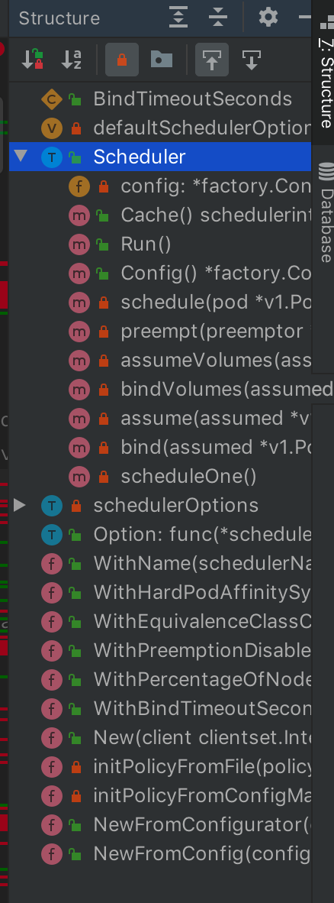

<!-- @import "[TOC]" {cmd="toc" depthFrom=1 depthTo=6 orderedList=false} -->

<!-- code_chunk_output -->

- [1. 调度器框架](#1-调度器框架)
  - [1.1. 写在前面](#11-写在前面)
  - [1.2. 调度器启动运行](#12-调度器启动运行)
  - [1.3. 一个pod的调度流程](#13-一个pod的调度流程)
  - [1.4. 潜入第三层前的一点逻辑](#14-潜入第三层前的一点逻辑)

<!-- /code_chunk_output -->

# 1. 调度器框架

## 1.1. 写在前面

今天我们从**pkg/scheduler/scheduler.go**出发, 分析Scheduler的**整体框架**. 

前面讲Scheduler设计的时候有提到过**源码的3层结构**, `pkg/scheduler/scheduler.go`也就是中间这一层, 负责Scheduler**除了具体node过滤算法外的工作逻辑**~

这一层我们先尽可能找主线, 顺着主线走通一遍, 就像走一个迷宫, 一条通路走出去后心里就有地了, 但是迷宫中的很多角落是未曾涉足的. 我们尽快走通主流程后, 再就一些主要知识点专题攻破, 比如k8s里面的List\-Watch, Informer等好玩的东西. 

## 1.2. 调度器启动运行

从goland的Structure中可以看到这个源文件(*pkg/scheduler/scheduler.go*)主要有这些对象: 



大概浏览一下可以很快找到我们的第一个关注点应该是**Scheduler这个struct**和**Scheduler的Run()方法**: 

```go

// pkg/scheduler/scheduler.go:58

// Scheduler watches for new unscheduled pods. It attempts to find
// nodes that they fit on and writes bindings back to the api server.
type Scheduler struct {
	config *factory.Config
}
```

这个struct在上一讲有跟到过, 代码注释说的是: 

> Scheduler watch新创建的未被调度的pods, 然后尝试寻找合适的node, **回写一个绑定关系**到**api server**.

这个注释有个小问题就是用了复数形式, 其实最后过滤出来的**只有一个node**; 当然这种小问题知道就好, 提到github上人家会觉得你在刷commit.

接着往下看, **Scheduler绑定了一个Run()方法**, 如下: 

```go
// pkg/scheduler/scheduler.go:276

// Run begins watching and scheduling. It waits for cache to be synced, then starts a goroutine and returns immediately.
func (sched *Scheduler) Run() {
	if !sched.config.WaitForCacheSync() {
		return
	}
	go wait.Until(sched.scheduleOne, 0, sched.config.StopEverything)
}
```

注释说这个函数开始**watching and scheduling**, 也就是**调度器主要逻辑**了！

注释后半段说到**Run**()方法**起了一个goroutine(协程！！！)** 后**马上返回！！！** 了, 这个怎么理解呢?我们先看一下调用Run的地方: 

```go
// cmd/kube-scheduler/app/server.go:240
	// Prepare a reusable runCommand function.
	run := func(ctx context.Context) {
		sched.Run()
		<-ctx.Done()
	}
```

可以发现调用了**sched.Run**()之后就在**等待ctx.Done**()了, 所以Run中启动的**goroutine自己不退出**就ok. 

goroutine在执行`go wait.Until(sched.scheduleOne, 0, sched.config.StopEverything)`这个语句?

`wait.Until`这个函数做的事情是: **每隔n时间调用f一次**, 除非channel c被关闭. 这里的n就是0, 也就是**一直调用**, 前一次调用返回下一次调用就开始了. 这里的f当然就是`sched.scheduleOne`, c就是`sched.config.StopEverything`.

## 1.3. 一个pod的调度流程

于是我们的关注点就转到了**sched.scheduleOne**这个方法上, 看一下: 

> scheduleOne does the entire scheduling workflow for a single pod.  It is serialized on the scheduling algorithm's host fitting.

注释里说scheduleOne**实现1个pod的完整调度工作流**, 这个过程是**顺序执行！！！** 的, 也就是**非并发的**. 结合前面的`wait.Until`逻辑, 也就是说**前一个pod**的**scheduleOne**一完成, **一个return**, 下一个pod的**scheduleOne**立马接着执行！

这里的串行逻辑也好理解, 如果是**同时调度N个pod**, 计算的时候觉得一个node很空闲, 实际调度过去启动的时候发现别人的一群pod先起来了, 端口啊, 内存啊, 全给你抢走了！所以这里的**调度算法执行过程用串行逻辑**很好理解. 

注意, **调度过程跑完不是说要等pod起来！！！**, **最后一步**是**写一个binding到apiserver！！！**, 所以不会太慢. 

下面我们看一下scheduleOne的主要逻辑: 

```go
// pkg/scheduler/scheduler.go:513
func (sched *Scheduler) scheduleOne() {
	pod := sched.config.NextPod()
	suggestedHost, err := sched.schedule(pod)
    if err != nil {
		if fitError, ok := err.(*core.FitError); ok {
			preemptionStartTime := time.Now()
			sched.preempt(pod, fitError)
		}
		return
	}
	assumedPod := pod.DeepCopy()
	allBound, err := sched.assumeVolumes(assumedPod, suggestedHost)
	err = sched.assume(assumedPod, suggestedHost)
	go func() {
		err := sched.bind(assumedPod, &v1.Binding{
			ObjectMeta: metav1.ObjectMeta{Namespace: assumedPod.Namespace, Name: assumedPod.Name, UID: assumedPod.UID},
			Target: v1.ObjectReference{
				Kind: "Node",
				Name: suggestedHost,
			},
		})
	}()
}
```

上面几行代码只保留了主干, 对于我们理解scheduleOne的过程足够了, 这里来个流程图吧: 


不考虑scheduleOne的所有细节和各种异常情况, 基本是上图的流程了, 主流程的核心步骤当然是`suggestedHost, err := sched.schedule(pod)`这一行, 这里完成了**不需要抢占的场景**下node的计算, 我们耳熟能详的**预选过程**, **优选过程**等就是在这里面. 

## 1.4. 潜入第三层前的一点逻辑

ok, 这时候重点就转移到了`suggestedHost, err := sched.schedule(pod)`这个过程, 强调一下这个过程是"**同步"执行**的. 

```go
// pkg/scheduler/scheduler.go:290
// schedule implements the scheduling algorithm and returns the suggested host.
func (sched *Scheduler) schedule(pod *v1.Pod) (string, error) {
	host, err := sched.config.Algorithm.Schedule(pod, sched.config.NodeLister)
	if err != nil {
		pod = pod.DeepCopy()
		sched.config.Error(pod, err)
		sched.config.Recorder.Eventf(pod, v1.EventTypeWarning, "FailedScheduling", "%v", err)
		sched.config.PodConditionUpdater.Update(pod, &v1.PodCondition{
			Type:          v1.PodScheduled,
			Status:        v1.ConditionFalse,
			LastProbeTime: metav1.Now(),
			Reason:        v1.PodReasonUnschedulable,
			Message:       err.Error(),
		})
		return "", err
	}
	return host, err
}
```

schedule**方法很简短**, 我们关注一下第一行, 调用`sched.config.Algorithm.Schedule()`方法, 入参是**pod**和**nodes**, 返回**一个host**, 继续看一下这个Schedule方法: 

```go
//pkg/scheduler/algorithm/scheduler_interface.go:78
type ScheduleAlgorithm interface {
	Schedule(*v1.Pod, NodeLister) (selectedMachine string, err error)
	Preempt(*v1.Pod, NodeLister, error) (selectedNode *v1.Node, preemptedPods []*v1.Pod, cleanupNominatedPods []*v1.Pod, err error)
	Predicates() map[string]FitPredicate
	Prioritizers() []PriorityConfig
}
```

发现**是个接口**, 这个接口有**4个方法**, 实现`ScheduleAlgorithm`接口的对象意味着知道如何调度pods到nodes上. **默认的实现**是`pkg/scheduler/core/generic_scheduler.go:98 genericScheduler`这个**struct**.

我们先继续看一下`ScheduleAlgorithm`接口定义的4个方法: 

- Schedule() //给定pod和nodes, **计算出一个适合跑pod的node**并返回; 
- Preempt() //抢占
- Predicates() //预选
- Prioritizers() //优选

前面流程里讲到的`sched.config.Algorithm.Schedule()`也就是`genericScheduler.Schedule()`方法了, 这个方法位于: `pkg/scheduler/core/generic_scheduler.go:139`一句话概括这个方法就是: 尝试将**指定的pod**调度到**给定的node列表中的一个**, 如果成功就返回这个node的名字. 

最后看一眼签名: 

```go
func (g *genericScheduler) Schedule(pod *v1.Pod, nodeLister algorithm.NodeLister) (string, error)
```

从如参和返回值其实可以猜到很多东西, 行, 今天就到这里, 具体的逻辑下回我们再分析~
