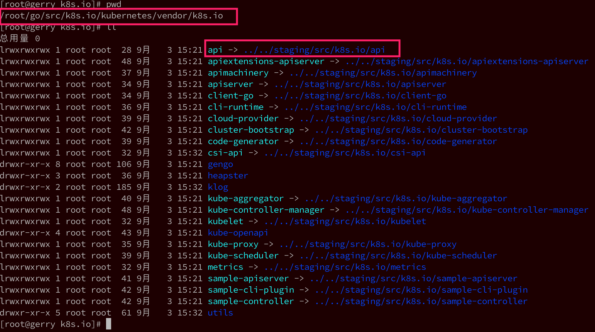

<!-- @import "[TOC]" {cmd="toc" depthFrom=1 depthTo=6 orderedList=false} -->

<!-- code_chunk_output -->

- [1. go环境安装](#1-go环境安装)
- [2. k8s源码下载](#2-k8s源码下载)
- [3. 编译](#3-编译)
  - [3.1. 使用容器构建](#31-使用容器构建)
    - [3.1.1. 关键脚本](#311-关键脚本)
    - [3.1.2. 基本流程](#312-基本流程)
    - [3.1.3. 执行编译](#313-执行编译)
  - [3.2. 本地二进制文件编译](#32-本地二进制文件编译)
    - [3.2.1. make方式](#321-make方式)
    - [3.2.2. go build方式](#322-go-build方式)
- [4. 参考](#4-参考)

<!-- /code_chunk_output -->

# 1. go环境安装

进入golang官网下载页面https://golang.org/dl/ , 选择合适的go版本下载. 

具体安装见GoLang下内容

# 2. k8s源码下载

在上面我们设置的**GOPATH目录**下, 新建文件夹: \$**GOPATH/src/k8s.io/kubernetes**; 

```
# mkdir -p $GOPATH/src/k8s.io/kubernetes
# cd $GOPATH/src/k8s.io/kubernetes
# git clone https://github.com/kubernetes/kubernetes.git
```

为了验证k8s的代码能否找到相应的依赖, 我们可以通过如下方式验证: 

* 命令行进入$GOPATH/src/k8s.io/kubernetes/cmd/kube\-proxy目录

* 执行go build命令; 

* 命令执行过程中没有报错, 且执行完成后文件中多了一个可执行文件, 说明编译成功了

```
# echo $GOPATH
/root/go
# pwd
/root/go/src/k8s.io/kubernetes/cmd/kube-proxy
# ls
app  BUILD  proxy.go
# go build .
# ls
app  BUILD  kube-proxy  proxy.go
```

这里需要注意一下, 如果报**依赖错误**, 找不到k8s.io下的某些项目, 就到vendor下看一下**软链接是不是都还在**, 如下: 



注意到k8s是使用这种方式解决k8s.io下的依赖问题的, 如果我们在windows下下载的代码, 然后copy到linux下, 就很容易遇到这些软链接丢失的情况, 导致go找不到依赖, 编译失败. 

注: 关于go的依赖机制vendor可以参考: https://studygolang.com/articles/4607

# 3. 编译

Kubernetes对golang版本有要求, 具体见 [Kubernetes Development Guide](https://github.com/kubernetes/community/blob/master/contributors/devel/development.md)

注: Go版本可能会需要对某些脚本和image进行特定修改

* 交叉编译的镜像 build/build-image/cross . `VERSION`文件和`Dockerfile`文件
* `build/common.sh`文件中交叉编译tag: `KUBE_BUILD_IMAGE_CROSS_TAG`
* `build/root/WORKSPACE`中的`go_version`变量
* `test/images/Makefile`中的`GOLANG_VERSION`

如果是在MAC上操作, 因为MAC的shell命令是BSD风格的, 因此需要安装GNU command tools. Linux默认带有GUN.

```
brew install coreutils
brew install gnu-tar
```

Kubernetes支持:

* 用容器构建
* 本地环境构建

## 3.1. 使用容器构建

k8s比较推荐使用的方式

参照: http://releases.k8s.io/HEAD/build/README.md

* Docker for Mac安装见 https://docs.docker.com/docker-for-mac/install/ . 注: Docker VM最少4.5G, 否则可能build失败
* Linux环境安装Docker

使用国内docker镜像源

```
https://docker.mirrors.ustc.edu.cn
https://hub-mirror.c.163.com
```

### 3.1.1. 关键脚本

build/目录中包含以下脚本. 请注意, 必须从Kubernetes根目录运行所有脚本. 

* `build/run.sh`: 在构建docker容器中运行命令. 常见的调用: 
    * `build/run.sh make`: 在容器中只构建linux二进制文件. 
    * `build/run.sh make cross`: 为所有平台构建所有二进制文件
    * `build/run.sh make kubectl KUBE_BUILD_PLATFORMS=darwin/amd64`: 构建用于特定平台(这里是二进制kubectl和darwin/amd64)
    * `build/run.sh make test`: 运行所有单元测试
    * `build/run.sh make test-integration`: 运行集成测试
    * `build/run.sh make test-cmd`: 运行CLI测试
* `build/copy-output.sh`: 这会将\_output/dockerized/binDocker容器中的内容复制到本地\_output/dockerized/bin. 它还将复制出作为构建过程的一部分生成的特定文件模式. 这是作为一部分自动运行的build/run.sh. 
* `build/make-clean.sh`: 清除内容\_output, 删除任何本地构建的容器映像并删除数据容器. 
* `build/shell.sh`: bash使用当前repo代码的快照放入构建容器中的shell. 

### 3.1.2. 基本流程

直接下的脚本build/用于构建和测试. 他们将确保kube\-build构建**Docker镜像**(基于`build/build\-image/Dockerfile`), 然后**在该容器中执行适当的命令**. 这些脚本将确保从运行中缓存正确的数据以进行增量构建, 并将结果从容器中复制回来. 

构建该**kube\-build容器镜像**, 首先在\_**output/images/build\-image**下创建"context"目录. 构建过程是在那里完成的, 而不是在Kubernetes仓库的根部, 以最小化我们在构建映像时需要打包的数据量. 

从该image运行有**3个不同的容器实例**. 

* 第一个是"**data"容器**, 用于存储需要**持久保存以支持增量构建的所有数据**. 
* 一个"**rsync"容器**, 用于将**数据传入**和**导出**到data容器. 
* 一个"**build"容器**, 用于**实际执行构建操作**. 

数据容器在运行期间保持不变, 而每次使用后都会**删除rsync和build容器**. 

rsync在后台透明地使用, 以有效地将数据移入和移出容器. 这将使用Docker选择的短暂端口. 您可以通过设置KUBE\_RSYNC\_PORTenv变量来修改它. 

所有Docker名称都带有从文件路径派生的哈希(允许在CI机器之类的内容上同时使用)和版本号. 当版本号更改时, 将清除所有状态并开始清理构建. 这允许更改构建基础结构并向CI系统发送需要删除旧工件的信号. 

### 3.1.3. 执行编译

由于墙的问题, 现在本地准备Docker镜像:

```
gcr.io/google_containers/kube-cross:KUBE_BUILD_IMAGE_CROSS_TAG
```

该镜像**基于Ubuntu构建**, 大小2.15G, 编译环境中包含以下软件: 

* Go
* etcd
* protobuf
* g\+\+
* 其他golang依赖包

查看具体的tag

```
# cat build/build-image/cross/VERSION
v1.12.9-1
```

通过加速源获取该镜像并打tag

```
# docker pull gcr.azk8s.cn/google_containers/kube-cross:v1.12.9-1
# docker tag gcr.azk8s.cn/google_containers/kube-cross:v1.12.9-1 gcr.io/google_containers/kube-cross:v1.12.9-1
```

编译, 切换目录到kuberentes源码的根目录下执行: 

```
# ./build/run.sh make clean
# ./build/run.sh make all KUBE_BUILD_PLATFORMS=linux/amd64 GOFLAGS=-v GOGCFLAGS="-N -l" 
```
* `GOGCFLAGS="-N -l"` 表明禁止编译优化和内联, 减小可执行程序大小
* `GOFLAGS=-v` 开启verbose日志
* `KUBE_BUILD_PLATFORMS=linux/amd64` 指定目标平台为linux/amd64

也可以在docker中执行**跨平台编译出二进制文件**. 

编译完成的二进制文件在/\_**output/local/go/bin**/目录下. 


## 3.2. 本地二进制文件编译

参考: https://github.com/kubernetes/community/blob/master/contributors/devel/development.md

Kubernetes要求系统中有`rsync`命令

有两种方式

### 3.2.1. make方式

验证当前设置的最佳方法是构建Kubernetes的一部分. 这样就可以在不用完整构建了

要构建特定部分, 在Kubernetes根目录下, 使用`WHAT`环境变量让构建脚本知道只想构建某个包/可执行文件.

```
# make WHAT=cmd/{$package_you_want}
```

注: 这只适合Kubernetes/cmd下的所有顶级文件夹

```
# KUBE_BUILD_PLATFORMS=linux/amd64 make all WHAT=cmd/kubelet GOFLAGS=-v GOGCFLAGS="-N -l"
```

`KUBE_BUILD_PLATFORMS`指定目标平台, `WHAT`指定编译的组件, 通过`GOFLAGS`和`GOGCFLAGS`传入编译时参数

* `GOGCFLAGS="-N -l"` 表明禁止编译优化和内联, 减小可执行程序大小
* `GOFLAGS=-v` 开启verbose日志
* `KUBE_BUILD_PLATFORMS=linux/amd64` 指定目标平台为linux/amd64

对于cli, 可以运行

```
# make WHAT=cmd/kubectl
+++ [0912 11:32:34] Building go targets for linux/amd64:
    ./vendor/k8s.io/code-generator/cmd/deepcopy-gen
+++ [0912 11:32:40] Building go targets for linux/amd64:
    ./vendor/k8s.io/code-generator/cmd/defaulter-gen
+++ [0912 11:32:44] Building go targets for linux/amd64:
    ./vendor/k8s.io/code-generator/cmd/conversion-gen
+++ [0912 11:32:48] Building go targets for linux/amd64:
    ./vendor/k8s.io/kube-openapi/cmd/openapi-gen
2019/09/12 11:32:54 Code for OpenAPI definitions generated
+++ [0912 11:32:54] Building go targets for linux/amd64:
    ./vendor/github.com/jteeuwen/go-bindata/go-bindata
+++ [0912 11:32:56] Building go targets for linux/amd64:
    cmd/kubectl
```

在`_output/bin`目录中有一个可执行文件

```
# ll _output/bin/
-rwxr-xr-x 1 root root  6004896 9月  12 11:32 conversion-gen
-rwxr-xr-x 1 root root  6004800 9月  12 11:32 deepcopy-gen
-rwxr-xr-x 1 root root  5988448 9月  12 11:32 defaulter-gen
-rwxr-xr-x 1 root root  4709220 9月  12 11:32 go2make
-rwxr-xr-x 1 root root  2055040 9月  12 11:32 go-bindata
-rwxr-xr-x 1 root root 41373344 9月  12 11:33 kubectl
-rwxr-xr-x 1 root root 11138112 9月  12 11:32 openapi-gen
```

不指定WHAT的话, 则编译全部

完整构建如下

```
# make
+++ [0912 19:28:06] Building go targets for linux/amd64:
    cmd/kube-proxy
    cmd/kube-apiserver
    cmd/kube-controller-manager
    cmd/kubelet
    cmd/kubeadm
    cmd/hyperkube
    cmd/kube-scheduler
    vendor/k8s.io/apiextensions-apiserver
    cluster/gce/gci/mounter
    cmd/kubectl
    cmd/gendocs
    cmd/genkubedocs
    cmd/genman
    cmd/genyaml
    cmd/genswaggertypedocs
    cmd/linkcheck
    vendor/github.com/onsi/ginkgo/ginkgo
    test/e2e/e2e.test
    cluster/images/conformance/go-runner
    cmd/kubemark
    vendor/github.com/onsi/ginkgo/ginkgo
    test/e2e_node/e2e_node.test
```

### 3.2.2. go build方式

进入cmd/kubelet (以kubelet为例子)

执行`go build -v`命令,如果没出错,会生成可执行文件kubelet

```
# cd cmd/kubelet
# go build -v
```

生成的可执行文件在当前文件夹下面

```
# ls cmd/kubelet/
app BUILD kubelet kubelet.go OWNERS
```

# 4. 参考

* Kubernetes的编译、打包、发布: https://www.lijiaocn.com/%E9%A1%B9%E7%9B%AE/2017/05/15/Kubernetes-compile.html#
* 编译和运行Kubernetes源码: https://www.kubernetes.org.cn/5033.html