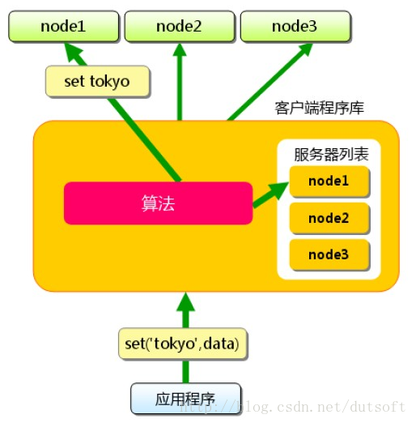
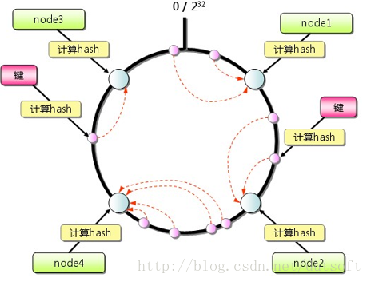
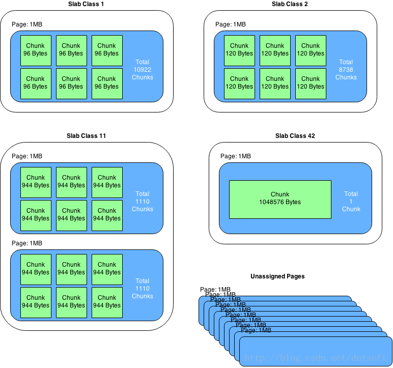

<!-- @import "[TOC]" {cmd="toc" depthFrom=1 depthTo=6 orderedList=false} -->

<!-- code_chunk_output -->

- [1 memcached](#1-memcached)
- [2 路由算法](#2-路由算法)
  - [2.1 简单路由算法](#21-简单路由算法)
  - [2.2 一致性哈希](#22-一致性哈希)
  - [2.3 虚拟层](#23-虚拟层)
- [3 内存管理](#3-内存管理)
  - [3.1 存储方式](#31-存储方式)
  - [3.2 内存结构](#32-内存结构)
- [3.3 注意事项](#33-注意事项)
- [4 使用场景](#4-使用场景)
- [5 安装启动](#5-安装启动)
- [6 python操作memcached](#6-python操作memcached)
  - [6.1 python访问memcached](#61-python访问memcached)

<!-- /code_chunk_output -->

https://blog.csdn.net/dutsoft/article/details/71101809

许多**Web应用**都将数据保存到MySQL这样的**关系型数据库**管理系统中, **应用服务器**从中**读取数据**并在浏览器中显示. 但随着**数据量的增大**、**访问的集中**, 就会出现**数据库**的**负担加重**、**数据库响应恶化**、 **网站显示延迟**等不良影响. **分布式缓存**是**优化网站性能**的重要手段, **大量站点**都通过**可伸缩的服务器集群**提供**大规模热点数据缓存服务**. 通过**缓存数据库查询结果**, **减少数据库访问次数**, 可以显著提高动态Web应用的速度和可扩展性. 业界常用的有**redis**、**memcached**等, 今天要讲的就是在python项目中如何使用memcached缓存服务. 

# 1 memcached

memcached是一款开源、高性能、**分布式内存对象缓存系统**, 可应用各种需要缓存的场景, 其**主要目的**是通过**降低对Database的访问**来加速web应用程序.  

memcached本身其实**不提供分布式解决方案！！！**. 在**服务端**, **memcached集群**环境实际就是**一个个memcached服务器**的堆积, 环境搭建较为简单; **cache的分布式**主要是在**客户端实现**, 通过**客户端**的**路由处理**来达到**分布式解决方案**的目的. **客户端**做**路由**的**原理非常简单**, **应用服务器**在每次存取某key的value时, 通过路由算法把key映射到某台memcached服务器nodeA上, 因此这个key所有操作都在nodeA上进行. 只要服务器还缓存着该数据, 就能保证缓存命中.  



# 2 路由算法

## 2.1 简单路由算法

简单路由算法, 使用余数Hash: 用缓存数据key的hash值, 除以服务器的数目, 余数为服务器列表的下表编号. 这个算法可以让缓存数据在整个memcached集群中均匀的分布, 也能满足大多数的缓存路由需求.  

但是, 当memcached集群要扩容的时候, 就会引发问题. 例如: 网站需要将3台缓存服务器扩容成4台. 在更改服务器列表后, 若仍使用余数hash, 很容易就计算出, 75%的请求不能命中缓存. 随着服务器集群规模增大, 不能命中的比率就越高. 

```
1%3 = 1    1%4 = 1
2%3 = 2    2%4 = 2
3%3 = 0    3%4 = 3
4%3 = 1    4%4 = 0
类推
```

这样扩容操作风险极大, 可能给数据库带来很大的瞬时压力, 甚至可能导致数据库崩溃. 解决这个问题有2个方法: 1、在访问低谷进行扩容, 在扩容后预热数据; 2、使用更优的路由算法. 目前使用较多的是一致性Hash算法. 

## 2.2 一致性哈希

memcached客户端可采用一致性hash算法作为路由策略, 如图, 相对于一般hash(如简单取模)的算法, 一致性hash算法除了计算key的hash值外, 还会计算每个server对应的hash值, 然后将这些hash值映射到一个有限的值域上(比如0~2^32). 通过寻找hash值大于hash(key)的最小server作为存储该key数据的目标server. 如果找不到, 则直接把具有最小hash值的server作为目标server. 同时, 一定程度上, 解决了扩容问题, 增加或删除单个节点, 对于整个集群来说, 不会有大的影响. 



## 2.3 虚拟层

一致性hash也不是完美的, 在扩容时可能导致负载不均衡的问题. 最近版本, 增加了虚拟节点的设计, 进一步提升了可用性. 在扩容时, 较为均匀的影响集群中已经存在的服务器, 均匀的分摊负载. 此处不再详述. 

# 3 内存管理

## 3.1 存储方式

为了提高性能, memcached中保存的数据都存储在memcached内置的内存存储空间中. 由于数据仅存在于内存中, 因此重启memcached、重启操作系统会导致全部数据消失. 另外, 缓存的内容容量达到指定值之后, 就基于LRU(Least Recently Used)算法自动删除不使用的缓存. memcached本身是为缓存而设计的服务, 因此并没有过多考虑数据的永久性问题. 

## 3.2 内存结构

memcached仅支持基础的key-value键值对类型数据存储. 在memcached内存结构中有两个非常重要的概念: slab和chunk.  
slab是一个内存块, 它是memcached一次申请内存的最小单位. 在启动memcached的时候一般会使用参数-m指定其可用内存, 但是并不是在启动的那一刻所有的内存就全部分配出去了, 只有在需要的时候才会去申请, 而且每次申请一定是一个slab. Slab的大小固定为1M(1048576 Byte), 一个slab由若干个大小相等的chunk组成. 每个chunk中都保存了一个item结构体、一对key和value. 

虽然在同一个slab中chunk的大小相等的, 但是在不同的slab中chunk的大小并不一定相等, 在memcached中按照chunk的大小不同, 可以把slab分为很多种类(class), 默认情况下memcached把slab分为40类(class1~class40), 在class 1中, chunk的大小为80字节, 由于一个slab的大小是固定的1048576字节(1M), 因此在class1中最多可以有13107个chunk(也就是这个slab能存最多13107个小于80字节的key-value数据).  



memcached内存管理采取预分配、分组管理的方式, 分组管理就是我们上面提到的slab class, 按照chunk的大小slab被分为很多种类. 内存预分配过程是怎样的呢?向memcached添加一个item时候, memcached首先会根据item的大小, 来选择最合适的slab class: 例如item的大小为190字节, 默认情况下class 4的chunk大小为160字节显然不合适, class 5的chunk大小为200字节, 大于190字节, 因此该item将放在class 5中(显然这里会有10字节的浪费是不可避免的), 计算好所要放入的chunk之后, memcached会去检查该类大小的chunk还有没有空闲的, 如果没有, 将会申请1M(1个slab)的空间并划分为该种类chunk. 例如我们第一次向memcached中放入一个190字节的item时, memcached会产生一个slab class 2(也叫一个page), 并会用去一个chunk, 剩余5241个chunk供下次有适合大小item时使用, 当我们用完这所有的5242个chunk之后, 下次再有一个在160~200字节之间的item添加进来时, memcached会再次产生一个class 5的slab(这样就存在了2个pages). 

# 3.3 注意事项

- chunk是在page里面划分的, 而page固定为1m, 所以chunk最大不能超过1m. 
- chunk实际占用内存要加48B, 因为chunk数据结构本身需要占用48B. 
- 如果用户数据大于1m, 则memcached会将其切割, 放到多个chunk内. 
- 已分配出去的page不能回收. 
- 对于key-value信息, 最好不要超过1m的大小; 同时信息长度最好相对是比较均衡稳定的, 这样能够保障最大限度的使用内存; 同时, memcached采用的LRU清理策略, 合理甚至过期时间, 提高命中率. 

# 4 使用场景

key\-value能满足需求的前提下, 使用memcached分布式集群是较好的选择, 搭建与操作使用都比较简单; 分布式集群在单点故障时, 只影响小部分数据异常, 目前还可以通过Magent缓存代理模式, 做单点备份, 提升高可用; 整个缓存都是基于内存的, 因此响应时间是很快, 不需要额外的序列化、反序列化的程序, 但同时由于基于内存, 数据没有持久化, 集群故障重启数据无法恢复. 高版本的memcached已经支持CAS模式的原子操作, 可以低成本的解决并发控制问题. 

# 5 安装启动

```
$ sudo apt-get install memcached
$ memcached -m 32 -p 11211 -d
# memcached将会以守护程序的形式启动 memcached(-d), 为其分配32M内存(-m 32), 并指定监听 localhost的11211端口. 
```

# 6 python操作memcached

在python中可通过memcache库来操作memcached, 这个库使用很简单, 声明一个client就可以读写memcached缓存了. 

## 6.1 python访问memcached

```
#!/usr/bin/env python

import memcache

mc = memcache.Client(['127.0.0.1:12000'],debug=0)

mc.set("some_key", "Some value")
value = mc.get("some_key")

mc.set("another_key", 3)
mc.delete("another_key")

mc.set("key", "1")   # note that the key used for incr/decr must be a string.
mc.incr("key")
mc.decr("key")
```

然而, python-memcached默认的路由策略没有使用一致性哈希. 

```
    def _get_server(self, key):
        if isinstance(key, tuple):
            serverhash, key = key
        else:
            serverhash = serverHashFunction(key)

        if not self.buckets:
            return None, None

        for i in range(Client._SERVER_RETRIES):
            server = self.buckets[serverhash % len(self.buckets)]
            if server.connect():
                # print("(using server %s)" % server,)
                return server, key
            serverhash = serverHashFunction(str(serverhash) + str(i))
        return None, None
```

从源码中可以看到: server = self.buckets[serverhash \% len(self.buckets)], 只是根据key进行了简单的取模. 我们可以通过重写\_get\_server方法, 让python\-memcached支持一致性哈希. 

```
import memcache
import types
from hash_ring import HashRing
class MemcacheRing(memcache.Client):
    """Extends python-memcache so it uses consistent hashing to
    distribute the keys.
    """
    def __init__(self, servers, *k, **kw):
        self.hash_ring = HashRing(servers)
        memcache.Client.__init__(self, servers, *k, **kw)
        self.server_mapping = {}
        for server_uri, server_obj in zip(servers, self.servers):
            self.server_mapping[server_uri] = server_obj

    def _get_server(self, key):
        if type(key) == types.TupleType:
            return memcache.Client._get_server(key)
        for i in range(self._SERVER_RETRIES):
            iterator = self.hash_ring.iterate_nodes(key)
            for server_uri in iterator:
                server_obj = self.server_mapping[server_uri]
                if server_obj.connect():
                    return server_obj, key
        return None, None
```

