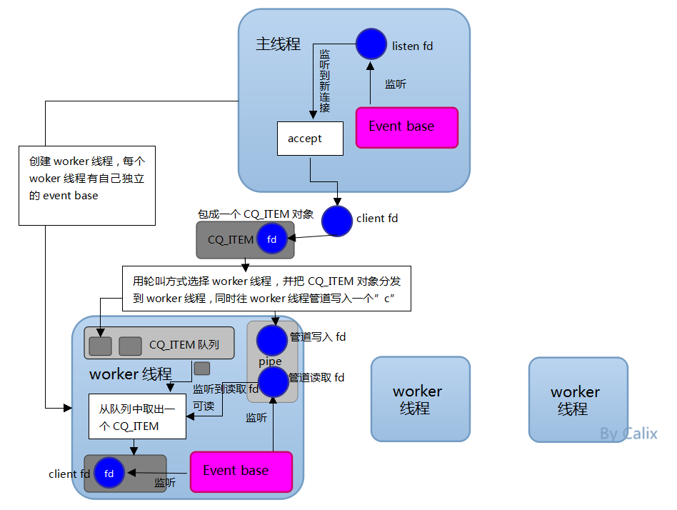

<!-- @import "[TOC]" {cmd="toc" depthFrom=1 depthTo=6 orderedList=false} -->

<!-- code_chunk_output -->

* [1 模型分析](#1-模型分析)
* [2 代码实现](#2-代码实现)
	* [2.1 memcached_thread_init](#21-memcached_thread_init)
		* [2.1.1 setup_thread线程初始化](#211-setup_thread线程初始化)
		* [2.1.2 worker线程执行入口](#212-worker线程执行入口)
	* [2.2  server_sockets](#22-server_sockets)
	* [2.3 主线程事件处理event_handler](#23-主线程事件处理event_handler)
		* [2.3.1 dispatch_conn_new分发](#231-dispatch_conn_new分发)
	* [2.4 thread\_libevent\_process](#24-thread_libevent_process)

<!-- /code_chunk_output -->

# 1 模型分析

memcached到底是如何处理我们的网络连接的?

memcached通过epoll(使用libevent, 下面具体再讲)实现异步的服务器, 但仍然使用多线程, 主要有两种线程, 分别是"主线程"和"worker线程", 一个主线程, 多个worker线程. 

主线程负责监听网络连接, 并且accept连接. 当监听到连接时, accept后, 连接成功, 把相应的client fd丢给其中一个worker线程. 

worker线程接收主线程丢过来的client fd, 加入到自己的epoll监听队列, 负责处理该连接的读写事件. 

所以说, 主线程和worker线程都各自有自己的监听队列, 主线程监听的仅是listen fd, 而worker线程监听的则是主线程accept成功后丢过来的client fd. 

memcached使用libevent实现事件监听. 在这简单介绍一下libevent的使用, 一般有以下几步: 

1)event_base = event_init(); 初始化事件基地. 

2)event_set(event, fd, event_flags, event_handler, args); 创建事件event, fd为要监听的fd, event_flags为监听的事件类型, event_handler为事件发生后的处理函数, args为调用处理函数时传递的参数. 

3)event_base_set(event_base, event); 为创建的事件event指定事件基地. 

4)event_add(event, timeval); 把事件加入到事件基地进行监听

5)event_base_loop(event_base, flag); 进入事件循环, 即epoll_wait

memcached主线程和worker线程各有自己的监听队列, 故有主线程和每个worker线程都有一个独立的event_base, 事件基地. 

了解libevent的简单使用后, 我们回到memcache线程模型上, 先看看下面的图片了解它线程模型的构建逻辑: 

memcached线程模型



1)主线程首先为自己分配一个event_base, 用于监听连接, 即listen fd. 

2)主线程创建n个worker线程, 同时每个worker线程也分配了独立的event_base. 

3)每个worker线程通过管道方式与其它线程(主要是主线程)进行通信, 调用pipe函数, 产生两个fd, 一个是管道写入fd, 一个是管道读取fd. worker线程把管道读取fd加到自己的event_base, 监听管道读取fd的可读事件, 即当主线程往某个线程的管道写入fd写数据时, 触发事件. 

4)主线程监听到有一个连接到达时, accept连接, 产生一个client fd, 然后选择一个worker线程, 把这个client fd包装成一个CQ_ITEM对象(该结构体下面再详细讲, 这个对象实质是起主线程与worker线程之间通信媒介的作用, 主线程把client fd丢给worker线程往往不止"client fd"这一个参数, 还有别的参数, 所以这个CQ_ITEM相当于一个"参数对象", 把参数都包装在里面), 然后压到worker线程的CQ_ITEM队列里面去(每个worker线程有一个CQ_ITEM队列), 同时主线程往选中的worker线程的管道写入fd中写入一个字符"c"(触发worker线程). 

5)主线程往选中的worker线程的管道写入fd中写入一个字符"c", 则worker线程监听到自己的管道读取fd可读, 触发事件处理, 而此是的事件处理是: 从自己的CQ_ITEM队列中取出CQ_ITEM对象(相当于收信, 看看主线程给了自己什么东西), 从4)可知, CQ_ITEM对象中包含client fd, worker线程把此client fd加入到自己的event_base, 从此负责该连接的读写工作. 

# 2 代码实现

https://www.cnblogs.com/wenqiang/p/5404081.html

memcached使用libevent实现事件监听

对于一个服务器而言, 流程大致如下: 

1 获取待监听的内容的fd; 
2 创建一个event_base; 
3 创建一个event,指定待监听的fd, 待监听事件的类型, 以及事件放生时的回调函数及传给回调函数的参数; 
4 将event添加到event_base的事件管理器中; 
5 开启event_base的事件处理循环; 
6 (异步)当事件发生的时候, 调用前面设置的回调函数. 


main函数中初始化和线程相关的:

```
main_base = event_init(); //全局的main_base变量

//初始化主线程, 参数是worker线程个数, 和当前主线程的event_base
memcached_thread_init(settings.num_threads, main_base);
 
//建立sockets, 
if (settings.port && server_sockets(settings.port, tcp_transport, portnumber_file)) {
        vperror("failed to listen on TCP port %d", settings.port);
        exit(EX_OSERR);
}

//进入事件循环
if (event_base_loop(main_base, 0) != 0) {
    retval = EXIT_FAILURE;
}
```

## 2.1 memcached_thread_init

```
    threads = calloc(nthreads, sizeof(LIBEVENT_THREAD));
    // 主线程的event_base
    dispatcher_thread.base = main_base;
    // 主线程pid
    dispatcher_thread.thread_id = pthread_self();

    for (i = 0; i < nthreads; i++) {
        int fds[2];
	// 创建pipe
        if (pipe(fds)) {
            perror("Can't create notify pipe");
            exit(1);
        }
        // 接收管道
        threads[i].notify_receive_fd = fds[0];
	// 发送管道
        threads[i].notify_send_fd = fds[1];
	// 这里面有些线程初始化, 包括每个线程的event_base
        setup_thread(&threads[i]);
        /* Reserve three fds for the libevent base, and two for the pipe */
        stats_state.reserved_fds += 5;
    }

    /* Create threads after we've done all the libevent setup. */
    for (i = 0; i < nthreads; i++) {
	// worker_libevent是线程启动的执行入口
        create_worker(worker_libevent, &threads[i]);
    }

    /* Wait for all the threads to set themselves up before returning. */
    pthread_mutex_lock(&init_lock);
    wait_for_thread_registration(nthreads);
    pthread_mutex_unlock(&init_lock);
}
```

### 2.1.1 setup_thread线程初始化

```
/*
 * Set up a thread's information.
 */
static void setup_thread(LIBEVENT_THREAD *me) {
    // event base
    me->base = event_init();

    /* Listen for notifications from other threads */
    // 监听管道receive_fd, 处理函数是thread_libevent_process
    event_set(&me->notify_event, me->notify_receive_fd,
              EV_READ | EV_PERSIST, thread_libevent_process, me);
    event_base_set(me->base, &me->notify_event);

    if (event_add(&me->notify_event, 0) == -1) {
        fprintf(stderr, "Can't monitor libevent notify pipe\n");
        exit(1);
    }
    // CQ_ITEM队列
    me->new_conn_queue = malloc(sizeof(struct conn_queue));
    if (me->new_conn_queue == NULL) {
        perror("Failed to allocate memory for connection queue");
        exit(EXIT_FAILURE);
    }
    // CQ_ITEM队列初始化
    cq_init(me->new_conn_queue);

    if (pthread_mutex_init(&me->stats.mutex, NULL) != 0) {
        perror("Failed to initialize mutex");
        exit(EXIT_FAILURE);
    }

    me->suffix_cache = cache_create("suffix", SUFFIX_SIZE, sizeof(char*),
                                    NULL, NULL);
    if (me->suffix_cache == NULL) {
        fprintf(stderr, "Failed to create suffix cache\n");
        exit(EXIT_FAILURE);
    }
}
```

### 2.1.2 worker线程执行入口

```
static void *worker_libevent(void *arg) {
    LIBEVENT_THREAD *me = arg;

    /* Any per-thread setup can happen here; memcached_thread_init() will block until
     * all threads have finished initializing.
     */
    me->l = logger_create();
    if (me->l == NULL) {
        abort();
    }

    register_thread_initialized();
    // event的事件循环
    event_base_loop(me->base, 0);
    return NULL;
}
```

## 2.2  server_sockets

server_sockets调用server_socket: 先是new_socket(), 然后调用conn_new()

```
// conn_listening
conn_new(sfd, conn_listening, EV_READ | EV_PERSIST, 1, transport, main_base)))
```

注: libevent支持的事件及属性包括(使用bitfield实现)

- EV_TIMEOUT:超时; 
- EV_READ:只要网络缓冲中还有数据, 回调函数就会被触发; 
- EV_WRITE:只要塞给网络缓冲的数据被写完, 回调函数就会被触发; 
- EV_SIGNAL:POSIX信号量; 
- EV_PERSIST:不指定这个属性, 回调函数被触发后事件会被删除; 
- EV_ET:Edge-Trigger边缘触发(这个还不懂是什么意思)

里面再调用

```
// 事件处理函数为event_handler, 注意c的state是conn_listening
event_set(&c->event, sfd, event_flags, event_handler, (void *)c);
// 设定event_base
event_base_set(base, &c->event);
// 添加事件
event_add(&c->event, 0)
```

最后的event_base_loop()进入循环

## 2.3 主线程事件处理event_handler

```
void event_handler(const int fd, const short which, void *arg) {
    conn *c;

    c = (conn *)arg;
    assert(c != NULL);

    c->which = which;

    /* sanity */
    if (fd != c->sfd) {
        if (settings.verbose > 0)
            fprintf(stderr, "Catastrophic: event fd doesn't match conn fd!\n");
        conn_close(c);
        return;
    }
    // 处理事件
    drive_machine(c);

    /* wait for next event */
    return;
}
```


```
static void drive_machine(conn *c) {

while (!stop) {

        switch(c->state) {
        case conn_listening:
            addrlen = sizeof(addr);
	    // 得到client fd
            sfd = accept(c->sfd, (struct sockaddr *)&addr, &addrlen);

            if (settings.maxconns_fast &&
                stats_state.curr_conns + stats_state.reserved_fds >= settings.maxconns - 1) {
                str = "ERROR Too many open connections\r\n";
                res = write(sfd, str, strlen(str));
                close(sfd);
                STATS_LOCK();
                stats.rejected_conns++;
                STATS_UNLOCK();
            } else {
		// 分发sfd给worker, 
                dispatch_conn_new(sfd, conn_new_cmd, EV_READ | EV_PERSIST,
                                     DATA_BUFFER_SIZE, c->transport);
            }

            stop = true;
            break;
```

```
#define DATA_BUFFER_SIZE 2048
```

当主线程有连接到达, 触发调用event_handler函数, 而event_handler函数又调用drive_machine, 主线程会进入switch里面, 在上面conn_new传进来的conn_state值为conn\_listening, 所以进入conn\_listening这个case分支, 在这个分支, 主线程accept刚请求过来的连接, 产生一个client fd, 然后调用dispatch\_conn\_new函数, 而这个函数正是把client fd分发给某个worker线程. 

accept函数由TCP服务器调用, 用于从已完成连接队列返回下一个已完成连接. 如果已完成连接队列为空, 那么进程被投入睡眠(假定套接字默为默认的阻塞方式)

```
ACCEPT(2)                  Linux Programmer's Manual                 ACCEPT(2)
NAME
       accept, accept4 - accept a connection on a socket
SYNOPSIS
       #include <sys/types.h>          /* See NOTES */
       #include <sys/socket.h>
       int accept(int sockfd, struct sockaddr *addr, socklen_t *addrlen);
```

sockfd是由socket函数返回的套接字描述符, 参数addr和addrlen用来返回已连接的对端进程(客户端)的协议地址. 如果我们对客户端的协议地址不感兴趣, 可以把arrd和addrlen均置为空指针

```
// IPv4的TCP伪代码
int sockfd = socket(AF_INET, SOCK_STREAM, 0); //TCP
// 调用bind()
// 调用listen()
 
//等待连接
struct sockaddr_in cliaddr;  
socklen_t len = sizeof(cliaddr);  
int connfd = accept(sockfd, (sockaddr *)&cliaddr, &len);
if (-1 == connfd) {  
    perror("accept fail");
}
 
//解析客户端地址
char buff[INET_ADDRSTRLEN + 1] = {0};  
inet_ntop(AF_INET, &cliaddr.sin_addr, buff, INET_ADDRSTRLEN);  
uint16_t port = ntohs(cliaddr.sin_port);  
printf("connection from %s, port %d\n", buff, port);
```

### 2.3.1 dispatch_conn_new分发

```
/*
 * Dispatches a new connection to another thread. This is only ever called
 * from the main thread, either during initialization (for UDP) or because
 * of an incoming connection.
 */
void dispatch_conn_new(int sfd, enum conn_states init_state, int event_flags,
                       int read_buffer_size, enum network_transport transport) {
    CQ_ITEM *item = cqi_new();
    char buf[1];
    //轮流方式
    int tid = (last_thread + 1) % settings.num_threads;
    // 得到worker线程
    LIBEVENT_THREAD *thread = threads + tid;

    last_thread = tid;

    item->sfd = sfd;
    item->init_state = init_state;
    item->event_flags = event_flags;
    item->read_buffer_size = read_buffer_size;
    item->transport = transport;
    // 将item信息push到worker的queue
    cq_push(thread->new_conn_queue, item);

    MEMCACHED_CONN_DISPATCH(sfd, thread->thread_id);

    // 主线程写一个'c'给worker线程
    buf[0] = 'c';
    if (write(thread->notify_send_fd, buf, 1) != 1) {
        perror("Writing to thread notify pipe");
    }
}
```

这里通过pipe通知了thread, 上面注册了管道另一端的event_set相应函数, worker会执行thread_libevent_process

## 2.4 thread\_libevent\_process

```
/*
 * Processes an incoming "handle a new connection" item. This is called when
 * input arrives on the libevent wakeup pipe.
 */
static void thread_libevent_process(int fd, short which, void *arg) {
    LIBEVENT_THREAD *me = arg;
    CQ_ITEM *item;
    char buf[1];
    unsigned int timeout_fd;

    if (read(fd, buf, 1) != 1) {
        if (settings.verbose > 0)
            fprintf(stderr, "Can't read from libevent pipe\n");
        return;
    }

    switch (buf[0]) {
    case 'c':
	// 从队列中pop出item数据
        item = cq_pop(me->new_conn_queue);

        if (NULL != item) {
	    // 得到主线程给的信息, worker调用con_new, 这里的fd是client fd, init_state是conn_new_cmd
	    // base是当前worker的event_base
            conn *c = conn_new(item->sfd, item->init_state, item->event_flags,
                               item->read_buffer_size, item->transport,
                               me->base);
            if (c == NULL) {
                if (IS_UDP(item->transport)) {
                    fprintf(stderr, "Can't listen for events on UDP socket\n");
                    exit(1);
                } else {
                    if (settings.verbose > 0) {
                        fprintf(stderr, "Can't listen for events on fd %d\n",
                            item->sfd);
                    }
                    close(item->sfd);
                }
            } else {
                c->thread = me;
            }
            cqi_free(item);
        }
        break;
    /* we were told to pause and report in */
    case 'p':
        register_thread_initialized();
        break;
    /* a client socket timed out */
    case 't':
        if (read(fd, &timeout_fd, sizeof(timeout_fd)) != sizeof(timeout_fd)) {
            if (settings.verbose > 0)
                fprintf(stderr, "Can't read timeout fd from libevent pipe\n");
            return;
        }
        conn_close_idle(conns[timeout_fd]);
        break;
    }
}
```

worker线程管道可读事件发生后, 从自己的CQ_ITEM队列"收信", 拿到主线程分发过来的信息(其中包括client fd), 然后你会发现, worker线程在这个地方也调用了conn_new函数！ 只是此是传给conn_new的参数中, fd不是listen fd而是client fd, init_state不是conn_listening, 而是conn_new_cmd, event_base不是主线程的event_base, 而是当前worker线程的event_base！

而回顾conn_new的作用可知, conn_new函数里面把传进来的fd(这里是client fd)加入传进来的event_base(这里是worker线程的event_base), 于是worker线程也调用了conn_new方法, 监听了client fd, 并且事件处理方法也是event_handler, 也就是drive_machine函数. 

所以无论是主线程监听listen fd 还是各个worker线程监听client fd, 当各自的fd有可读事件发生时, 最终调用同一个函数drive_machine进行事件处理！！只是listen fd的conn_state初始时为conn_listening (其实永远都是), 而client fd初始为conn_new_cmd. 

另外, 至此, worker线程已经监听了两种fd, 一种是管道接收fd(与主线程通信), 一种是client fd(与客户端通信). 

分析到这里, 我们已经把上面的那个模型图的具体代码实现都分析完了, 而至于worker线程后来也调用drive_machine做了什么?为什么要是与主线程同一个函数?

