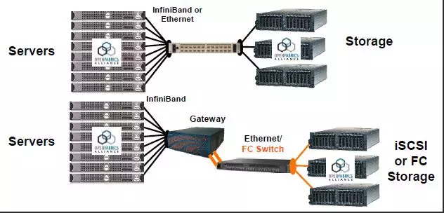
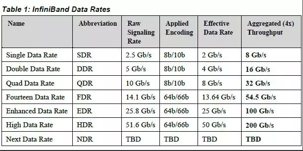
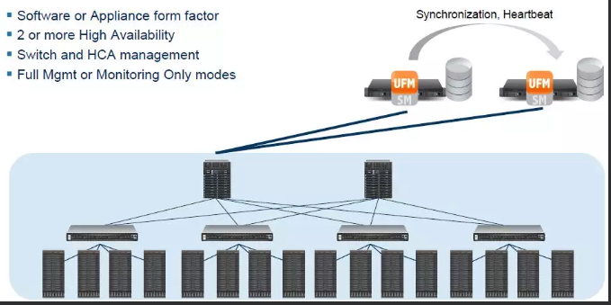

<!-- @import "[TOC]" {cmd="toc" depthFrom=1 depthTo=6 orderedList=false} -->

<!-- code_chunk_output -->

* [1 什么是InfiniBand网络](#1-什么是infiniband网络)
* [2 什么是InfiniBand架构](#2-什么是infiniband架构)
* [3 InfiniBand速率发展介绍](#3-infiniband速率发展介绍)
* [4 InfiniBand网络主要上层协议](#4-infiniband网络主要上层协议)
* [5 InfiniBand管理软件](#5-infiniband管理软件)

<!-- /code_chunk_output -->

https://mp.weixin.qq.com/s/9FnEMR5klV7LqcihKU9G2w

**IP网络协议**如**TCP/IP**, 具有**转发丢失数据包**的特性, 网络不良时要**不断地确认与重发**, 基于这些协议的通信也会因此变慢, 极大地影响了性能. 与之相比, **IB**使用基于**信任的**、**流控制**的机制来**确保连接的完整性**, 数据包极少丢失. 

使用**IB协议**, 除非确认**接收缓存具备足够的空间**, 否则**不会传送数据**. 接受方在数据传输完毕之后, 返回信号来标示缓存空间的可用性. 通过这种办法, IB协议消除了由于原数据包丢失而带来的重发延迟, 从而提升了效率和整体性能. 

# 1 什么是InfiniBand网络

InfiniBand是一种网络通信协议, 它提供了一种**基于交换的架构**, 由**处理器节点之间**、**处理器节点**和**输入/输出节点(如磁盘或存储**)之间的**点对点双向串行链路构成！！！**. 

**每个链路**都有一个**连接到链路两端的设备！！！**, 这样在**每个链路两端控制传输(发送和接收**)的特性就被很好地定义和控制了. 

InfiniBand通过**交换机**在**节点之间**直接创建一个**私有的、受保护的通道**, 进行**数据和消息的传输**, **无需CPU**参与**远程直接内存访问(RDMA**)和发送/接收由**InfiniBand适配器**管理和执行的负载. 

**适配器**通过**PCI Express接口**一端连接到**CPU**, 另一端通过**InfiniBand网络端口**连接到**InfiniBand子网**. 与**其他网络通信协议**相比, 这提供了明显的优势, 包括更高的带宽、更低的延迟和增强的可伸缩性. 

# 2 什么是InfiniBand架构

**InfiniBand Architecture(IBA**)是为**硬件实现而设计**的, 而**TCP**则是**为软件实现而设计**的. 因此, InfiniBand是比TCP更轻的传输服务, 因为它不需要重新排序数据包, 因为较低的链路层提供有序的数据包交付. 传输层只需要检查包序列并按顺序发送包. 

进一步, 因为InfiniBand提供**以信用为基础的流控制(发送方节点不给接收方发送超出广播 "信用"大小的数据包**),传输层不需要像TCP窗口算法那样的包机制确定最优飞行包的数量. 这使得高效的产品能够以非常低的延迟和可忽略的CPU利用率向应用程序交付56、100Gb/s的数据速率. 

IB是以通道(Channel)为基础的双向、串行式传输, 在连接拓朴中是采用交换、切换式结构(Switched Fabric), 所以会有所谓的IBA交换器(Switch), 此外在线路不够长时可用IBA中继器(Repeater)进行延伸. 

而每一个IBA网络称为子网(Subnet), 每个子网内最高可有65,536个节点(Node), IBASwitch、IBA Repeater仅适用于Subnet范畴, 若要通跨多个IBA Subnet就需要用到IBA路由器(Router)或IBA网关器(Gateway). 

至于节点部分, Node想与IBA Subnet接轨必须透过配接器(Adapter), 若是CPU、内存部分要透过HCA (Host Channel Adapter), 若为硬盘、I/O部分则要透过TCA (Target Channel Adapter), 之后各部分的衔接称为联机(Link). 上述种种构成了一个完整的IBA. 

# 3 InfiniBand速率发展介绍

InfiniBand串行链路可以在不同的信令速率下运行, 然后可以捆绑在一起实现更高的吞吐量. 原始信令速率与编码方案耦合, 产生有效的传输速率. 编码将通过铜线或光纤发送的数据的错误率降至最低, 但也增加了一些开销(例如, 每8位数据传输10位). 

典型的实现是聚合四个链接单元(4X). 目前, InfiniBand系统提供以下吞吐量速率:

# 4 InfiniBand网络主要上层协议

InfiniBand为不同类型的用户提供了不同的上层协议, 并为某些管理功能定义了消息和协议. InfiniBand主要支持SDP、SRP、iSER、RDS、IPoIB和uDAPL等上层协议. 

- SDP (Sockets Direct Protocol)是InfiniBand Trade Association (IBTA)制定的基于infiniband的一种协议, 它允许用户已有的使用TCP/IP协议的程序运行在高速的infiniband之上. 

- SRP(SCSIRDMA Protocol)是InfiniBand中的一种通信协议, 在InfiniBand中将SCSI命令进行打包, 允许SCSI命令通过RDMA(远程直接内存访问)在不同的系统之间进行通信, 实现存储设备共享和RDMA通信服务. 

- iSER(iSCSI RDMA Protocol)类似于SRP(SCSI RDMA protocol)协议, 是IB SAN的一种协议 , 其主要作用是把iSCSI协议的命令和数据通过RDMA的方式跑到例如Infiniband这种网络上, 作为iSCSI RDMA的存储协议iSER已被IETF所标准化. 

- RDS(Reliable Datagram Sockets)协议与UDP 类似, 设计用于在Infiniband 上使用套接字来发送和接收数据. 实际是由Oracle公司研发的运行在infiniband之上, 直接基于IPC的协议. 

- IPoIB(IP-over-IB)是为了实现INFINIBAND网络与TCP/IP网络兼容而制定的协议, 基于TCP/IP协议, 对于用户应用程序是透明的, 并且可以提供更大的带宽, 也就是原先使用TCP/IP协议栈的应用不需要任何修改就能使用IPoIB. 

- uDAPL(User Direct Access Programming Library)用户直接访问编程库是标准的API, 通过远程直接内存访问 RDMA功能的互连(如InfiniBand)来提高数据中心应用程序数据消息传送性能、伸缩性和可靠性. 

iSER (iSCSI Extensions for RDMA)和NFSoRDMA (NFS over RDMA), SRP (SCSI RDMA Protocol) 等是InfiniBand中的一种通信协议, 在InfiniBand中将SCSI命令进行打包, 允许SCSI命令通过RDMA在不同的系统之间进行通信, 实现存储设备共享和RDMA通信服务. 

# 5 InfiniBand管理软件

OpenSM软件是符合InfiniBand的子网管理器(SM), 运行在Mellanox OFED软件堆栈进行IB 网络管理, 管理控制流走业务通道, 属于带内管理方式. 

OpenSM包括子网管理器、背板管理器和性能管理器三个组件, 绑定在交换机内部的必备部件. 提供非常完备的管理和监控能力, 如设备自动发现、设备管理、Fabric可视化、智能分析、健康监测等等. 