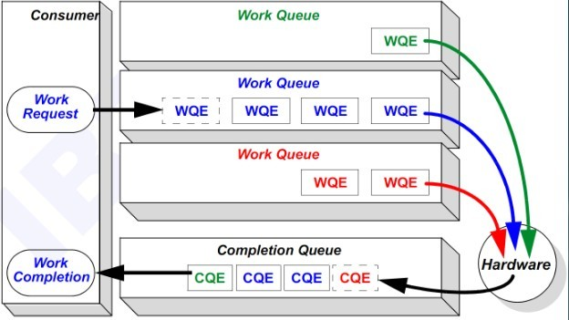

<!-- @import "[TOC]" {cmd="toc" depthFrom=1 depthTo=6 orderedList=false} -->

<!-- code_chunk_output -->

* [1 InfiniBand简介](#1-infiniband简介)
* [2 InfiniBand Stack](#2-infiniband-stack)
* [3 Structure](#3-structure)
* [4 QP](#4-qp)
* [5 InfiniBand网络拓扑](#5-infiniband网络拓扑)
* [4 HCA和TCA的主要区别](#4-hca和tca的主要区别)
* [5 IPoIB协议](#5-ipoib协议)

<!-- /code_chunk_output -->

# 1 InfiniBand简介

InfiniBand架构是一种支持**多并发链接**的"**转换线缆**"技术, 在这种技术中, **每种链接**都可以达到**2.5 Gbps**的运行速度. 这种架构在一个链接的时候速度是500 MB/秒, 四个链接的时候速度是2 GB/秒, 12个链接的时候速度可以达到6 GB /秒. IBTA成立于1999年8月31日, 由Compaq、惠普、IBM、戴尔、英特尔、微软和Sun七家公司牵头, 共同研究发展的高速先进的I/O标准. 最初的命名为System I/O, 1999年10月, 正式改名为InfiniBand. InfiniBand是一种长缆线的连接方式, 具有**高速、低延迟**的传输特性. 

InfiniBand用于**服务器系统内部(内部总线！！！**)并没有发展起来, 原因在于英特尔和微软在2002年就退出了IBTA. 在此之前, 英特尔早已另行倡议**Arapahoe**, 亦称为**3GIO(3rd Generation I/O, 第三代I/O**), 即今日鼎鼎大名的**PCI Express(PCI\-E**), InfiniBand、3GIO经过一年的并行, 英特尔终究还是选择了PCI\-E. 因此, 现在应用InfiniBand, 主要是用于在**服务器集群**, **系统之间的互联(！！！不是服务器内部总线！！！**).  

随着CPU性能的飞速发展, **I/O系统的性能**成为制约服务器性能的瓶颈. 于是人们开始重新审视使用了十几年的PCI总线架构. 虽然PCI总线结构把数据的传输从8位/16位一举提升到32位, 甚至当前的64位, 但是它的一些先天劣势限制了其继续发展的势头. PCI总线有如下缺陷: 

(1)由于采用了**基于总线的共享传输模式！！！**, 在**PCI总线**上**不可能同时传送两组以上的数据**, 当一个PCI设备占用总线时, 其他设备只能等待; 

(2)随着总线频率从33MHz提高到66MHz, 甚至133MHz(PCI-X), **信号线之间的相互干扰**变得越来越严重, 在一块主板上布设多条总线的难度也就越来越大; 

(3)由于**PCI设备**采用了**内存映射I/O地址！！！**的方式建立与内存的联系, **热添加PCI设备！！！**变成了一件非常困难的工作. 目前的做法是**在内存中**为**每一个PCI设备**划出一块**50M到100M的区域**, 这段空间**用户是不能使用**的, 因此如果**一块主板上支持的热插拔PCI接口越多！！！**, 用户损失的内存就越多; 

(4)PCI的总线上虽然有**buffer**作为**数据的缓冲区**, 但是它**不具备纠错的功能**, 如果在**传输的过程**中发生了**数据丢失或损坏**的情况, **控制器！！！**只能触发一个**NMI中断**通知操作系统在PCI总线上发生了错误. 

InfiniBand 采用**双队列程序提取技术**, 使**应用程序**直接将**数据**从**适配器**送入到**应用内存(称为远程直接存储器存取或RDMA！！！**), 反之依然. 

在**TCP/IP协议**中,来自**网卡的数据**先拷贝到**核心内存(现在一般是DMA操作**), 然后**再拷贝到应用存储空间**,或从**应用空间将数据**拷贝到**核心内存**,再经由**网卡**发送到**Internet**. 这种I/O操作方式,**始终需要经过核心内存的转换！！！**,它不仅**增加了数据流传输路径的长度**,而且大大**降低了I/O的访问速度**,增加了**CPU的负担**. 

而SDP则是将**来自网卡的数据**直接拷贝到**用户的应用空间**,从而避免了**核心内存参入(以及协议栈参与**). 这种方式就称为**零拷贝！！！**,它可以在进行大量数据处理时,达到该协议所能达到的最大的吞吐量. 

# 2 InfiniBand Stack

# 3 Structure

每个端口具有一个GUID(Globally Unique Identifier), GUID是全局唯一的, 类似于以太网MAC地址. 运行过程中, 子网管理代理(SMA)会给端口分配一个本地标识(LID), LID仅在子网内部有用. 

# 4 QP

QP是infiniband的一个重要概念, 它是指**发送队列**和**接收队列的组合**, 用户调用API**发送接收数据**的时候, 实际上是**将数据放入QP**当中, 然后**以轮询的方式将QP中的请求一条条的处理**, 其模式**类似于生产者\-消费者模式**. 

# 5 InfiniBand网络拓扑

Infiniband的网络拓扑结构如图, 其**组成单元**主要分为**四类**: 

(1)HCA(Host Channel Adapter), 它是连接**内存控制器**和**TCA**的桥梁; 

(2)TCA(Target Channel Adapter), 它将**I/O设备(例如网卡、SCSI控制器**)的**数字信号打包**发送给**HCA**; 

(3)Infiniband link, 它是连接HCA和TCA的光纤, InfiniBand架构允许硬件厂家以1条、4条、12条光纤3种方式连结TCA和HCA; 

(4)交换机和路由器; 

# 4 HCA和TCA的主要区别

|属 性|HCA|TCA|
|--|--|--|
|多端口支持|支持|支持
|用LRH发送/接收数据包|所有的QP均要求||	
|用GRH发送/接收数据包|除QP0外,所有的QP均要求||	 
|支持的传输业务|支持任何QP上的不可靠传送数据包、可靠的和不可靠的连接传输业务|不可靠传送的数据包|
|原子操作|支持|支持|
|其它操作|支持传输业务定义的全部操作|不支持全部,但可定制支持|
|通道MTU|支持 256字节 256、512字节 256、512、1024字节 256、512、1024、2048字节 256、512、1024、2048、4096字节 
|组播|生成和接收组播,可选|| 
|请求事件|必需,生成和接收|可选|
|内存保护|必需,按Verbs层规范处理|可选|
|环回|支持|可选|

# 5 IPoIB协议

**Internet Protocol over InfiniBand** 简称IPoIB. 传统的TCP/IP栈的影响实在太大了, 几乎所有的网络应用都是基于此开发的, **IPoIB**实际是infiniband为了**兼容以太网**不得不做的一种折中, 毕竟谁也不愿意使用不兼容大规模已有设备的产品. **IPoIB**基于TCP/IP协议, 对于用户应用程序是透明的, 并且可以提供更大的带宽,  也就是原先使用TCP/IP协议栈的应用不需要任何修改就能使用IPoIB. 
 