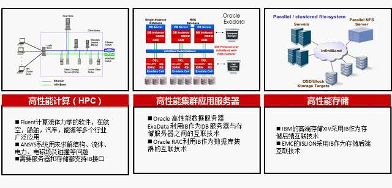

<!-- @import "[TOC]" {cmd="toc" depthFrom=1 depthTo=6 orderedList=false} -->

<!-- code_chunk_output -->

* [1 IB技术的发展](#1-ib技术的发展)
* [2 IB技术的优势](#2-ib技术的优势)
* [3 IB基本概念](#3-ib基本概念)
	* [3.1 IB的网络拓扑以及数据传输](#31-ib的网络拓扑以及数据传输)
* [4 IB协议简介](#4-ib协议简介)
	* [4.1 物理层](#41-物理层)
	* [4.2 链路层](#42-链路层)
	* [4.3 网络层](#43-网络层)
	* [4.4 传输层](#44-传输层)
	* [4.5 上层协议](#45-上层协议)
* [5 IB基本应用场景](#5-ib基本应用场景)
	* [5.1 Infiniband 在 HPC(High performance computing)领域的应用](#51-infiniband-在-hpchigh-performance-computing领域的应用)

<!-- /code_chunk_output -->

https://cloud.tencent.com/developer/news/384580

https://www.ibm.com/developerworks/cn/aix/library/1105_luoming_infiniband/index.html

https://www.cnblogs.com/e-shannon/p/7122659.html

https://weibo.com/p/1001603936363903889917?mod=zwenzhang

Infiniband开放标准技术简化并加速了**服务器之间的连接**,同时支持**服务器**与**远程存储和网络设备的连接(！！！**). OpenFabrics Enterprise Distribution (**OFED**)是一组开源软件驱动、核心内核代码、中间件和**支持InfiniBand Fabric的用户级接口程序**. 

2005年由OpenFabrics Alliance(OFA)发布第一个版本. **Mellanox OFED**用于Linux, Windows (WinOF), 包括各种诊断和性能工具, 用于**监视InfiniBand网络**的运行情况, 包括监视传输带宽和监视Fabric内部的拥塞情况. 

OpenFabrics Alliance (OFA)是一个基于开源的组织, 它开发、测试、支持OpenFabrics企业发行版. 该联盟的任务是开发并推广软件, 通过将高效消息、低延迟和最大带宽技术架构直接应用到最小CPU开销的应用程序中, 从而实现最大应用效率. 

该联盟成立于2004年6月, 最初是OpenIB联盟, 致力于开发独立于供应商、基于Linux的InfiniBand软件栈. 2005, 联盟致力于支持Windows, 此举将使软件栈真正跨平台. 

2006年, 该组织再次扩展其章程, 包括对iWARP的支持, 在2010年增加了对RoCE (RDMA over Converged)支持通过以太网交付高性能RDMA和内核旁路解决方案. 2014年, 随着OpenFabrics Interfaces工作组的建立, 联盟再次扩大, 实现对其他高性能网络的支持

# 1 IB技术的发展

1999年开始起草规格及标准规范, 2000年正式发表, 但发展速度不及Rapid I/O、PCI-X、PCI-E和FC, 加上Ethernet从1Gbps进展至10Gbps. 所以直到2005年之后, InfiniBand Architecture(IBA)才在集群式超级计算机上广泛应用. 全球HPC高算系统TOP500大效能的超级计算机中有相当多套系统都使用上IBA. 

除了InfiniBand Trade Association (IBTA)9个主要董事成员CRAY、Emulex、HP、IBM、intel、Mellanox、Microsoft、Oracle、Qlogic专门在应用和推广InfiniBand外, 其他厂商正在加入或者重返到它的阵营中来, 包括Cisco、Sun、NEC、LSI等. InfiniBand已经成为目前主流的高性能计算机互连技术之一. 为了满足HPC、企业数据中心和云计算环境中的高I/O吞吐需求, 新一代高速率56Gbps的FDR (Fourteen Data Rate) 和100Gpb EDR InfiniBand技术已经广泛应用. 

# 2 IB技术的优势

Infiniband大量用于**FC/IP SAN**、**NAS**和**服务器之间的连接**,作为iSCSI RDMA的存储协议iSER已被IETF标准化. 目前EMC全系产品已经切换到Infiniband组网, IBM/TMS的FlashSystem系列, IBM的存储系统XIV Gen3, DDN的SFA系列都采用Infiniband网络. 

相比FC的优势主要体现在性能是FC的3.5倍, Infiniband交换机的延迟是FC交换机的1/10, 支持SAN和NAS. 

存储系统已不能满足于传统的FC SAN所提供的服务器与裸存储的网络连接架构. HP SFS和IBM GPFS 是在Infiniband fabric连接起来的服务器和iSER Infiniband存储构建的并行文件系统, 完全突破系统的性能瓶颈. 

Infiniband采用**PCI串行高速带宽链接**, 从SDR、DDR、QDR、FDR到EDR HCA连接, 可以做到1微妙、甚至纳米级别极低的时延, 基于链路层的流控机制实现先进的拥塞控制. 

InfiniBand采用虚通道(VL即Virtual Lanes)方式来实现QoS, 虚通道是一些共享一条物理链接的相互分立的逻辑通信链路, 每条物理链接可支持多达15条的标准虚通道和一条管理通道(VL15)

RDMA技术实现内核旁路, 可以提供远程节点间RDMA读写访问, 完全卸载CPU工作负载, 基于硬件传出协议实现可靠传输和更高性能. 

相比TCP/IP网络协议, IB使用基于信任的、流控制的机制来确保连接的完整性, 数据包极少丢失, 接受方在数据传输完毕之后, 返回信号来标示缓存空间的可用性, 所以IB协议消除了由于原数据包丢失而带来的重发延迟, 从而提升了效率和整体性能. 

TCP/IP具有转发损失的数据包的能力, 但是由于要不断地确认与重发, 基于这些协议的通信也会因此变慢, 极大地影响了性能. 

# 3 IB基本概念

**网络**是常常被认为是**路由器**、**交换机**和插在服务器和存储设备上的**电缆**的集合. 在大部分人的印象里, 网络用来连接服务器到其他服务器、存储和其他网络. 其实, 这是一种普遍存在的对网络的片面看法, 它将过多的注意力集中在处于网络底层结构的电缆和交换机上. 这是典型的"**以网络为中心！！！**的"观点: 认为**网络的构成架构**应该**决定应用程序的通讯模式**. 

**Infiniband 网络**则基于"**以应用程序为中心**"的新观点. 它的提出来源于一个简单的问题: 如何让**应用程序**访问其他**应用程序**以及**存储**尽可能的**简单、高效和直接**?如果以"应用程序为中心"的观点来思考 I/O 问题, 就能得到一种与传统完全不同的网络架构. 

**Infiniband** 基于一种非常简单的原则: 提供一种**易于使用的消息服务！！！**. 这个服务可以被用来与**其他应用程序**、**进程**或者**存储**进行**通信**. **应用程序不再向操作系统提交访问其他资源的申请, 而是直接使用 Infiniband 消息服务！！！**. Infiniband 消息服务是一个非常**高效、直接的消息服务**, 它摒弃了传统网络和应用程序之间消息传递的复杂结构. 直接使用 Infiniband 服务意味着**应用程序不再依赖操作系统来传递消息**, 这大大提高了通信效率. 

如图 1, Infiniband 消息服务可以在**两个应用程序之间创建一个管道**, 来使应用程序之间直接进行通信, 从而**绕过了操作系统**, 大大提高了效率. 

那么, 什么是InfiniBand, 为什么越来越多的存储系统销售商不管是背板还是网络连接都要用到此连接?InfiniBand是一种在2000年左右出现的, 基于标准的网络协
议. **InfiniBand**整合了**NGIO**和**Future I/O**(**PCI总线替换技术的竞争技术**)这两种技术. 

从设计上来说, InfiniBand具有**总线技术的特点**, 但实际上, **PCI Express**——最终产生的PCI替换技术, 从概述上来说**是InfiniBand的一个子集**. 

InfiniBand与其他网络的核心区别有两个方面. 

首先, 其采用的是一种**基于信用的流量控制系统(这个和PCIE一致**). 即在**接收对象未保证充足的缓冲(！！！**)之前, **不会发送数据(！！！**). 这样, 就使得**InfiniBand**成为像无损光纤通道网络架构那样的**光纤通道**. 

其次, **InfiniBand**支持**远程直接内存访问(RDMA, 远程连接协议**), 具备在**完全卸载CPU和操作系统(！！！**)的方式下, 在**两个远程系统的存储区域移动数据(！！！**)的能力. 作为原始总线设计遗留下来的的理念, 如要对**分布式系统进行扩展**, **RDMA是关键(！！！**). 有RDMA的InfiniBand具备多种关键优势. 

InfiniBand的**物理信号技术(！！！**)一直超前于其他网络技术, 使得它都具备**比其他任何网络协议都大的带宽**. InfiniBand这一名称本身即说明了其无限的带宽发展前景. **InfiniBand路线图设计**的目的就是要保证**单个链路的带宽**能够保持在**大于PCIExpress(PCIe)总线数据速率(这是服务器内部总线标准！！！**)的水平. 这样, 系统就能够以其可产生的最快速度, 在网络间移动数据, 并且不会因出现因网络限制而导致的备份. 这样, 就可让 InfiniBand具备无限带宽. 

而InfiniBand弥补了PCI总线的上述缺陷, 以一种**全新的方式**把网络中常见的**交换和路由**概念引入了**I/O子系统**当中. 在**InfiniBand架构**中, 最主要的硬件部分就是**HCA**、**TCA**和**IB Link**. 

- **HCA**是**Host Channel Adapter**的缩写, 它是**连接内存控制器和TCA的桥梁**; 
- **TCA**是**Target Channel Adapter**的缩写, 它将**I/O设备(例如网卡、SCSI控制器**)的**数字信号**打包发送给**HCA**; 
- **IB Link**包含了**连接HCA和TCA的光纤！！！**以及**光纤交换机！！！**、**路由器等整套设备！！！**. 在现阶段**一根光纤的传输速率是2.5Git/s**, 支持**全双工模式**, 并且可以把**多条光纤捆绑到一起工作**, 目前的模式有**x1、x4、x12**三种. 

一言以蔽之, **InfiniBand架构**的核心就是把**I/O子系统从服务器主机中剥离出去**, 通过**光纤介质**, 采用**基于交换的端到端的传输模式连接**它们

## 3.1 IB的网络拓扑以及数据传输

下面我们看一下在InfiniBand架构中, 数据是如何传输的. 如图所示, InfiniBand架构相比PCI总线的方式更前进了一步, 在**内存控制器**与**HCA**之间是通过**Hub Link方式！！！**相连的, 目前的标准是**Hub Interface2.0**. infiniband的HCA和内存控制器如何相连, 以前是Hub link, 现在吧呢?猜测还是PCIE吧

没有研究infiniband和PCIE的竞争, 价格优劣以及性能优劣, 好像低端的超算的使用PCIE. 

没有评估infiniband和omini-path,cray的技术, 市场, 价格的. 

**Hub Link**是一种**串行总线**, 它的工作频率可以提到很高, 而它最大的优势就是**良好的可扩展性**, 主板设计师可以根据需要的总线带宽在**内存控制器**和**HCA之间**选择**多条Hub Link总线**. 

从图中可以看出, **数据**从**网卡或硬盘**首先通过**各自的I/O控制器**送给**TCA**, 再由**TCA**通过**InfiniBand Link**经过**交换机**甚至**路由器送到HCA**, 再通过**Hub Link总线**送到内存控制器

**InfiniBand**对**数据在传送中的处理**几乎照搬了**以太网协议**的全部思想. 和TCP/IP协议集极其相似, InfiniBand就是分了**6个协议层**, 从**Transport层！！！**向下各层数据的封装都是由**TCA和HCA自己完成(！！！**)的, 不需要占用系统CPU的资源, **交换机和路由器工作在Network层！！！**. 如果**超越了Transport层**, **HCA**会把任务交给系统处理, 这一部分的工作需要操作系统的支持, 但是**对于TCA**来说, 它是不需要考虑这些的, 只要把**物理层的信号**打包生成**网络层可以识别的packet**, 它的工作就算完成了. 

InfiniBand规范定义了3个基本组件: 

- 一个主机信道适配器(HCA)
- 一个目标信道适配器(TCA)
- 一个网络交换机

InfiniBand技术通过连接HCAs、TCAs、交换机和路由器而发挥作用(见图). 位于叶节点的InfiniBand设备是**产生和使用信息包(中间节点只是转发**)的信道适配器. 

**HCA 和TCA**可以提供一个**无需CPU干预**的高可靠**端－至－端连接**. **HCA**驻留在**处理器节点**并提供从**系统内存**到**InfiniBand网络**的通路. 它也有一个**可编程的直接内存访问(DMA)引擎**. 该引擎具有**特殊保护**和**地址翻译**特性, 从而使DMA操作可以本地进行或者通过另一个HCA或TCA远程进行. 

**TCA**驻留在**I/O单元**, 并提供**I/O设备(如一个磁盘驱动器**)或**I/O网络(如以太网或光纤通道**)与**InfiniBand网络的连接**. 它实现了InfiniBand协议的**物理层、链接层和传输层**. 

**交换机**放置在**信道适配器之间**. 它们使几个甚至几千个**InfiniBand叶节点**可以在**任意位置互连进一个单一网络**, 该网络同时支持**多个连接**. **交换机既不产生, 也不使用信息包！！！**. 它们只是根据信息包中路由器报头的**目的地地址**, 将其传送过去. 交换机对于节点而言是透明的, 同时**信息包完整无损地经过交换机网**. 

IB是以**通道为基础**的**双向**、**串行式传输**, 在**连接拓朴**中是采用**交换、切换式结构(Switched Fabric**), 在线路不够长时可用**IBA中继器(Repeater**)进行延伸. **每一个IBA网络**称为**子网(Subnet**), **每个子网**内最高可有**65,536个节点(Node**), IBA Switch、IBARepeater仅适用于Subnet范畴, 若要通跨多个IBASubnet就需要用到IBA路由器(Router)或IBA网关器(Gateway). 

每个节点(Node) 必须透过配接器(Adapter)与IBA Subnet连接, 节点CPU、内存要透过HCA(Host Channel Adapter)连接到子网; 节点硬盘、I/O则要透过TCA(TargetChannel Adapter)连接到子网, 这样的一个拓扑结构就构成了一个完整的IBA. 

IB的传输方式和介质相当灵活, 在设备机内可用印刷电路板的铜质线箔传递(Backplane背板), 在机外可用铜质缆线或支持更远光纤介质. 若用铜箔、铜缆最远可至17m, 而光纤则可至10km, 同时IBA也支持热插拔, 及具有自动侦测、自我调适的Active Cable活化智能性连接机制. 

# 4 IB协议简介

InfiniBand也是一种**分层协议(类似TCP/IP协议**), 每层负责不同的功能, 下层为上层服务, 不同层次相互独立.  IB采用IPv6的报头格式. 其数据包报头包括本地路由标识符LRH, 全局路由标示符GRH, 基本传输标识符BTH等. 

Mellanox OFED是一个单一的软件堆栈, 包括驱动、中间件、用户接口, 以及一系列的标准协议IPoIB、SDP、SRP、iSER、RDS、DAPL(Direct Access Programming Library), 支持MPI、Lustre/NFS over RDMA等协议, 并提供Verbs编程接口; Mellanox OFED由开源OpenFabrics组织维护. 

当然, Mellanox OFED软件堆栈是承载在InfiniBand硬件和协议之上的, 软件通协议和硬件进行有效的数据传输. 

## 4.1 物理层

**物理层**定义了**电气特性**和**机械特性**, 包括光纤和铜媒介的电缆和插座、底板连接器、热交换特性等. 定义了**背板**、**电缆**、**光缆**三种物理端口. 

并定义了用于**形成帧的符号(包的开始和结束**)、数据符号(DataSymbols)、和数据包直接的填充(Idles). 详细说明了构建有效包的信令协议, 如码元编码、成帧标志排列、开始和结束定界符间的无效或非数据符号、非奇偶性错误、同步方法等. 

## 4.2 链路层

链路层描述了**数据包的格式**和**数据包操作的协议**, 如流量控制和子网内数据包的路由. 链路层有**链路管理数据包**和**数据包**两种类型的数据包. 

## 4.3 网络层

网络层是**子网间转发数据包的协议(！！！不同子网！！！**), 类似于**IP网络中的网络层**. 实现**子网间的数据路由**, 数据在**子网内传输时不需网络层(！！！**)的参与. 

数据包中包含**全局路由头GRH**, 用于**子网间数据包路由转发**. 全局路由头部指明了使用IPv6地址格式的全局标识符(GID)的源端口和目的端口, 路由器基于GRH进行数据包转发. GRH采用IPv6报头格式. GID由每个子网唯一的子网 标示符和端口GUID捆绑而成. 

## 4.4 传输层

传输层负责报文的分发、通道多路复用、基本传输服务和处理报文分段的发送、接收和重组. 传输层的功能是将数据包传送到各个指定的队列(QP)中, 并指示队列如何处理该数据包. 当消息的数据路径负载大于路径的最大传输单元(MTU)时, 传输层负责将消息分割成多个数据包. 

接收端的队列负责将数据重组到指定的数据缓冲区中. 除了原始数据报外, 所有的数据包都包含BTH, BTH指定目的队列并指明操作类型、数据包序列号和分区信息. 

## 4.5 上层协议

InfiniBand为不同类型的用户提供了不同的上层协议, 并为某些管理功能定义了消息和协议. InfiniBand主要支持SDP、SRP、iSER、RDS、IPoIB和uDAPL等上层协议. 

SDP(SocketsDirect Protocol)是InfiniBand Trade Association (IBTA)制定的基于infiniband的一种协议, 它允许用户已有的使用TCP/IP协议的程序运行在高速的infiniband之上. 

SRP(SCSIRDMA Protocol)是InfiniBand中的一种通信协议, 在InfiniBand中将SCSI命令进行打包, 允许SCSI命令通过RDMA(远程直接内存访问)在不同的系统之间进行通信, 实现存储设备共享和RDMA通信服务. 

iSER(iSCSIRDMA Protocol)类似于SRP(SCSI RDMA protocol)协议, 是IB SAN的一种协议 , 其主要作用是把iSCSI协议的命令和数据通过RDMA的方式跑到例如Infiniband这种网络上, 作为iSCSI RDMA的存储协议iSER已被IETF所标准化. 

RDS(Reliable Datagram Sockets)协议与UDP 类似, 设计用于在Infiniband 上使用套接字来发送和接收数据. 实际是由Oracle公司研发的运行在infiniband之上, 直接基于IPC的协议. 

IPoIB(IP-over-IB)是为了实现INFINIBAND网络与TCP/IP网络兼容而制定的协议, 基于TCP/IP协议, 对于用户应用程序是透明的, 并且可以提供更大的带宽, 也就是原先使用TCP/IP协议栈的应用不需要任何修改就能使用IPoIB. 

uDAPL(UserDirect Access Programming Library)用户直接访问编程库是标准的API, 通过远程直接内存访问 RDMA功能的互连(如InfiniBand)来提高数据中心应用程序数据消息传送性能、伸缩性和可靠性. 

# 5 IB基本应用场景

Infiniband灵活支持直连及交换机多种组网方式, 主要用于HPC高性能计算场景, 大型数据中心高性能存储等场景, HPC应用的共同诉求是低时延

## 5.1 Infiniband 在 HPC(High performance computing)领域的应用

**高性能计算(HPC**)是一个涵盖面很广的领域, 它覆盖了从最大的"TOP 500"高性能集群到微型桌面集群. 这篇文章里的我们谈及的 HPC 是这样一类系统, 它**所有的计算能力**在一段时间内都被用来**解决同一个大型问题**. 换句话说, 我们这里讨论的 HPC 系统不会被用来运行传统的企业应用, 例如: 邮件、计费、web 等. 一些典型的 HPC 应用包括: 大气建模、基因研究、汽车碰撞模拟、流体动态分析等. 

图 2 显示了一个标准的高性能集群(HPC)的拓扑结构. 可以看到, 在**高性能计算集群**中, **各种设备**是通过**集群的交换网络！！！**连接到一起的. 所以, **高性能计算系统**除了需要**高性能的中央处理器**外, 还需要**高性能的存储**和**低延迟的进程间通信**来满足科学运算的需求. 在**大型集群**中**高速的交换网络**扮演了非常重要的角色, 甚至比 CPU 还要关键, 处于**集群的核心位置**. 

大量的实验数据表明, **集群的性能**和**可扩展性**主要和**消息在节点之间的传递速度(！！！**)有关, 这意味着**低延迟的消息传递是被迫切需求**的, 而这正是 Infiniband 的优势. 下面我们就介绍下 Infiniband 为什么比传统网络更适合高性能计算系统. 

根据我们对高性能计算系统的认识, Infiniband 的低延迟、高带宽和原生的通道架构对于此类系统来说是非常重要的. **低延迟的 Infiniband 网络**可以在**保证性能**的前提下, **增大集群的规模**. **通道 I/O 架构**则可以提供**可扩展的存储带宽性能**, 并且**支持并行文件系统**. 

说道 HPC 就不能不提 **MPI(Message Passing Interface**). MPI 是应用在 HPC 上主要的**消息传递中间件标准(！！！**). 虽然 MPI 也可以应用在**基于共享内存的系统**上, 但是, 更多的则是**被当作通讯层**用作**连接集群中的不同节点(！！！**). 

**MPI 通讯服务**依赖于**底层的提供节点间真正信息传递的消息服务**. **Infiniband** 作为一种**底层消息服务**为 MPI 层提供了被称为 **RDMA(Remote Direct Memory Access)的消息服务！！！**. 在上面一章, 我们讨论了应用程序之间如何通过 Infiniband 通讯架构来实现直接的通讯, 从而绕过操作系统. 在 HPC 中, 我们可以认为 **HPC 应用程序调用 MPI 通讯服务**, 而 **MPI** 则**利用底层的 RDMA 消息服务**实现**节点间通讯**. 这就使得, **HPC 应用程序**具备了**不消耗集群 CPU 资源的通讯能力(！！！**). 

