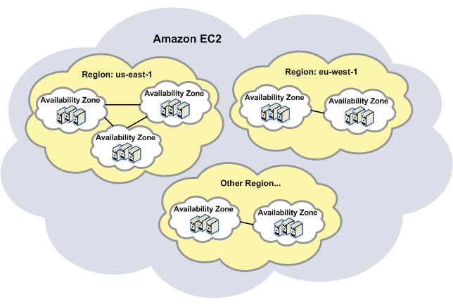
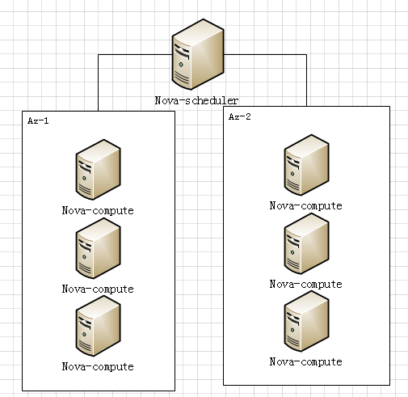
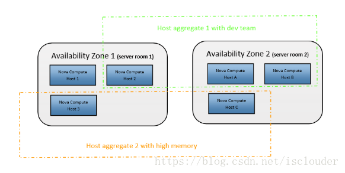
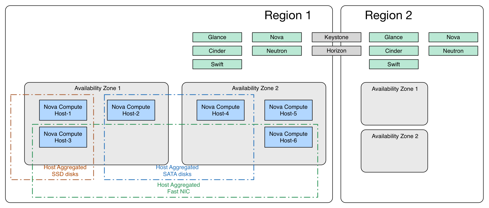

<!-- @import "[TOC]" {cmd="toc" depthFrom=1 depthTo=6 orderedList=false} -->

<!-- code_chunk_output -->

- [0 概述](#0-概述)
- [1 Region](#1-region)
- [2 availability zone](#2-availability-zone)
- [3 Aggregate Hosts](#3-aggregate-hosts)
- [4 Availability Zones和Host Aggregate的关系图](#4-availability-zones和host-aggregate的关系图)
- [5 例子](#5-例子)
- [参考](#参考)

<!-- /code_chunk_output -->

# 0 概述

OpenStack是Amazon AWS的开源实现, 直白点就是山寨产品吧, 对于主机的分布也不例外的copy了Amazon EC2

首先记住一点, Region, Availability Zone和Aggregate host这三者是从大范围到小范围的关系, 即前者包含了后者. 

Region的概念即美国区, 欧洲区, 亚洲区, 是最大范围的一个划分, 如果你的主要用户都在美国, 那么用户在部署VM的时候选择美国区, 以提高用户的访问速度和较好的SLA. 阿里云也可以选择是杭州节点还是青岛节点, 一个道理. 


Availability 

Zone是针对一个区来说的, 将区分成更小的范围, 如果你将VM都部署在一个Region的其中一个AZ上, 那么当该AZ出现故障(比较糟糕的, 完全断电
或者火灾之类的), 那么你的instances就都挂掉了. 所以一般将应用的多个VM实例分别部署在Region的多个AZ上, 提高AZ的容灾性和可用
性. 当然对于一个Region只在一个机房的情况下一个AZ可以是一个或几个相邻的机架, 这个定义由管理员可以指定(nova.conf), 如果没有指定
的话在Folsom版本中所有的service默认都在nova这个Zone中. 在OpenStack的Nova中是可以让用户指定VM是在哪个AZ启动
的, 这样nova-scheduler就会针对这个AZ做虚拟机部署的调度. 该特性面向用户, 用户可以指定AZ部署虚拟机. 

Aggregate Host 

Aggregate则是针对一个AZ来说的, 主要是针对有共同特性的主机host做一个aggregate, 如共享存储和网络, 或可信计算硬件等. 比较常用的做法是和nova-scheduler结合, 比如说nova-scheduler会将同一flavor或image的VM放置在一个aggregate中. 该特性只面向管理员(nova.conf), 可以由管理员指定相关的调度策略, 而用户不可见. 

附上OpenStack官方的概念介绍: http://docs.openstack.org/trunk/openstack-ops/content/scaling.html

# 1 Region

Region更像是一个地理上的概念, 每个region有自己独立的endpoint, regions之间完全隔离, 但是多个regions之间共享同一个keystone和dashboard, region的设计更多侧重地理位置的概念, 用户可以选择离自己更近的region来部署自己的服务. 

# 2 availability zone

az是在**region范围内**的再次切分, 只是**工程上的独立**, 例如可以把一个机架上的机器划分在一个az中, 划分az是为了提高**容灾性**和提供**廉价的隔离服务**. 选择不同的region主要考虑哪个region靠近你的用户群体, 比如用户在美国, 自然会选择离美国近的region; 选择不同的az是为了防止所有的instance一起挂掉, 下图描述了二者之间的关系. 



catalog其实是分级的  ..., 第二级的region就是上文提到的region. 在这里我们可以设置不同的region和不同的service的endpoint. horizon只提取keystone中catalog的regionOne中的endpoint, 所以, 即使设置了多个region, horizon也体现不出来. 

az在openstack中其实是nova\-scheduler来实现的, 当新建虚拟机, 调度器将会根据nova-compute设置的az来调度, 例如在新建虚拟机的时候, 用户设置了希望将虚拟机放在az-1中, 那么调度器将会选择属于这个az的nova\-compute来调度, 如下图所示. 



```
#nova boot --image 1fe4b52c-bda5-11e2-a40b-f23c91aec05e --flavor large --availability-zone chicago:clocktower
```

指定instance clocktower将在availability zone\-chicago被创建, 至于那些compute node属于哪一个az, 是在nova.conf中通过参数node\_availability\_zone=xxx来配置的. 

Availability Zones 通常是对 computes 节点上的资源在小的区域内进行逻辑上的分组和隔离. 例如在同一个数据中心, 我们可以将 Availability Zones 规划到不同的机房, 或者在同一机房的几个相邻的机架, 从而保障如果某个 Availability Zone 的节点发生故障(如供电系统或网络), 而不影响其他的 Availability Zones 上节点运行的虚拟机, 通过这种划分来提高 OpenStack 的可用性. 目前 OpenStack 默认的安装是把所有的 computes 节点划分到 nova 的 Availability Zone 上, 但我们可以通过对 nova.conf 文件的配置来定义不同的 Availability zones. 

# 3 Aggregate Hosts

host aggregate是管理员用来根据**硬件资源**的**某一属性！！！** 来对硬件进行划分的功能, **只对管理员可见**, 主要用来给nova\-scheduler通过某一属性来进行instance的调度. 其主要功能就是实现根据某一属性来划分物理机, 比如按照地理位置, 使用固态硬盘的机器, 内存超过32G的机器, 根据这些指标来构成一个host group. 

Availability zones are a customer-facing capability, host aggregates are meant to be used by administrators to separate hardware by particular properties, and are not seen by customers.

az是一个面向终端客户的概念和能力, 而host aggregate是管理员用来根据硬件资源的某一属性来对硬件进行划分的功能, 只对管理员可见. 

其主要功能就是实现根据某一属性来划分物理机, 比如按照地理位置, 使用固态硬盘的机器, 内存超过32G的机器, 根据这些指标来构成一个host group. 

nova aggregate-create joesservers chicago

Host aggregate可以用来进一步细分availability zone. 

通过以上分析, 问题就来了: availability zone和host aggregate都能对host machine进行划分, 那么二者的区别是啥?

Availability zones are handy for allowing users to specify a particular group of servers on which they want their host to run, but beyond that they don't do much more than serve as a bucket. In this example, using an availability zone, our users can specify that a VM should be started up in the Chicago data center.

Host aggregates, on the other hand, serve as an intelligent way for schedulers to know where to place VM's based on some sort of characteristic. In this example, we might want to enable users to easily boot their most mission-critical VMs on servers that are administered by Joe, rather than leaving them to fate.

综上所述: az是用户可见的, 用户手动的来指定vm运行在哪些host上; Host aggregate是一种更智能的方式, 是调度器可见的, 影响调度策略的一个表达式. 

# 4 Availability Zones和Host Aggregate的关系图





Host Aggregates

Host aggregates can be regarded as a mechanism to further partition an availability zone; while availability zones are visible to users, host aggregates are only visible to administrators. Host aggregates started out as a way to use Xen hypervisor resource pools, but has been generalized to provide a mechanism to allow administrators to assign key-value pairs to groups of machines. Each node can have multiple aggregates, each aggregate can have multiple key-value pairs, and the same key-value pair can be assigned to multiple aggregate. This information can be used in the scheduler to enable advanced scheduling, to set up xen hypervisor resources pools or to define logical groups for migration.

理解: Host Aggregates可以视为是AZ(Avaliability Zone)的更进一步的划分, 是对管理员可见的. 每一个节点都可以属于多个Aggregates, 这些Aggregates可以用作更高级的调度、配置Xen的资源池、或者定义用于升级的逻辑分组. 可以理解为aggregate是一组具有相同属性主机的分组. 

Availability Zones (AZs)

Availability Zones are the end-user visible logical abstraction for partitioning a cloud without knowing the physical infrastructure. That abstraction doesn't come up in Nova with an actual database model since the availability zone is actually a specific metadata information attached to an aggregate. Adding that specific metadata to an aggregate makes the aggregate visible from an end-user perspective and consequently allows to schedule upon a specific set of hosts (the ones belonging to the aggregate).

That said, there are a few rules to know that diverge from an API perspective between aggregates and availability zones:

- one host can be in multiple aggregates, but it can only be in one availability zone
- by default a host is part of a default availability zone even if it doesn't belong to an aggregate (the configuration option is named default_availability_zone)

理解: Availability Zones可以理解为将一个aggregate加了一些metadata信息, 使得对用户可见. 他和Aggregate最主要的区别是, 一个节点只能属于一个AZ, 默认一个主机属于一个默认的AZ. 

Xen Pool Host Aggregates

Originally all aggregates were Xen resource pools, now an aggregate can be set up as a resource pool by giving the aggregate the correct key-value pair.

You can use aggregates for XenServer resource pools when you have multiple compute nodes installed (only XenServer/XCP via xenapi driver is currently supported), and you want to leverage the capabilities of the underlying hypervisor resource pools. For example, you want to enable VM live migration (i.e. VM migration within the pool) or enable host maintenance with zero-downtime for guest instances. Please, note that VM migration across pools (i.e. storage migration) is not yet supported in XenServer/XCP, but will be added when available. Bear in mind that the two migration techniques are not mutually exclusive and can be used in combination for a higher level of flexibility in your cloud management.

理解: 可以将Xen的划分到一个Aggregate, 来支持Xen资源池的一些特性. 

Design

The OSAPI Admin API is extended to support the following operations:

Aggregates

- list aggregates: returns a list of all the host-aggregates (optionally filtered by availability zone)

- create aggregate: creates an aggregate, takes a friendly name, etc. returns an id
- show aggregate: shows the details of an aggregate (id, name, availability_zone, hosts and metadata)
- update aggregate: updates the name and availability zone of an aggregate
- set metadata: sets the metadata on an aggregate to the values supplied
- delete aggregate: deletes an aggregate, it fails if the aggregate is not empty
- add host: adds a host to the aggregate
- remove host: removes a host from the aggregate

Hosts

- start host maintenance (or evacuate-host): disallow a host to serve API requests and migrate instances to other hosts of the aggregate
- stop host maintenance: (or rebalance-host): put the host back into operational mode, migrating instances back onto that host

理解: 对于Aggregate操作有: 列出、创建、显示信息、更新、设置metadaa、删除、添加主机、移除主机. 对于host的操作有: 开启维护主机、停止维护主机. 

# 5 例子

配置

/etc/nova/nova.conf

```
[filter_scheduler]
available_filters = nova.scheduler.filters.all_filters
enabled_filters = AggregateInstanceExtraSpecsFilter
```

openstack官方使用host aggregate的例子

This example configures the Compute service to enable users to request nodes that have solid-state drives (SSDs). You create a fast-io host aggregate in the nova availability zone and you add the ssd=true key-value pair to the aggregate. Then, you add the node1, and node2 compute nodes to it.

```
$ nova aggregate-create fast-io nova
+----+---------+-------------------+-------+----------+
| Id | Name    | Availability Zone | Hosts | Metadata |
+----+---------+-------------------+-------+----------+
| 1  | fast-io | nova              |       |          |
+----+---------+-------------------+-------+----------+
$ nova aggregate-set-metadata 1 ssd=true
+----+---------+-------------------+-------+-------------------+
| Id | Name    | Availability Zone | Hosts | Metadata          |
+----+---------+-------------------+-------+-------------------+
| 1  | fast-io | nova              | []    | {u'ssd': u'true'} |
+----+---------+-------------------+-------+-------------------+
$ nova aggregate-add-host 1 node1
+----+---------+-------------------+------------+-------------------+
| Id | Name    | Availability Zone | Hosts      | Metadata          |
+----+---------+-------------------+------------+-------------------+
| 1  | fast-io | nova              | [u'node1'] | {u'ssd': u'true'} |
+----+---------+-------------------+------------+-------------------+
$ nova aggregate-add-host 1 node2
+----+---------+-------------------+----------------------+-------------------+
| Id | Name    | Availability Zone | Hosts                | Metadata          |
+----+---------+-------------------+----------------------+-------------------+
| 1  | fast-io | nova              | [u'node1', u'node2'] | {u'ssd': u'true'} |
+----+---------+-------------------+----------------------+-------------------+
```


Use the nova flavor-create command to create the ssd.large flavor called with an ID of 6, 8 GB of RAM, 80 GB root disk, and four vCPUs.

```
$ nova flavor-create ssd.large 6 8192 80 4
+----+-----------+-----------+------+-----------+------+-------+-------------+-----------+
| ID | Name      | Memory_MB | Disk | Ephemeral | Swap | VCPUs | RXTX_Factor | Is_Public |
+----+-----------+-----------+------+-----------+------+-------+-------------+-----------+
| 6  | ssd.large | 8192      | 80   | 0         |      | 4     | 1.0         | True      |
+----+-----------+-----------+------+-----------+------+-------+-------------+-----------+
```


Once the flavor is created, specify one or more key-value pairs that match the key-value pairs on the host aggregates with scope aggregate_instance_extra_specs. In this case, that is the aggregate_instance_extra_specs:ssd=true key-value pair. Setting a key-value pair on a flavor is done using the nova flavor-key command.

```
$ nova flavor-key ssd.large set aggregate_instance_extra_specs:ssd=true
```

Once it is set, you should see the extra_specs property of the ssd.large flavor populated with a key of ssd and a corresponding value of true.

```
$ nova flavor-show ssd.large
+----------------------------+--------------------------------------------------+
| Property                   | Value                                            |
+----------------------------+--------------------------------------------------+
| OS-FLV-DISABLED:disabled   | False                                            |
| OS-FLV-EXT-DATA:ephemeral  | 0                                                |
| disk                       | 80                                               |
| extra_specs                | {u'aggregate_instance_extra_specs:ssd': u'true'} |
| id                         | 6                                                |
| name                       | ssd.large                                        |
| os-flavor-access:is_public | True                                             |
| ram                        | 8192                                             |
| rxtx_factor                | 1.0                                              |
| swap                       |                                                  |
| vcpus                      | 4                                                |
+----------------------------+--------------------------------------------------+
```

Now, when a user requests an instance with the ssd.large flavor, the scheduler only considers hosts with the ssd=true key-value pair. In this example, these are node1 and node2.

nova实现 host aggregate的命令

```
# nova -h |grep aggregate
    aggregate-add-host          Add the host to the specified aggregate.
    aggregate-create            Create a new aggregate with the specified
    aggregate-delete            Delete the aggregate.
    aggregate-details           DEPRECATED, use aggregate-show instead.
    aggregate-list              Print a list of all aggregates.
    aggregate-remove-host       Remove the specified host from the specified
                                aggregate.
    aggregate-set-metadata      Update the metadata associated with the
                                aggregate.
    aggregate-show              Show details of the specified aggregate.
    aggregate-update            Update the aggregate's name and optionally
```

# 参考

- http://blog.chinaunix.net/uid-20940095-id-3875022.html
- https://blog.csdn.net/isclouder/article/details/79878346
