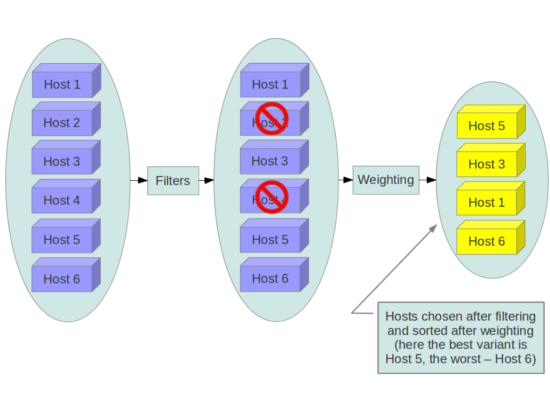
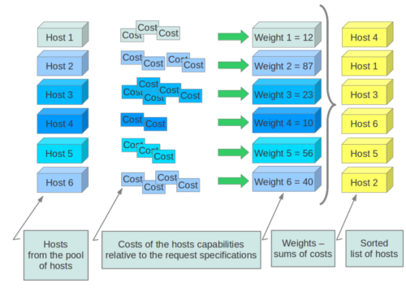

<!-- @import "[TOC]" {cmd="toc" depthFrom=1 depthTo=6 orderedList=false} -->

<!-- code_chunk_output -->

* [1 概述](#1-概述)
	* [1.1 标准过滤器](#11-标准过滤器)
	* [1.2 权重计算](#12-权重计算)
	* [1.3 常见策略](#13-常见策略)
* [2 元数据](#2-元数据)
	* [2.1 调度测试](#21-调度测试)
		* [2.1.1 过滤器配置](#211-过滤器配置)
		* [2.1.2 集合配置](#212-集合配置)
		* [2.1.3 创建io\-slow集合](#213-创建io-slow集合)
		* [2.1.4 模板配置](#214-模板配置)
		* [2.1.5 创建虚拟机](#215-创建虚拟机)
* [参考](#参考)

<!-- /code_chunk_output -->

# 1 概述

在创建一个新虚拟机实例时, Nova Scheduler通过配置好的Filter Scheduler对所有计算节点进行过滤(filtering)和称重(weighting), 最后根据称重高低和用户请求节点个数返回可用主机列表. 如果失败, 则表明没有可用的主机. 

## 1.1 标准过滤器



- AllHostsFilter - 不进行过滤, 所有可见的主机都会通过. 

- ImagePropertiesFilter - 根据镜像元数据进行过滤. 

- AvailabilityZoneFilter - 根据可用区域进行过滤(Availability Zone元数据). 

- ComputeCapabilitiesFilter - 根据计算能力进行过滤, 通过请求创建虚拟机时指定的参数与主机的属性和状态进行匹配来确定是否通过, 可用的操作符如下: 

    * = (equal to or greater than as a number; same as vcpus case)
    * == (equal to as a number)
    * != (not equal to as a number)
    * \>= (greater than or equal to as a number)
    * \<= (less than or equal to as a number)
    * s== (equal to as a string)
    * s!= (not equal to as a string)
    * s\>= (greater than or equal to as a string)
    * s\> (greater than as a string)
    * s\<= (less than or equal to as a string)
    * s\< (less than as a string)
    * \<in\> (substring)
    * \<all\-in\> (all elements contained in collection)
    * \<or\> (find one of these)

Examples are: 

```
">= 5", "s== 2.1.0", "<in> gcc", "<all-in> aes mmx", and "<or> fpu <or> gpu"
```

部分可用的属性: 

    * free_ram_mb (compared with a number, values like ">= 4096")
    * free_disk_mb (compared with a number, values like ">= 10240")
    * host (compared with a string, values like: "<in> compute","s== compute_01")
    * hypervisor_type (compared with a string, values like: "s== QEMU", "s== powervm")
    * hypervisor_version (compared with a number, values like : ">= 1005003", "== 2000000")
    * num_instances (compared with a number, values like: "<= 10")
    * num_io_ops (compared with a number, values like: "<= 5")
    * vcpus_total (compared with a number, values like: "= 48", ">=24")
    * vcpus_used (compared with a number, values like: "= 0", "<= 10")

- AggregateInstanceExtraSpecsFilter - 根据额外的主机属性进行过滤(Host Aggregate元数据), 与ComputeCapabilitiesFilter类似. 

- ComputeFilter - 根据主机的状态和服务的可用性过滤. 

- CoreFilter AggregateCoreFilter - 根据剩余可用的CPU个数进行过滤. 

- IsolatedHostsFilter - 根据nova.conf中的image_isolated、 host_isolated, 和restrict_isolated_hosts_to_isolated_images 标志进行过滤, 用于节点隔离. 

- JsonFilter - 根据JSON语句来过滤. 

- RamFilter AggregateRamFilter - 根据内存来过滤. 

- DiskFilter AggregateDiskFilter - 根据磁盘空间来过滤. 

- NumInstancesFilter AggregateNumInstancesFilter - 根据节点实例个数来过滤. 

- IoOpsFilter AggregateIoOpsFilter - 根据IO状况过滤. 

- PciPassthroughFilter - 根据请求的PCI设备进行过滤. 

- SimpleCIDRAffinityFilter - 在同一个IP子网上创建虚拟机. 

- SameHostFilter - 在与一个实例相同的主机上启动实例. 

- RetryFilter - 过滤掉已经尝试过的主机. 

- AggregateTypeAffinityFilter - 限定一个Aggregate中创建的实例类型(Flavor类型). 

- ServerGroupAntiAffinityFilter - 尽量把实例部署在不同主机. 

- ServerGroupAffinityFilter - 尽量把实例部署在相同主机. 

- AggregateMultiTenancyIsolation - 把租户隔离在指定的Aggregate. 

- AggregateImagePropertiesIsolation - 根据镜像属性和Aggregate属性隔离主机. 

- MetricsFilter - 根据weight_setting 过滤主机, 只有具备可用测量值的主机被通过. 

- NUMATopologyFilter - 根据实例的NUMA要求过滤主机. 

## 1.2 权重计算



当过滤后如果有多个主机, 则需要进行权重计算, 最后选出权重最高的主机, 公式如下: 

```
weight = w1_multiplier * norm(w1) + w2_multiplier * norm(w2) + ...
```

每一项都由"权重系数"(wN_multiplier)乘以"称重值"(norm(wN)), "权重系数"通过配置文件获取, "称重值"由"称重对象"(Weight Object)动态生成, 目前可用的"称重对象"主要有: RAMWeigher, DiskWeigher, MetricsWeigher, IoOpsWeigher, PCIWeigher, ServerGroupSoftAffinityWeigher和ServerGroupSoftAntiAffinityWeigher. 

## 1.3 常见策略

根据不同的需求, 可以制定出不同的调度策略, 使用调度插件进行组合, 以满足需求. 下面是一些常见的调度策略: 

- Packing:  虚拟机尽量放置在含有虚拟机数量最多的主机上. 

- Stripping: 虚拟机尽量放置在含有虚拟机数量最少的主机上. 

- CPU load balance: 虚拟机尽量放在可用core最多的主机上. 

- Memory load balance: 虚拟机尽量放在可用memory 最多的主机上. 

- Affinity : 多个虚拟机需要放置在相同的主机上. 

- AntiAffinity: 多个虚拟机需要放在在不同的主机上. 

- CPU Utilization load balance: 虚拟机尽量放在CPU利用率最低的主机上. 

# 2 元数据

## 2.1 调度测试

由于各种元数据过滤方法都大同小异, 而Flavor元数据没有太多预定义的值, 处理比较自由, 因此这里以Flavor元数据过滤器进行测试. 

### 2.1.1 过滤器配置

新增AggregateInstanceExtraSpecsFilter过滤器: 

```
$ vi /etc/kolla/nova-scheduler/nova.conf
[DEFAULT]
...
scheduler_default_filters = AggregateInstanceExtraSpecsFilter, RetryFilter, RamFilter, DiskFilter, ComputeFilter, ComputeCapabilitiesFilter, ImagePropertiesFilter, ServerGroupAntiAffinityFilter, ServerGroupAffinityFilter
...

$ docker restart nova_scheduler
```

### 2.1.2 集合配置

- 创建io\-fast集合: 

```
$ nova aggregate-create io-fast
+----+---------+-------------------+-------+----------+--------------------------------------+
| Id | Name    | Availability Zone | Hosts | Metadata | UUID                                 |
+----+---------+-------------------+-------+----------+--------------------------------------+
| 8  | io-fast | -                 |       |          | 2523c96a-46ee-4fac-ba8a-5b50a4d1ebbd |
+----+---------+-------------------+-------+----------+--------------------------------------+
$ nova aggregate-set-metadata io-fast io=fast
Metadata has been successfully updated for aggregate 8.
+----+---------+-------------------+-------+-----------+--------------------------------------+
| Id | Name    | Availability Zone | Hosts | Metadata  | UUID                                 |
+----+---------+-------------------+-------+-----------+--------------------------------------+
| 8  | io-fast | -                 |       | 'io=fast' | 2523c96a-46ee-4fac-ba8a-5b50a4d1ebbd |
+----+---------+-------------------+-------+-----------+--------------------------------------+

$ nova aggregate-add-host io-fast osdev-01
Host osdev-01 has been successfully added for aggregate 8 
+----+---------+-------------------+------------+-----------+--------------------------------------+
| Id | Name    | Availability Zone | Hosts      | Metadata  | UUID                                 |
+----+---------+-------------------+------------+-----------+--------------------------------------+
| 8  | io-fast | -                 | 'osdev-01' | 'io=fast' | 2523c96a-46ee-4fac-ba8a-5b50a4d1ebbd |
+----+---------+-------------------+------------+-----------+--------------------------------------+

$ nova aggregate-add-host io-fast osdev-02
Host osdev-02 has been successfully added for aggregate 8 
+----+---------+-------------------+------------------------+-----------+--------------------------------------+
| Id | Name    | Availability Zone | Hosts                  | Metadata  | UUID                                 |
+----+---------+-------------------+------------------------+-----------+--------------------------------------+
| 8  | io-fast | -                 | 'osdev-01', 'osdev-02' | 'io=fast' | 2523c96a-46ee-4fac-ba8a-5b50a4d1ebbd |
+----+---------+-------------------+------------------------+-----------+--------------------------------------+

$ nova aggregate-add-host io-fast osdev-03
Host osdev-03 has been successfully added for aggregate 8 
+----+---------+-------------------+------------------------------------+-----------+--------------------------------------+
| Id | Name    | Availability Zone | Hosts                              | Metadata  | UUID                                 |
+----+---------+-------------------+------------------------------------+-----------+--------------------------------------+
| 8  | io-fast | -                 | 'osdev-01', 'osdev-02', 'osdev-03' | 'io=fast' | 2523c96a-46ee-4fac-ba8a-5b50a4d1ebbd |
+----+---------+-------------------+------------------------------------+-----------+--------------------------------------+
```

### 2.1.3 创建io\-slow集合

```
$ nova aggregate-create io-slow
+----+---------+-------------------+-------+----------+--------------------------------------+
| Id | Name    | Availability Zone | Hosts | Metadata | UUID                                 |
+----+---------+-------------------+-------+----------+--------------------------------------+
| 9  | io-slow | -                 |       |          | d10d2eaf-43d7-464e-bc12-10f18897b476 |
+----+---------+-------------------+-------+----------+--------------------------------------+

$ nova aggregate-set-metadata io-slow io=slow
Metadata has been successfully updated for aggregate 9.
+----+---------+-------------------+-------+-----------+--------------------------------------+
| Id | Name    | Availability Zone | Hosts | Metadata  | UUID                                 |
+----+---------+-------------------+-------+-----------+--------------------------------------+
| 9  | io-slow | -                 |       | 'io=slow' | d10d2eaf-43d7-464e-bc12-10f18897b476 |
+----+---------+-------------------+-------+-----------+--------------------------------------+

$ nova aggregate-add-host io-slow osdev-gpu
Host osdev-gpu has been successfully added for aggregate 9 
+----+---------+-------------------+-------------+-----------+--------------------------------------+
| Id | Name    | Availability Zone | Hosts       | Metadata  | UUID                                 |
+----+---------+-------------------+-------------+-----------+--------------------------------------+
| 9  | io-slow | -                 | 'osdev-gpu' | 'io=slow' | d10d2eaf-43d7-464e-bc12-10f18897b476 |
+----+---------+-------------------+-------------+-----------+--------------------------------------+

$ nova aggregate-add-host io-slow osdev-ceph
Host osdev-ceph has been successfully added for aggregate 9 
+----+---------+-------------------+---------------------------+-----------+--------------------------------------+
| Id | Name    | Availability Zone | Hosts                     | Metadata  | UUID                                 |
+----+---------+-------------------+---------------------------+-----------+--------------------------------------+
| 9  | io-slow | -                 | 'osdev-gpu', 'osdev-ceph' | 'io=slow' | d10d2eaf-43d7-464e-bc12-10f18897b476 |
+----+---------+-------------------+---------------------------+-----------+--------------------------------------+
```

### 2.1.4 模板配置

- 创建io-fast虚拟机模板

```
$ openstack flavor create --vcpus 1 --ram 64 --disk 1 machine.fast
$ nova flavor-key machine.fast set io=fast

$ openstack flavor show machine.fast
+----------------------------+--------------------------------------+
| Field                      | Value                                |
+----------------------------+--------------------------------------+
| OS-FLV-DISABLED:disabled   | False                                |
| OS-FLV-EXT-DATA:ephemeral  | 0                                    |
| access_project_ids         | None                                 |
| disk                       | 1                                    |
| id                         | 4c8a6d15-270d-464b-bd3b-303d167af4cb |
| name                       | machine.fast                         |
| os-flavor-access:is_public | True                                 |
| properties                 | io='fast'                            |
| ram                        | 64                                   |
| rxtx_factor                | 1.0                                  |
| swap                       |                                      |
| vcpus                      | 1                                    |
+----------------------------+--------------------------------------+
```

- 创建io-slow虚拟机模板

```
$ openstack flavor create --vcpus 1 --ram 64 --disk 1 machine.slow
$ nova flavor-key machine.slow set io=slow

$ openstack flavor show machine.slow
+----------------------------+--------------------------------------+
| Field                      | Value                                |
+----------------------------+--------------------------------------+
| OS-FLV-DISABLED:disabled   | False                                |
| OS-FLV-EXT-DATA:ephemeral  | 0                                    |
| access_project_ids         | None                                 |
| disk                       | 1                                    |
| id                         | f6a0fdad-3f20-40ed-a4fc-0ba49ff4ff02 |
| name                       | machine.slow                         |
| os-flavor-access:is_public | True                                 |
| properties                 | io='slow'                            |
| ram                        | 64                                   |
| rxtx_factor                | 1.0                                  |
| swap                       |                                      |
| vcpus                      | 1                                    |
+----------------------------+--------------------------------------+
```

### 2.1.5 创建虚拟机

- 创建io-fast虚拟机

```
$ openstack server create --image cirros --flavor machine.fast --key-name mykey --nic net-id=8d01509e-4a3a-497a-9118-3827c1e37672 server.fast1

$ openstack server create --image cirros --flavor machine.fast --key-name mykey --nic net-id=8d01509e-4a3a-497a-9118-3827c1e37672 server.fast2

$ openstack server create --image cirros --flavor machine.fast --key-name mykey --nic net-id=8d01509e-4a3a-497a-9118-3827c1e37672 server.fast3
```

- 创建io-slow虚拟机

```

```

# 参考 

- https://my.oschina.net/LastRitter/blog/1649954

