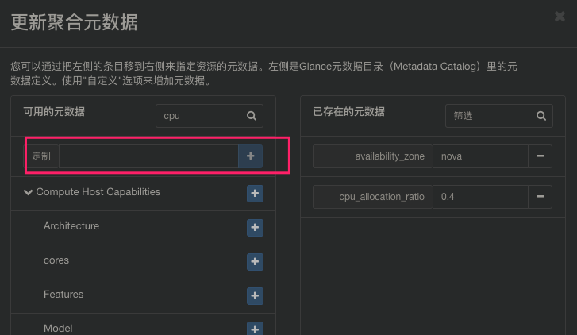

a、AggregateCoreFilter的cpu_allocation_ratio metadata key

使用: 

```
nova aggregate-set-metadata 1 cpu_allocation_ratio=2.0
```

b、compute node的配置文件nova.conf支持cpu_allocation_ratio参数设置

c、原本的controller node nova.conf的cpu_allocation_ratio参数设置

优先级: a > b > c

为什么是这样的优先级呢, 下面看代码: 

```python
[nova/scheduler/filters/core_filter.py]
class AggregateCoreFilter(BaseCoreFilter):
    """AggregateCoreFilter with per-aggregate CPU subscription flag.

    Fall back to global cpu_allocation_ratio if no per-aggregate setting found.
    """

    def _get_cpu_allocation_ratio(self, host_state, spec_obj):
        aggregate_vals = utils.aggregate_values_from_key(
            host_state,
            'cpu_allocation_ratio')
        try:
            # host_state是从nova数据库中compute_node表来的
            ratio = utils.validate_num_values(
                aggregate_vals, host_state.cpu_allocation_ratio, cast_to=float)
        except ValueError as e:
            LOG.warning("Could not decode cpu_allocation_ratio: '%s'", e)
            ratio = host_state.cpu_allocation_ratio

        return ratio

[nova/scheduler/filters/utils.py]
def aggregate_values_from_key(host_state, key_name):
    """Returns a set of values based on a metadata key for a specific host."""
    # 如果没设置Aggregation主机聚合的cpu_allocation_ratio metadata key, 返回空set
    aggrlist = host_state.aggregates
    return {aggr.metadata[key_name]
              for aggr in aggrlist
              if key_name in aggr.metadata
              }

[nova/scheduler/filters/utils.py]
def validate_num_values(vals, default=None, cast_to=int, based_on=min):
    """Returns a correctly casted value based on a set of values.

    This method is useful to work with per-aggregate filters, It takes
    a set of values then return the 'based_on'{min/max} converted to
    'cast_to' of the set or the default value.

    Note: The cast implies a possible ValueError
    """
    num_values = len(vals)
    # 如果没设置Aggregation主机聚合的cpu_allocation_ratio metadata key
    if num_values == 0:
        # 还是调用host_state.cpu_allocation_ratio
        return default

    if num_values > 1:
        if based_on == min:
            LOG.info("%(num_values)d values found, "
                     "of which the minimum value will be used.",
                     {'num_values': num_values})
        else:
            LOG.info("%(num_values)d values found, "
                     "of which the maximum value will be used.",
                     {'num_values': num_values})
    # 如果Aggregation主机聚合设置了多个cpu_allocation_ratio metadata key, 默认取最小的
    return based_on([cast_to(val) for val in vals])
```

# AggregateCoreFilter设置

## 添加过滤类

在scheduler节点的配置文件nova/nova.conf中设置

```
[filter_scheduler]
available_filters = nova.scheduler.filters.all_filters
enabled_filters = RetryFilter,AvailabilityZoneFilter,ComputeFilter,ComputeCapabilitiesFilter,ImagePropertiesFilter,ServerGroupAntiAffinityFilter,ServerGroupAffinityFilter,AggregateCoreFilter
```

重启nova\-scheduler

## 设置主机聚合

命名为scheduler\_test\_0.5, 可用域为nova

### 命令行

创建主机聚合, 覆盖可用域nova

```
nova aggregate-create scheduler_test_0.5 nova
```

设置集群元数据cpu\_allocation\_ratio=0.5

```
nova aggregate-set-metadata 1 cpu_allocation_ratio=0.4
```

添加主机

```
nova aggregate-add-host 1 compute1
```

查看主机聚合

```
# nova aggregate-show 1
+----+--------------------+-------------------+------------+------------------------------------------------------+--------------------------------------+
| Id | Name               | Availability Zone | Hosts      | Metadata                                             | UUID                                 |
+----+--------------------+-------------------+------------+------------------------------------------------------+--------------------------------------+
| 1  | scheduler_test_0.5 | nova              | 'compute1' | 'availability_zone=nova', 'cpu_allocation_ratio=0.5' | 17a9fced-0dbe-4ed2-905f-6516893e3f2f |
+----+--------------------+-------------------+------------+------------------------------------------------------+--------------------------------------+
```

### portal

"管理员" \-\-\- "计算" \-\-\- "主机聚合" \-\-\- "创建主机聚合"


点击刚创建的主机聚合, "更新元数据"

这里必须点击定制, 比如"cpu\_allocation\_ratio"、"ram\_allocation\_ratio"、"disk\_allocation\_ratio"



# 参考

- nova设置参考: https://docs.openstack.org/nova/latest/configuration/config.html
- host\-aggregates: https://docs.openstack.org/nova/latest/admin/configuration/schedulers.html#host-aggregates