# 对OpenStack梳理 #

## OpenStack ##

### OpenStack基本框架 ###

一种云操作系统[^3], 同时称为云平台管理项目更合适, 其中管理的资源对象概括为三大项: **计算、网络和存储**, 通过调用不同的**API**实现三大资源的管理和分配. 目前, 其发布版本如下: 

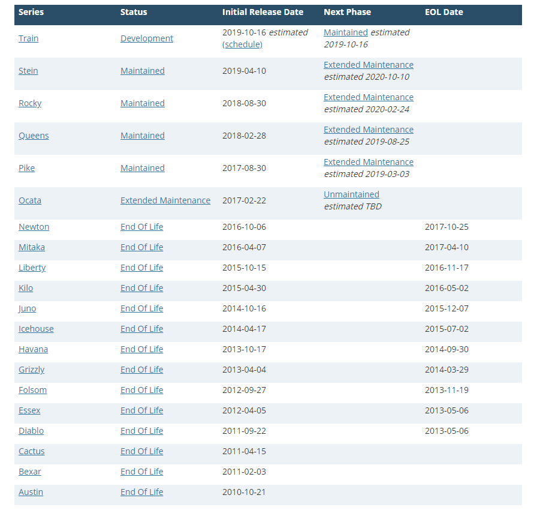

关于**OpenStack**全局功能图如下: 

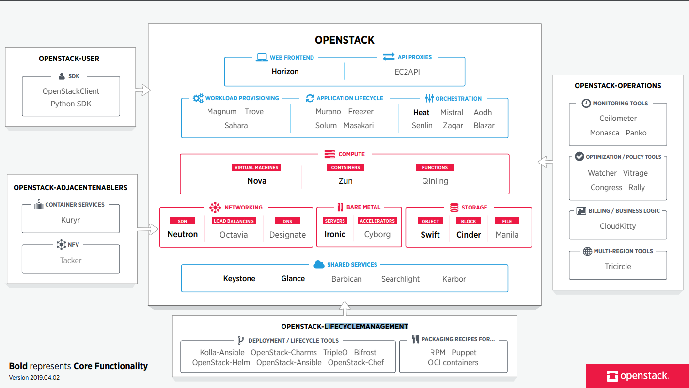

上图中各子项目项目描述如下: 


各服务介绍如下: 

- Heat: 自动化部署组件; 
- Horizon: 基于**diango**开发的web管理, **Horizon**通过调用**Cinder、Neutron、Nova、Glance和Keystone**组件功能对虚拟机进行管理; 
- Nova: 为虚拟机提供计算资源; 
- Neutron: 为虚拟机提供网络资源; 
- Swift: 对象存储, 适用于"一次写入, 多次读取"; 
- Cinder: 块存储, 提供存储资源池; 
- Glance: 提供虚拟镜像的注册和存储管理; 
- Keystone: 认证管理, 为各服务器之间通信提供认证和服务注册; 
- Ironic: 提供物理机申请管理. 对于虚拟机的管理, OpenStack已经非常成熟, 通过Nova可以创建虚拟机、枚举虚拟设备、管理电源状态和安装操作系统. 但是对于物理机的管理, 需要设计新的组件, Ironic为此设计, 可以解决物理机的添加、删除、电源管理和安装部署. 对于物理机的部署而言, 与虚拟机部署很相似, 也是通过Nova创建虚拟机的方式进行触发, 只是底层nova-scheduler和nova-computer的驱动方式不同, 虚拟机的底层驱动采用libvirt的虚拟化技术实现, 物理机则采用Ironic技术, Ironic技术可以理解为一组Hypervisor API接口集合, 其功能与libvirt相似; 
- MySQL: 为各服务器提供数据存储; 
- RabbitMq: 为各服务之间通信提供认证和服务注册. 

在以上子项目中, Ironic主要为Bare Metal Service(裸金属服务器)服务[^5], 对于高性能计算集群、数据库主机等需要直接使用物理机提高性能. 同时, 以上服务包括计算服务、认证服务、网络服务、镜像服务、块存储服务、对象存储服务、计量服务、编排服务和数据库服务, 在实际云搭建过程中, 可以独立安装这些服务、独自配置它们或者连接成一个整体. 

关于OpenStack相关组件关系, 以及认证、创建虚拟机以及管理虚拟机过程如下: 


>>该图片来源于<https://blog.csdn.net/u010653908/article/details/72121559>

图中各过程内容如下[^7](**后续在详细描述, 有源码更好**): 

- [1] 登录界面或命令行通过RESTful API向keystone获取认证信息. 

- [2] keystone通过用户请求认证信息, 并生成auth-token返回给对应的认证请求. 

- [3] 界面或命令行通过RESTful API向nova-api发送一个boot instance的请求(携带auth-token). 

- [4] nova-api接受请求后向keystone发送认证请求, 查看token是否为有效用户和token. 

- [5] keystone验证token是否有效, 如有效则返回有效的认证和对应的角色(注: 有些操作需要有角色权限才能操作). 

- [6] 通过认证后nova-api和数据库通讯. 

- [7] 初始化新建虚拟机的数据库记录. 

- [8] nova-api通过rpc.call向nova-scheduler请求是否有创建虚拟机的资源(Host ID). 

- [9] nova-scheduler进程侦听消息队列, 获取nova-api的请求. 

- [10] nova-scheduler通过查询nova数据库中计算资源的情况, 并通过调度算法计算符合虚拟机创建需要的主机. 

- [11] 对于有符合虚拟机创建的主机, nova-scheduler更新数据库中虚拟机对应的物理主机信息. 

- [12] nova-scheduler通过rpc.cast向nova-compute发送对应的创建虚拟机请求的消息. 

- [13] nova-compute会从对应的消息队列中获取创建虚拟机请求的消息. 

- [14] nova-compute通过rpc.call向nova-conductor请求获取虚拟机消息. (Flavor)

- [15] nova-conductor从消息队队列中拿到nova-compute请求消息. 

- [16] nova-conductor根据消息查询虚拟机对应的信息. 

- [17] nova-conductor从数据库中获得虚拟机对应信息. 

- [18] nova-conductor把虚拟机信息通过消息的方式发送到消息队列中. 

- [19] nova-compute从对应的消息队列中获取虚拟机信息消息. 

- [20] nova-compute通过keystone的RESTfull API拿到认证的token, 并通过HTTP请求glance-api获取创建虚拟机所需要镜像. 

- [21] glance-api向keystone认证token是否有效, 并返回验证结果. 

- [22] token验证通过, nova-compute获得虚拟机镜像信息(URL). 

- [23] nova-compute通过keystone的RESTfull API拿到认证k的token, 并通过HTTP请求neutron-server获取创建虚拟机所需要的网络信息. 

- [24] neutron-server向keystone认证token是否有效, 并返回验证结果. 

- [25] token验证通过, nova-compute获得虚拟机网络信息. 

- [26] nova-compute通过keystone的RESTfull API拿到认证的token, 并通过HTTP请求cinder-api获取创建虚拟机所需要的持久化存储信息. 

- [27] cinder-api向keystone认证token是否有效, 并返回验证结果. 

- [28] token验证通过, nova-compute获得虚拟机持久化存储信息. 

- [29] nova-compute根据instance的信息调用配置的虚拟化驱动来创建虚拟机. 

通过以上过程便于理解各组件协同关系, 以及与底层Hypervisor关系. 

#### Keystone ###

前面已经提到Keystone为各服务器之间通信提供认证和服务注册, 由于在OpenStack各组件间, 相互独立以减少耦合性, 但各组件发挥作用都依赖于Keystone. 下图以user访问nova为例说明: 

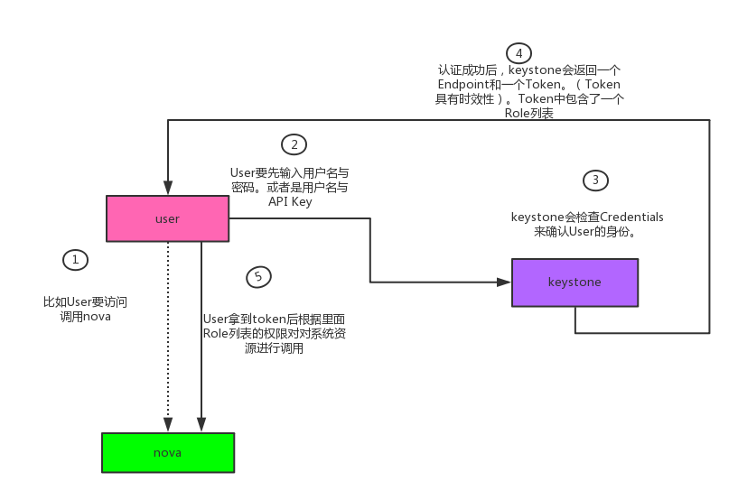

>>>图片来源于<https://www.cnblogs.com/charles1ee/p/6293387.html>

在上图中, 当User访问调用nova时, 需输入用户名以及密码, keystone认证User输入的信息以确认User身份; 若认证成功, keystone返回一个Endpoint和Token(包含Role列表, 具体为当前User有权限访问到的Nova资源)发送到User; User收到Token并根据Role列表上的权限对nova上系统资源进行调用; 当nova收到来自User发送的请求后, 需想keystone发起认证, 认证成功, nova开始执行User所发送的请求. 

在实际User申请虚拟机过程中, 除nova外, 一般还需要Glance、Neutron提供的镜像管理功能和网络资源, 因此, Keystone与其他三种间如何协作对理解OpenStack各组件功能尤为重要, 接下来使用下图进行说明: 

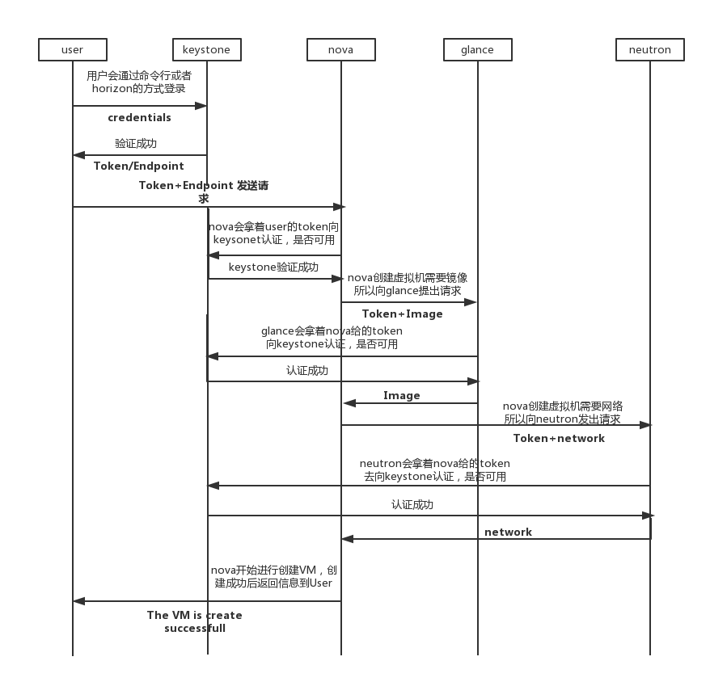

>>>图片来源于<https://www.cnblogs.com/charles1ee/p/6293387.html>

在上图显示的User创建或访问各组件功能过程中, 各组件收到来自其他组件的请求时, 该组件将使用token向Keystone发起认证, 仅当认证成功后, 开始执行其他组件的请求. 

### SH08集群 ###

在SH08集群中, 主机包括10.5.8.32~10.5.8.97, 其中95、96、97作为部署有nova-conductor服务, 可作为进入其他主机的跳板, 各服务分布于多个主机, 分布信息大致如图所示: 

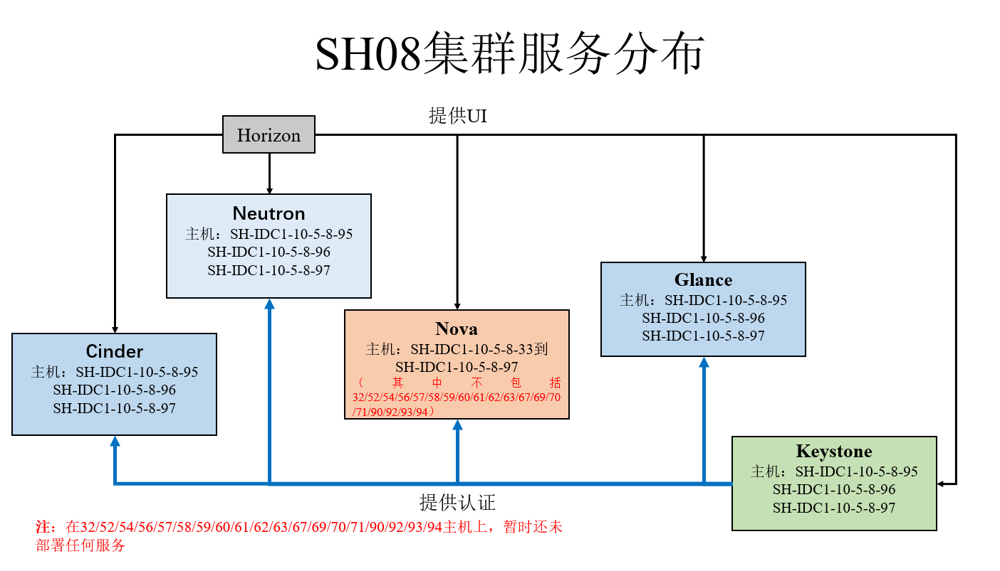

如上图所示, 除nova服务外, 其他服务多数分布在95~97, nova服务分布在33~97, 其中包括32、52、54等十多个服务器暂时未分配任何服务. 
由于nova服务所在服务器数量较多, 图xxx无法显示nova中子服务等具体分布, 为此对nova服务分布进行单独画出框架: 

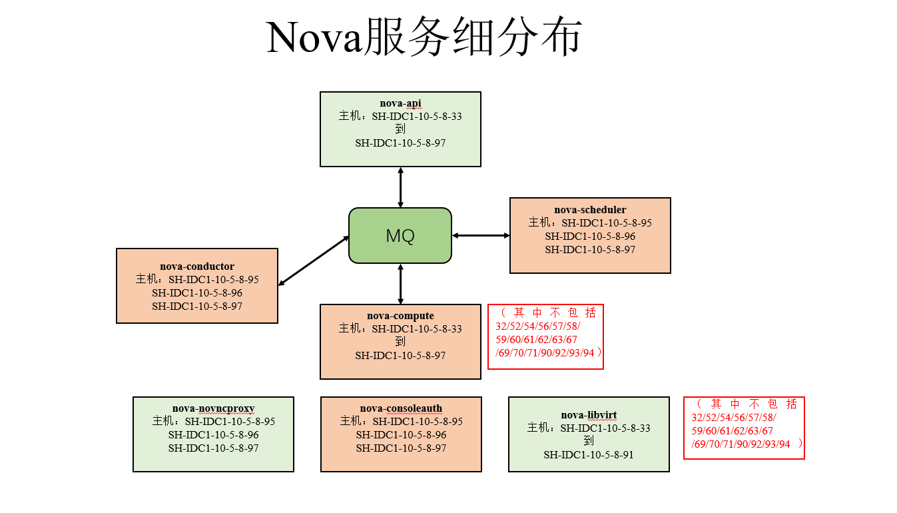

以上服务分布图主要通过命令: 

```bash
openstack service list
```

进行查看, 同时, 以上分布信息经过主机97进入到其他主机服务分布方式验证过. 

以上分别从服务到角度展示了各主机的服务信息, 接下来, 对各主机网卡配置进行说明. 
在SH08集群中, 网卡主要包括: 

- eth0: 物理网卡
- tap网卡: 虚拟机使用
- ib网卡

网桥包括: 

- Linux网桥(可采用brctl show查看)
- Open vSwitch网桥(OVS网桥, 可采用ovs-vsctl show查看)

为说明主机中网桥与网卡所属关系, 以主机97为例, 画出如下SH08集群主机信息: 

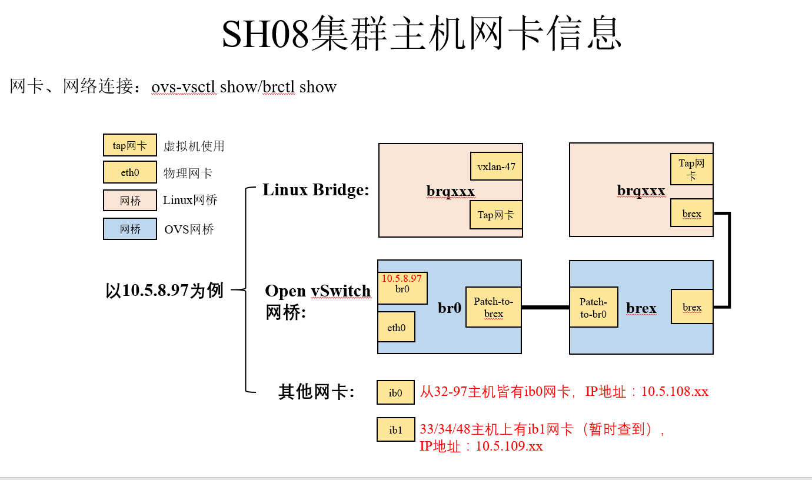

从上图可以看出以下几点: 

- eth0与ibx网卡属于物理网卡, 其中存储相关服务基本走ib网卡; 
- 网桥br0与brex通过端口patch-to-brex与patch-to-br0; 
- 网桥brqxxx属于Linux网桥, 该网桥上创建的tap网卡供该主机上启动的虚拟机所使用. 

在上述网卡和网桥中, 多数属于虚拟网络设备和虚拟交换机, 例如网桥(bridge), 网桥首先是一个虚拟网络设备, 具有网络设备的特征, 可以配置IP、MAC地址等, 其次, 网桥同时还是一个虚拟交换机, 与物理交换机有类似的功能. 但是网桥与物理网络设备在端口上存在不同: 对于普通的网络设备, 只有两个端口(一端输入一端输出), 网桥却有多个端口, 数据可从任意端口进入进出. 

结合上图网卡信息图, 其中物理网卡eth0被添加到网桥br0, br0对物理设备和虚拟设备不加区分, 当eth0加入到br0后, eth0与br0网桥上其他虚拟设备地位等同, 协议栈的数据可以转发给eth0, 但eth0从外部接受到的数据必须转发给br0. 同时eth0的IP地址被去掉, 以防止在ping网络时, 默认选择eth0. 

以上属于网桥的基本概念, 接下来属于网桥以及为网桥添加网卡的大致步骤: 

```bash
$>sudo ip link add name br0 type bridge
$>sudo ip link set br0 up
```

在创建之初, 未给网桥添加任何虚拟网卡和物理网卡, 网卡eth0、网桥br0以及网络协议栈的连接关系如下: 

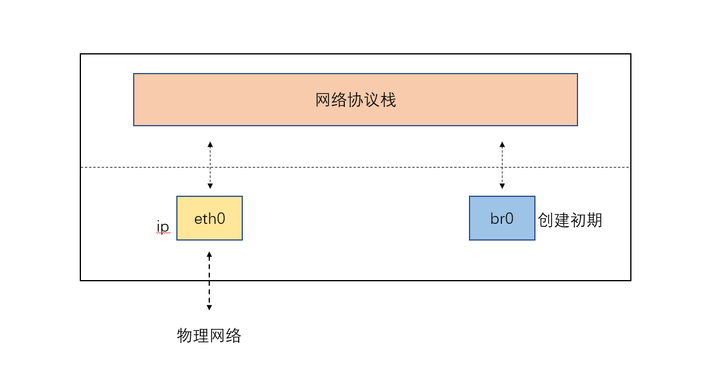

若需要将物理网卡添加到网桥br0, 则只需要执行: 

```bash
$>sudo ip link set dev eth0 master br0
$>sudo bridge link
```

执行执行完成后, eth0传输到数据需要经过br0, 再到网络协议栈, 其中下图即为SH08集群某主机网卡连接关系: 

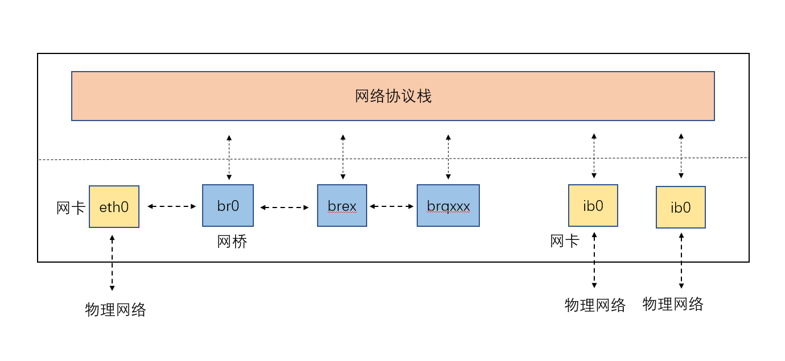

从上图可以大致看出SH08集群主机网卡和虚拟网桥信息, 其中网桥brex和brq从外界网络传输的数据依赖于网桥br0. 

结合图[5], 考虑在该host起虚拟机的情况下虚拟机网卡与host上网桥的关系, 画出图[6]所示较完整的网桥与网卡关系图: 

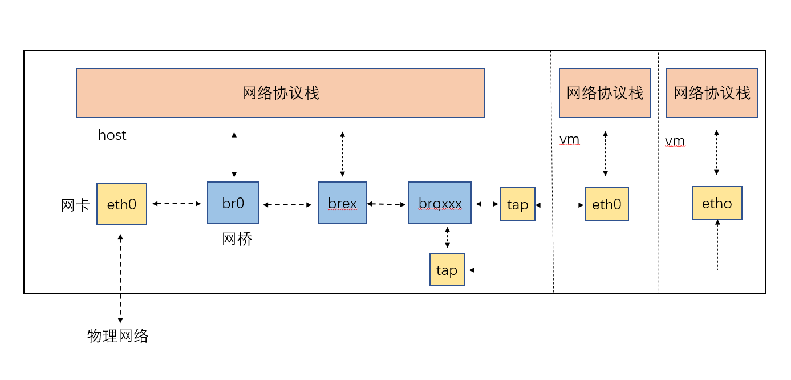

## Hypervisor ##

一种运行在基础物理服务器和操作系统之间的中间软件层, 可允许多个操作系统和应用共享硬件, 也可称为VMM(virtual machine monitor, 虚拟机监视器). 通过Hypervisor可访问物理服务器上包括磁盘和内存在内的所有物理设备, 以及对各虚拟机施加防护. 当服务器启动并执行Hypervisor时, 它会加载所有虚拟机客户端的操作系统, 同时为每台虚拟机分配适量的内存、CPU、网络和磁盘. Hypervisor类型包括: 

- I型: 
  直接运行在系统硬件上, 创建硬件全仿真实例, 称为"裸机型"(bare-metal Hypervisor), 典型地如Xen和VMware ESX. 

- II型: 
  虚拟机运行在传统操作系统上, 同样创建的是硬件全仿真实例, 被称为"托管"型, 例如VMware Workstation或KVM(KVM属于I型还是II型有些争议): 在Windows上运行Linux操作系统, 主机虚拟化中VM的应用程序调用硬件资源时, 需经过: VM内核->Hypervisor->主机内核, 因此, II型是三种虚拟化中性能最差的. 

- III型: 
  虚拟机运行在传统操作系统上, 创建一个独立的虚拟化实例(容器), 指向底层托管操作系统, 被称为"操作系统虚拟化". "操作系统虚拟化"是在操作系统中模拟出运行应用程序的容器, 所有虚拟机共享内核空间, 性能最好、耗费资源最少. 但是底层和上层必须使用同一种操作系统, 如底层操作系统使用Windows, 则VPS和VE必须运行Windows. 

目前, Hypervisor包括XEN、Hyper-V和KVM, 更准确的说法是加载了KVM模块的Linux内核是一个Hypervisor. 

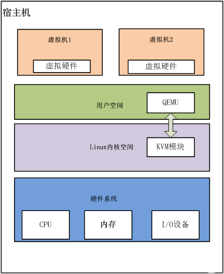

>>VPS: 虚拟专用服务器(VPS, Virtual Private Server)
>>VE: 虚拟环境(VE, Virtual Environment)

## libvirt ##

首先, 在虚拟云实现过程中, 涉及到: 虚拟化技术实现-虚拟机管理-集群资源管理(云管理), 不同虚拟化技
术提供了主要管理工具, 包括启用、停用、配置和连接控制台等. 这样在构建云管理时存在两个问题: 

- 假设采用混合虚拟技术, 上层需对不同的虚拟技术调用不同的管理工具, 此时, 接口不统一十分麻烦; 

- 上层虚拟化技术的升级或者改动, 需大幅度修改管理功能相关代码, 导致开销较大; 

针对以上问题, 一般采用分层的思想, 在虚拟机和云管理中独立出一个抽象管理层, 即**libvirt**, 提供各种API, 供上层管理不同的虚拟机. 

### libvirt主要功能 ###

libvirt是底层Hypervisor和上层用户之间的存在的中间适配层, 将底层不同Hypervisor使用接口进行统一, 为上层虚拟机管理工具提供一套统一、较稳定的接口. 通过libvirt可以做到如下[^1]: 

- 虚拟机管理
  包含不同的领域生命周期操作, 比如: 启动、停止、暂停、保存、恢复和迁移. 

- 远程机器支持

更具体的**libvirt**管理功能主要包含如下5个部分. 

- 1)域的管理. 包括对节点上的域的各个⽣命周期的管理, 如启动、停⽌、暂停、保存、恢复和动态迁移. 还包括对多种设备类型的热插拔操作, 包括磁盘、网卡、内存和CPU. 当然不同的Hypervisor上对这些热插拔的支持程度有所不同. 

- 2)远程节点的管理. 只要物理节点上运⾏了**libvirtd**这个守护进程, 远程的管理程序就可以连接到该节点进程管理操作, 经过认证和授权之后, 所有的libvirt功能都可以被访问和使⽤. libvirt支持多种网络远程传输类型, 如SSH、TCP套接字、Unix domain socket、TLS的加密传输等. 假设使⽤了最简单的SSH, 不需要额外的配置⼯作, 比如, 在example.com节点上运⾏了libvirtd, 而且允许SSH访问, 在远程的某台管理机器上就可以用如下的命令⾏来连接到example.com上, 从而管理其上的域. 

- 3)存储的管理. 任何运行了libvirtd守护进程的主机, 都可以通过libvirt来管理不同类型的存储, 如创建不同格式的客户机镜像(qcow2、raw、qde、vmdk等)、挂载NFS共享存储系统、查看现有的LVM卷组、创建新的LVM卷组和逻辑卷、对磁盘设备分区、挂载iSCSI共享存储、使⽤Ceph系统支持的RBD远程存储, 等等. 当然在libvirt中, 对存储的管理也是支持远程的. 

- 4)网络的管理. 任何运行了**libvirtd**守护进程的主机, 都可以通过libvirt来管理物理的和逻辑的网络接口. 包括列出现有的网络接口卡, 配置网络接口, 创建虚拟网络接口, 网络接口的桥接, VLAN管理, NAT网络设置, 为客户机分配虚拟网络接⼝, 等等. 

- 5)提供⼀个稳定、可靠、⾼效的应用程序接⼝, 以便可以完成前⾯的4个管理功能. 

libvirt主要由3个部分组成, 分别是: 应⽤程序编程接口库、⼀个守护进程(libvirtd)和⼀个默认命令⾏管理⼯具(virsh). 应用程序接口是为其他虚拟机管理⼯具(如virsh、virt-manager等)提供虚拟机管理的程序库⽀持. libvirtd守护进程负责执行对节点上的域的管理⼯作, 在用各种⼯具对虚拟机进⾏管理时, 这个守护进程⼀定要处于运⾏状态中. 而且这个守护进程可以分为两种: ⼀种是root权限的libvirtd, 其权限较⼤, 可以完成所有⽀持的管理⼯作; ⼀种是普通用户权限的libvirtd, 只能完成比较受限的管理⼯作. virsh是libvirt项⽬中默认的对虚拟机管理的⼀个命令行⼯具. 

在libvirt中存在几个重要的概念: 

- 节点: 
  一个物理机器, 可运行多个虚拟客户机. 其中Hypervisor和Domain都运行在节点上; 
- Hypervisor: 
  虚拟机监控器(VMM), 如KVM、Xen和VMware等. VMM可以将一个节点虚拟化, 然后运行多个虚拟客户机; 
- 域(Domain): 
  一个客户机操作系统实例, 通常也称为实例, 如客户机操作系统、虚拟机皆指同一个概念. 

在表明以上概念后, 有相关书籍[^10]采用以下一句话概括libvirt的目标: 为了安全高效地管理节点上各个域, 而提供一个公共的稳定的软件层. 其中管理包括: 本地管理和远程管理. 关于本地管理和远程管理示意图如下: 

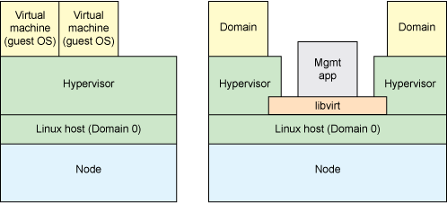

同时libvirt可实现两种控制方式, 上图为第一种, guest和libvirt在同一节点下, 第二种为guest和libvirt在不同的节点i下, 需要实现libvirt远程控制, 示意图如下: 

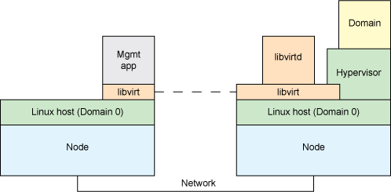

关于Hypervisor与libvirt的关系, 从下图可以看出: 

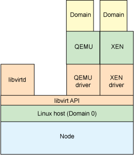

libvirt对多种不同的Hypervisor的⽀持是通过⼀种基于驱动程序的架构来实现的. libvirt对不同的Hypervisor提供了不同的驱动: 对Xen有Xen的驱动, 对QEMU/KVM有QEMU驱动, 对VMware有VMware驱动. 在libvirt源代码中, 可以很容易找到**qemu_driver.c、xen_driver.c、xenapi_driver.c、VMware_driver.c、vbox_driver.c**这样的驱动程序源代码⽂件. 

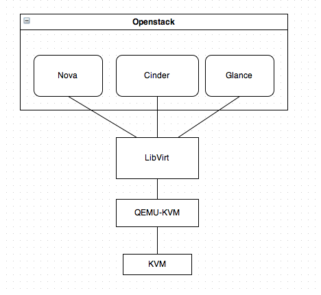

## qemu ##

QEMU为纯软件实现, 具有整套虚拟机实现, 包括在无KVM的情况下, 其可独立允许, 但由于采用纯软件模拟CPU、内存和I/O设备, 其性能较低. 

## kvm ##

KVM(kernel virtual machine)为Linux内核模块, 依赖于硬件虚拟化(VT-X或AMDxxx)在内核层实现CPU虚拟化和内存虚拟化. **KVM本身并不实现任何模拟, 仅暴露一个/dev/kvm接口, 该接口可被宿主机用来创建vCPU、虚拟内存分配、vCPU寄存器读写和vCPU运行**

### qemu-kvm ###

由于qemu中内存、CPU以及I/O虚拟化皆为软件实现, 其性能较差, 因此对其代码进行修改, 使用KVM中内存以及CPU虚拟化替代qemu中原内存以及CPU虚拟化方式, 以此提高qemu性能. 首先**KVM(Kernel Virtual Machine)**是Linux的一个内核驱动模块, 它能够**让Linux主机成为一个Hypervisor(虚拟机监控器)**. 在支持**VMX(Virtual Machine Extension)**功能的x86处理器中, Linux在原有的用户模式和内核模式中新增加了客户模式, 并且客户模式也拥有自己的内核模式和用户模式, 虚拟机就是运行在客户模式中. KVM模块的职责就是打开并初始化VMX功能, 提供相应的接口以支持虚拟机的运行. 

QEMU(quick emulator)本身并不包含或依赖KVM模块, 而是一套由**Fabrice Bellard**编写的模拟计算机的自由软件. QEMU虚拟机是一个纯软件的实现, 可以在没有KVM模块的情况下独立运行, 但是性能比较低. QEMU有整套的虚拟机实现, 包括处理器虚拟化、内存虚拟化以及I/O设备的虚拟化. **QEMU-KVM是一个用户空间的进程, 需要通过特定的接口才能调用到KVM模块提供的功能. 从QEMU角度来看, 虚拟机运行期间, QEMU通过KVM模块提供的系统调用接口进行内核设置, 由KVM模块负责将虚拟机置于处理器的特殊模式运行. QEMU使用了KVM模块的虚拟化功能, 为自己的虚拟机提供硬件虚拟化加速以提高虚拟机的性能. **(需要改进)

KVM只模拟CPU和内存, 因此一个客户机操作系统可以在宿主机上跑起来, 但是你看不到它, 无法和它沟通. 于是, 有人修改了QEMU代码, 把他模拟CPU、内存的代码换成KVM, 而网卡、显示器等留着, 因此QEMU+KVM就成了一个完整的虚拟化平台. 

KVM只是内核模块, 用户并没法直接跟内核模块交互, 需要借助用户空间的管理工具, 而这个工具就是QEMU. KVM和QEMU相辅相成, QEMU通过KVM达到了硬件虚拟化的速度, 而KVM则通过QEMU来模拟设备. 对于KVM来说, 其匹配的用户空间工具并不仅仅只有QEMU, 还有其他选择, 如RedHat开发的libvirt、virsh、virt-manager等, QEMU并不是KVM的唯一选择. 综上所述, 关于KVM与QEMU的关系可以理解为: **QEMU是个计算机模拟器, 而KVM为计算机的模拟提供加速功能**. 

### 其他 ###

在OpenStack部署过程中, 例如搭建计算节点, 需检测虚拟机硬件是否支持硬件加速, 即检测**/proc/cpuinfo**: 

```bash
egrep -c '(vmx|svm)' /proc/cpuinfo
```

如果计算节点不支持硬件加速, 必须采用配置libvirt使用qemu替代KVM. 

## OPENVZ ##

与以上平台虚拟化(KVM/QEMU/XEN/VMware/VirtualBox/Hyper-V)方案不同, OpenVZ属于容器虚拟化, 此外还包括: LXC等. 

## 其他技术 ##

### InfiniBand ###

简称IB网络, 应用在高性能计算中, 例如InfiniBnad在主机旁采用RDMA技术, 释放部分CPU负载, 可实现将主机内CPU延时从几十微妙降到几微秒[^6]. 

## 参考 ##

[1] <https://www.cnblogs.com/zsychanpin/p/6859717.html>

[2] <https://www.cnblogs.com/boyzgw/p/6807986.html>

[3] <https://www.cnblogs.com/shhnwangjian/p/6358754.html>

[4] <http://zixi.org/index.php/archives/bms-architecture.html>

[5] <http://www.sohu.com/a/220012524_281404>

[6] <http://www.cnblogs.com/allcloud/p/7680353.html>

[7] <https://blog.csdn.net/u010653908/article/details/72121559>

[8] <http://www.cnblogs.com/sammyliu/p/4543110.html>

[9] <https://docs.openstack.org/mitaka/zh_CN/install-guide-rdo/>

[10] 《KVM实战: 原理、进阶与性能调优》

[11] <https://www.ibm.com/developerworks/cn/cloud/library/1402_chenhy_openstacknetwork/index.html>
