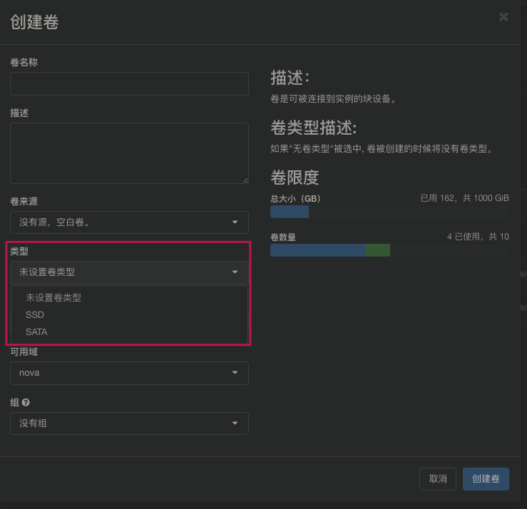

<!-- @import "[TOC]" {cmd="toc" depthFrom=1 depthTo=6 orderedList=false} -->

<!-- code_chunk_output -->

* [1 创建pool](#1-创建pool)
* [2 修改cinder配置](#2-修改cinder配置)
* [3 创建不同卷](#3-创建不同卷)
* [4 测试结果](#4-测试结果)
* [5 参考](#5-参考)

<!-- /code_chunk_output -->

# 1 创建pool

在ceph中为cinder新建一个pool

```
ceph osd pool create volumes_ssd 2048 2048
```

修改权限

```
sudo ceph auth caps client.cinder-volume mon 'allow r' osd 'allow class-read object_prefix rbd_children, allow rwx pool=volumes, allow rwx pool=vms, allow rwx pool=volumes_ssd,allow rx pool=images'

sudo ceph auth caps client.nova mon 'allow r' osd 'allow class-read object_prefix rbd_children, allow rwx pool=vms, allow rwx pool=volumes, allow rwx pool=images, allow rwx pool=volumes_ssd'

sudo ceph auth caps client.cinder-backup mon 'allow r' osd 'allow class-read object_prefix rbd_children, allow rwx pool=volumes, allow rwx pool=backups, allow rwx pool=volumes_ssd'
```

# 2 修改cinder配置

```
enabled_backends = rbd-1, ssd

[rbd-1]
rbd_ceph_conf = /etc/ceph/ceph.conf
rbd_user = cinder-volume
backend_host = rbd:volume
rbd_pool = volumes
volume_backend_name = rbd-1
volume_driver = cinder.volume.drivers.rbd.RBDDriver
rbd_secret_uuid = b71a525a-3c01-468d-ac97-d2e4d395a652

[ssd]
rbd_ceph_conf = /etc/ceph/ceph.conf
rbd_user = cinder-volume
backend_host = rbd:volume
rbd_pool = volumes_ssd
volume_backend_name = ssd
volume_driver = cinder.volume.drivers.rbd.RBDDriver
rbd_secret_uuid = b71a525a-3c01-468d-ac97-d2e4d395a652
```

重启cinder-volume

# 3 创建不同卷

创建两个cinder卷类型

```
# source /etc/kolla/admin-openrc.sh
# cinder type-create SATA
# cinder type-create SSD
# cinder type-list
+--------------------------------------+------+-------------+-----------+
| ID                                   | Name | Description | Is_Public |
+--------------------------------------+------+-------------+-----------+
| 12efdc6e-4217-4341-a7b4-ca40089c12b6 | SSD  | -           | True      |
| 66283e28-44d9-47f5-840c-8888103c02ca | SATA | -           | True      |
+--------------------------------------+------+-------------+-----------+
```

设置卷类型的extra\_specs

```
# cinder type-key SSD set volume_backend_name=ssd
# cinder type-key SATA set volume_backend_name=rbd-1
# # cinder extra-specs-list
+--------------------------------------+------+----------------------------------+
| ID                                   | Name | extra_specs                      |
+--------------------------------------+------+----------------------------------+
| 12efdc6e-4217-4341-a7b4-ca40089c12b6 | SSD  | {'volume_backend_name': 'ssd'}   |
| 66283e28-44d9-47f5-840c-8888103c02ca | SATA | {'volume_backend_name': 'rbd-1'} |
+--------------------------------------+------+----------------------------------+
```

创建不同卷



或者命令行

```
[root@controller124 ~]# cinder create --volume_type SSD --display_name vol-ssd 1
+--------------------------------+--------------------------------------+
| Property                       | Value                                |
+--------------------------------+--------------------------------------+
| attachments                    | []                                   |
| availability_zone              | nova                                 |
| bootable                       | false                                |
| consistencygroup_id            | None                                 |
| created_at                     | 2019-06-13T06:36:09.000000           |
| description                    | None                                 |
| encrypted                      | False                                |
| id                             | bd996a17-45c9-4e8a-8305-5cf333b7fb3c |
| metadata                       | {}                                   |
| migration_status               | None                                 |
| multiattach                    | False                                |
| name                           | vol-ssd                              |
| os-vol-host-attr:host          | None                                 |
| os-vol-mig-status-attr:migstat | None                                 |
| os-vol-mig-status-attr:name_id | None                                 |
| os-vol-tenant-attr:tenant_id   | 214c7f0c07844ca3b136309d545766d7     |
| replication_status             | None                                 |
| size                           | 1                                    |
| snapshot_id                    | None                                 |
| source_volid                   | None                                 |
| status                         | creating                             |
| updated_at                     | None                                 |
| user_id                        | 924c3d9b8d1842ad9ccc868b9fe57634     |
| volume_type                    | SSD                                  |
+--------------------------------+--------------------------------------+
```

# 4 测试结果

在ceph中查看

```
[root@SH-IDC1-10-5-39-166 ~]# rbd -p volumes_ssd ls
volume-bd996a17-45c9-4e8a-8305-5cf333b7fb3c
```


# 5 参考

https://www.lijiawang.org/posts/%E5%9C%A8kolla%E4%B8%AD%E9%85%8D%E7%BD%AEcinder%20ceph%E5%A4%9A%E5%90%8E%E7%AB%AF.html?tdsourcetag=s_pcqq_aiomsg