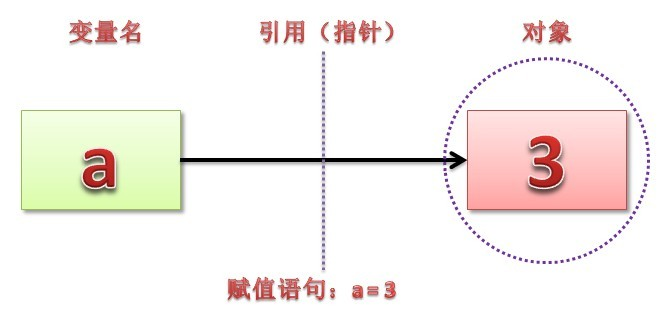

# Python中变量、引用、拷贝

在Python中, 变量是没有类型的, 这和以往看到的大部分编辑语言都不一样. 在使用变量的时候, 不需要提前声明, 只需要给这个变量赋值即可. 但是, 当用变量的时候, 必须要给这个变量赋值; 如果只写一个变量, 而没有赋值, 那么Python认为这个变量没有定义. 如下: 

```
>>> a
Traceback (most recent call last):
  File "<stdin>", line 1, in <module>
NameError: name 'a' is not defined
```

### 一、可变对象 & 不可变对象

在Python中, 对象分为两种: 可变对象和不可变对象, 不可变对象包括int, float, long, str, tuple等, 可变对象包括list, set, dict等. 需要注意的是: 这里说的不可变指的是**值的不可变**. 对于不可变类型的变量, 如果要更改变量, 则会创建一个新值, 把变量绑定到新值上, 而旧值如果没有被引用就等待垃圾回收. 另外, 不可变的类型可以计算hash值, 作为字典的key. 可变类型数据对对象操作的时候, 不需要再在其他地方申请内存, 只需要在此对象后面连续申请(+/-)即可, 也就是它的内存地址会保持不变, 但区域会变长或者变短. 

```
>>> a = 'xianglong.me'
>>> id(a)
140443303134352
>>> a = '1saying.com'
>>> id(a)
140443303131776
# 重新赋值之后, 变量a的内存地址已经变了
# 'xianglong.me'是str类型, 不可变, 所以赋值操作知识重新创建了str '1saying.com'对象, 然后将变量a指向了它
 
>>> a_list = [1, 2, 3]
>>> id(a_list)
140443302951680
>>> a_list.append(4)
>>> id(a_list)
140443302951680
# list重新赋值之后, 变量a_list的内存地址并未改变
# [1, 2, 3]是可变的, append操作只是改变了其value, 变量a_list指向没有变
```

### 二、变量无类型, 对象有类型

上面说了, Python中的变量是没有类型的, 但Python其实是区分类型的: Python的所有变量其实都是指向内存中的对象的一个指针, 都是值的引用, 而其类型是跟着对象走的. 总结来说: 在Python中, 类型是属于对象的, 而不是变量, 变量和对象是分离的, 对象是内存中储存数据的实体, 变量则是指向对象的指针. 在《Learning Python》一书中有一个观点: 变量无类型, 对象有类型, 大概也是说的这个意思. 下面是一张说明变量的图: 



在 python 中赋值语句总是建立对象的引用值, 而不是复制对象. 因此, python 变量更像是指针, 而不是数据存储区域. 

### 三、函数值传递

先看一个例子: 

```
def func_int(a):
    a += 4
 
def func_list(a_list):
    a_list[0] = 4
 
t = 0
func_int(t)
print t
# output: 0
 
t_list = [1, 2, 3]
func_list(t_list)
print t_list
# output: [4, 2, 3]
```

对于上面的输出, 不少Python初学者都比较疑惑: 第一个例子看起来像是传值, 而第二个例子确实传引用. 其实, 解释这个问题也非常容易, 主要是因为可变对象和不可变对象的原因: 对于可变对象, 对象的操作不会重建对象, 而对于不可变对象, 每一次操作就重建新的对象. 

在函数参数传递的时候, Python其实就是把参数里传入的变量对应的对象的引用依次赋值给对应的函数内部变量. 参照上面的例子来说明更容易理解, func_int中的局部变量"a"其实是全局变量"t"所指向对象的另一个引用, 由于整数对象是不可变的, 所以当func_int对变量"a"进行修改的时候, 实际上是将局部变量"a"指向到了整数对象"1". 所以很明显, func_list修改的是一个可变的对象, 局部变量"a"和全局变量"t_list"指向的还是同一个对象. 

### 四、浅拷贝 & 深拷贝

接下来的问题是: 如果我们一定要复制一个可变对象的副本怎么办?简单的赋值已经证明是不可行的, 所以Python提供了copy模块, 专门用于复制可变对象. copy中有两个方法: copy()和deepcopy(), 前一个是浅拷贝, 后一个是深拷贝. 浅拷贝仅仅复制了第一个传给它的对象, 下面的不管了; 而深拷贝则将所有能复制的对象都复制了. 下面是一个例子: 

```
import copy

a = [[1, 2, 3], [4, 5, 6]]

b = a
c = copy.copy(a)
d = copy.deepcopy(a)

a.append(12)

a[1][2] = 11

a[0][1] = 100

print a
print b
print c
print d

output:
[[1, 100, 3], [4, 5, 11], 12]
[[1, 100, 3], [4, 5, 11], 12]
[[1, 100, 3], [4, 5, 11]]
[[1, 2, 3], [4, 5, 6]]
```


