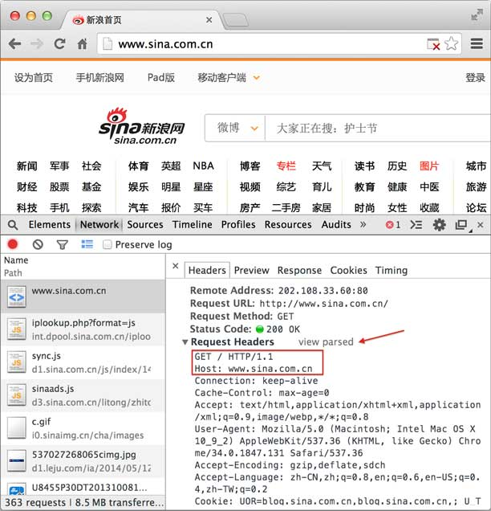
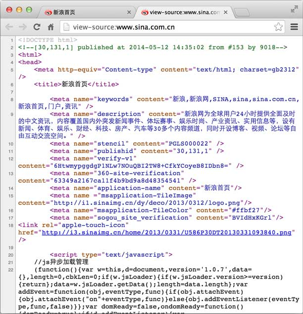
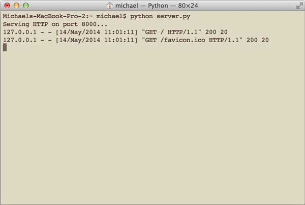
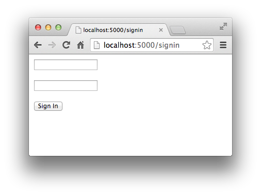
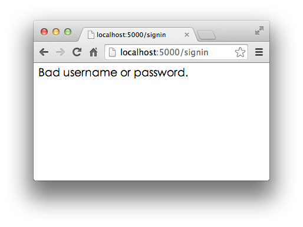

# Web开发

> 
参考: [廖雪峰](http://www.liaoxuefeng.com/wiki/001374738125095c955c1e6d8bb493182103fac9270762a000/001386832648091917b035146084c43b05754ec9408dfaf000)

最早的软件都是运行在大型机上的, 软件使用者通过"哑终端"登陆到大型机上去运行软件. 后来随着PC机的兴起, 软件开始主要运行在桌面上, 而数据库这样的软件运行在服务器端, 这种Client/Server模式简称CS架构. 

随着互联网的兴起, 人们发现, CS架构不适合Web, 最大的原因是Web应用程序的修改和升级非常迅速, 而CS架构需要每个客户端逐个升级桌面App, 因此, Browser/Server模式开始流行, 简称BS架构. 

在BS架构下, 客户端只需要浏览器, 应用程序的逻辑和数据都存储在服务器端. 浏览器只需要请求服务器, 获取Web页面, 并把Web页面展示给用户即可. 

当然, Web页面也具有极强的交互性. 由于Web页面是用HTML编写的, 而HTML具备超强的表现力, 并且, 服务器端升级后, 客户端无需任何部署就可以使用到新的版本, 因此, BS架构迅速流行起来. 

今天, 除了重量级的软件如Office, Photoshop等, 大部分软件都以Web形式提供. 比如, 新浪提供的新闻、博客、微博等服务, 均是Web应用. 

Web应用开发可以说是目前软件开发中最重要的部分. Web开发也经历了好几个阶段: 

静态Web页面: 由文本编辑器直接编辑并生成静态的HTML页面, 如果要修改Web页面的内容, 就需要再次编辑HTML源文件, 早期的互联网Web页面就是静态的; 

CGI: 由于静态Web页面无法与用户交互, 比如用户填写了一个注册表单, 静态Web页面就无法处理. 要处理用户发送的动态数据, 出现了Common Gateway Interface, 简称CGI, 用C/C++编写. 

ASP/JSP/PHP: 由于Web应用特点是修改频繁, 用C/C++这样的低级语言非常不适合Web开发, 而脚本语言由于开发效率高, 与HTML结合紧密, 因此, 迅速取代了CGI模式. ASP是微软推出的用VBScript脚本编程的Web开发技术, 而JSP用Java来编写脚本, PHP本身则是开源的脚本语言. 

MVC: 为了解决直接用脚本语言嵌入HTML导致的可维护性差的问题, Web应用也引入了Model-View-Controller的模式, 来简化Web开发. ASP发展为ASP.Net, JSP和PHP也有一大堆MVC框架. 

目前, Web开发技术仍在快速发展中, 异步开发、新的MVVM前端技术层出不穷. 

Python的诞生历史比Web还要早, 由于Python是一种解释型的脚本语言, 开发效率高, 所以非常适合用来做Web开发. 

Python有上百种Web开发框架, 有很多成熟的模板技术, 选择Python开发Web应用, 不但开发效率高, 而且运行速度快. 

## HTTP协议简介

在Web应用中, 服务器把网页传给浏览器, 实际上就是把网页的HTML代码发送给浏览器, 让浏览器显示出来. 而浏览器和服务器之间的传输协议是HTTP, 所以: 

HTML是一种用来定义网页的文本, 会HTML, 就可以编写网页; 

HTTP是在网络上传输HTML的协议, 用于浏览器和服务器的通信. 

在举例子之前, 我们需要安装Google的Chrome浏览器. 

为什么要使用Chrome浏览器而不是IE呢?因为IE实在是太慢了, 并且, IE对于开发和调试Web应用程序完全是一点用也没有. 

我们需要在浏览器很方便地调试我们的Web应用, 而Chrome提供了一套完整地调试工具, 非常适合Web开发. 

安装好Chrome浏览器后, 打开Chrome, 在菜单中选择"视图", "开发者", "开发者工具", 就可以显示开发者工具. 

Elements显示网页的结构, Network显示浏览器和服务器的通信. 我们点Network, 确保第一个小红灯亮着, Chrome就会记录所有浏览器和服务器之间的通信:


当我们在地址栏输入www.sina.com.cn时, 浏览器将显示新浪的首页. 在这个过程中, 浏览器都干了哪些事情呢?通过Network的记录, 我们就可以知道. 在Network中, 定位到第一条记录, 点击, 右侧将显示Request Headers, 点击右侧的view source, 我们就可以看到浏览器发给新浪服务器的请求: 



最主要的头两行分析如下, 第一行: 

```
GET / HTTP/1.1
```

GET表示一个读取请求, 将从服务器获得网页数据, /表示URL的路径, URL总是以/开头, /就表示首页, 最后的HTTP/1.1指示采用的HTTP协议版本是1.1. 目前HTTP协议的版本就是1.1, 但是大部分服务器也支持1.0版本, 主要区别在于1.1版本允许多个HTTP请求复用一个TCP连接, 以加快传输速度. 

从第二行开始, 每一行都类似于Xxx: abcdefg: 

```
Host: www.sina.com.cn
```

表示请求的域名是 www.sina.com.cn. 如果一台服务器有多个网站, 服务器就需要通过Host来区分浏览器请求的是哪个网站. 

继续往下找到Response Headers, 点击view source, 显示服务器返回的原始响应数据: 


HTTP响应分为Header和Body两部分(Body是可选项), 我们在Network中看到的Header最重要的几行如下: 

```
200 OK
```

200表示一个成功的响应, 后面的OK是说明. 失败的响应有404 Not Found: 网页不存在, 500 Internal Server Error: 服务器内部出错, 等等. 

```
Content-Type: text/html
```

Content-Type指示响应的内容, 这里是text/html表示HTML网页. 请注意, 浏览器就是依靠Content-Type来判断响应的内容是网页还是图片, 是视频还是音乐. 浏览器并不靠URL来判断响应的内容, 所以, 即使URL是http://example.com/abc.jpg, 它也不一定就是图片. 

HTTP响应的Body就是HTML源码, 我们在菜单栏选择"视图", "开发者", "查看网页源码"就可以在浏览器中直接查看HTML源码: 



当浏览器读取到新浪首页的HTML源码后, 它会解析HTML, 显示页面, 然后, 根据HTML里面的各种链接, 再发送HTTP请求给新浪服务器, 拿到相应的图片、视频、Flash、JavaScript脚本、CSS等各种资源, 最终显示出一个完整的页面. 所以我们在Network下面能看到很多额外的HTTP请求. 

## HTTP请求

跟踪了新浪的首页, 我们来总结一下HTTP请求的流程: 

步骤1: 浏览器首先向服务器发送HTTP请求, 请求包括: 

方法: GET还是POST, GET仅请求资源, POST会附带用户数据; 

路径: /full/url/path; 

域名: 由Host头指定: Host: www.sina.com.cn

以及其他相关的Header; 

如果是POST, 那么请求还包括一个Body, 包含用户数据. 

步骤2: 服务器向浏览器返回HTTP响应, 响应包括: 

响应代码: 200表示成功, 3xx表示重定向, 4xx表示客户端发送的请求有错误, 5xx表示服务器端处理时发生了错误; 

响应类型: 由Content-Type指定; 

以及其他相关的Header; 

通常服务器的HTTP响应会携带内容, 也就是有一个Body, 包含响应的内容, 网页的HTML源码就在Body中. 

步骤3: 如果浏览器还需要继续向服务器请求其他资源, 比如图片, 就再次发出HTTP请求, 重复步骤1、2. 

Web采用的HTTP协议采用了非常简单的请求-响应模式, 从而大大简化了开发. 当我们编写一个页面时, 我们只需要在HTTP请求中把HTML发送出去, 不需要考虑如何附带图片、视频等, 浏览器如果需要请求图片和视频, 它会发送另一个HTTP请求, 因此, 一个HTTP请求只处理一个资源. 

HTTP协议同时具备极强的扩展性, 虽然浏览器请求的是http://www.sina.com.cn/的首页, 但是新浪在HTML中可以链入其他服务器的资源, 比如, 从而将请求压力分散到各个服务器上, 并且, 一个站点可以链接到其他站点, 无数个站点互相链接起来, 就形成了World Wide Web, 简称WWW. 

## HTTP格式

每个HTTP请求和响应都遵循相同的格式, 一个HTTP包含Header和Body两部分, 其中Body是可选的. 

HTTP协议是一种文本协议, 所以, 它的格式也非常简单. HTTP GET请求的格式: 

```
GET /path HTTP/1.1
Header1: Value1
Header2: Value2
Header3: Value3
```

每个Header一行一个, 换行符是\r\n. 

HTTP POST请求的格式: 

```
POST /path HTTP/1.1
Header1: Value1
Header2: Value2
Header3: Value3
```

body data goes here...
当遇到连续两个\r\n时, Header部分结束, 后面的数据全部是Body. 

HTTP响应的格式: 

```
200 OK
Header1: Value1
Header2: Value2
Header3: Value3

body data goes here...
```

HTTP响应如果包含body, 也是通过\r\n\r\n来分隔的. 请再次注意, Body的数据类型由Content-Type头来确定, 如果是网页, Body就是文本, 如果是图片, Body就是图片的二进制数据. 

当存在Content-Encoding时, Body数据是被压缩的, 最常见的压缩方式是gzip, 所以, 看到Content-Encoding: gzip时, 需要将Body数据先解压缩, 才能得到真正的数据. 压缩的目的在于减少Body的大小, 加快网络传输. 

要详细了解HTTP协议, 推荐"[HTTP: The Definitive Guide](http://shop.oreilly.com/product/9781565925090.do)"一书, 非常不错, 有中文译本: 

[HTTP权威指南](http://t.cn/R7FguRq)

## WSGI接口

了解了HTTP协议和HTML文档, 我们其实就明白了一个Web应用的本质就是: 

浏览器发送一个HTTP请求; 

服务器收到请求, 生成一个HTML文档; 

服务器把HTML文档作为HTTP响应的Body发送给浏览器; 

浏览器收到HTTP响应, 从HTTP Body取出HTML文档并显示. 

所以, 最简单的Web应用就是先把HTML用文件保存好, 用一个现成的HTTP服务器软件, 接收用户请求, 从文件中读取HTML, 返回. Apache、Nginx、Lighttpd等这些常见的静态服务器就是干这件事情的. 

如果要动态生成HTML, 就需要把上述步骤自己来实现. 不过, 接受HTTP请求、解析HTTP请求、发送HTTP响应都是苦力活, 如果我们自己来写这些底层代码, 还没开始写动态HTML呢, 就得花个把月去读HTTP规范. 

正确的做法是底层代码由专门的服务器软件实现, 我们用Python专注于生成HTML文档. 因为我们不希望接触到TCP连接、HTTP原始请求和响应格式, 所以, 需要一个统一的接口, 让我们专心用Python编写Web业务. 

这个接口就是WSGI: Web Server Gateway Interface. 

WSGI接口定义非常简单, 它只要求Web开发者实现一个函数, 就可以响应HTTP请求. 我们来看一个最简单的Web版本的"Hello, web!": 

```
def application(environ, start_response):
    start_response('200 OK', [('Content-Type', 'text/html')])
    return '<h1>Hello, web!</h1>'
```

上面的application()函数就是符合WSGI标准的一个HTTP处理函数, 它接收两个参数: 

- environ: 一个包含所有HTTP请求信息的dict对象; 

- start_response: 一个发送HTTP响应的函数. 

在application()函数中, 调用: 

```
start_response('200 OK', [('Content-Type', 'text/html')])
```

就发送了HTTP响应的Header, 注意Header只能发送一次, 也就是只能调用一次start_response()函数. start_response()函数接收两个参数, 一个是HTTP响应码, 一个是一组list表示的HTTP Header, 每个Header用一个包含两个str的tuple表示. 

通常情况下, 都应该把Content-Type头发送给浏览器. 其他很多常用的HTTP Header也应该发送. 

然后, 函数的返回值```'<h1>Hello, web!</h1>'```将作为HTTP响应的Body发送给浏览器. 

有了WSGI, 我们关心的就是如何从environ这个dict对象拿到HTTP请求信息, 然后构造HTML, 通过start_response()发送Header, 最后返回Body. 

整个application()函数本身没有涉及到任何解析HTTP的部分, 也就是说, 底层代码不需要我们自己编写, 我们只负责在更高层次上考虑如何响应请求就可以了. 

不过, 等等, 这个application()函数怎么调用?如果我们自己调用, 两个参数environ和start_response我们没法提供, 返回的str也没法发给浏览器. 

所以application()函数必须由WSGI服务器来调用. 有很多符合WSGI规范的服务器, 我们可以挑选一个来用. 但是现在, 我们只想尽快测试一下我们编写的application()函数真的可以把HTML输出到浏览器, 所以, 要赶紧找一个最简单的WSGI服务器, 把我们的Web应用程序跑起来. 

好消息是Python内置了一个WSGI服务器, 这个模块叫wsgiref, 它是用纯Python编写的WSGI服务器的参考实现. 所谓"参考实现"是指该实现完全符合WSGI标准, 但是不考虑任何运行效率, 仅供开发和测试使用. 

### 运行WSGI服务

我们先编写 hello.py, 实现Web应用程序的WSGI处理函数: 

```
# hello.py

def application(environ, start_response):
    start_response('200 OK', [('Content-Type', 'text/html')])
    return '<h1>Hello, web!</h1>'
```

然后, 再编写一个 server.py, 负责启动WSGI服务器, 加载application()函数: 

```
# server.py
# 从wsgiref模块导入:
from wsgiref.simple_server import make_server
# 导入我们自己编写的application函数:
from hello import application

# 创建一个服务器, IP地址为空, 端口是8000, 处理函数是application:
httpd = make_server('', 8000, application)
print "Serving HTTP on port 8000..."
# 开始监听HTTP请求:
httpd.serve_forever()
```

确保以上两个文件在同一个目录下, 然后在命令行输入python server.py来启动WSGI服务器: 


注意: 如果8000端口已被其他程序占用, 启动将失败, 请修改成其他端口. 

启动成功后, 打开浏览器, 输入http://localhost:8000/, 就可以看到结果了: 


在命令行可以看到wsgiref打印的log信息: 


按Ctrl+C终止服务器. 

如果你觉得这个Web应用太简单了, 可以稍微改造一下, 从environ里读取PATH_INFO, 这样可以显示更加动态的内容: 

```
# hello.py

def application(environ, start_response):
    start_response('200 OK', [('Content-Type', 'text/html')])
    return '<h1>Hello, %s!</h1>' % (environ['PATH_INFO'][1:] or 'web')
你可以在地址栏输入用户名作为URL的一部分, 将返回Hello, xxx!: 
```



是不是有点Web App的感觉了?

无论多么复杂的Web应用程序, 入口都是一个WSGI处理函数. HTTP请求的所有输入信息都可以通过environ获得, HTTP响应的输出都可以通过start_response()加上函数返回值作为Body. 

复杂的Web应用程序, 光靠一个WSGI函数来处理还是太底层了, 我们需要在WSGI之上再抽象出Web框架, 进一步简化Web开发. 

## 使用Web框架

了解了WSGI框架, 我们发现: 其实一个Web App, 就是写一个WSGI的处理函数, 针对每个HTTP请求进行响应. 

但是如何处理HTTP请求不是问题, 问题是如何处理100个不同的URL. 

每一个URL可以对应GET和POST请求, 当然还有PUT、DELETE等请求, 但是我们通常只考虑最常见的GET和POST请求. 

一个最简单的想法是从environ变量里取出HTTP请求的信息, 然后逐个判断: 

```
def application(environ, start_response):
    method = environ['REQUEST_METHOD']
    path = environ['PATH_INFO']
    if method=='GET' and path=='/':
        return handle_home(environ, start_response)
    if method=='POST' and path='/signin':
        return handle_signin(environ, start_response)
    ...
```

只是这么写下去代码是肯定没法维护了. 

代码这么写没法维护的原因是因为WSGI提供的接口虽然比HTTP接口高级了不少, 但和Web App的处理逻辑比, 还是比较低级, 我们需要在WSGI接口之上能进一步抽象, 让我们专注于用一个函数处理一个URL, 至于URL到函数的映射, 就交给Web框架来做. 

由于用Python开发一个Web框架十分容易, 所以Python有上百个开源的Web框架. 这里我们先不讨论各种Web框架的优缺点, 直接选择一个比较流行的Web框架——Flask来使用. 

用Flask编写Web App比WSGI接口简单(这不是废话么, 要是比WSGI还复杂, 用框架干嘛?), 我们先用easy_install或者pip安装Flask: 

```
$ easy_install flask
```

然后写一个app.py, 处理3个URL, 分别是: 

- GET /: 首页, 返回Home; 

- GET /signin: 登录页, 显示登录表单; 

- POST /signin: 处理登录表单, 显示登录结果. 

注意噢, 同一个URL/signin分别有GET和POST两种请求, 映射到两个处理函数中. 

Flask通过Python的装饰器在内部自动地把URL和函数给关联起来, 所以, 我们写出来的代码就像这样: 

```
from flask import Flask
from flask import request

app = Flask(__name__)

@app.route('/', methods=['GET', 'POST'])
def home():
    return '<h1>Home</h1>'

@app.route('/signin', methods=['GET'])
def signin_form():
    return '''<form action="/signin" method="post">
              <p><input name="username"></p>
              <p><input name="password" type="password"></p>
              <p><button type="submit">Sign In</button></p>
              </form>'''

@app.route('/signin', methods=['POST'])
def signin():
    # 需要从request对象读取表单内容: 
    if request.form['username']=='admin' and request.form['password']=='password':
        return '<h3>Hello, admin!</h3>'
    return '<h3>Bad username or password.</h3>'

if __name__ == '__main__':
    app.run()
```

运行python app.py, Flask自带的Server在端口5000上监听: 

```
$ python app.py 
 * Running on http://127.0.0.1:5000/
```

打开浏览器, 输入首页地址http://localhost:5000/: 


首页显示正确！

再在浏览器地址栏输入http://localhost:5000/signin, 会显示登录表单: 



输入预设的用户名admin和口令password, 登录成功: 


输入其他错误的用户名和口令, 登录失败: 



实际的Web App应该拿到用户名和口令后, 去数据库查询再比对, 来判断用户是否能登录成功. 

除了Flask, 常见的Python Web框架还有: 

- Django: 全能型Web框架; 

- web.py: 一个小巧的Web框架; 

- Bottle: 和Flask类似的Web框架; 

- Tornado: Facebook的开源异步Web框架. 

当然了, 因为开发Python的Web框架也不是什么难事, 我们后面也会自己开发一个Web框架. 

有了Web框架, 我们在编写Web应用时, 注意力就从WSGI处理函数转移到URL+对应的处理函数, 这样, 编写Web App就更加简单了. 

在编写URL处理函数时, 除了配置URL外, 从HTTP请求拿到用户数据也是非常重要的. Web框架都提供了自己的API来实现这些功能. Flask通过request.form['name']来获取表单的内容. 


