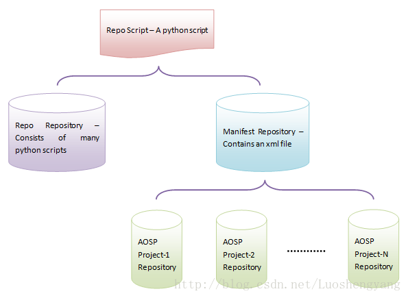

# 1. 产生背景

软件工程由于需要不断迭代开发, 因此要对源代码进行版本管理. Android 源代码工程 (AOSP) 也不例外, 它采用 Git 来进行版本管理. AOSP 作为一个大型开放源代码工程, 由许许多多子项目组成, 因此不能简单地用 Git 进行管理, 它在 Git 的基础上建立了一套自己的代码仓库, 并且使用工具 Repo 进行管理. 工欲善其事, 必先利其器. 本文就对 AOSP 代码仓库及其管理工具 repo 进行分析, 以便提高我们日常开发效率.

现代的代码版本管理工具, SVN 和 Git 是最流行的. SVN 是一种集中式的代码管理工具, 需要有一个中心服务器, 而 Git 是一种分布式的代码管理工具. 不需要一个中心服务器. 不需要中心服务器意味着在没有网络的情况下, Git 也能进行版本管理. 因此, 单从这一点出发, Git 就比 SVN 要方便很多. 当然, Git 和 SVN 相比, 还有许多不同的理念设计, 但是总的来说, Git 越来越受到大家的青睐, 尤其是在开源社区. 君不见, Linux 是采用 Git 进行版本管理, 而越来越火的 GitHub, 提供也是 Git 代码管理服务. 本文不打算分析 Git 与 SVN 的区别, 以及 Git 的使用方法, 不过强烈建议大家先去了解 Git, 然后再看下面的内容. 这里推荐一本 Git 书籍 < Pro Git>, 它是 GitHub 的员工 Scott Chacon 撰写的, 对 Git 的使用及其原理都介绍得非常详细和清晰.

前面提到, **AOSP** 是由许**许多项目**组成的, 例如, 在 Android 4.2 中, 就包含了 **329 个项目**, **每一个项目**都是一个**独立的 Git 仓库**. 这意味着, 如果我们要创建一个 AOSP 分支来做 feature 开发, 那么就需要到每一个子项目去创建对应的分支. 这显然不能手动地到每一个子项目里面去创建分支, 必须要采用一种自动化的方式来处理. 这些自动化处理工作就是由 **Repo 工具**来完成的. 当然, Repo 工具所负责的自动化工作不只是创建分支那么简单, 查看分支状态, 提交代码, 更新代码等基础 Git 操作它都可以完成.

# 2. 三个仓库

## 2.1. Repo 仓库

> 包含 Repo 工具的一系列 Python 脚本

Repo 工具实际上是由一系列的 **Python 脚本**组成的, 这些 Python 脚本通过**调用 Git 命令**来完成自己的功能. 比较有意思的是, **组成 Repo 工具**的那些 **Python 脚本**本身也是**一个 Git 仓库**. 这个 Git 仓库在 AOSP 里面就称为 **Repo 仓库**.

我们**每次执行 Repo 命令**的时候, Repo 仓库都会对自己**进行一次更新**.

## 2.2. Manifest 仓库

> 包含 子项目的 Git 仓库元信息

上面我们讨论的是 Repo 仓库, 但是实际上我们执行 Repo 命令想操作的是 AOSP. 这就要求 Repo 命令要知道 **AOSP** 都包含有**哪些子项目**, 并且要知道这些**子项目的名称**, **仓库地址**是什么. 换句话说, 就是 Repo 命令要知道 AOSP 所有子项目的 Git 仓库元信息. 我们知道, AOSP 也是不断地迭代法变化的, 例如, 它的每一个版本所包含的子项目可能都是不一样的. 这意味着需要通过**另外一个 Git 仓库**来管理 AOSP 所有的**子项目的 Git 仓库元信息**. 这个 Git 仓库在 AOSP 里面就称为 **Manifest 仓库**.

## 2.3. 三个仓库的关系

到目前为止, 我们提到了**三种类型的 Git 仓库**, 分别是 **Repo 仓库**, **Manifest 仓库**和 **AOSP 子项目仓库**.

Repo 仓库通过 Manifest 仓库可以获得所有 AOSP 子项目仓库的元信息. 有了这些元信息之后, 我们就可以通过 Repo 仓库里面的 Python 脚本来操作 AOSP 的子项目.

## 2.4. Repo 脚本

> 通用工具, 用来获取 Repo 仓库和 Manifest 仓库

那么, **Repo 仓库**和 **Manifest 仓库**又是怎么来的呢? 答案是通过一个独立的 Repo 脚本来获取, 这个 Repo 脚本位于 AOSP 的一个官方网站上, 我们可以通过 HTTP 协议来下载.

## 2.5. 架构图

现在, 我们就通过一个图来来勾勒一下整个 AOSP 的 Picture, 它由 Repo 脚本, Repo 仓库, Manifest 仓库和 AOSP 子项目仓库组成, 如图 1 所示:



# Repo 脚本

接下来我们就看看上述脚本和仓库是怎么来的.

Repo 脚本: 通用工具

从官方网站可以知道, Repo 脚本可以通过以下命令来获取:

```shell
$ curl https://storage.googleapis.com/git-repo-downloads/repo > ~/bin/repo
$ chmod a+x ~/bin/repo
```

也就是可以通过 curl 工具从 https://storage.googleapis.com/git-repo-downloads/repo 地址下载 repo 脚本, 并将其放到~/bin 目录下, 并赋予可执行权限. 以便接下来我们可以通过 repo 命令来运行它.

# Repo 仓库

我们下载好 Repo 脚本之后, 要选通过以下命令来安装一个 Repo 仓库:

```shell
$ repo init -u https://android.googlesource.com/tools/repo
```

这个命令实际上是包含了两个操作: **安装 Repo 仓库**和**安装 Manifest 仓库**. 其中, Manifest 仓库的地址由 `-u` 后来带的参数给出.

* Repo 仓库默认在 `.repo/repo` 目录下, 这是公用的 `https://gerrit.googlesource.com/git-repo`;

* Manifest 仓库在 `.repo/manifests` 目录下, 这是自定义的(`-u` 参数后面的).

这一小节我们先分析 Repo 仓库的安装过程, 在接下来再分析 Manifest 仓库的安装过程.

我们看看 Repo 脚本是如何执行 repo init 命令的:

```python
def main(orig_args):
  // 返回当前
  repo_main, rel_repo_dir = _FindRepo()
  // 参数进行解析
  cmd, opt, args = _ParseArguments(orig_args)

  wrapper_path = os.path.abspath(__file__)
  my_main, my_git = _RunSelf(wrapper_path)

  if not repo_main:
    if opt.help:
      _Usage()
    if cmd == 'help':
      _Help(args)
    if not cmd:
      _NotInstalled()
    if cmd == 'init':
      if my_git:
        _SetDefaultsTo(my_git)
      try:
        _Init(args)
      except CloneFailure:
        ......
        sys.exit(1)
      repo_main, rel_repo_dir = _FindRepo()
    else:
      _NoCommands(cmd)

  if my_main:
    repo_main = my_main

  ver_str = '.'.join(map(str, VERSION))
  me = [repo_main,
        '--repo-dir=%s' % rel_repo_dir,
        '--wrapper-version=%s' % ver_str,
        '--wrapper-path=%s' % wrapper_path,
        '--']
  me.extend(orig_args)
  me.extend(extra_args)
  try:
    os.execv(repo_main, me)
  except OSError as e:
    ......
    sys.exit(148)

if __name__ == '__main__':
  main(sys.argv[1:])
```

`_FindRepo` 在从当前目录开始往上遍历直到根目录. 如果中间某一个目录下面存在一个 `.repo/repo` 目录, 并且该 `.repo/repo` 存在一个 `main.py` 文件, 那么就会认为当前是 AOSP 中执行 **Repo 脚本**, 这时候它就会返回文件 main.py 的绝对路径和当前查找目录下的 `.repo` 子目录的绝对路径给调用者. 在上述情况下, 实际上是说明 **Repo 仓库已经安装过**了.

`_FindRepo` 的实现如下所示:

```python
repodir = '.repo'               # name of repo's private directory
S_repo = 'repo'                 # special repo repository
REPO_MAIN = S_repo + '/main.py' # main script

def _FindRepo():
  """Look for a repo installation, starting at the current directory."""
  curdir = os.getcwd()
  repo = None

  olddir = None
  while curdir != '/' \
    and curdir != olddir \
    and not repo:
    repo = os.path.join(curdir, repodir, REPO_MAIN)
    if not os.path.isfile(repo):
      repo = None
      olddir = curdir
      curdir = os.path.dirname(curdir)
  return (repo, os.path.join(curdir, repodir))
```

`_ParseArguments` 无非是对 Repo 的参数进行解析, 得到要执行的命令及其对应的参数. 例如, 当我们调用 "`repo init -u https://android.googlesource.com/platform/manifest`" 的时候, 就表示要执行的**命令是 init**, 这个命令后面跟的参数是 "`-u https://android.googlesource.com/platform/manifest`". 同时, 如果我们调用 "repo sync", 就表示要执行的命令是 sync, 这个命令没有参数.

`_RunSelf` 检查 Repo 脚本所在目录是否存在一个 Repo 仓库, 如果存在的话, 就从该仓库克隆一个新的仓库到执行 Repo 脚本的目录来. 实际上就是从本地克隆一个新的 Repo 仓库. 如果不存在的话, 那么就需要从远程地址克隆一个 Repo 仓库到本地来. 这个远程地址是 Hard Code 在 Repo 脚本里面.

`_RunSelf` 的实现如下所示:

```python
def _RunSelf(wrapper_path):
  my_dir = os.path.dirname(wrapper_path)
  my_main = os.path.join(my_dir, 'main.py')
  my_git = os.path.join(my_dir, '.git')

  if os.path.isfile(my_main) and os.path.isdir(my_git):
    for name in ['git_config.py',
                 'project.py',
                 'subcmds']:
      if not os.path.exists(os.path.join(my_dir, name)):
        return None, None
    return my_main, my_git
  return None, None
```

从这里我们就可以看出, 如果 **Repo 脚本**所在的目录存在**一个 Repo 仓库**, 那么要满足以下条件:

(1) 存在一个 `.git` 目录;

(2) 存在一个 `main.py` 文件;

(3) 存在一个 `git_config.py` 文件;

(4) 存在一个 `project.py` 文件;

(5) 存在一个 `subcmds` 目录.

上述目录和文件实际上都是一个标准的 Repo 仓库所具有的.

我们再回到 main 函数中. 如果调用 `_FindRepo` 得到的 `repo_main` 的值等于空, 那么就说明当前目录还没有安装 Repo 仓库, 这时候 Repo 后面所跟的参数只能是 help 或者 init, 否则的话, 就会显示错误信息. 如果 Repo 后面跟的参数是 help, 就打印出 Repo 脚本的帮助文档.

我们关注 Repo 后面跟的参数是 init 的情况. 这时候看一下调用 `_RunSelf` 的返回值 my_git 是否不等于空. 如果不等于空的话, 那么就说明 Repo 脚本所在目录存一个 Repo 仓库, 这时候就调用 `_SetDefaultsTo` 设置等一会要克隆的 Repo 仓库源.

`_SetDefaultsTo` 的实现如下所示:

```python
GIT = 'git'

REPO_URL = 'https://gerrit.googlesource.com/git-repo'
REPO_REV = 'stable'

def _SetDefaultsTo(gitdir):
  global REPO_URL
  global REPO_REV

  REPO_URL = gitdir
  proc = subprocess.Popen([GIT,
                           '--git-dir=%s' % gitdir,
                           'symbolic-ref',
                           'HEAD'],
                          stdout = subprocess.PIPE,
                          stderr = subprocess.PIPE)
  REPO_REV = proc.stdout.read().strip()
  proc.stdout.close()

  proc.stderr.read()
  proc.stderr.close()

  if proc.wait() != 0:
    _print('fatal: %s has no current branch' % gitdir, file=sys.stderr)
    sys.exit(1)
```

如果 Repo 脚本所在目录不存在一个 **Repo 仓库**, 那么默认就将 `https://gerrit.googlesource.com/git-repo` 设置为一会要克隆的 Repo 仓库源, 并且要克隆的分支是 stable. 否则的话, 就以该 Repo 仓库作为**克隆源**, 并且以该 Repo 仓库的当前分支作为要克隆的分支.

```
.repo/repo$ git remote -v
origin  https://gerrit.googlesource.com/git-repo (fetch)
origin  https://gerrit.googlesource.com/git-repo (push)

.repo/repo$ git log
commit db111d392407797e170355e1c0ec98e71d4a8278 (HEAD -> default, tag: v2.51, origin/stable)
Author: Josip Sokcevic <sokcevic@chromium.org>
Date:   Wed Jan 15 23:43:22 2025 +0000
```

从前面的分析就可以知道, 当我们执行 "`repo init`" 命令的时候:

(1) 如果我们**只是**从网上下载了**一个 Repo 脚本**, 那么在执行 Repo 命令的时候, 就会从远程克隆一个 Repo 仓库到当前执行 Repo 脚本的目录来.

(2). 如果我们从网上下载的是一个带有 Repo 仓库的 Repo 脚本, 那么在执行 Repo 命令的时候, 就可以从本地克隆一个 Repo 仓库到当前执行 Repo 脚本的目录来.

我们再继续看 main 函数的实现, 它接下来调用 `_Init` 在当前执行 Repo 脚本的目录下安装一个 Repo 仓库:

```python
def _Init(args):
  """Installs repo by cloning it over the network."""
  opt, args = init_optparse.parse_args(args)
  ......

  url = opt.repo_url
  if not url:
    url = REPO_URL
    extra_args.append('--repo-url=%s' % url)

  branch = opt.repo_branch
  if not branch:
    branch = REPO_REV
    extra_args.append('--repo-branch=%s' % branch)

  ......

  if not os.path.isdir(repodir):
    try:
      os.mkdir(repodir)
    except OSError as e:
      ......
      sys.exit(1)

  _CheckGitVersion()
  try:
    if NeedSetupGnuPG():
      can_verify = SetupGnuPG(opt.quiet)
    else:
      can_verify = True

    dst = os.path.abspath(os.path.join(repodir, S_repo))
    _Clone(url, dst, opt.quiet)

    if can_verify and not opt.no_repo_verify:
      rev = _Verify(dst, branch, opt.quiet)
    else:
      rev = 'refs/remotes/origin/%s^0' % branch

    _Checkout(dst, branch, rev, opt.quiet)
  except CloneFailure:
    ......
```

如果我们在执行 Repo 脚本的时候, 没有通过 `--repo-url` 和 `--repo-branch` 来指定 Repo 仓库的源地址和分支, 那么就使用由 `REPO_URL` 和 `REPO_REV` 所指定的源地址和分支. 从前面的分析可以知道, `REPO_URL` 和 `REPO_REV` 要么指向远程地址 `https://gerrit.googlesource.com/git-repo` 和分支 stable, 要么指向 Repo 脚本所在目录的 Repo 仓库和该仓库的当前分支.

_Init 函数继续检查当前执行 Repo 脚本的目录是否存在一个. repo 目录. 如果不存在的话, 那么就新创建一个. 接着是否需要验证等一会克隆回来的 Repo 仓库的 GPG. 如果需要验证的话, 那么就会在调用_Clone 函数来克隆好 Repo 仓库之后, 调用_Verify 函数来验证该 Repo 仓库的 GPG.

最关键的地方就在于函数_Clone 函数和_Checkout 函数的调用, 前者用来从 url 指定的地方克隆一个仓库到 dst 指定的地方来, 实际上就是克隆到当前目录下的./repo/repo 目录来, 后者在克隆回来的仓库中将 branch 分支 checkout 出来.

函数_Clone 的实现如下所示:

```python
def _Clone(url, local, quiet):
  """Clones a git repository to a new subdirectory of repodir"""
  try:
    os.mkdir(local)
  except OSError as e:
    _print('fatal: cannot make %s directory: %s' % (local, e.strerror),
           file=sys.stderr)
    raise CloneFailure()

  cmd = [GIT, 'init', '--quiet']
  try:
    proc = subprocess.Popen(cmd, cwd = local)
  except OSError as e:
    ......

  ......

  _InitHttp()
  _SetConfig(local, 'remote.origin.url', url)
  _SetConfig(local, 'remote.origin.fetch',
                    '+refs/heads/*:refs/remotes/origin/*')
  if _DownloadBundle(url, local, quiet):
    _ImportBundle(local)
  else:
    _Fetch(url, local, 'origin', quiet)
```

这个函数首先是调用 "git init" 在当前目录下的 `.repo/repo` 子目录初始化一个 Git 仓库, 接着再调用_SetConfig 函来设置该 Git 仓库的 url 信息等. 再接着调用_DownloadBundle 来检查指定的 url 是否存在一个 clone.bundle 文件. 如果存在这个 clone.bundle 文件的话, 就以它作为 Repo 仓库的克隆源.

函数 _DownloadBundle 的实现如下所示:

```python
def _DownloadBundle(url, local, quiet):
  if not url.endswith('/'):
    url += '/'
  url += 'clone.bundle'

  ......

  if not url.startswith('http:') and not url.startswith('https:'):
    return False

  dest = open(os.path.join(local, '.git', 'clone.bundle'), 'w+b')
  try:
    try:
      r = urllib.request.urlopen(url)
    except urllib.error.HTTPError as e:
      if e.code in [403, 404]:
        return False
      ......
      raise CloneFailure()
    except urllib.error.URLError as e:
      ......
      raise CloneFailure()
    try:
      if not quiet:
        _print('Get %s' % url, file=sys.stderr)
      while True:
        buf = r.read(8192)
        if buf == '':
          return True
        dest.write(buf)
    finally:
      r.close()
  finally:
    dest.close()
```

Bundle 文件是 Git 提供的一种机制, 用来解决不能正常通过 git,ssh 和 http 等网络协议从远程地址克隆 Git 仓库的问题. 简单来说, 就是我们可以用 "git bundle" 命令来在一个 Git 仓库创建一个 Bundle 文件, 这个 Bundle 文件就会包含 Git 仓库的提交历史. 把这个 Bundle 文件通过其它方式拷贝到另一台机器上, 就可以将它作为一个本地 Git 仓库来使用, 而不用去访问远程网络.

回到函数_Clone 中, 如果存在对应的 clone.bundle 文件, 并且能成功下载到该 clone.bundle, 接下来就调用函数_ImportBundle 将它作为源仓库克隆为新的 Repo 仓库. 函数_ImportBundle 的实现如下所示:

```python
def _ImportBundle(local):
  path = os.path.join(local, '.git', 'clone.bundle')
  try:
    _Fetch(local, local, path, True)
  finally:
    os.remove(path)
```

结合_Clone 函数和_ImportBundle 函数就可以看出, 从 clone.bundle 文件克隆 Repo 仓库和从远程 url 克隆 Repo 仓库都是通过函数_Fetch 来实现的. 区别就在于调用函数_Fetch 时指定的第三个参数, 前者是已经下载到本地的一个 clone.bundle 文件路径, 后者是 origin(表示远程仓库名称).

函数_Fetch 的实现如下所示:

```python
def _Fetch(url, local, src, quiet):
  if not quiet:
    _print('Get %s' % url, file=sys.stderr)

  cmd = [GIT, 'fetch']
  if quiet:
    cmd.append('--quiet')
    err = subprocess.PIPE
  else:
    err = None
  cmd.append(src)
  cmd.append('+refs/heads/*:refs/remotes/origin/*')
  cmd.append('refs/tags/*:refs/tags/*')

  proc = subprocess.Popen(cmd, cwd = local, stderr = err)
  if err:
    proc.stderr.read()
    proc.stderr.close()
  if proc.wait() != 0:
    raise CloneFailure()
```

函数 _Fetch 实际上就是通过 "git fetch" 从指定的仓库源克隆一个新的 Repo 仓库到当前目录下的 `.repo/repo` 子目录来.

注意, 以上只是克隆好了一个 Repo 仓库, 接下来还需要从这个 Repo 仓库 checkout 出一个分支来, 才能正常工作. 从 Repo 仓库 checkout 出一个分支是通过调用函数 _Checkout 来实现的:

```python
def _Checkout(cwd, branch, rev, quiet):
  """Checkout an upstream branch into the repository and track it."""
  cmd = [GIT, 'update-ref', 'refs/heads/default', rev]
  if subprocess.Popen(cmd, cwd = cwd).wait() != 0:
    raise CloneFailure()

  _SetConfig(cwd, 'branch.default.remote', 'origin')
  _SetConfig(cwd, 'branch.default.merge', 'refs/heads/%s' % branch)

  cmd = [GIT, 'symbolic-ref', 'HEAD', 'refs/heads/default']
  if subprocess.Popen(cmd, cwd = cwd).wait() != 0:
    raise CloneFailure()

  cmd = [GIT, 'read-tree', '--reset', '-u']
  if not quiet:
    cmd.append('-v')
  cmd.append('HEAD')
  if subprocess.Popen(cmd, cwd = cwd).wait() != 0:
    raise CloneFailure()
```

要 checkout 出来的分支由**参数 branch** 指定. 从前面的分析可以知道, 如果当前执行的 Repo 脚本所在目录存在一个 Repo 仓库, 那么参数 branch 描述的就是该仓库**当前 checkout 出来的分支**. 否则的话, 参数 branch 描述的就是从**远程仓库**克隆回来的 "**stable**" 分支.

需要注意的是, 这里从仓库 checkout 出分支不是使用 "git checkout" 命令来实现的, 而是通过更底层的 Git 命令 "git update-ref" 来实现的. 实际上,"git checkout" 命令也是通过 "git update-ref" 命令来实现的, 只不过它进行了更高层的封装, 更方便使用. 如果我们去分析组成 Repo 仓库的那些 Python 脚本命令, 就会发现它们基本上都是通过**底层的 Git 命令**来完成 Git 功能的.

# Manifest 仓库

我们接着再分析下面这个命令的执行:

```shell
repo init -u https://android.googlesource.com/platform/manifest
```

如前所述, 这个命令安装好 Repo 仓库之后, 就会调用该 Repo 仓库下面的 `main.py` 脚本, 对应的文件为 `.repo/repo/main.py`, 它的入口函数的实现如下所示:

```python
def _Main(argv):
  result = 0

  opt = optparse.OptionParser(usage="repo wrapperinfo -- ...")
  opt.add_option("--repo-dir", dest="repodir",
                 help="path to .repo/")
  ......

  repo = _Repo(opt.repodir)
  try:
    try:
      init_ssh()
      init_http()
      result = repo._Run(argv) or 0
    finally:
      close_ssh()
  except KeyboardInterrupt:
    ......
    result = 1
  except ManifestParseError as mpe:
    ......
    result = 1
  except RepoChangedException as rce:
    # If repo changed, re-exec ourselves.
    #
    argv = list(sys.argv)
    argv.extend(rce.extra_args)
    try:
      os.execv(__file__, argv)
    except OSError as e:
      ......
      result = 128

  sys.exit(result)

if __name__ == '__main__':
  _Main(sys.argv[1:])
```

从前面的分析可以知道, 通过参数 `--repo-dir` 传进来的是 AOSP 根目录下的 `.repo` 目录, 这是一个隐藏目录, 里面保存的是 Repo 仓库, Manifest 仓库, 以及各个 AOSP 子项目仓库. 函数 `_Main` 首先是调用 `init_ssh` 和 `init_http` 来初始化网络环境, 接着再调用前面创建的一个 `_Repo` 对象的成员函数 `_Run` 来解析要执行的命令, 并且执行这个命令.

_Repo 类的成员函数_Run 的实现如下所示:

```python
from subcmds import all_commands

class _Repo(object):
  def __init__(self, repodir):
    self.repodir = repodir
    self.commands = all_commands
    # add 'branch' as an alias for 'branches'
    all_commands['branch'] = all_commands['branches']

  def _Run(self, argv):
    result = 0
    name = None
    glob = []

    for i in range(len(argv)):
      if not argv[i].startswith('-'):
        name = argv[i]
        if i > 0:
          glob = argv[:i]
        argv = argv[i + 1:]
        break
    if not name:
      glob = argv
      name = 'help'
      argv = []
    gopts, _gargs = global_options.parse_args(glob)

    ......

    try:
      cmd = self.commands[name]
    except KeyError:
      ......
      return 1

    cmd.repodir = self.repodir
    cmd.manifest = XmlManifest(cmd.repodir)

    ......

    try:
      result = cmd.Execute(copts, cargs)
    except DownloadError as e:
      ......
      result = 1
    except ManifestInvalidRevisionError as e:
      ......
      result = 1
    except NoManifestException as e:
      ......
      result = 1
    except NoSuchProjectError as e:
      ......
      result = 1
    finally:
      ......

    return result
```

Repo 脚本能执行的命令都放在目录 `.repo/repo/subcmds` 中, 该目录每一个 python 文件都对应一个 Repo 命令. 例如, "repo init" 表示要执行命令脚本是 `.repo/repo/subcmds/init.py`.

_Repo 类的成员函数_Run 首先是在 repo 后面所带的参数中, 不是以横线 "-" 开始的第一个选项, 该选项就代表要执行的命令, 该命令的名称就保存在变量 name 中. 接着根据变量 name 的值在_Repo 类的成员变量 commands 中找到对应的命令模块 cmd, 并且指定该命令模块 cmd 的成员变量 repodir 和 manifest 的值. 命令模块 cmd 的成员变量 repodir 描述的就是 AOSP 的 `.repo` 目录, 成员变量 manifest 指向的是一个 XmlManifest 对象, 它描述的是 AOSP 的 Repo 仓库和 Manifest 仓库.

我们看看 XmlManifest 类的构造函数, 它定义在文件 `.repo/repo/xml_manifest.py` 文件中:

```python
class XmlManifest(object):
  """manages the repo configuration file"""

  def __init__(self, repodir):
    self.repodir = os.path.abspath(repodir)
    self.topdir = os.path.dirname(self.repodir)
    self.manifestFile = os.path.join(self.repodir, MANIFEST_FILE_NAME)
    ......

    self.repoProject = MetaProject(self, 'repo',
      gitdir   = os.path.join(repodir, 'repo/.git'),
      worktree = os.path.join(repodir, 'repo'))

    self.manifestProject = MetaProject(self, 'manifests',
      gitdir   = os.path.join(repodir, 'manifests.git'),
      worktree = os.path.join(repodir, 'manifests'))

    ......
```

`XmlManifest` 作了描述了 **AOSP** 的 **Repo 目录** (repodir), **AOSP 根目录**(topdir) 和 `Manifest.xml` 文件 (manifestFile) 之外, 还使用两个 MetaProject 对象描述了 **AOSP** 的 **Repo 仓库** (repoProject) 和 **Manifest 仓库**(manifestProject).

在 AOSP 中, 每一个子项目 (或者说仓库) 都用一个 Project 对象来描述. Project 类定义在文件 `.repo/repo/project.py` 文件中, 用来封装对各个项目的基础 Git 操作, 例如, 对项目进行暂存, 提交和更新等. 它的构造函数如下所示:

```python
class Project(object):
  def __init__(self,
               manifest,
               name,
               remote,
               gitdir,
               worktree,
               relpath,
               revisionExpr,
               revisionId,
               rebase = True,
               groups = None,
               sync_c = False,
               sync_s = False,
               clone_depth = None,
               upstream = None,
               parent = None,
               is_derived = False,
               dest_branch = None):
    """Init a Project object.
    Args:
      manifest: The XmlManifest object.
      name: The `name` attribute of manifest.xml's project element.
      remote: RemoteSpec object specifying its remote's properties.
      gitdir: Absolute path of git directory.
      worktree: Absolute path of git working tree.
      relpath: Relative path of git working tree to repo's top directory.
      revisionExpr: The `revision` attribute of manifest.xml's project element.
      revisionId: git commit id for checking out.
      rebase: The `rebase` attribute of manifest.xml's project element.
      groups: The `groups` attribute of manifest.xml's project element.
      sync_c: The `sync-c` attribute of manifest.xml's project element.
      sync_s: The `sync-s` attribute of manifest.xml's project element.
      upstream: The `upstream` attribute of manifest.xml's project element.
      parent: The parent Project object.
      is_derived: False if the project was explicitly defined in the manifest;
                  True if the project is a discovered submodule.
      dest_branch: The branch to which to push changes for review by default.
    """
    self.manifest = manifest
    self.name = name
    self.remote = remote
    self.gitdir = gitdir.replace('\\', '/')
    if worktree:
      self.worktree = worktree.replace('\\', '/')
    else:
      self.worktree = None
    self.relpath = relpath
    self.revisionExpr = revisionExpr

    if   revisionId is None \
     and revisionExpr \
     and IsId(revisionExpr):
      self.revisionId = revisionExpr
    else:
      self.revisionId = revisionId

    self.rebase = rebase
    self.groups = groups
    self.sync_c = sync_c
    self.sync_s = sync_s
    self.clone_depth = clone_depth
    self.upstream = upstream
    self.parent = parent
    self.is_derived = is_derived
    self.subprojects = []

    self.snapshots = {}
    self.copyfiles = []
    self.annotations = []
    self.config = GitConfig.ForRepository(
                    gitdir = self.gitdir,
                    defaults =  self.manifest.globalConfig)

    if self.worktree:
      self.work_git = self._GitGetByExec(self, bare=False)
    else:
      self.work_git = None
    self.bare_git = self._GitGetByExec(self, bare=True)
    self.bare_ref = GitRefs(gitdir)
    self.dest_branch = dest_branch

    # This will be filled in if a project is later identified to be the
    # project containing repo hooks.
    self.enabled_repo_hooks = []
```

Project 类构造函数的各个参数的含义见注释, 这里为了方便描述, 用中文描述一下:

manifest: 指向一个 XmlManifest 对象, 描述 AOSP 的 Repo 仓库和 Manifest 仓库元信息

name: 项目名称

remote: 描述项目对应的远程仓库元信息

gitdir: 项目的 Git 仓库目录

worktree: 项目的工作目录

relpath: 项目的相对于 AOSP 根目录的工作目录

revisionExpr, revisionId,rebase,groups,sync_c,sync_s 和 upstream: 每一个项目在 `.repo/repo/manifest.xml` 文件中都有对应的描述, 这几个属性的值就来自于该 `manifest.xml` 文件对自己的描述的, 它们的含义可以参考 `.repo/repo/docs/manifest-format.txt` 文件

parent: 父项目

is_derived: 如果一个项目含有子模块(也是一个 Git 仓库), 那么这些子模块也会用一个 Project 对象来描述, 这些 Project 的 is_derived 属性会设置为 true

dest_branch: 用来 code review 的分支

这里重点说一下项目的 Git 仓库目录和工作目录的概念. 一般来说, 一个项目的 **Git 仓库目录** (默认为 `.git` 目录) 是位于**工作目录下面**的, 但是 Git 支持将一个项目的 **Git 仓库目录和工作目录分开**来存放. 在 AOSP 中,

* **Repo 仓库**的 Git 目录 (`.git`) 位于工作目录 (.repo/repo) 下;

* **Manifest 仓库**的 Git 目录有**两份拷贝**, 一份 (`.git`) 位于**工作目录** (`.repo/manifests`) 下, 另外一份位于 `.repo/manifests.git` 目录;

* **其余的 AOSP 子项目**的**工作目录**和 **Git 目录**都是**分开存放**的, 其中, **工作目录**位于 **AOSP 根目录**下, **Git 目录**位于 `.repo/projects` 目录下.

* 此外, **每一个 AOSP 子项目**的**工作目录**也有一个 `.git` 目录, 不过这个 .git 目录是一个**符号链接**, 链接到 `.repo/projects` 对应的 Git 目录. 这样, 我们就既可以在 **AOSP 子项目**的**工作目录**下执行 **Git 命令**, 也可以在**其对应的 Git 目录下**执行 Git 命令. 一般来说, 要访问到工作目录的命令 (例如 git status) 需要在工作目录下执行, 而不需要访问工作目录 (例如 git log) 可以在 Git 目录下执行.

Project 类有两个成员变量 work_git 和 bare_git, 它们指向的都是一个_GitGetByExec 对象. 用来封装对 Git 命令的执行. 其中, 前者在执行 Git 命令的时候, 会将当前目录设置为项目的工作目录, 而后者在执行的时候, 不会设置当前目录, 但是会将环境变量 GIT_DIR 的值设置为项目的 Git 目录, 也就是. repo/projects 目录下面的那些目录. 通过这种方式, Project 类就可以根据需要来在工作目录或者 Git 目录下执行 Git 命令.

回到 XmlManifest 类的构造函数中, 由于 Repo 和 Manifest 也是属于 Git 仓库, 所以我们也需要创建一个 Project 对象来描述它们. 不过, 由于它们是比较特殊的 Git 仓库(用来描述 AOSP 子项目元信息的 Git 仓库), 所以我们就使用另外一个类型为 MetaProject 的对象来描述它们. MetaProject 类是从 Project 类继承下来的, 定义在 project.py 文件中, 如下所示:

```python
class MetaProject(Project):
  """A special project housed under .repo."""
  def __init__(self, manifest, name, gitdir, worktree):
    Project.__init__(self,
                     manifest = manifest,
                     name = name,
                     gitdir = gitdir,
                     worktree = worktree,
                     remote = RemoteSpec('origin'),
                     relpath = '.repo/%s' % name,
                     revisionExpr = 'refs/heads/master',
                     revisionId = None,
                     groups = None)
```

既然 MetaProject 类是从 Project 类继承下来的, 那么它们的 Git 操作几乎都可以通过 Project 类来完成的. 实际上, MetaProject 类和 Project 类目前的区别不是太大, 可以认为是基本相同的. 使用 MetaProject 类来描述 Repo 仓库和 Manifest 仓库, 主要是为了强调它们是用来描述 AOSP 子项目仓库的元信息的.

回到 _Repo 类的成员函数_Run 中, 创建好用来描述 Repo 仓库和 Manifest 仓库的 XmlManifest 对象之后, 就开始执行跟在 repo 脚本后面的不带横线 "-" 的选项所表示的命令. 在我们这个场景中, 这个命令就是 init, 它对应的 Python 模块为 `.repo/repo/subcmds/init.py`, 入口函数为定义在该模块的 Init 类的成员函数 Execute, 它的实现如下所示:

```python
class Init(InteractiveCommand, MirrorSafeCommand):
    ......

  def Execute(self, opt, args):
    ......

    self._SyncManifest(opt)
    self._LinkManifest(opt.manifest_name)

    ......
```

Init 类的成员函数 Execute 主要就是调用另外两个成员函数_SyncManifest 和_LinkManifest 来完成克隆 Manifest 仓库的工作.

Init 类的成员函数_SyncManifest 的实现如下所示:

```python
class Init(InteractiveCommand, MirrorSafeCommand):
  ......

  def _SyncManifest(self, opt):
    m = self.manifest.manifestProject
    is_new = not m.Exists

    if is_new:
        ......

      m._InitGitDir(mirror_git=mirrored_manifest_git)

      if opt.manifest_branch:
        m.revisionExpr = opt.manifest_branch
      else:
        m.revisionExpr = 'refs/heads/master
    else:
      if opt.manifest_branch:
        m.revisionExpr = opt.manifest_branch
      else:
        m.PreSync()

    ......

    if not m.Sync_NetworkHalf(is_new=is_new):
      ......
      sys.exit(1)

    if opt.manifest_branch:
      m.MetaBranchSwitch(opt.manifest_branch)
    ......

    m.Sync_LocalHalf(syncbuf)
    ......

    if is_new or m.CurrentBranch is None:
      if not m.StartBranch('default'):
        ......
        sys.exit(1)
```

Init 类的成员函数_SyncManifest 执行以下操作:

(1) 检查本地是否存在 Manifest 仓库, 即检查用来描述 Manifest 仓库 MetaProject 对象 m 的成员变量 mExists 值是否等于 true. 如果不等于的话, 那么就说明本地还没有安装过 Manifest 仓库. 这时候就需要调用该 MetaProject 对象 m 的成员函数_InitGitDir 来在. repo/manifests 目录初始化一个 Git 仓库.

(2) 调用用来描述 Manifest 仓库 MetaProject 对象 m 的成员函数 Sync_NetworkHalf 来从远程仓库中克隆一个新的 Manifest 仓库到本地来, 或者更新本地的 Manifest 仓库. 这个远程仓库的地址即为在执行 "repo init" 命令时, 通过 - u 指定的 url, 即 https://android.googlesource.com/platform/manifest.

(3) 检查 "repo init" 命令后面是否通过 - b 指定要在 Manifest 仓库中 checkout 出来的分支. 如果有的话, 那么就调用用来描述 Manifest 仓库 MetaProject 对象 m 的成员函数 MetaBranchSwitch 做一些清理工作, 以便接下来可以 checkout 到指定的分支.

(4) 调用用来描述 Manifest 仓库 MetaProject 对象 m 的成员函数 Sync_LocaHalf 来执行 checkout 分支的操作. 注意, 要切换的分支在前面已经记录在 MetaProject 对象 m 的成员变量 revisionExpr 中.

(5) 如果前面执行的是新安装 Manifest 仓库的操作, 并且没有通过 - b 选项指定要 checkout 的分支, 那么默认就 checkout 出一个 default 分支.

接下来, 我们就主要分析 MetaProject 类的成员函数_InitGitDir,Sync_NetworkHalf 和 Sync_LocaHalf 的实现. 这几个函数实际上都是由 MetaProject 的父类 Project 来实现的, 因此, 下面我们就分析 Project 类的成员函数_InitGitDir,Sync_NetworkHalf 和 Sync_LocaHalf 的实现.

Project 类的成员函数_InitGitDir 的成员函数的实现如下所示:

```python
class Project(object):
  ......

  def _InitGitDir(self, mirror_git=None):
    if not os.path.exists(self.gitdir):
      os.makedirs(self.gitdir)
      self.bare_git.init()
      ......
```

Project 类的成员函数_InitGitDir 首先是检查项目的 Git 目录是否已经存在. 如果不存在, 那么就会首先创建这个 Git 目录, 然后再调用成员变量 bare_git 所描述的一个_GitGetByExec 对象的成员函数 init 来在该目录下初始化一个 Git 仓库.

_GitGetByExec 类的成员函数 init 是通过另外一个成员函数__getattr__来实现的, 如下所示:

```python
class Project(object):
  ......

  class _GitGetByExec(object):
    ......

    def __getattr__(self, name):
      """Allow arbitrary git commands using pythonic syntax.

      This allows you to do things like:
        git_obj.rev_parse('HEAD')

      Since we don't have a'rev_parse' method defined, the __getattr__ will
      run.  We'll replace the'_'with a'-' and try to run a git command.
      Any other positional arguments will be passed to the git command, and the
      following keyword arguments are supported:
        config: An optional dict of git config options to be passed with '-c'.

      Args:
        name: The name of the git command to call.  Any '_' characters will
            be replaced with '-'.

      Returns:
        A callable object that will try to call git with the named command.
      """name = name.replace('_','-')
      def runner(*args, **kwargs):
        cmdv = []
        config = kwargs.pop('config', None)
        ......
        if config is not None:
          ......
          for k, v in config.items():
            cmdv.append('-c')
            cmdv.append('%s=%s' % (k, v))
        cmdv.append(name)
        cmdv.extend(args)
        p = GitCommand(self._project,
                       cmdv,
                       bare = self._bare,
                       capture_stdout = True,
                       capture_stderr = True)
        if p.Wait() != 0:
          ......
        r = p.stdout
        try:
          r = r.decode('utf-8')
        except AttributeError:
          pass
        if r.endswith('\n') and r.index('\n') == len(r) - 1:
          return r[:-1]
        return r
      return runner
```

从注释可以知道,_GitGetByExec 类的成员函数__getattr__使用了一个 trick, 将_GitGetByExec 类没有实现的成员函数间接地以属性的形式来获得, 并且将该没有实现的成员函数的名称作为 git 的一个参数来执行. 也就是说, 当执行_GitGetByExec.init()的时候, 实际上是透过成员函数__getattr__执行了一个 "git init" 命令. 这个命令就正好是用来初始化一个 Git 仓库.

我们再来看 Project 类的成员函数 Sync_NetworkHalf 的实现:

```python
class Project(object):
  ......

  def Sync_NetworkHalf(self,
      quiet=False,
      is_new=None,
      current_branch_only=False,
      clone_bundle=True,
      no_tags=False):
    """Perform only the network IO portion of the sync process.
       Local working directory/branch state is not affected.
    """
    if is_new is None:
      is_new = not self.Exists
    if is_new:
      self._InitGitDir()

    ......

    if not self._RemoteFetch(initial=is_new, quiet=quiet, alt_dir=alt_dir,
                             current_branch_only=current_branch_only,
                             no_tags=no_tags):
      return False

    ......
```

Project 类的成员函数 `Sync_NetworkHalf` 主要执行以下的操作:

(1) 检查本地是否已经存在对应的 Git 仓库. 如果不存在, 那么就先调用另外一个成员函数 `_InitGitDir` 来初始化该 Git 仓库.

(2) 调用另外一个成员函数 `_RemoteFetch` 来从远程仓库更新本地仓库.

Project 类的成员函数 `_RemoteFetch` 的实现如下所示:

```python
class Project(object):
  ......

  def _RemoteFetch(self, name=None,
                   current_branch_only=False,
                   initial=False,
                   quiet=False,
                   alt_dir=None,
                   no_tags=False):
    ......

    cmd = ['fetch']

    ......

    ok = False
    for _i in range(2):
      ret = GitCommand(self, cmd, bare=True, ssh_proxy=ssh_proxy).Wait()
      if ret == 0:
        ok = True
        break
      elif current_branch_only and is_sha1 and ret == 128:
        # Exit code 128 means "couldn't find the ref you asked for"; if we're in sha1
        # mode, we just tried sync'ing from the upstream field; it doesn't exist, thus
        # abort the optimization attempt and do a full sync.
        break
      time.sleep(random.randint(30, 45))

    ......
```

Project 类的成员函数 `_RemoteFetch` 的核心操作就是调用 "git fetch" 命令来从远程仓库更新本地仓库.

接下来我们再看 MetaProject 类的成员函数 `Sync_LocaHalf` 的实现:

```python
class Project(object):
  ......

  def Sync_LocalHalf(self, syncbuf):
    """Perform only the local IO portion of the sync process.
       Network access is not required.
    """
    ......

    revid = self.GetRevisionId(all_refs)

    ......

    self._InitWorkTree()
    head = self.work_git.GetHead()
    if head.startswith(R_HEADS):
      branch = head[len(R_HEADS):]
      try:
        head = all_refs[head]
      except KeyError:
        head = None
    else:
      branch = None

    ......

    if head == revid:
      # No changes; don't do anything further.
      #
      return

    branch = self.GetBranch(branch)

    ......

    if not branch.LocalMerge:
      # The current branch has no tracking configuration.
      # Jump off it to a detached HEAD.
      #
      syncbuf.info(self,
                   "leaving %s; does not track upstream",
                   branch.name)
      try:
        self._Checkout(revid, quiet=True)
      except GitError as e:
        syncbuf.fail(self, e)
        return
      ......
      return

    ......
```

这里我们只分析一种比较简单的情况, 就是当前要 checkout 的分支是一个干净的分支, 它没有做过修改, 也没有设置跟踪远程分支. 这时候 Project 类的成员函数_RemoteFetch 的主要执行以下操作:

(1) 调用另外一个成员函数 GetRevisionId 获得即将要 checkout 的分支, 保存在变量 revid 中.

(2) 调用成员变量 work_git 所描述的一个_GitGetByExec 对象的成员函数 GetHead 获得项目当前 checkout 的分支, 只存在变量 head 中.

(3) 如果即将要 checkout 的分支 revid 就是当前已经 checkout 分支, 那么就什么也不用做. 否则继续往下执行.

(4) 调用另外一个成员函数 GetBranch 获得用来描述当前分支的一个 Branch 对象.

(5) 如果上述 Branch 对象的属性 LocalMerge 的值等于 None, 也就是属于我们讨论的情况, 那么就调用另外一个成员函数_Checkout 真正执行 checkout 分支 revid 的操作.

如果要 checkout 的分支 revid 不是一个干净的分支, 也就是它正在跳踪远程分支, 并且在本地做过提交, 这些提交又没有上传到远程分支去, 那么就需要执行一些 merge 或者 rebase 的操作. 不过无论如何, 这些操作都是通过标准的 Git 命令来完成的.

我们接着再看 Project 类的成员函数_Checkout 的实现:

```python
class Project(object):
  ......

  def _Checkout(self, rev, quiet=False):
    cmd = ['checkout']
    if quiet:
      cmd.append('-q')
    cmd.append(rev)
    cmd.append('--')
    if GitCommand(self, cmd).Wait() != 0:
      if self._allrefs:
        raise GitError('%s checkout %s' % (self.name, rev))
```

Project 类的成员函数_Checkout 的实现很简单, 它通过 GitCommand 类构造了一个 "git checkout" 命令, 将参数 rev 描述的分支 checkout 出来.

至此, 我们就将 Manifest 仓库从远程地址 https://android.googlesource.com/platform/manifest 克隆到本地来了, 并且 checkout 出了指定的分支. 回到 Init 类的成员函数 Execute 中, 它接下来还要调用另外一个成员函数 `_LinkManifest` 来执行一个符号链接的操作.

Init 类的成员函数 `_LinkManifest` 的实现如下所示:

```python
class Init(InteractiveCommand, MirrorSafeCommand):
  ......

  def _LinkManifest(self, name):
    if not name:
      print('fatal: manifest name (-m) is required.', file=sys.stderr)
      sys.exit(1)

    try:
      self.manifest.Link(name)
    except ManifestParseError as e:
      print("fatal: manifest'%s'not available" % name, file=sys.stderr)
      print('fatal: %s' % str(e), file=sys.stderr)
      sys.exit(1)
```

参数 name 的值一般就等于 "default.xml", 表示 **Manifest 仓库**中的 `default.xml` 文件, Init 类的成员函数 `_LinkManifest` 通过调用成员变量 manifest 所描述的一个 XmlManifest 对象的成员函数 Link 来执行符号链接的操作, 它定义在文件 `.repo/repo/xml_manifest.py` 文件, 它的实现如下所示:

```python
class XmlManifest(object):
  """manages the repo configuration file"""
  ......

  def Link(self, name):
    """Update the repo metadata to use a different manifest."""
    ......

    try:
      if os.path.lexists(self.manifestFile):
        os.remove(self.manifestFile)
      os.symlink('manifests/%s' % name, self.manifestFile)
    except OSError as e:
      raise ManifestParseError('cannot link manifest %s: %s' % (name, str(e)))
```

XmlManifest 类的成员变量 manifestFile 的值等于 `$(AOSP)/.repo/manifest.xml`, 通过调用 os.symlink 就将它符号链接至 `$(AOSP)/.repo/manifests/<name>` 文件去. 这样无论 Manifest 仓库中用来描述 AOSP 子项目的 **xml 文件是什么名称**, 都可以统一通过 `$(AOSP)/.repo/manifest.xml` 文件来访问.

前面提到, Manifest 仓库中用来**描述 AOSP 子项目**的 xml 文件名称**默认**就为 `default.xml`, 它的内容如下所示:

```xml
<?xml version="1.0" encoding="UTF-8"?>
<manifest>

  <remote  name="aosp"
           fetch=".."
           review="https://android-review.googlesource.com/" />
  <default revision="refs/tags/android-4.2_r1"
           remote="aosp"
           sync-j="4" />

  <project path="build" name="platform/build" >
    <copyfile src="core/root.mk" dest="Makefile" />
  </project>
  <project path="abi/cpp" name="platform/abi/cpp" />
  <project path="bionic" name="platform/bionic" />
  ......

</manifest>
```

关于该 xml 文件的详细描述可以参考 `.repo/repo/docs/manifest-format.txt` 文件. 一般来说, 该 xml 包含有**四种类型的标签**:

* **remote**: 用来指定远程仓库信息. 属性 name 描述的是一个远程仓库的名称, 属性 fetch 用作项目名称的前缘, 在构造项目仓库远程地址时使用到, 属性 review 描述的是用作 code review 的 server 地址.

* **default**: 当 project 标签没有指定 default 标签的属性时, 默认就使用在 default 标签列出的属性. 属性 revision 描述的是项目默认检出的分支, 属性 remote 描述的是默认使用的远程仓库名称, 必须要对应的 remote 标签的 name 属性值, 属性 sync-j 描述的是从远程仓库更新项目时使用的并行任务数.

* **project**: 每一个 AOSP 子项目在这里都对应有一个 projec 标签, 用来描述项目的元信息. 属性 path 描述的是项目相对于远程仓库 URL 的路径, 属性 name 描述的是项目的名称, 也是相对于 AOSP 根目录的目录名称. 例如, 如果远程仓库 URL 为 https://android.googlesource.com/platform, 那么 AOSP 子项目 bionic 对应的远程仓库 URL 就为 https://android.googlesource.com/platform/bionic, 并且它的工作目录位于 $(AOSP)/bionic.

* **copyfile**: 作为 project 的子标签, 表示要将从远程仓库更新回来的文件拷贝到指定的另外一个文件去.

至些, 我们就分析完成 Manifest 仓库的克隆过程了. 在此基础上, 我们再分析 AOSP 子项目仓库的克隆过程或者针对 AOSP 子项目的各种 Repo 命令就容易多了.

1. AOSP 子项目仓库

执行完成 repo init 命令之后, 我们就可以继续执行 repo sync 命令来克隆或者同步 AOSP 子项目了:

```shell
$ repo sync
```

与 repo init 命令类似, repo sync 命令的执行过程如下所示:

1. Repo 脚本找到 Repo 仓库里面的 main.py 文件, 并且执行它的入口函数_Main;

2. Repo 仓库里面的 main.py 文件的入口函数_Main 调用_Repo 类的成员函数_Run 对 Repo 脚本传递进来的参数进行解析;

3. _Repo 类的成员函数_Run 解析参数发现要执行的命令是 sync, 于是就在 subcmds 目录中找到一个名称为 sync.py 的文件, 并且调用定义在它里面的一个名称为 Sync 的类的成员函数 Execute;

4. Sync 类的成员函数 Execute 解析 Manifest 仓库的 default.xml 文件, 并且克隆或者同步出在 default.xml 文件里面列出的每一个 AOSP 子项目.

在第 3 步中, Repo 仓库的每一个 Python 文件是如何与一个 Repo 命令关联起来的呢? 原来在 Repo 仓库的 subcmds 目录中, 有一个 `__init__.py` 文件, 每当 subcmds 被 import 时, 定义在它里面的命令就会被执行, 如下所示:

```python
all_commands = {}

my_dir = os.path.dirname(__file__)
for py in os.listdir(my_dir):
  if py == '__init__.py':
    continue

  if py.endswith('.py'):
    name = py[:-3]
    clsn = name.capitalize()
    while clsn.find('_') > 0:
      h = clsn.index('_')
      clsn = clsn[0:h] + clsn[h + 1:].capitalize()

    mod = __import__(__name__,
                     globals(),
                     locals(),
                     ['%s' % name])
    mod = getattr(mod, name)
    try:
      cmd = getattr(mod, clsn)()
    except AttributeError:
      raise SyntaxError('%s/%s does not define class %s' % (
                         __name__, py, clsn))

    name = name.replace('_', '-')
    cmd.NAME = name
    all_commands[name] = cmd
```

__init__.py 会列出 subcmds 目录中的所有 Python 文件(除了__init__.py), 并且里面找到对应的类, 然后再创建这个类的一个对象, 并且以文件名为关键字将该对象保存在全局变量 `all_commands` 中. 例如, 对于 sync.py 文件, 它的文件名称去掉后缀名后为 sync, 再将 sync 的首字母大写, 得到 Sync. 也就是说, sync.py 需要定义一个 Sync 类, 并且这个类需要直接或者间接地从 Command 类继承下来. Command 类有一个成员函数 Execute, 它的各个子类需要对它进行重写, 以实现各自的功能.

`_Repo` 类的成员函数_Run 就是通过 subcmds 模块里面的全局变量 `all_commands`, 并且根据 Repo 脚本传进行来的第一个不带横线 "-" 的参数来找到对应的 Command 对象, 然后调用它的成员函数 Execute 的.

Sync 类的成员函数 Execute 的实现如下所示:

```python
class Sync(Command, MirrorSafeCommand):
  ......

  def Execute(self, opt, args):
    ......

    mp = self.manifest.manifestProject
    ......

    if not opt.local_only:
      mp.Sync_NetworkHalf(quiet=opt.quiet,
                          current_branch_only=opt.current_branch_only,
                          no_tags=opt.no_tags)
    ......

    if mp.HasChanges:
      ......
      mp.Sync_LocalHalf(syncbuf)
      ......

    all_projects = self.GetProjects(args,
                                    missing_ok=True,
                                    submodules_ok=opt.fetch_submodules)
    ......

    if not opt.local_only:
      to_fetch = []
      ......
      to_fetch.extend(all_projects)
      to_fetch.sort(key=self._fetch_times.Get, reverse=True)

      fetched = self._Fetch(to_fetch, opt)
      ......

      if opt.network_only:
        # bail out now; the rest touches the working tree
        return

      # Iteratively fetch missing and/or nested unregistered submodules
      while True:
        ......
        all_projects = self.GetProjects(args,
                                        missing_ok=True,
                                        submodules_ok=opt.fetch_submodules)
        missing = []
        for project in all_projects:
          if project.gitdir not in fetched:
            missing.append(project)
        if not missing:
          break
        ......
        fetched.update(self._Fetch(missing, opt))

    if self.UpdateProjectList():
      sys.exit(1)

    ......

    for project in all_projects:
      ......
      if project.worktree:
        project.Sync_LocalHalf(syncbuf)

    ......
```

Sync 类的成员函数 Execute 的核以执行流程如下所示:

(1). 获得用来描述 Manifest 仓库的 MetaProject 对象 mp.

(2). 如果在执行 repo sync 命令时, 没有指定 --local-only 选项, 那么就调用 MetaProject 对象 mp 的成员函数 Sync_NetworkHalf 从远程仓库下载更新本地 Manifest 仓库.

(3). 如果 Mainifest 仓库发生过更新, 那么就调用 MetaProject 对象 mp 的成员函数 Sync_LocalHalf 来合并这些更新到本地的当前分支来.

(4). 调用 Sync 的父类 Command 的成员函数 GetProjects 获得由 Manifest 仓库的 default.xml 文件定义的所有 AOSP 子项目信息, 或者由参数 args 所指定的 AOSP 子项目的信息. 这些 AOSP 子项目信息都是通过 Project 对象来描述, 并且保存在变量 all_projects 中.

(5). 如果在执行 repo sync 命令时, 没有指定 --local-only 选项, 那么就对保存在变量 all_projects 中的 AOSP 子项目进行网络更新, 也就是从远程仓库中下载更新到本地仓库来, 这是通过调用 Sync 类的成员函数_Fetch 来完成的. Sync 类的成员函数_Fetch 实际上又是通过调用 Project 类的成员函数 Sync_NetworkHalf 来将远程仓库的更新下载到本地仓库来的.

(6). 由于 AOSP 子项目可能会包含有子模块, 因此当对它们进行了远程更新之后, 需要检查它们是否包含有子模块. 如果包含有子模块, 并且执行 repo sync 脚本时指定有 --fetch-submodules 选项, 那么就需要对 AOSP 子项目的子模块进行远程更新. 调用 Sync 的父类 Command 的成员函数 GetProjects 的时候, 如果将参数 submodules_ok 的值设置为 true, 那么得到的 AOSP 子项目列表就包含有子模块. 将这个 AOSP 子项目列表与之前获得的 AOSP 子项目列表 fetched 进行一个比较, 就可以知道有哪些子模块是需要更新的. 需要更新的子模块都保存在变量 missing 中. 由于子模块也是用 Project 类来描述的, 因此, 我们可以像远程更新 AOSP 子项目一样, 调用 Sync 类的成员函数_Fetch 来更新它们的子模块.

(7). 调用 Sync 类的成员函数 UpdateProjectList 更新 $(AOSP)/.repo 目录下的 project.list 文件.$(AOSP)/.repo/project.list 记录的是上一次远程同步后所有的 AOSP 子项目名称. 以后每一次远程同步之后, Sync 类的成员函数 UpdateProjectList 就会通过该文件来检查是否存在某些 AOSP 子项目被删掉了. 如果存在这样的 AOSP 子项目, 并且这些 AOSP 子项目没有发生修改, 那么就会将它们的工作目录删掉.

(8). 到目前为止, Sync 类的成员函数对 AOSP 子项目所做的操作仅仅是下载远程仓库的更新到本地来, 但是还没有将这些更新合并到本地的当前分支来, 因此, 这时候就需要调用 Project 类的成员函数 Sync_LocalHalf 来执行合并更新的操作.

从上面的步骤可以看出, init sync 命令的核心操作就是收集每一个需要同步的 AOSP 子项目所对应的 Project 对象, 然后再调用这些 Project 对象的成员函数 Sync_NetwokHalft 和 Sync_LocalHalf 进行同步. 关于 Project 类的成员函数 Sync_NetwokHalft 和 Sync_LocalHalf, 我们在前面分析 Manifest 仓库的克隆过程时, 已经分析过了, 它们无非就是通过 git fetch,git rebase 或者 git merge 等基本 Git 命令来完成自己的功能.

以上我们分析的就是 AOSP 子项目仓库的克隆或者同步过程, 为了更进一步加深对 Repo 仓库的理解, 接下来我们再分析另外一个用来在 AOSP 上创建 Topic 的命令 repo start.

5. 在 AOSP 上创建 Topic

在 Git 的世界里, 分支 (branch) 是一个很核心的概念. Git 鼓励你在修复 Bug 或者开发新的 Feature 时, 都创建一个新的分支. 创建 Git 分支的代价是很小的, 而且速度很快, 因此, 不用担心创建 Git 分支是一件不讨好的事情, 而应该尽可能多地使用分支.

同样的, 我们下载好 AOSP 代码之后, 如果需要在上面进行修改, 或者增加新的功能, 那么就要在新的分支上面进行. Repo 仓库提供了一个 repo start 命令, 用来在 AOSP 上创建分支, 也称为 Topic. 这个命令的用法如下所示:

```shell
$ repo start BRANCH_NAME [PROJECT_LIST]
```

参数 BRANCH_NAME 指定新的分支名称, 后面的 PROJECT_LIST 是可选的. 如果指定了 PROJECT_LIST, 就表示只对特定的 AOSP 子项目创建分支, 否则的话, 就对所有的 AOSP 子项目创建分支.

根据前面我们对 repo sync 命令的分析可以知道, 当我们执行 repo start 命令的时候, 最终定义在 Repo 仓库的 subcmds/start.py 文件里面的 Start 类的成员函数 Execute 会被调用, 它的实现如下所示:

```python
class Start(Command):
  ......

  def Execute(self, opt, args):
    ......

    nb = args[0]
    if not git.check_ref_format('heads/%s' % nb):
      print("error:'%s'is not a valid name" % nb, file=sys.stderr)
      sys.exit(1)

    err = []
    projects = []
    if not opt.all:
      projects = args[1:]
      if len(projects) < 1:
        print("error: at least one project must be specified", file=sys.stderr)
        sys.exit(1)

    all_projects = self.GetProjects(projects)

    pm = Progress('Starting %s' % nb, len(all_projects))
    for project in all_projects:
      pm.update()
      ......
      if not project.StartBranch(nb):
        err.append(project)
    pm.end()

    ......
```

参数 args[0]保存的是要创建的分支的名称, 参数 args[1:]保存的是要创建分支的 AOSP 子项目名称列表, Start 类的成员函数 Execute 分别将它们保存变量 nb 和 projects 中.

Start 类的成员函数 Execute 接下来调用父类 Command 的成员函数 GetProjects, 并且以变量 projects 为参数, 就可以获得所有需要创建新分支 nb 的 AOSP 子项目列表 all_projects. 在 all_projects 中, 每一个 AOSP 子项目都用一个 Project 对象来描述.

最后, Start 类的成员函数 Execute 就遍历 all_projects 里面的每一个 Project 对象, 并且调用它们的成员函数 StartBranch 来执行创建新分支的操作.

Project 类的成员函数 StartBranch 的实现如下所示:

```python
class Project(object):
  ......

  def StartBranch(self, name):
    """Create a new branch off the manifest's revision.
    """
    head = self.work_git.GetHead()
    if head == (R_HEADS + name):
      return True

    all_refs = self.bare_ref.all
    if (R_HEADS + name) in all_refs:
      return GitCommand(self,
                        ['checkout', name, '--'],
                        capture_stdout = True,
                        capture_stderr = True).Wait() == 0

    branch = self.GetBranch(name)
    branch.remote = self.GetRemote(self.remote.name)
    branch.merge = self.revisionExpr
    revid = self.GetRevisionId(all_refs)

    if head.startswith(R_HEADS):
      try:
        head = all_refs[head]
      except KeyError:
        head = None

    if revid and head and revid == head:
      ref = os.path.join(self.gitdir, R_HEADS + name)
      try:
        os.makedirs(os.path.dirname(ref))
      except OSError:
        pass
      _lwrite(ref, '%s\n' % revid)
      _lwrite(os.path.join(self.worktree, '.git', HEAD),
              'ref: %s%s\n' % (R_HEADS, name))
      branch.Save()
      return True

    if GitCommand(self,
                  ['checkout', '-b', branch.name, revid],
                  capture_stdout = True,
                  capture_stderr = True).Wait() == 0:
      branch.Save()
      return True
    return False
```

Project 类的成员函数 StartBranch 的执行过程如下所示:

(1). 获得项目的当前分支 head, 这是通过调用 Project 类的成员函数 GetHead 来实现的.

(2). 项目当前的所有分支保存在 Project 类的成员变量 bare_ref 所描述的一个 GitRefs 对象的成员变量 all 中. 如果要创建的分支 name 已经项目的一个分支, 那么就直接通过 GitCommand 类调用 git checkout 命令来将该分支检出即可, 而不用创建新的分支. 否则继续往下执行.

(3). 创建一个 Branch 对象来描述即将要创建的分支. Branch 类的成员变量 remote 描述的分支所要追踪的远程仓库, 另外一个成员变量 merge 描述的是分支要追踪的远程仓库的分支. 这个要追踪的远程仓库分支由 Manifest 仓库的 default.xml 文件描述, 并且保存在 Project 类的成员变量 revisionExpr 中.

(4). 调用 Project 类的成员函数 GetRevisionId 获得项目要追踪的远程仓库分支的 sha1 值, 并且保存在变量 revid 中.

(5). 由于新创建的分支 name 需要追踪的远程仓库分支为 revid, 因此如果项目的当前分支 head 刚好就是项目要追踪的远程仓库分支 revid, 那么创建新分支 name 就变得很简单, 只要在项目的 Git 目录 (位于. repo/projects 目录下) 下的 refs/heads 子目录以 name 名称创建一个文件, 并且往这个文件写入写入 revid 的值, 以表明新分支 name 是在要追踪的远程分支 revid 的基础上创建的. 这样的一个简单的 Git 分支就创建完成了. 不过我们还要修改项目工作目录下的. git/HEAD 文件, 将它的内容写为刚才创建的文件的路径名称, 这样才能将项目的当前分支切换为刚才新创建的分支. 从这个过程就可以看出, 创建的一个 Git 分支, 不过就是创建一个包含一个 sha1 值的文件, 因此代价是非常小的. 如果项目的当前分支 head 刚好不是项目要追踪的远程仓库分支 revid, 那么就继续往下执行.

(6). 执行到这里的时候, 就表明我们要创建的分支不存在, 并且我们需要在一个不是当前分支的分支的基础上创建该新分支, 这时候就需要通过调用带 - b 选项的 git checkout 命令来完成创建新分支的操作了. 选项 - b 后面的参数就表明要在哪一个分支的基础上创建分支. 新的分支创建出来之后, 还需要将它的文件拷贝到项目的工作目录去.

至此, 我们就分析完成在 AOSP 上创建新分支的过程了, 也就是 repo start 命令的执行过程. 更多的 repo 命令, 例如 repo uplad,repo diff 和 repo status 等, 可以以参考官方文档 http://source.android.com/source/using-repo.html, 它们的执行过程和我们前面分析 repo sync,repo start 都是类似, 不同的是它们执行其它的 Git 命令. 有兴趣的小伙伴自己尝试自己去分析一下.