整体:

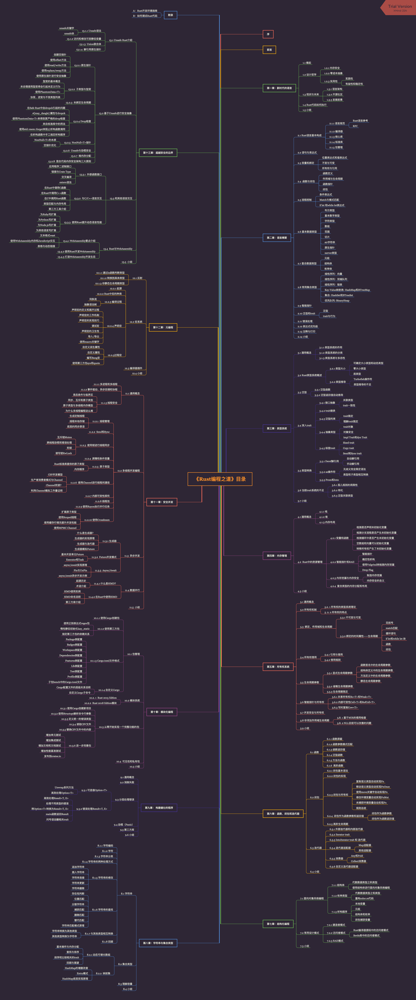

主目录:

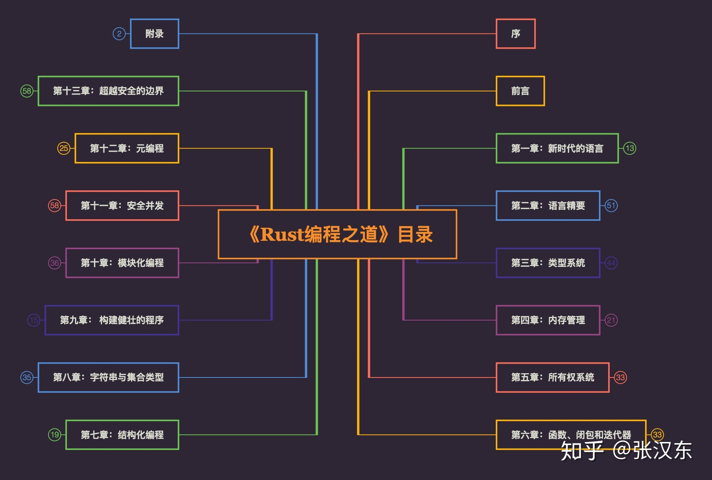

第一章: 新时代的语言

第二章: 语言精要

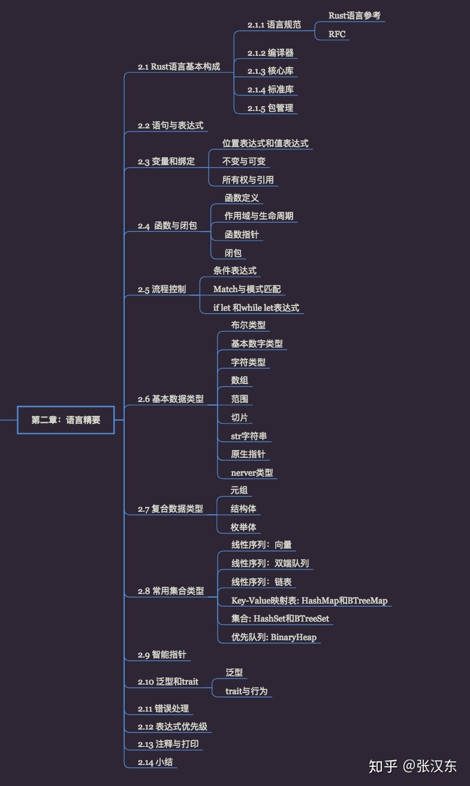

第三章: 类型系统

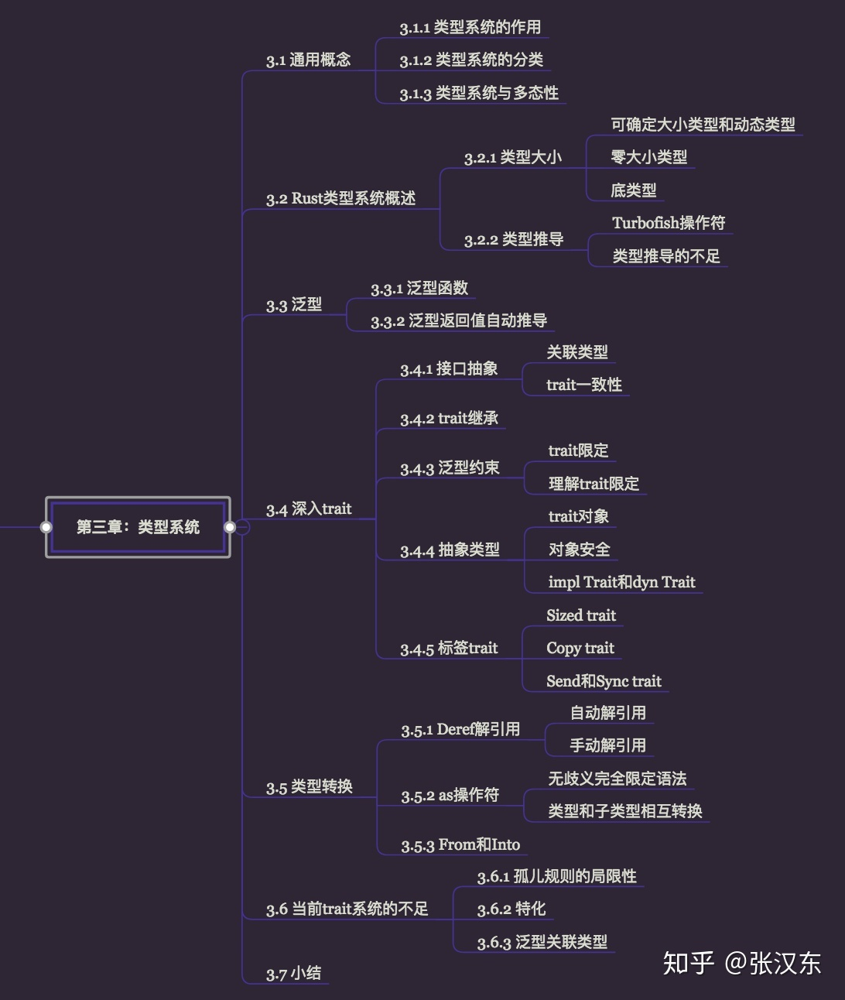

第四章: 内存管理

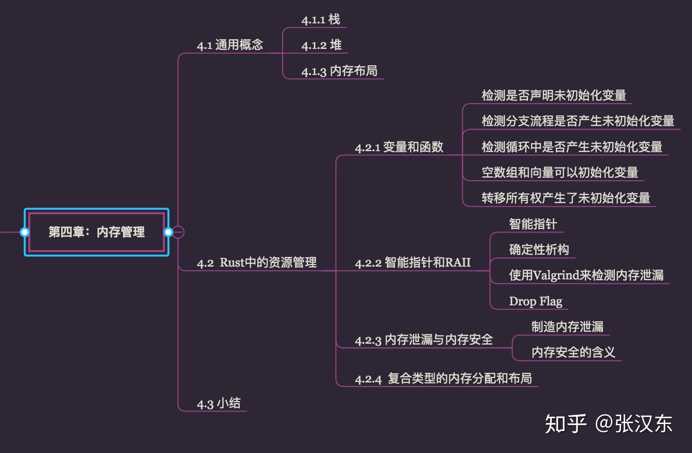

第五章: 所有权系统

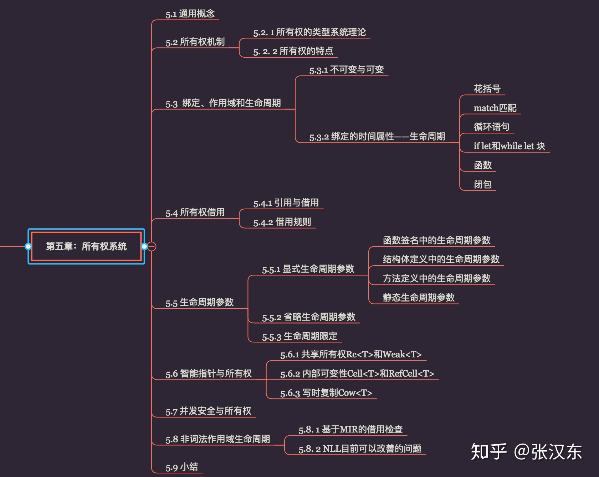

第六章: 函数、闭包和迭代器

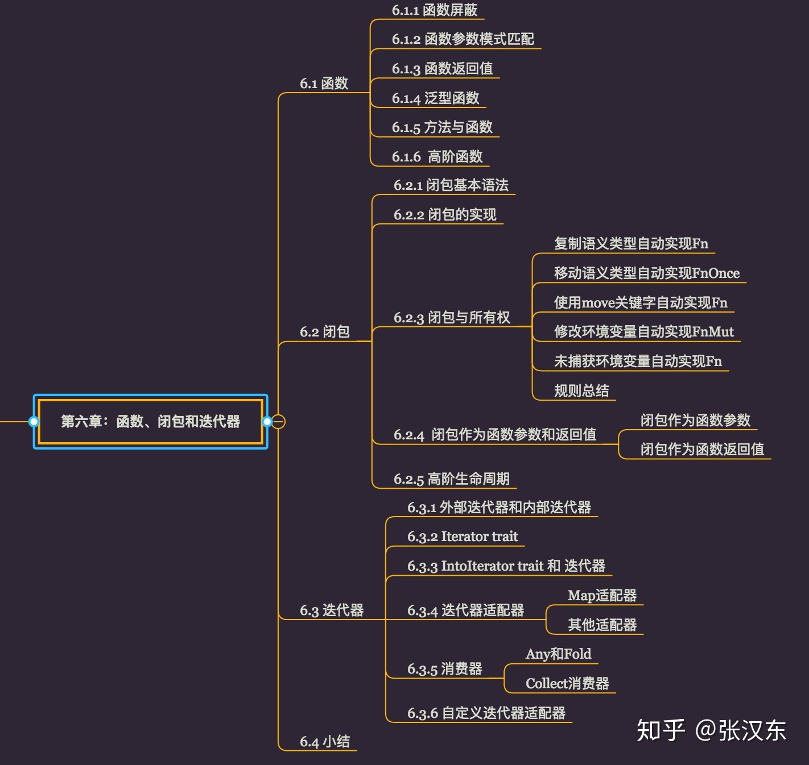

第七章: 结构化编程

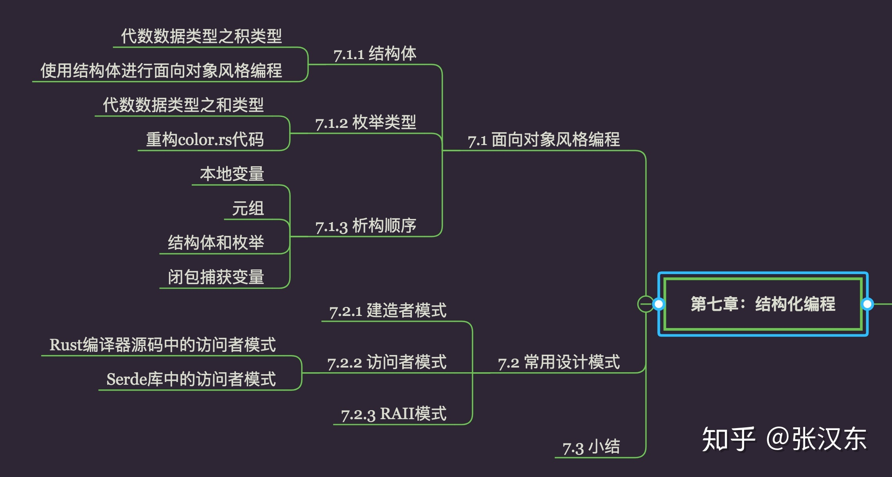

第八章: 字符串与集合类型

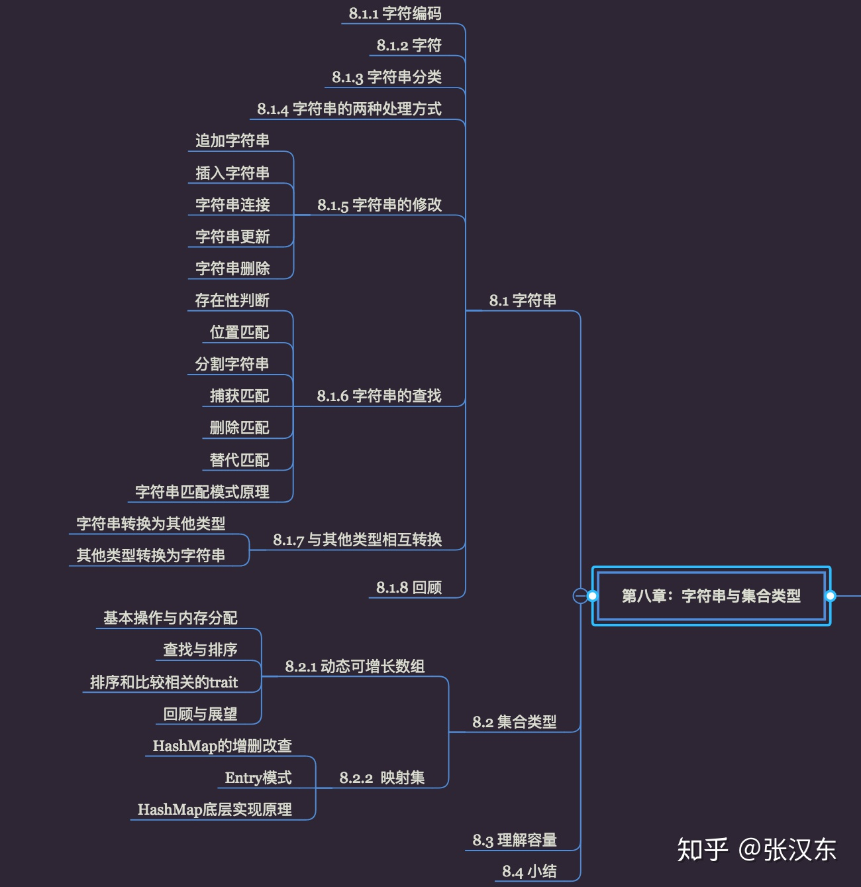

第九章: 构建健壮的程序

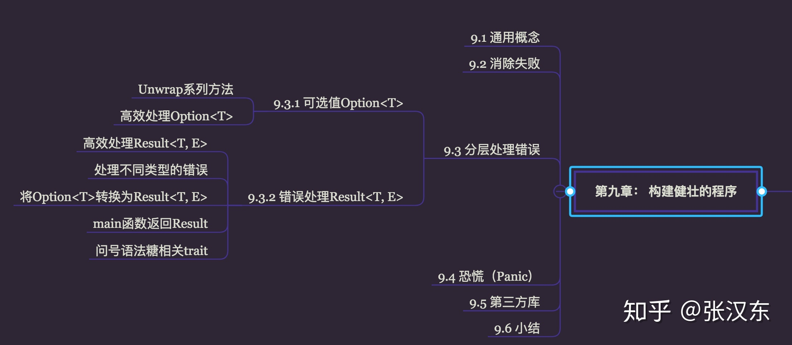

第十章: 模块化编程

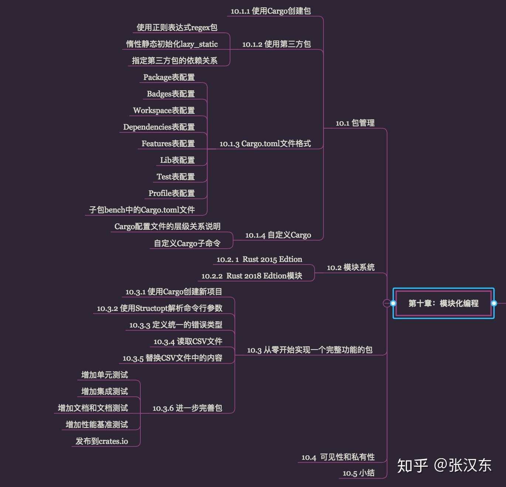

第十一章: 安全并发

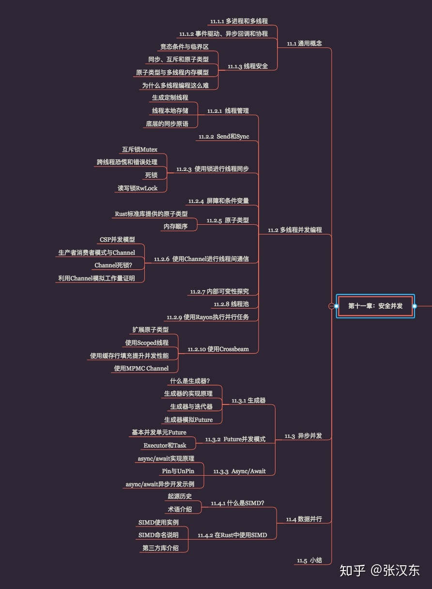

第十二章: 元编程

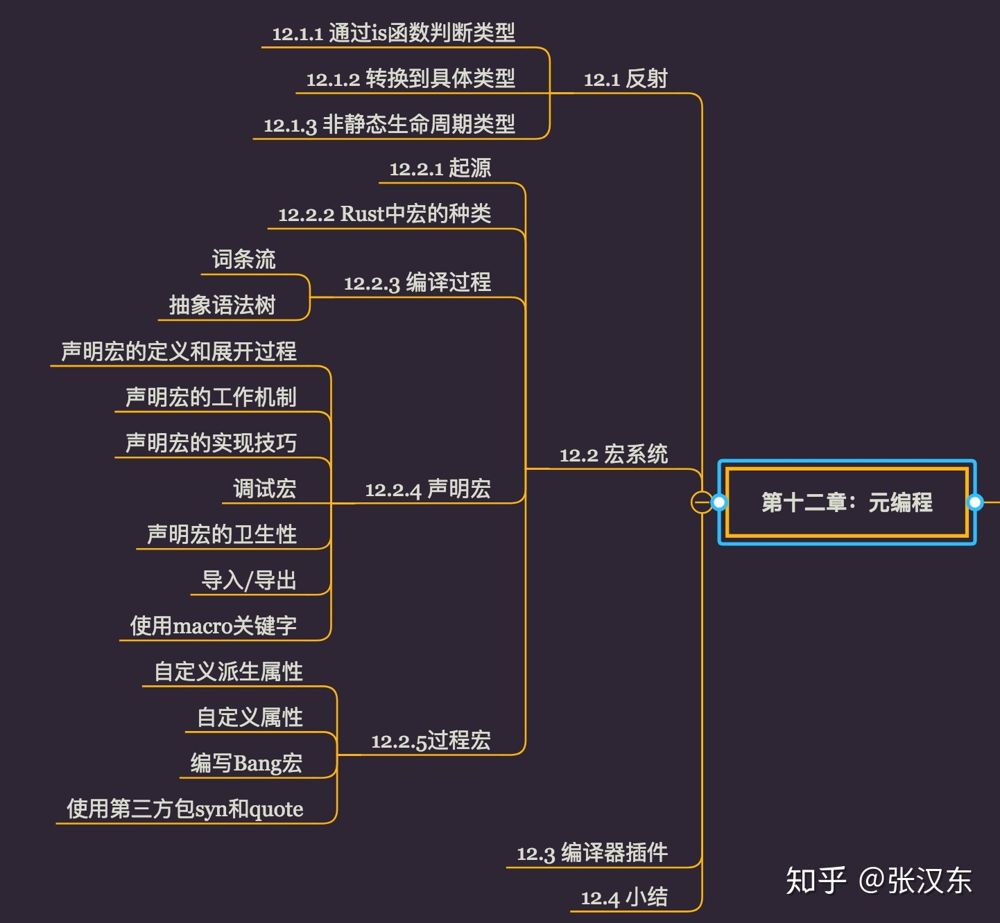

第十三章: 超越安全的边界

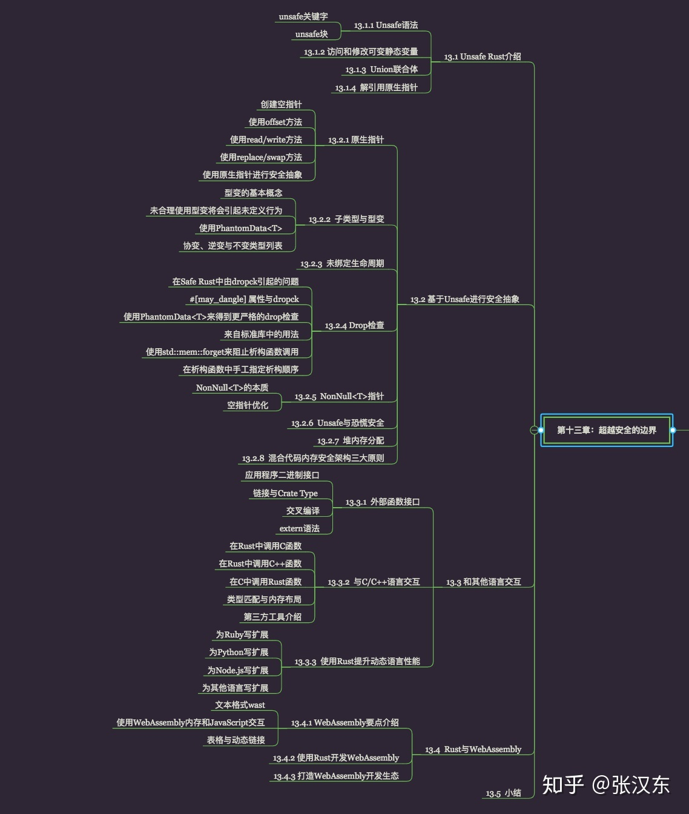

附录

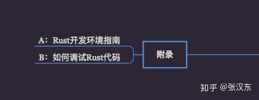
