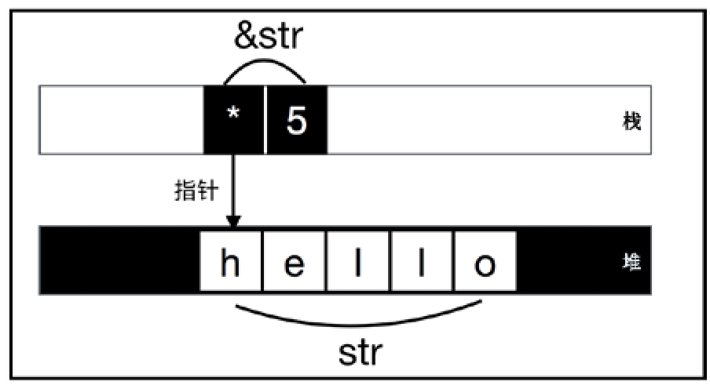

<!-- @import "[TOC]" {cmd="toc" depthFrom=1 depthTo=6 orderedList=false} -->

<!-- code_chunk_output -->

- [1. 类型系统](#1-类型系统)
- [2. 类型大小](#2-类型大小)
  - [2.1. 可确定大小类型和动态大小类型](#21-可确定大小类型和动态大小类型)
    - [2.1.1. str 字符串](#211-str-字符串)
    - [2.1.2. 数组 [T]](#212-数组-t)
  - [2.2. 零大小类型(空)](#22-零大小类型空)
  - [2.3. 底类型(无)](#23-底类型无)
- [3. 类型推导](#3-类型推导)
  - [3.1. Turbofish 操作符](#31-turbofish-操作符)
  - [3.2. 类型推导的不足](#32-类型推导的不足)

<!-- /code_chunk_output -->

Rust 是一门强类型且类型安全的静态语言. 

**Rust 中一切皆表达式, 表达式皆有值, 值皆有类型**. 所以可以说, **Rust 中一切皆类型**.

# 1. 类型系统

除了一些基本的**原生类型**和**复合类型**, Rust 把**作用域**也纳入了**类型系统**, 这就是第 4 章的**生命周期标记**. 

还有一些**表达式**的特殊情况, Rust 也将其纳入**类型系统**
* 有时**有返回值**, 有时**没有返回值** (也就是**只返回单元值**), 即 `Option<T>` **可选类型**
* 有时**返回正确的值**, 有时**返回错误的值**, 即 `Result<T,E>` **可选类型**
上面的**可选类型**会强制开发人员必须分别处理这两种情况. 

一些根本**无法返回值**的情况, 比如线程崩溃, break 或 continue 等行为, 也都被纳入了类型系统, 这种类型叫作 **never 类型**.

可以说, Rust 的类型系统基本囊括了编程中会遇到的各种情况, 一般情况下不会有未定义的行为出现, 所以说, Rust 是**类型安全的语言**.

# 2. 类型大小

编程语言中**不同的类型**本质上是**内存占用空间**和**编码方式**的不同. 

Rust 中没有 GC, 内存首先由编译器来分配, Rust 代码被编译为 LLVM IR, 其中携带了内存分配的信息. **所以编译器需要事先知道类型的大小, 才能分配合理的内存**.

## 2.1. 可确定大小类型和动态大小类型

绝大部分类型都是在**编译期可确定大小的类型**(`SizedType`).

也有少量的**动态大小的类型**(`Dynamic Sized Type`, DST).

### 2.1.1. str 字符串

str 类型是**字符串字面量**.

Rust提供了**引用类型**, 因为**引用**总会有**固定的且在编译期已知的大小**.

**字符串切片** `&str` 就是一种**引用类型**, 它由**指针**和**长度信息**组成, 如图所示.



**引用** `&str` 存储于**栈**上, str **字符串序列**存储于**堆**上. 

引用 `&str` 由两部分组成: **指针和长度信息**, 如代码 `3-1` 所示. 其中**指针是固定大小**的, 存储的是 str 字符串序列的**起始地址**, **长度信息**也是**固定大小**的整数.

这样一来, `&str`就变成了**可确定大小的类型**, **编译器**就可以正确地为其分配**栈内存空间**, str也会在**运行时**在**堆**上开辟内存空间.

```rust
fn main3_1() {
	let str = "Hello Rust"; // type: &str
	let ptr = str.as_ptr(); // type: *const u8
	let len = str.len(); // type: usize
	println!("{:p}", ptr); // 0x55a08f1c8000
	println!("{:?}", len); // 10
}
```

声明了字符串字面量 str, 通过 `as_ptr()`和 `len()` 方法, 可以分别获取该**字符串字面量存储的地址**和**长度信息**.

这种包含了动态大小类型地址信息和携带了长度信息的**指针**, 叫作**胖指针**(`Fat Pointer`), 所以 `&str` 是一种**胖指针**.

### 2.1.2. 数组 [T]

Rust中的数组 `[T]` 是**动态大小类型**, 编译器难以确定它的大小.

```rust
fn reset3_2(mut arr: [u32]) {
	arr[0] = 5;
	arr[1] = 4;
	arr[2] = 3;
	arr[3] = 2;
	arr[4] = 1;
	println!("reset arr {:?}", arr);
}
fn main_3_2() {
	let arr: [u32] = [1, 2, 3, 4, 5];
	reset3_2(arr);
	println!("origin arr {:?}", arr);
}
```

编译报错

```
error[E0277]: the size for values of type `[u32]` cannot be known at compilation time
  --> src/main.rs:24:2
   |
24 |     reset3_2(arr);
   |     ^^^^^^^^ doesn't have a size known at compile-time
```

意思是, 编译器无法确定参数 `[u32]` 类型的大小.

两种方式修复, 第一种是函数参数使用 `[u32; 5]` 类型

```rust
fn reset_3_3(mut arr: [u32; 5]) { // [u32; 5]
	arr[0] = 5;
	arr[1] = 4;
	arr[2] = 3;
	arr[3] = 2;
	arr[3] = 1;
	println!("reset arr address {:?}, {:?}", arr.as_ptr(), arr); // [5, 4, 3, 2, 1]
}
fn main_3_3() {
	let arr: [u32; 5] = [1, 2, 3, 4, 5]; // [u32; 5]
	reset_3_3(arr);
	println!("origin arr address {:?}, {:?}", arr.as_ptr(), arr); // [1, 2, 3, 4, 5]
}
```

```
reset arr address 0x7fffaa493984, [5, 4, 3, 1, 5]
origin arr address 0x7fffaa493970, [1, 2, 3, 4, 5]
```

修改的数组**并未影响原来的数组**. 这是因为 u32 类型是**可复制**的类型, 实现了 **Copy trait**, 所以整个数组也是可复制的. 所以当数组被传入函数中时就会被复制一份新的副本. 这里值得注意的是, `[u32]` 和 `[u32; 5]` 是两种不同的类型.

另一种方式, 使用**胖指针**. 类似于 `&str`, 只需要将参数类型改为 `&mut [u32]`. `&mut [u32]` 是对 `[u32]` 数组的借用, 会生成一个**数组切片** `&[u32]`, 它会携带长度信息.

使用 `&mut [u32]` 作为参数类型:

```rust
fn reset_3_4(mut arr: &mut [u32]) { // &mut [u32]
	arr[0] = 5;
	arr[1] = 4;
	arr[2] = 3;
	arr[3] = 2;
	arr[4] = 1;
	// arr 已经被重置为 [5, 4, 3, 2, 1]
	println!("reset: array address {:?}, len {:?}, {:?}", arr.as_ptr(), arr.len(), arr); // [5, 4, 3, 2, 1]
}
fn main_3_4() {
	let mut arr= [1, 2, 3, 4, 5]; // [u32; 5]
	// 重置之前, 原始数组为 [1, 2, 3, 4, 5]
	println!("reset before: array address {:?}, len {:?}, {:?}", arr.as_ptr(), arr.len(), arr); // [1, 2, 3, 4, 5]
	{
	    let mut_arr: &mut[u32] = &mut arr; // &mut [u32]
	    reset_3_4(mut_arr);
	}
	println!("reset after: array address {:?}, len {:?}, {:?}", arr.as_ptr(), arr.len(), arr); // [5, 4, 3, 2, 1]
}
```

```
reset before: array address 0x7ffe3af7d334, len 5, [1, 2, 3, 4, 5]
reset: array address 0x7ffe3af7d334, len 5, [5, 4, 3, 2, 1]
reset after: array address 0x7ffe3af7d334, len 5, [5, 4, 3, 2, 1]
```

使用了 `&mut [u32]`, 它是**可变借用**, `&[u32]` 是**不可变借用**. 因为这里要**修改数组元素**, 所以使用可变借用.

胖指针 `&mut [u32]` 包含了长度信息. 将引用当作函数参数, 意味着被修改的是原数组, 而不是最新的数组, 所以原数组在 reset 之后也发生了改变.

比较 `&[u32; 5]` 和 `&[u32]` 两种类型的空间占用情况:

```rust
fn main_3_5() {
    assert_eq!(std::mem::size_of::<&[u32; 5]>(), 8);
    assert_eq!(std::mem::size_of::<&[u32]>(), 16);
}
```

`std::mem::size_of::<&[u32; 5]>()` 函数可以返回类型的字节数. `&[u32; 5]` 类型是**普通指针**, 占 8 字节; `&[u32]` 类型为**胖指针**, 占 16 字节. 整整多了一倍的占用空间, 所以叫胖指针.

## 2.2. 零大小类型(空)

除了可确定大小类型和 DST 类型, Rust还支持**零大小类型**(`Zero Sized Type`, ZST), 比如**单元类型**和**单元结构体**, 大小都是零.

```rust
enum Void3_6 {}
struct Foo3_6;
struct Baz3_6 {
	foo: Foo3_6,
	qux: (),
	baz: [u8; 0],
}
fn main_3_6() {
	assert_eq!(std::mem::size_of::<()>(), 0);
	assert_eq!(std::mem::size_of::<Foo3_6>(), 0);
	assert_eq!(std::mem::size_of::<Baz3_6>(), 0);
	assert_eq!(std::mem::size_of::<Void3_6>(), 0);
	assert_eq!(std::mem::size_of::<[(); 10]>(), 0);
}
```

**单元类型**和**单元结构体**大小为**零**, 由**单元类型**组成的**数组**大小也为**零**.

ZST 类型的特点是, 它们的**值就是其本身**, 运行时并**不占用内存空间**. ZST类型代表的意义正是"**空**".

使用单元类型**查看数据类型**的一个技巧:

```rust
fn main_3_7() {
	let v: () = vec![(); 10];
}
```

编译报错如下:

```
|
|     let v: () = vec![(); 10];
|            --   ^^^^^^^^^^^^ expected `()`, found struct `Vec`
|            |
|            expected due to this
|
```

提示: 期望的是单元类型, 但是却发现 `struct Vec`. 这样我们就知道了右值 `vec![(); 10]` 是**向量类型**.

使用 `Vec<()>` 迭代类型的迭代技巧:

```rust
fn main_3_8() {
	let v: Vec<()> = vec![(); 10];
	for i in v {
		println!("{:?}", i); // ()
	}
}
```

使用了 `Vec<()>` 类型, 使用单元类型制造了一个长度为 10 的向量. 在一些**只需要迭代次数的场合**中, 使用这种方式能获得**较高的性能**. 因为 Vec 内部迭代器中会针对 ZST 类型做一些优化.

另外一个使用单元类型的示例是前面 `2.8` 中 `2_48` 的 Rust 官方标准库中的 `HashSet<T>` 和 `BTreeSet<T>`. 它们其实只是将 `HashMap<K, T>` 换成了 `HashMap<K, ()>`, 然后就可以公用 `HashMap<K, T>` 之前的代码, 而不需要重新实现一遍 `HashSet<T>` 了.

## 2.3. 底类型(无)

**底类型**(`Bottom Type`)是源自**类型理论**的术语, 它其实是 **never 类型**.

它的特点是:

* **没有值**
* 是**其他任意类型的子类型**

**ZST 类型**表示"**空**"的话, **底类型**就表示"**无**". 底类型**无值**, 而且它可以等价于**任意类型**, 有点无中生有之意.

Rust 中的**底类型**用**叹号**(`!`)表示. 此类型也被称为 **Bang Type**.

Rust中有很多种情况确实**没有值**, 但为了**类型安全**, 必须把**这些情况**纳入**类型系统**进行统一处理. 包括:

* **发散函数**(`Diverging Function`)
* **continue** 和 **break** 关键字
* **loop 循环**
* **空枚举**, 比如 `enum Void{}`

**发散函数**是指会导致线程崩溃的 `panic!("Thisfunction never returns!")`, 或者用于退出的 `std::process::exit`, **这类函数永远都不会有返回值**.

continue 和 break 类似, 仅仅表示**流程的跳转**, 并不会返回什么.

loop 循环有需要无限循环的时候.

if 语句是表达式, 要求**所有分支类型一致**, 但有时分支中可能包含了**永远无法返回**的情况, 属于底类型的一种应用.

```rust
// #![feature(never_type)]
fn foo_3_9() -> ! {
	// ...
	loop {
	    println!("jh");
	}
}
fn main_3_9() {
	let i = if false {
		foo_3_9()
	} else {
		100
	};
	assert_eq!(i, 100);
}
```

if 条件表达式中, foo 函数返回 `!`, 而 else 表达式返回整数类型, 但是编译可以正常通过.

空枚举, 比如 `enum Void{}`, 完全没有任何成员, 因而无法对其进行变量绑定, 不知道如何初始化并使用, 所以它是底类型.

```rust
enum Void3_10 {}
fn main_3_10() {
	let res: Result<u32, Void3_10> = Ok(0);
	let Ok(num) = res;
}
```

> 上面编译无法通过, Rust 还在完善中

Rust 中使用 Result 类型来进行错误处理, 强制开发者处理 Ok 和 Err 两种情况, 但有时**永远没有 Err**, 这时使用 `enum Void{}` 可以**避免处理 Err 的情况**.

> 这里可以用 if let 语句优化.

# 3. 类型推导

类型标注在 Rust 中属于语法的一部分, 所以 Rust 属于**显式类型语言**. Rust 支持**类型推断**, 但其功能并不像 Haskell 那样强大, Rust 只能在**局部范围**内进行类型推导.

```rust
fn sum3_11(a: u32, b: i32) -> u32 {
	a + (b as u32)
}
fn main_3_11() {
	let a = 1;
	let b = 2;
	assert_eq!(sum3_11(a, b), 3);
	let elem = 5u8;
	let mut vec = Vec::new();
	vec.push(elem);
	assert_eq!(vec, [5]);
}
```

a 和 b 传入 sum 正常运行, Rust 自动推导了 a 和 b 的类型.

先声明了一个 u8 类型, 然后创建了一个空向量, 类型为 `Vec<_>`, 可以通过 `code3_7` 方法来查看此类型. 用 push 插入 vec, 此时 vec 类型为 `Vec<u8>`.

## 3.1. Turbofish 操作符

> 为泛型函数标注类型

当 Rust 无法自动推导出类型, 就会报错.

```rust
fn main_3_12() {
	let x = "1";
	println!("{:?}", x.parse().unwrap());
}
```

```
error[E0284]: type annotations needed
   --> src/main.rs:154:21
    |
154 |     println!("{:?}", x.parse().unwrap());
    |                        ^^^^^ cannot infer type for type parameter `F` declared on the associated function `parse`
    |
    = note: cannot satisfy `<_ as FromStr>::Err == _`
help: consider specifying the type argument in the method call
    |
154 |     println!("{:?}", x.parse::<F>().unwrap());
    |                             +++++
```

想将字符串 "1" 转换为整数类型 1, 但 **parse** 方法其实是一个**泛型方法**, Rust 无法确定转换为哪种类型的整数, u32 还是 i32? 当前无法自动推导类型.

```rust
fn main_3_13() {
	let x = "1";
	let int_x: i32 = x.parse().unwrap();
	println!("{:?}", int_x); // 1
}

fn main_3_14() {
	let x = "1";
	assert_eq!(x.parse::<i32>().unwrap(), 1);
}
```

上面两种方式**为泛型函数标注类型**. 代码 `3_14` 这种标注类型 (`::<>`) 的形式叫作 **turbofish 操作符**.

parse 定义如下:

```rust
impl str {

    pub fn parse<F: FromStr>(&self) -> Result<F, F::Err> {
        FromStr::from_str(self)
    }

}
```

## 3.2. 类型推导的不足

Rust 的类型推导还不够强大.

下面显示了另一种类型推导的缺陷.

```rust
fn main_3_15() {
	let a = 0;
	let a_pos = a.is_positive();
}
```

当前 Rust 编译时会报错:

```
error[E0689]: can't call method `is_positive` on ambiguous numeric type `{integer}`
```

这里的 `{integer}` 并非真实类型, 只是表明此时编译器已经知道变量 a 是整数类型, 没有推导出 a 的真正类型. 所以尽量显式声明.