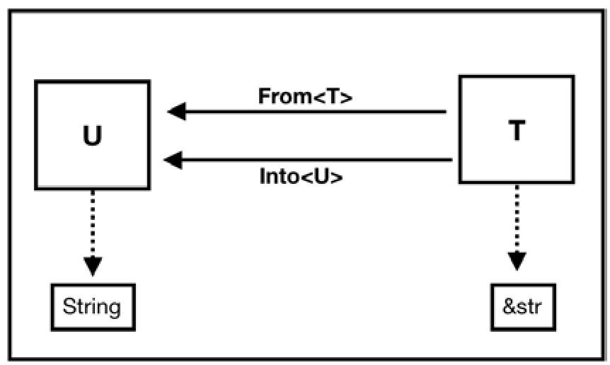

<!-- @import "[TOC]" {cmd="toc" depthFrom=1 depthTo=6 orderedList=false} -->

<!-- code_chunk_output -->

- [1. Deref 解引用](#1-deref-解引用)
  - [1.1. 自动解引用](#11-自动解引用)
  - [1.2. 手动解引用](#12-手动解引用)
    - [1.2.1. 类型和解应用目标类型有相同方法](#121-类型和解应用目标类型有相同方法)
    - [1.2.2. match 引用](#122-match-引用)
- [2. as 操作符](#2-as-操作符)
  - [2.1. 无歧义完全限定语法](#21-无歧义完全限定语法)
  - [2.2. 类型和子类型相互转换](#22-类型和子类型相互转换)
- [3. From 和 Into](#3-from-和-into)

<!-- /code_chunk_output -->

在编程语言中, 类型转换分为:

* **隐式类型转换**(`Implicit TypeConversion`), 由**编译器**或**解释器**自动完成, 开发者并未参与, 所以又称之为**强制类型转换**(`Type Coercion`)
* **显式类型转换**(`Explicit TypeConversion`), 由**开发者指定的**, 就是一般意义上的类型转换(`Type Cast`)

Rust语言, 只要不乱用 **unsafe** 块来**跳过编译器检查**, 就不会因为类型转换出现安全问题.

# 1. Deref 解引用

一般来说, **引用**使用 `&` 操作符, 而**解引用**使用 `*` 操作符.

Rust 中的**隐式类型转换**基本上**只有自动解引用**. 主要目的是方便开发者使用**智能指针**.

Rust 中提供的 `Box<T>`、`Rc<T>` 和 `String` 等类型, 实际上是一种**智能指针**. 像指针一样, 可以通过"**解引用**"操作符进行解引用, 获取其**内部的值**.

> 第4章会介绍关于智能指针的更多细节.

## 1.1. 自动解引用

**自动解引用**虽然是**编译器来做**的, 但是**自动解引用的行为**可以由开发者**自定义**.

可以通过**实现 Deref trait** 来**自定义解引用操作**.


Deref 有一个特性是**强制！！！隐式转换**, 规则是这样的: 如果**一个类型 T 实现**了 `Deref<Target=U>`, 则**该类型 T 的引用**(或**智能指针！！！**)在**应用**的时候会**被自动转换为类型U**.

> Deref trait 即**重载解引用运算符** `*`, 也就是说使用 `&T` 会**强制调用** `T.deref`? 说法有问题?
> 
> `&T` -> `&U`
> 
> 什么叫应用的时候? 当 T 实现了 Deref, 只要**使用 T 的引用**(即 `&T`)就可能会触发**自动解引用**
>  
> 会根据需要的类型, 编译器可以自动转换, 也可以不转换, 比如下面"类型和解应用目标类型有相同方法"

Deref trait 内部实现:

```rust
pub trait Deref {
	type Target: ?Sized;
	fn deref(&self) -> &Self::Target;
}
pub trait DerefMut: Deref {
	fn deref_mut(&mut self) -> &mut Self::Target;
}
```

> `&self` -> `&(Self::Target)`

DerefMut 和 Deref 类似, 只不过它是**返回可变引用**的. Deref中包含**关联类型 Target**, 它表示**解引用之后的目标类型**.

String 类型实现了 Deref. 比如下面代码连接了两个 String 字符串.

```rust
fn main_3_58() {
	let tmp = "hello"; // &str
	let a = "hello".to_string(); // Sring
	let b = " world".to_string(); // String
	let c = a + &b; // String + &String(> &str) = String
    	// let c = a + b; // 这个就会报错
	print!("{:?}", c); // "hello world"
}
```

> `&String` -> `&str`, b 不是 &String

使用了 `&b`, 它是一个 `&String` 类型, 而 **String 类型**实现的 **add 方法**的**右值参数必须是 &str 类型**.

按理说, 代码**应该编译出错**. 不过 **String 类型**实现了 `Deref<Target=str>`, 内部实现如下.

```rust
#[stable(feature = "rust1", since = "1.0.0")]
impl ops::Deref for String {
    type Target = str;

    #[inline]
    fn deref(&self) -> &str {
        unsafe { str::from_utf8_unchecked(&self.vec) }
    }
}
```

所以 `&String` 类型会被**自动隐式转换**为 `&str`.

> 为什么自动调用了解引用, 只要使用 String 的引用就会调用?

除了String类型, 标准库中常用的其他类型都实现了 Deref, 比如 `Vec<T>`、`Box<T>`、`Rc<T>`、`Arc<T>` 等. 实现 Deref 的目的只有一个, 就是简化编程.

`Vec<T>` 实现 Deref:

```rust
fn foo_3_60(s: &[i32]) {
	println!("{:?}", s[0]);
}

fn main_3_60() {
	let v = vec![1, 2, 3]; // Vec<i32>
	foo_3_60(&v) // &v = &Vec<{integer}>
}
```

> `&Vec<T>` -> `&[T]`

foo 函数的**参数**为 `&[T]` 类型. 而在调用 `foo(&v)` 的时候, `&v` 的类型为 `&Vec<T>`, 这里也发生了**自动解引用**, 因为 `Vec<T>` 实现了 `Deref<Target=[T]>`, 所以 `&Vec<T>` 会被自动转换为 `&[T]` 类型, foo 函数得以正确调用.

```rust
#[stable(feature = "rust1", since = "1.0.0")]
impl<T, A: Allocator> ops::Deref for Vec<T, A> {
    type Target = [T];

    fn deref(&self) -> &[T] {
        unsafe { slice::from_raw_parts(self.as_ptr(), self.len) }
    }
}
```

> `&Vec<T>` -> `&[T]`

函数调用时, 自动解引用也提供了极大的方便. **Rc 指针**实现了 **Deref**, 使函数调用变得非常方便.

```rust
use std::rc::Rc;
fn main_3_61() {
    let x = Rc::new("hello"); // Rc<&str>
    println!("{:?}", x.chars()); // Chars(['h', 'e', 'l', 'l', 'o'])
    println!("{:?}", &x.chars()); // Chars(['h', 'e', 'l', 'l', 'o'])
}
```

变量 x 是 `Rc<&str>` 类型, 它并没有实现过 `chars()` 方法. 但是现在可以**直接调用**, 因为 `Rc<T>` 实现了 `Deref<Target<T>>`.

```rust
#[stable(feature = "rust1", since = "1.0.0")]
impl<T: ?Sized> Deref for Rc<T> {
    type Target = T;

    #[inline(always)]
    fn deref(&self) -> &T {
        &self.inner().value
    }
}
```

`&Rc<&str>`(`&x`) -> `&&str`, T 是 `&str`

> 注意这里 x 是 `Rc<&str>`, 但是理论上 Deref 是对**引用类型**(`&Rc<T>`)即进行的, 这里很明显**有其他语法**.
>
> 而且转换后理论上应该是 `&&str`, 但是 chars() 函数应该被 `&str` 调用, 也应该**有其他语法**.

## 1.2. 手动解引用

但在有些情况下, 就算实现了 Deref, **编译器**也**不会自动解引用**. `code_3_61` 是因为 Rc 没有 chars 方法, 所以会正常解引用.

### 1.2.1. 类型和解应用目标类型有相同方法

但是当**某类型**和**其解引用目标类型**中包含了**相同的方法**时, 编译器就不知道该用哪一个了. 此时就需要手动解引用.

> 那如果函数声明不同呢?

```rust
fn main_3_62() {
	let x = Rc::new("hello");
	let y = x.clone(); // Rc<&str>
	let z = (*x).clone(); // &str
}
```

clone 方法在 `Rc` 和 `&str` 类型中都被实现了, 所以**调用时会直接调用 Rc 的 clone 方法**, 如果想调用 Rc 里面 `&str` 类型的 clone 方法, 则需要使用"解引用"操作符**手动解引用**.

### 1.2.2. match 引用

另外, **match 引用时**也需要**手动解引用**, 如代码.

```rust
fn main_3_63() {
	let x = "hello".to_string(); // type x = String
	match &x { // &x = &String
		"hello" => { println!("hello") },
		_ => ()
	}
}
```

```
error[E0308]: mismatched types
   --> src/main.rs:539:3
    |
538 |     match &x { // &x = &String
    |           -- this expression has type `&String`
539 |         "hello" => { println!("hello") },
    |         ^^^^^^^ expected struct `String`, found `str`
    |
    = note:   expected type `&String`
            found reference `&'static str`
```

只能通过**手动解引用**把 `&String` 类型转换成 `&str` 类型, 具体有下列几种方式.

* `match x.deref()`, 直接调用 deref方法, 需要 `use std::ops::Deref`.
* `match x.as_ref()`, String 类型提供了 `as_ref` 方法来返回一个 `&str` 类似, 该方法定义于 AsRef trait 中.
* `match x.borrow()`, 方法 borrow 定义于 `Borrow trait` 中, 行为和 AsRef 类型一样. 需要 `use std::borrow::Borrow`.
* `match &*x`, 使用"解引用"操作符, 将 String 转换为 str, 然后再用"引用"操作符转为 `&str`.
* `match &x[..]`, 这是因为 String 类型的 index 操作可以返回 `&str` 类型.

总体来说, 除了自动解引用隐式转换, Rust还提供了**不少显式的手动转换类型的方式**. 平时编程还是要多**翻阅标准库文档**.

# 2. as 操作符

最常用的是转换**基本数据类型**.

注意: **as 关键字不支持重载**.

```rust
fn main_3_64() {
	let a = 1u32; // u32
	let b = a as u64; // u64
	let c = 3u64; // u64
	let d = c as u32; // u32
}
```

长(大小)类型转换成短(大小)类型, 则会被**截断处理**:

```rust
fn main_3_65() {
	let a = std::u32::MAX;
	let b = a as u16;
	assert_eq!(b, 65535);
	let e = -1i32;
	let f = e as u32;
	println!("{:x}", e); // ffffffff
	println!("{:?}", e.abs()); // 1
	println!("{:?}", f); // 4294967295
	println!("{:x}", f); // ffffffff
}
```

变量a被赋予了u32类型的最大值, 当转换为u16类型的时候, **被截断处理**, 变量b的值就变成了u16类型的最大值.

当从**有符号类型**向**无符号类型**转换的时候, 最好使用**标准库中提供的专门的方法**, 而**不要直接使用as操作符**.

## 2.1. 无歧义完全限定语法

**为结构体实现多个trait**时, 可能会出现**同名的方法**, 如下代码就展示了这种情况. 此时**使用 as 操作符**可以帮助**避免歧义**.

```rust
struct S_3_66(i32);
trait A_3_66 {
	fn test(&self, i: i32);
}
trait B_3_66 {
	fn test(&self, i: i32);
}
impl A_3_66 for S_3_66 {
	fn test(&self, i: i32) {
		println!("From A: {:?}", i);
	}
}
impl B_3_66 for S_3_66 {
	fn test(&self, i: i32) {
		println!("From B: {:?}", i + 1);
	}
}
fn main_3_66() {
	let s = S_3_66(1);
	A_3_66::test(&s, 1); // From A: 1
	B_3_66::test(&s, 1); // From B: 2
	<S_3_66 as A_3_66>::test(&s, 1); // From A: 1
	<S_3_66 as B_3_66>::test(&s, 1); // From B: 2
}
```

有两种方式调用可以**避免歧义**.

* 第一种是直接当作 **trait 的静态函数**来调用, `A::test()`或`B::test()`.
* 第二种就是使用 **as 操作符**, `<S as A>::test()` 或 `<S as B>::test()`.

**这两种方式**叫作**无歧义完全限定语法**(`Fully Qualified Syntax for Disambiguation`), 曾经也有另外一个名字: **通用函数调用语法**(`UFCS`). 这两种方式的共同之处就是都需要**将结构体实例变量 s 的引用显式地传入 test 方法**中. 但是**建议使用第二种方式**, 因为 `<S as A>::test()` 语义比较完整, 它表明了调用的是S结构体实现的A中的test方法. 而**第一种方式遗漏了S结构体这一信息**, 可读性相对差一些. 这**两种方式**都可以看作**对 trait 行为的转换**.

## 2.2. 类型和子类型相互转换

Rust中**没有标准定义中的子类型**, 比如**结构体继承之类**, 但是**生命周期标记**可看作**子类型**.

比如 `&'static str` 类型是 `&'a str` 类型的**子类型**, 因为二者的**生命周期标记不同**, `'a` 和`'static` 都是**生命周期标记**, 其中:

* `'a` 是**泛型标记**, 是 `&str` 的**通用形式**;
* `'static` 则是**特指静态生命周期**的 `&str` 字符串. 

所以, 通过 as 操作符转换可以将 `&'static str` 类型转为 `&'a str` 类型, 如代码.

```rust
fn main_3_67() {
	let a: &'static str = "hello"; // &'static str
	let b: &str = a as &str; // &str
	let c: &'static str = b as &'static str; // &'static str
}
```

可以通过 as 操作符将 `&'static str` 和 `&'a str` 相互转换. 

# 3. From 和 Into

From 和 Into 是定义于 `std::convert` 模块中的**两个 trait**. 它们定义了 from 和 into 两个方法, 这两个方法互为反操作. 

内部实现如下:

```rust
pub trait From<T>: Sized {
    /// Performs the conversion.
    #[lang = "from"]
    #[stable(feature = "rust1", since = "1.0.0")]
    fn from(_: T) -> Self;
}

pub trait Into<T>: Sized {
    /// Performs the conversion.
    #[stable(feature = "rust1", since = "1.0.0")]
    fn into(self) -> T;
}
```

对于类型T, 如果它实现了`From<U>`, 则可以通过 `T::from(u)` 来**生成T类型的实例**, 此处 `u` 为 `U` 的类型**实例**. 

String 类型的 from 方法:

```rust
fn main_3_69() {
	let string = "hello".to_string(); // String
	let other_string = String::from("hello"); // String
	assert_eq!(string, other_string);
}
```

对于类型T, 如果它实现了 `Into<U>`, 则可以通过 `into` 方法来**消耗自身转换为类型 U 的新实例**. 

```rust
#[derive(Debug)]
struct Person_3_70 { name: String }
impl Person_3_70 {
    fn new<T: Into<String>>(name: T) -> Person_3_70 {
	    Person_3_70 { name: name.into() }
    }
}
fn main_3_70() {
	let person = Person_3_70::new("Alex");
	let person = Person_3_70::new("Alex".to_string());
	println!("{:?}", person);
}
```

**new 方法**是一个**泛型方法**. 使用了 `<T: Into<String>>` 限定就意味着, **实现**了 **into String** 方法的**类型**都可以作为参数. 

`&str` 和 `String` **类型**都实现了 **Into**. 

* 当参数是 `&str` 类型时, 会通过 into 转换为 String 类型; 
* 当参数是String类型时, 则什么都不会发生. 

有一条**默认的规则**: 如果**类型 U** 实现了 `From<T>`, 则 **T 类型实例**调用 **into** 方法就可以转换为**类型 U**. 这是因为 Rust 标准库内部有一个**默认的实现**, 如下.

为**所有实现**了 `From<T>` 的类型 T 实现 `Into<U>`:

```rust
impl<T, U> Into<U> for T where U: From<T>
```

`String` 和 `&str`:

```rust
fn main_3_72() {
	let a = "hello";
	let b: String = a.into();
}
```

String 类型实现了 `From<&str>`, 所以可以使用 into 方法将 `&str` 转换成 String.

From 和 Into 的关系:



所以, **一般情况**下, **只需要实现 From 即可**, 除非 **From 不容易实现**, 才需要考虑**实现 Into**. 

在标准库中, 还包含了 **TryFrom** 和 **TryInto** 两种 **trait**, 是 From 和 Into 的**错误处理版本**, 因为类型转换是有**可能发生错误**的, 所以在**需要进行错误处理**的时候可以使用  **TryFrom** 和 **TryInto**. 不过 TryFrom 和 TryInto 目前还是实验性特性, 只能在 Nightly 版本下使用, 在不久的将来也许会稳定. 

另外, 标准库中还包含了 **AsRef** 和 **AsMut** 两种 **trait**, 可以将值分别转换为**不可变引用**和**可变引用**. AsRef 和标准库的另外一个 Borrow trait 功能有些类似, 但是 AsRef 比较轻量级, 它只是简单地将值转换为引用, 而 Borrow trait 可以用来将某个复合类型抽象为拥有借用语义的类型. 更详细的内容请参考标准库文档. 